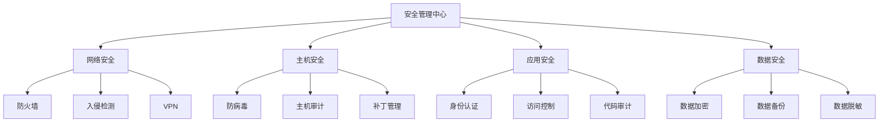

# 项目名称：XX市智慧城市建设项目投标文件

**招标编号**：XX-2024-001

**投标人**：XX科技有限公司

**投标日期**：2024年12月

---

## 一、投标函

### 致：XX市政府采购中心

XX科技有限公司（以下简称"投标人"）荣幸地参与贵组织的"XX市智慧城市建设项目"（招标编号：XX-2024-001）的投标活动。经认真研究招标文件的全部内容，投标人现郑重提交如下投标文件：

1. **投标总价**：人民币壹仟贰佰叁拾肆万伍仟陆佰柒拾捌元整（¥12,345,678.00）

2. **项目工期**：自合同签订之日起18个月内完成全部建设内容并通过验收

3. **质量承诺**：严格按照国家相关标准及招标文件要求执行，确保项目质量达到优良等级

4. **售后服务**：提供为期3年的免费维护服务，响应时间不超过2小时

投标人保证所提交的全部资料真实、有效、完整，并愿意承担因提供虚假资料所产生的一切法律责任。

**投标人**：XX科技有限公司（盖章）

**法定代表人**：张三（签字）

**日期**：2024年12月15日

---

## 二、投标一览表

| 序号 | 项目内容 | 数量 | 单价（元） | 总价（元） | 备注 |
|------|----------|------|------------|------------|------|
| 1 | 智慧政务平台 | 1套 | 3,500,000.00 | 3,500,000.00 | 含软件许可 |
| 2 | 城市数据中心 | 1项 | 4,200,000.00 | 4,200,000.00 | 含硬件设备 |
| 3 | 物联网感知系统 | 1套 | 2,100,000.00 | 2,100,000.00 | 含传感器网络 |
| 4 | 安全保障体系 | 1项 | 1,545,678.00 | 1,545,678.00 | 含三年维保 |
| **合计** | | | | **12,345,678.00** | |

---

## 三、项目背景与需求分析

### （一）项目背景

随着信息技术的快速发展和城市化进程的不断推进，智慧城市建设已成为提升城市治理能力、改善民生服务、促进产业升级的重要举措。XX市作为国家新型智慧城市试点城市，亟需通过信息化手段实现城市管理的精细化、智能化。

### （二）现状分析

通过对XX市现有信息化系统的调研，发现存在以下问题：

1. **数据孤岛问题突出**：各部门信息系统独立建设，数据标准不统一，难以实现数据共享

2. **基础设施相对滞后**：现有数据中心服务器老化，存储容量不足，难以支撑大数据处理需求

3. **公共服务效率偏低**：线上线下服务渠道不统一，群众办事仍需"多次跑"、"多头跑"

4. **安全防护能力薄弱**：缺乏统一的安全保障体系，网络安全事件时有发生

### （三）建设目标

本项目旨在通过建设智慧城市综合管理平台，实现以下目标：

1. 打破部门数据壁垒，实现跨部门数据共享和业务协同

2. 构建统一的城市数据中心，提升数据处理和存储能力

3. 建成覆盖全市的物联网感知网络，实现对城市运行状态的实时监测

4. 建立完善的安全保障体系，确保系统安全稳定运行

---

## 四、技术方案

### （一）总体架构设计

本项目采用"云-管-端"三层架构体系：

| 层次 | 名称 | 主要内容 | 技术选型 |
|------|------|----------|----------|
| 第一层 | 基础设施层 | 服务器、存储、网络 | VMware vSphere、华为OceanStor |
| 第二层 | 平台层 | 数据中心、AI平台、物联网平台 | Hadoop、TensorFlow、MQTT |
| 第三层 | 应用层 | 智慧政务、智慧交通、智慧安防 | Spring Cloud、Vue.js |

### （二）智慧政务平台建设方案

#### 1. 平台功能模块

智慧政务平台包含以下核心功能模块：

（1）统一门户管理

提供单点登录、个性化门户、权限管理等功能，支持多终端访问。

（2）网上办事大厅

实现政务服务事项的在线申报、在线审批、进度查询、结果公示等功能，覆盖市、区、街道三级。

（3）并联审批系统

建立跨部门协同审批机制，实现"一窗受理、并联审批、限时办结"。

（4）电子证照库

汇集各类证照信息，实现证照互认共享，减少群众重复提交材料。

#### 2. 技术实现方式

```java
// 示例：审批流程引擎配置
public class ApprovalProcessEngine {
    public void configureProcess() {
        ProcessDefinition process = new ProcessDefinition();
        process.setProcessName("企业设立登记");
        process.addTask(new Task("工商受理", "市场监督管理局"));
        process.addTask(new Task("税务登记", "税务局"));
        process.addTask(new Task("社保开户", "社保局"));
        process.setParallelMode(true); // 并联审批
        process.setTimeLimit(5); // 5个工作日
    }
}
```

### （三）城市数据中心建设方案

#### 1. 数据中心规模

数据中心规划建设面积500平方米，包括：

- 主机房区：200平方米，放置服务器机柜50个
- 存储区：100平方米，配置存储设备总容量10PB
- 网络区：50平方米，部署核心交换机、路由器等网络设备
- 运维管理区：50平方米，设置监控大屏和运维工位
- 配电室：50平方米，配置UPS和柴油发电机

#### 2. 主要设备配置

| 设备类型 | 设备名称 | 数量 | 配置参数 | 单价（元） |
|----------|----------|------|----------|------------|
| 服务器 | 华为RH2288 V3 | 50台 | 2×Intel Xeon Gold 6248R/256GB内存/2TB SSD | 48,000.00 |
| 存储 | 华为OceanStor 5500 | 5套 | 10PB容量/双控制器/8Gbps缓存 | 480,000.00 |
| 交换机 | 华为CloudEngine 12800 | 4台 | 48×10G光口/12×40G光口 | 120,000.00 |
| 路由器 | 华为NE40E | 2台 | 千兆电口×24/万兆光口×8 | 85,000.00 |

### （四）物联网感知系统建设方案

#### 1. 感知设备部署

在全市范围内部署物联网感知设备，具体部署方案如下表所示：

| 设备类型 | 部署位置 | 部署数量 | 采集频率 | 数据类型 |
|----------|----------|----------|----------|----------|
| 视频监控 | 主干道、重点区域 | 5000个 | 实时 | 视频流 |
| 环境传感器 | 公园、广场 | 300个 | 每10分钟 | PM2.5、温度、湿度 |
| 智能路灯 | 主次干道 | 8000盏 | 实时 | 开关状态、能耗数据 |
| 井盖监测器 | 雨污水井盖 | 2000个 | 每30分钟 | 位移、水位 |
| 停车诱导 | 停车场、路边停车位 | 150个 | 实时 | 车位占用情况 |

#### 2. 数据传输网络

采用NB-IoT + 5G混合组网方式：

- NB-IoT：用于低功耗、低频次采集的传感器（井盖、环境监测等）

- 5G：用于高清视频监控和实时性要求高的设备

### （五）安全保障体系建设方案

#### 1. 安全体系架构

按照国家等级保护三级要求，构建"一个中心、三重防护"的安全保障体系：



#### 2. 主要安全措施

（1）**网络安全防护**

- 部署下一代防火墙，实现访问控制、攻击防护、应用识别

- 配置入侵检测/防御系统（IDS/IPS），实时监控网络攻击行为

- 建立VPN专网，保障远程访问安全

（2）**主机安全防护**

- 安装企业级防病毒软件，定期更新病毒库

- 部署主机审计系统，记录主机操作行为

- 建立补丁管理机制，及时修复系统漏洞

（3）**应用安全防护**

- 实施强身份认证机制（双因子认证）

- 建立基于角色的访问控制（RBAC）体系

- 定期开展代码审计和渗透测试

（4）**数据安全防护**

- 采用国密算法对敏感数据进行加密存储

- 建立异地数据备份中心，实现数据的每日增量备份和每周全量备份

- 对共享数据进行脱敏处理，保护个人隐私

---

## 五、项目实施计划

### （一）项目阶段划分

本项目划分为五个阶段，总工期18个月：

| 阶段 | 阶段名称 | 工期 | 主要工作内容 | 交付成果 |
|------|----------|------|--------------|----------|
| 第一阶段 | 需求调研与设计 | 2个月 | 需求调研、方案设计、招标采购 | 需求规格说明书、设计方案 |
| 第二阶段 | 基础设施建设 | 4个月 | 数据中心建设、网络设备安装 | 数据中心、网络系统 |
| 第三阶段 | 平台软件开发 | 6个月 | 各应用系统开发、单元测试 | 软件系统源代码 |
| 第四阶段 | 系统集成与联调 | 3个月 | 系统集成、联调测试 | 集成测试报告 |
| 第五阶段 | 试运行与验收 | 3个月 | 试运行、优化完善、项目验收 | 验收报告 |

### （二）关键里程碑

| 里程碑节点 | 时间节点 | 验收标准 |
|------------|----------|----------|
| 数据中心建设完成 | 第6个月末 | 机房装修完成、设备安装调试完毕、通过第三方检测 |
| 平台软件开发完成 | 第12个月末 | 所有功能模块开发完成、通过单元测试 |
| 系统集成联调完成 | 第15个月末 | 各子系统联通、通过集成测试 |
| 项目最终验收 | 第18个月末 | 试运行3个月无重大故障、通过用户验收 |

### （三）项目团队组织

本项目组建专业化的项目团队，组织结构如下：

```
项目总监：李四（高级项目经理，PMP认证）
    ├── 技术负责人：王五（系统架构师，15年经验）
    ├── 需求分析组（5人）
    ├── 软件开发组（20人）
    ├── 网络集成组（8人）
    ├── 测试组（6人）
    └── 运维保障组（4人）
```

---

## 六、质量保障措施

### （一）质量管理组织

成立质量管理小组，由质量经理直接负责，制定详细的质量管理计划：

1. **制定质量标准**：参照国家相关标准，制定项目质量标准和验收规范

2. **过程质量控制**：建立阶段评审机制，每个阶段结束时进行质量评审

3. **问题跟踪管理**：建立问题跟踪机制，确保问题及时闭环

### （二）质量保证措施

1. **ISO9001质量管理体系**：公司已通过ISO9001认证，将严格按照质量管理体系执行项目

2. **CMMI5级软件成熟度模型**：软件开发过程遵循CMMI5级标准

3. **第三方软件测评**：委托具有CNAS资质的第三方测评机构进行软件测评

---

## 七、售后服务承诺

### （一）服务内容与标准

本公司承诺提供以下售后服务：

| 服务项目 | 服务内容 | 响应时间 | 服务标准 |
|----------|----------|----------|----------|
| 故障响应 | 提供7×24小时故障响应服务 | 2小时内响应 | 4小时内到达现场 |
| 日常维护 | 定期巡检、系统优化 | 每月1次 | 提交巡检报告 |
| 系统升级 | 软件版本升级、功能优化 | 按需提供 | 免费升级 |
| 培训服务 | 操作培训、技术培训 | 上线前完成 | 培训合格率100% |

### （二）服务承诺

1. **质保期承诺**：系统验收合格后提供3年免费质保服务

2. **应急响应**：建立应急响应小组，重大故障1小时内启动应急预案

3. **定期巡检**：每月进行一次现场巡检，每季度提交一次系统运行报告

4. **持续优化**：根据用户反馈，持续优化系统性能和用户体验

---

## 八、资格证明文件

### （一）营业执照

公司名称：XX科技有限公司

统一社会信用代码：91110000XXXXXXXXXX

类型：有限责任公司

成立日期：2010年5月10日

经营范围：软件开发、信息系统集成服务、信息技术咨询服务

### （二）资质证书

1. **信息系统建设和服务能力CS4级证书**（证书编号：CSXX20200001）

2. **电子与智能化工程专业承包一级资质**（证书编号：D11100XXXXX）

3. **CMMI5级认证证书**（注册号：CNXXXXXXXX）

### （三）类似项目业绩

| 序号 | 项目名称 | 建设单位 | 合同金额（万元） | 完成时间 |
|------|----------|----------|------------------|----------|
| 1 | XX市智慧政务平台项目 | XX市人民政府 | 2,500 | 2023年6月 |
| 2 | XX省城市大脑项目 | XX省大数据局 | 8,000 | 2022年12月 |
| 3 | XX区物联网感知系统 | XX区人民政府 | 1,200 | 2023年9月 |
| 4 | XX市数据中心建设 | XX市发改委 | 3,500 | 2022年6月 |

---

## 九、其他事项说明

### （一）付款方式建议

建议按以下比例分期付款：

1. **合同签订**：支付合同总额的30%

2. **数据中心建设完成**：支付合同总额的25%

3. **平台软件开发完成**：支付合同总额的25%

4. **项目最终验收**：支付合同总额的15%

5. **质保期满**：支付合同总额的5%

### （二）联系方式

**投标单位**：XX科技有限公司

**地址**：XX市XX区XX路123号

**邮编**：100000

**联系人**：李四（项目总监）

**电话**：010-12345678

**手机**：13800138000

**邮箱**：lisi@company.com

---

## 十、法定代表人身份证明书

**单位名称**：XX科技有限公司

**单位性质**：有限责任公司

**地址**：XX市XX区XX路123号

**姓名**：张三

**性别**：男

**年龄**：45岁

**职务**：董事长

**身份证号码**：110XXXXXXXXXXXXXXX

特此证明。

**投标人**：XX科技有限公司（盖章）

**日期**：2024年12月15日

---

## 十一、授权委托书

本人张三，系XX科技有限公司的法定代表人，现授权委托李四为我公司的代理人，参加贵组织的"XX市智慧城市建设项目"（招标编号：XX-2024-001）的投标活动。代理人在投标过程中所签署的一切文件和处理的一切事务，我公司均予以承认。

**代理人**：李四

**职务**：项目总监

**身份证号码**：110XXXXXXXXXXXXXXX

**授权范围**：投标报价、合同谈判、文件签署

**授权期限**：自本授权委托书签署之日起至项目结束

特此授权。

**法定代表人**：张三（签字）

**投标人**：XX科技有限公司（盖章）

**日期**：2024年12月15日

---

**投标人声明**：本投标文件所有内容真实有效，如有虚假，愿承担法律责任。

**XX科技有限公司（盖章）**

**2024年12月15日**
