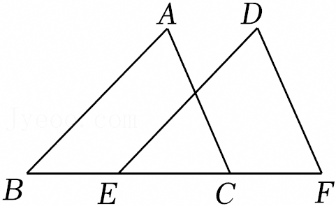
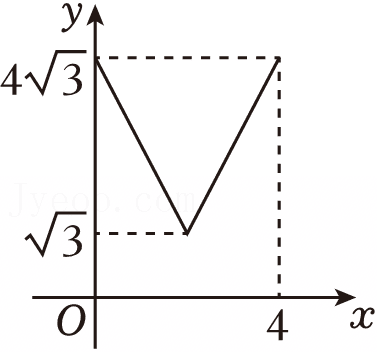
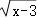
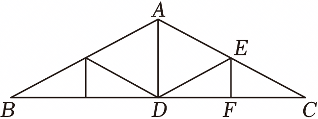
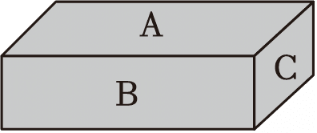
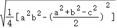
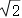
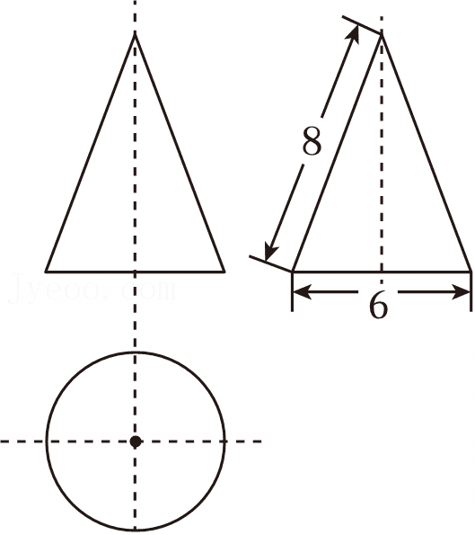

2025年江苏省南通市中考数学试卷

一、选择题（本大题共10小题，每小题3分，共30分.在每小题给出的四个选项中，只有一项是符合题目要求的，请将正确选项的字母代号填涂在答题卡相应位置上）

1．（3分）计算（﹣2）×（﹣3），正确的结果是（　　）

A．﹣5	B．5	C．﹣6	D．6

2．（3分）《2025年中国卫星导航与位置服务产业发展白皮书》显示，去年我国卫星导航与位置服务产业总产值达5758亿元．将“5758亿”用科学记数法表示为（　　）

A．5.758×1010	B．5.758×1011

C．0.5758×1012	D．57.58×1010

3．（3分）如图，将△ABC沿着射线BC平移到△DEF．若BC＝6，EC＝4，则平移的距离为（　　）

A．2	B．4	C．6	D．8

4．（3分）上午9时整，钟表的时针和分针构成的角的度数为（　　）

A．30°	B．60°	C．90°	D．120°

5．（3分）已知直线y＝kx+b经过第一、第二、第三象限，则k，b的取值范围是（　　）

A．k＜0，b＜0	B．k＜0，b＞0	C．k＞0，b＜0	D．k＞0，b＞0

6．（3分）如图是一个几何体的三视图（图中尺寸单位：cm），则这个几何体的底面圆的周长为（　　）

A．6πcm	B．9πcm	C．12πcm	D．16πcm

7．（3分）在平面直角坐标系xOy中，将点A（3，1）绕原点O逆时针旋转90°，得到点B，则点B的坐标为（　　）

A．（3，﹣1）	B．（﹣1，3）	C．（1，﹣3）	D．（﹣3，1）

8．（3分）在△ABC中，∠C＝90°，tanA＝，AC＝2，则BC的长为（　　）

A．1	B．2	C．	D．5

9．（3分）如图，在等边三角形ABC的三边上，分别取点D，E，F，使AD＝BE＝CF．若AB＝4，AD＝x，△DEF的面积为y，则y关于x的函数图象大致为（　　）

10．（3分）在平面直角坐标系xOy中，五个点的坐标分别为A（﹣1，5），B（1，2），C（2，1），D（3，﹣1），E（5，5）．若抛物线y＝a（x﹣2）2+k（a＞0）经过上述五个点中的三个点，则满足题意的a的值不可能为（　　）

A．	B．	C．	D．

二、填空题（本大题共8小题，第11～12题每小题3分，第13～18题每小题3分，共30分.不需写出解答过程，请把答案直接填写在答题卡相应位置上）

11．（3分）分解因式am+a＝　         　 ．

12．（3分）若在实数范围内有意义，则实数x的取值范围为 　      　 ．

13．（4分）南通是“建筑之乡”，工程建筑中经常采用三角形的结构．如图是屋架设计图的一部分，E是斜梁AC的中点，立柱AD，EF垂直于横梁BC．若AC＝4.8m，∠C＝30°，则EF的长为　      　 m．

14．（4分）把一根长10m的钢管截成3m长和1m长两种规格的钢管．为了不造成浪费，可能截得钢管的总根数为 　        　 （写出一种情况即可）．

15．（4分）如图，一块砖的A，B，C三个面的面积比是5：3：1．如果B面向下放在地上，地面所受压强为aPa，那么C面向下放在地上时，地面所受压强为　     　 Pa．

16．（4分）我国南宋数学家秦九韶曾提出利用三角形的三边求面积的公式：一个三角形的三边长分别为a，b，c，三角形的面积S＝．若a＝2，b＝3，c＝1，则S的值为 　             　 ．

17．（4分）在平面直角坐标系中，以点A（3，0）为圆心，为半径作⊙A．直线y＝kx﹣3k+2与⊙A交于B，C两点，则BC的最小值为 　   　 ．

18．（4分）如图，网格图中每个小正方形的面积都为1．经过网格点A的一条直线，把网格图分成了两个部分，其中△BMN的面积为3，则sin∠MNB的值为　                  　 ．

三、解答题（本大题共8小题，共90分.请在答题卡指定区域内作答，解答时应写出文字说明、证明过程或演算步骤）

19．（12分）（1）解不等式组；

（2）计算．

20．（10分）请从下列四个命题中选取两个命题，并判断所选命题是真命题还是假命题．如果是真命题，给出证明；如果是假命题，举出反例．

（1）若a2＝b2，则a＝b；

（2）对于任意实数x，y，一定有x2+y2＞2xy；

（3）两个连续正奇数的平方差一定是8的倍数；

（4）一组对边平行，另一组对边相等的四边形一定是平行四边形．

21．（10分）为提升学生体质健康水平，促进学生全面发展，某校大课间共开展6项体育活动，每名学生均参加了其中一项活动．为了解该校学生参与大课间体育活动情况，随机抽取了该校50名学生进行调查，得到如下未完成的统计表．

（1）表格中a的值为　     　 ；

（2）若该校有1000名学生，请估计该校参加足球活动的学生人数；

（3）为备战校际篮球联赛，学校计划从参加篮球活动的甲、乙两名同学中选拔一人加入校篮球队．已知甲、乙两名同学近六周定点投篮测试成绩（每次测试共有10次投篮机会，以命中次数作为测试成绩）如图所示．你建议选拔哪名同学，请说明理由．

22．（10分）为继承和弘扬中华优秀传统文化，某校将八年级学生随机安排到以下四个场所参加社会实践活动．

已知小明、小华、小丽都是该校八年级学生，求下列事件的概率：

（1）小明到南通博物苑参加社会实践活动；

（2）小华和小丽都到南通美术馆参加社会实践活动．

23．（10分）如图，PA与⊙O相切于点A，AC为⊙O的直径，点B在⊙O上，连接PB，PC，且PA＝PB．

（1）连接OB，求证：OB⊥PB；

（2）若∠APB＝60°，PA＝2，求图中阴影部分的面积．

24．（12分）综合与实践：学校数学兴趣小组围绕“校园花圃方案设计”开展主题学习活动．

已知花圃一边靠墙（墙的长度不限），其余部分用总长为60m的栅栏围成．兴趣小组设计了以下两种方案：

（1）求方案一中与墙垂直的边的长度；

（2）要使方案二中花圃的面积最大，与墙平行的边的长度为多少米？

25．（13分）如图，矩形ABCD中，对角线AC，BD相交于点O．M是BC的中点，DM交AC于点G．

（1）求证：AG＝2GC；

（2）设∠BCD，∠BDC的角平分线交于点I．

①当AB＝6，BC＝8时，求点I到BC的距离；

②若AB+AC＝2BC，作直线GI分别交BD，CD于E，F两点，求的值．

26．（13分）在平面直角坐标系xOy中，反比例函数的图象经过点A（1，5），点A，B关于原点对称．该函数图象上另有两点M1，M2，它们的横坐标分别为m，m+n，其中m＞1，n＞0．依次作直线AM1，BM1与y轴分别交于点C1，D1，直线AM2，BM2与y轴分别交于点C2，D2.记OC1﹣OD1＝d1，OC2﹣OD2＝d2．

（1）若m＝2，求OC1的长；

（2）求代数式（m+n）•d2的值；

（3）当m（d1﹣d2）＝2d2，3（d1+d2）＝2n3时，求点D2关于直线AM2对称的点P的坐标．

| 体育活动 | 足球 | 篮球 | 排球 | 乒乓球 | 跳绳 | 啦啦操 |
|---|---|---|---|---|---|---|
| 人数 | 6 | a | 10 | 9 | 8 | 5 |

| 方案一 | 方案二 |
|---|---|
| 如图1，围成一个面积为450m2的矩形花圃． | 如图2，围成矩形花圃时，用栅栏（栅栏宽度忽略不计）将该花圃分隔为两个小矩形区域，用来种植不同花卉，并在花圃两侧各留一个宽为3m的进出口（此处不用栅栏）． |