2025年江苏省宿迁市中考数学试卷

一、选择题（本大题共8小题，每小题3分，共24分．在每小题所给出的四个选项中，有且只有一项是符合题目要求的，请将正确选项的字母代号填涂在答题卡相应位置上）

1．（3分）下列四个数中，最大的数是（　　）

A．2	B．﹣2	C．	D．

2．（3分）下列计算结果为a3的是（　　）

A．a+a2	B．（a2）3	C．a•a2	D．a9÷a3

3．（3分）宿迁市2025年第一季度GDP总量突破一千亿大关，约为1080亿元．数据1080亿用科学记数法表示为（　　）

A．1.08×1010	B．1.08×1011	C．10.8×1010	D．1080×108

4．（3分）某几何体的三视图如图所示，这个几何体是（　　）

A．圆柱	B．圆锥	C．正方体	D．长方体

5．（3分）如图，在△ABC中，AB≠AC，点D、E、F分别是边AB、AC、BC的中点，则下列结论错误的是（　　）

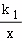

A．DE∥BC	B．∠B＝∠EFC	C．∠BAF＝∠CAF	D．OD＝OE

6．（3分）在平面直角坐标系中，点A的坐标为（3，2），将线段OA绕着点O逆时针旋转90°得线段OA'，则点A′的坐标为（　　）

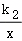

A．（﹣3，2）	B．（﹣2，3）	C．（3，﹣2）	D．（2，﹣3）

7．（3分）《九章算术》中记载：“今有牛五、羊二，值金十两；牛二、羊五，值金八两．问牛羊各值金几何？”译文：“今有牛5头，羊2头，共值金10两，牛2头，羊5头，共值金8两．问牛、羊每头各值金多少？”若设牛每头值金x两，羊每头值金y两，则可列方程组是（　　）

A．	B．

C．	D．

8．（3分）如图，点A、B在双曲线y1＝（x＞0）上，直线AB分别与x轴、y轴交于点C、D，与双曲线y2＝（x＜0）交于点E，连接OA、OB，若S△AOC＝20，AB＝3BC，AD＝DE，则k2的值为（　　）

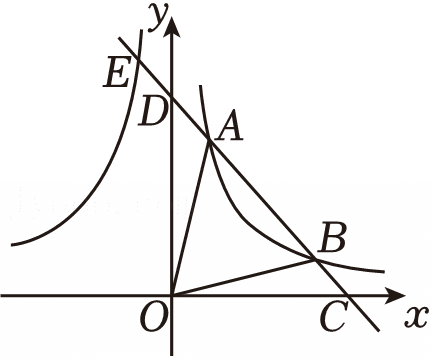

A．﹣10	B．﹣11	C．﹣12	D．﹣13

二、填空题（本大题共10小题，每小题3分，共30分．不需写出解答过程，请把答案直接填写在答题卡相应位置上）

9．（3分）要使分式有意义，则x的取值范围是 　      　 ．

10．（3分）分解因式：x2﹣4＝　             　 ．

11．（3分）点P（1，a+2）在第一象限，则实数a的取值范围是 　       　 ．

12．（3分）某公司在一次招聘中，分笔试和面试两部分，笔试和面试成绩按6：4计算最终成绩．小李的笔试成绩为85分，面试成绩为90分，则小李的最终成绩为 　     　 分．

13．（3分）若等腰三角形的两边长为2cm和4cm，则该等腰三角形的周长为 　     　 cm．

14．（3分）已知圆锥的底面半径为3，高为4，则该圆锥的侧面积为　      　 ．

15．（3分）如图，正五边形ABCDE内接于⊙O，连接AC，则∠ACD的度数为 　     　 °．

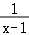

16．（3分）一块梯形木板ABCD，AD∥BC，∠BCD＝90°，AD＝4，BC＝10，CD＝6，按如图方式设计一个矩形桌面EFCG（点E在边AB上）．当EF＝ 　   　 时，矩形桌面面积最大．

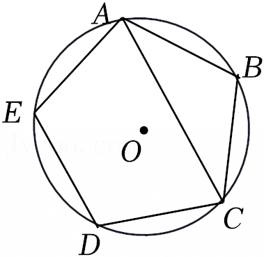

17．（3分）方程x2﹣2024x﹣2025＝0的两个根分别是m、n，则（m2﹣2023m﹣2026）（n2﹣2023n﹣2026）＝ 　        　 ．

18．（3分）如图，在△ABC中，∠ACB＝90°，AC＝4，BC＝3，点D在边AB上，过点A作AE⊥CD，垂足为点E，则的最小值是 　   　 ．

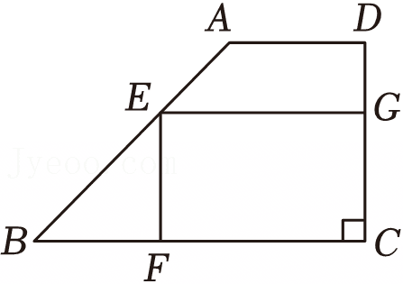

三、解答题（本大题共10小题，共96分．请在答题卡指定区域内作答，解答时应写出必要的文字说明、证明过程或演算步骤）

19．（8分）计算：．

20．（8分）先化简，再求值：，其中x＝﹣4．

21．（8分）2025年2月，江苏省教育厅印发《关于在义务教育学校实施“2•15专项行动”的通知》，明确提出“中小学生每天综合体育活动时间不低于2小时”．某校采取多种举措，确保学生每天有充足的体育活动时间，同时监测学生的体质健康情况．为此，学校从全体男生中随机抽取部分学生调查他们的立定跳远成绩，并把成绩分成五档（A档160＜x≤180、B档180＜x≤200、C档200＜x≤220、D档220＜x≤240、E档240＜x≤260，单位：cm），绘制成统计图．其中部分数据丢失，请结合统计图，完成下列问题：

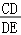

（1）扇形统计图中n的值为 　     　 ，条形统计图中“B档”成绩的人数为 　     　 ；

（2）本次抽测中，立定跳远成绩的中位数落在 　   　 档；

（3）若该校共有1200名男生，请你估计该校立定跳远成绩为“E档”的男生人数．

22．（8分）某校建议学生利用周末时间积极参加社会实践活动．某一周末有两个项目供学生选择：A文明交通劝导志愿行，B乡村教育关爱行，每名学生只能任意选择其中一个项目．

（1）甲同学选择A项目的概率为 　                　 ；

（2）请用画树状图的方法，求甲、乙、丙三位同学恰好选择同一项目的概率．

23．（10分）小明和小军两位同学对某河流的宽度进行测量，如图所示，两人分别站在同侧河岸上的点A、B处，选取河对岸的一块石头C作为测量点（点A、B、C在同一水平面内），小明同学在点A处测得∠BAC为42°，小军同学在点B处测得∠ABC为61°，两人之间的距离AB为60米，求此河流的宽度．

（参考数据：sin42°≈0.67，tan42°≈0.90，sin61°≈0.87，tan61°≈1.80）

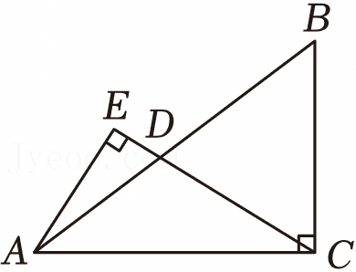

24．（10分）实验活动：仅用一把圆规作图．

【任务阅读】如图1，仅用一把圆规在∠AOB内部画一点P，使点P在∠AOB的平分线上．

小明的作法如下：

如图2，以点O为圆心，适当长为半径画弧，分别交射线OA、OB于点E、F，再分别以点E、F为圆心，大于长为半径画弧，两弧交于点P，则点P为所求点．

理由：如图3，连接EP、FP、OP，

由作图可知OE＝OF，PE＝PF，

又因为OP＝OP，

所以 　                 　 ．

所以∠EOP＝∠FOP．

所以OP平分∠AOB．

即点P为所求点．

【实践操作】如图4，已知直线AB及其外一点P，只用一把圆规画一点Q，使点P、Q所在直线与直线AB平行，并给出证明．（保留作图痕迹，不写作法）

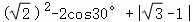

25．（10分）如图，点A在⊙O上，点B在⊙O外，线段OB与⊙O交于点C，过点C作⊙O的切线交直线AB于点D，且AD＝CD．

（1）判断直线AB与⊙O的位置关系，并说明理由；

（2）若∠B＝30°，CD＝4，求图中阴影部分的面积．

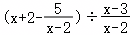

26．（10分）甲、乙两人从同一地点M出发沿同一路线匀速步行前往N处参加活动．甲比乙早出发6min，两人途中均未休息，先到达N处的人在原地休息等待，直到另一人到达N处．两人之间的路程y（m）与甲行走的时间t（min）的函数图象如图所示．

（1）乙步行的速度为 　     　 m/min，MN之间的路程为 　       　 m；

（2）当18≤t≤50时，求y关于t的函数表达式；

（3）甲出发多长时间时，两人之间的路程为450m．

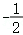

27．（12分）定义：在平面直角坐标系中，到两个坐标轴的距离都小于或等于k的点叫“k阶近轴点”，所有的“k阶近轴点”组成的图形记为图形W．如图所示，所有的“1阶近轴点”组成的图形是以坐标原点为中心，2为边长的正方形区域．

（1）下列函数图象上存在“1阶近轴点”的是 　   　 ；

①；②y＝﹣x+3；③y＝x2﹣2x+3．

（2）若一次函数y＝2x+m的图象上存在“3阶近轴点”，求实数m的取值范围；

（3）特别地，当点P在图形W上，且横坐标是纵坐标的k倍时，称点P是图形W的“k阶完美点”，若二次函数y＝ax2﹣ax﹣2a+2的图象上有且只有一个“2阶完美点”，求实数a的取值范围．

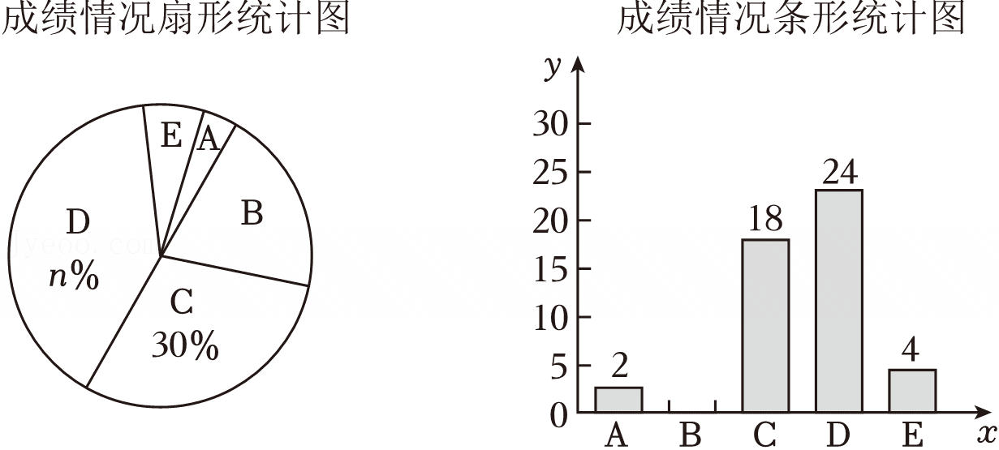

28．（12分）如图1，在矩形ABCD中，AB＝3，，点M是边BC上一个动点，点N在射线CD上，∠MAN＝60°．线段AM的垂直平分线分别交直线AB、AM、AN、CD于点E、F、G、H．

（1）直接写出∠ACB＝ 　     　 °，＝ 　             　 ；

（2）当BM＝1时，求EF+GH的值；

（3）如图2，连接MG并延长交直线CD于点P．

①求证：MG＝PG；

②如图3，过点P作直线EH的垂线，分别交直线EH、AN于点T、Q，连接DQ，求线段DQ的最小值．

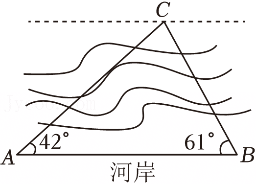