2025年江苏省常州市中考数学试卷

一、选择题（本大题共8小题，每小题2分，共16分.在每小题所给出的四个选项中，只有一项是正确的）

1．（2分）如图，数轴上点P表示的数的相反数是（　　）

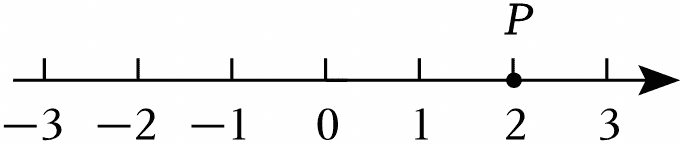

A．﹣2	B．﹣1	C．0	D．

2．（2分）若使分式有意义，则x的取值范围是（　　）

A．x≠﹣1	B．x＝﹣1	C．x≥﹣1	D．x＞﹣1

3．（2分）下列图形中，为三棱柱的侧面展开图的是（　　）

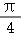

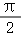

4．（2分）如图，⊙O的半径为2，直径AB、CD互相垂直，则的长是（　　）

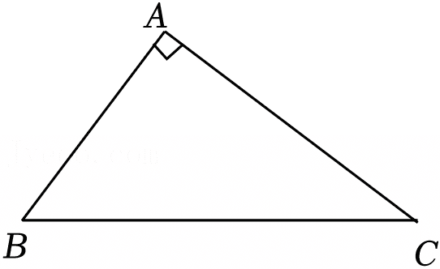

A．	B．	C．π	D．2π

5．（2分）如图，在Rt△ABC中，∠A＝90°，AB＝3，AC＝4，则sinB的值是（　　）

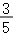

A．	B．	C．	D．

6．（2分）如图，在菱形ABCD中，AC、BD是对角线，AB＝5．若∠ABD＝30°，则AC的长是（　　）

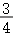

A．4	B．5	C．6	D．10

7．（2分）如图，将两块相同的直角三角尺按图示摆放，则AB与CD平行．这一判断过程体现的数学依据是（　　）

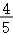

A．垂线段最短

B．内错角相等，两直线平行

C．两点确定一条直线

D．平行于同一条直线的两条直线平行

8．（2分）小华家、小丽家与图书馆位于一条笔直的街道上，小丽家位于小华家和图书馆之间，小华家到小丽家、图书馆的距离分别为300米、1800米．若小华、小丽各自从自己家同时出发，分别以v1米/分钟、v2米/分钟的速度匀速前往图书馆，则两人恰好同时到达．现两人各自从自己家同时出发，小丽仍然以v2分钟的速度匀速前往图书馆，小华先以米/分钟的速度追赶小丽，与小丽相遇后，再以v2米/分钟的速度与小丽一同前往图书馆，则小华到图书馆的距离y（米）与行进时间x（分钟）之间的函数图象可能是（　　）

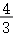

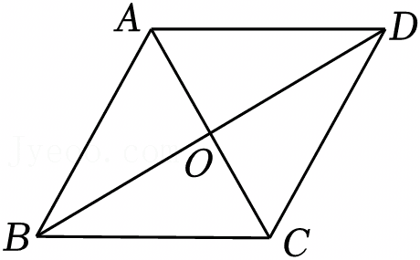

二、填空题（本大题共10小题，每小题2分，共20分.不需写出解答过程，请将答案直接填写在答题卡相应位置上）

9．（2分）4的算术平方根是 　   　 ．

10．（2分）计算（a2）3＝　     　 ．

11．（2分）分解因式：x2﹣9y2＝　               　 ．

12．（2分）太阳的半径约为700000千米，数据700000用科学记数法表示为 　        　 ．

13．（2分）若则x﹣y　   　 0．（填＞、＜或＝）．

14．（2分）若关于x的一元二次方程x2﹣2x+m＝0有两个相等的实数根，则实数m的值为 　   　 ．

15．（2分）如图，AB∥CD，AC⊥AD，∠ACD＝50°，则∠α＝ 　      　 ．

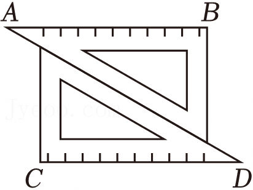

16．（2分）如图，在▱ABCD中，E是AD上一点，DE＝2AE，CE、BA的延长线相交于点F，若AB＝2，则AF＝ 　   　 ．

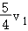

17．（2分）如图，AB是⊙O的直径，CD是⊙O的弦．若∠DCB＝45°，AD＝1，则AB＝ 　             　 ．

18．（2分）如图，在△ABC中，tanC＝，D是边BC上一点，将△ACD沿AD翻折得到△AED使线段AE、BC相交于点F，若CF＝5，EF＝2，则AC＝ 　                 　 ．

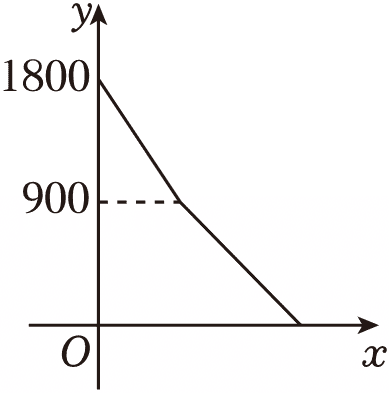

三、解答题（本大题共10小题，共84分．请在答题卡指定区域内作答，如无特殊说明，解答应写出文字说明、演算步骤或推理过程）

19．（8分）先化简，再求值：x（x+2）+（x﹣1）2，其中．

20．（6分）解不等式组并把解集在数轴上表示出来．

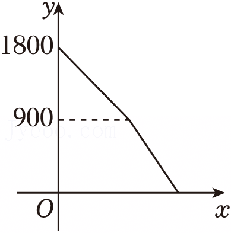

21．（8分）甲、乙两人在相同条件下10次射击的成绩如下：

对以上数据进行分析，绘制成如表：

（1）填空：＝ 　   　 ，m＝ 　   　 ，n＝ 　   　 ；

（2）根据以上数据，评价甲、乙两人射击成绩的稳定性，并说明理由．

22．（8分）在5张相同的小纸条上，分别写有：①﹣1；②0；③1；④正数；⑤负数．将这5张小纸条做成5支签，①、②、③放在不透明的盒子A中搅匀，④、⑤放在不透明的盒子B中搅匀．

（1）从盒子A中任意抽出1支签，抽到0的概率是 　                　 ；

（2）先从盒子A中任意抽出1支签，再从盒子B中任意抽出1支签．求抽到的数与文字描述相符合的概率．

23．（8分）某块绿地改进浇水方式，将漫灌方式全部改为喷灌方式，平均每天用水量减少1吨，20吨水可以使用的天数是原来的2倍．问浇水方式改进后平均每天用水多少吨？

24．（8分）如图，在△ABC中，AB＝AC，点D，E在BC上，BD＝CE．

（1）求证：△ABD≌△ACE；

（2）用直尺和圆规作∠DAE的平分线AF（保留作图痕迹，不要求写作法）．

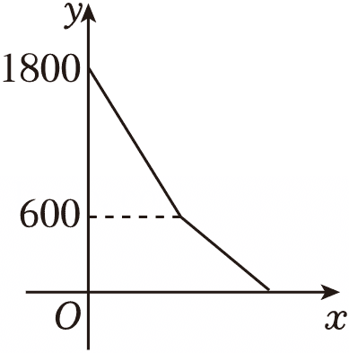

25．（8分）如图，在平面直角坐标系xOy中，一次函数y＝kx+b的图象与反比例函数的图象相交于点A（1，n）、B（﹣3，﹣2），且与y轴交于点C．

（1）求一次函数、反比例函数的表达式；

（2）连接OA，求△OAC的面积．

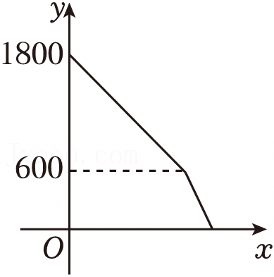

26．（10分）在四边形ABCD中，对角线AC、BD相交于点O，AB＝2，AD＝1．

（1）若△ABD是等腰三角形，则BD＝ 　   　 ；

（2）已知OB＝OD，AC＝BD．

①若OA＝OC，判断四边形ABCD是怎样的特殊四边形，并说明理由；

②如图，在△ACD中，CD2＝AD2+AC2，求AC的长．

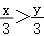

27．（10分）如图：在平面直角坐标系xOy中，一次函数y＝﹣x+3的图象分别与x轴，y轴交于点A、B，点C是线段AB上一点，C与B不重合．二次函数y＝ax2+bx+c（a，b，c是常数，且a≠0）的图象经过点B，顶点是C．将该二次函数的图象平移后得到新抛物线，B′、C′分别是B、C的对应点，且点B′落在x轴正半轴上，点C′的纵坐标为﹣2．

（1）OB＝ 　   　 ；

（2）求点C的坐标；

（3）已知新抛物线与y轴交于点G（0，），点D（3，y1）、E（x2，y2）在新抛物线上，若对于满足m＜x2≤m+1的任意实数x2，y2＞y1总成立，求实数m的取值范围．

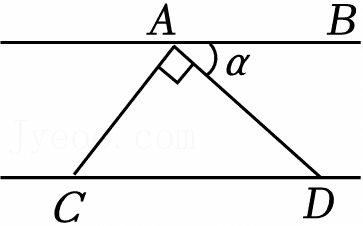

28．（10分）在平面xOy中以下种不同所得线段的关系．

方式一：向右平移1个单位长度，后绕原点O按逆时针方向旋转90°；

方式二：先原点O按逆时针方向旋转90°，然后向右平移1个单位长度．

如图1小明将线段AB按方式一方式二运动：分别得到线段A1B1、A2B2，发现它们除长度相等外还有其他关系．

【实践体验】

（1）如图2，小明已画出线段CD按方式一运动得到的线段C1D1．请你利用网格，在图2中画出线段CD按方式二运动得到的线段；

【探索发现】

（2）在平面直角坐标系xOy中，将线段a按方式一、方式二运动，分别得到线段a1、a2，则线段a1、a2所在直线可能 　     　 （写出所有可能的序号）；

①相交；②平行；③是同一条直线．

【综合应用】

（3）如图3，已知点G（2，3），H（x，y）是第一象限内两个不重合的点，将线段GH按方式一、方式二运动，分别得到线段G1H1、G2H2（G1、G2是G的对应点．H1、H2是H的对应点）．

①若点H1与点G2重合，求点H的坐标；

②若线段G1H1与线段G2H2有公共点，直接写出y与x之间的函数表达式，并写出实数x的取值范围．

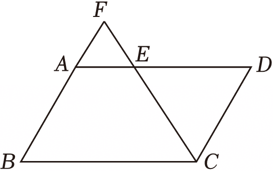

| 人员 | 环数 | 环数 | 环数 | 环数 | 环数 | 环数 | 环数 | 环数 | 环数 | 环数 |
|---|---|---|---|---|---|---|---|---|---|---|
| 甲 | 6 | 7 | 6 | 8 | 7 | 6 | 8 | 6 | 9 | 7 |
| 乙 | 5 | 7 | 5 | 10 | 5 | 8 | 6 | 9 | 8 | 7 |

| 人员 | 平均数 | 中位数 | 众数 | 方差： |
|---|---|---|---|---|
| 甲 |  | 7 | m | 1 |
| 乙 | 7 | n | 5 | 2.8 |