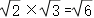
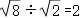
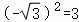
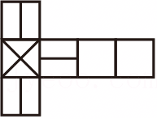
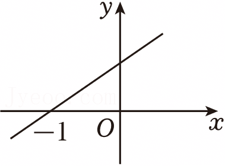
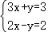
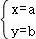
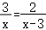
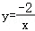

2025年江苏省徐州市中考数学试卷

一、选择题（本大题共有8小题，每小题3分，共24分.在每小题所给出的四个选项中，只有一项符合题意，请将正确选项对应的字母代号填涂在答题卡相应位置）

1．（3分）﹣的相反数是（　　）

A．	B．﹣	C．2	D．﹣2

2．（3分）传统纹样作为中华传统文化的一部分，具有深厚的底蕴．徐州出土汉代玉器的下列纹样，既是轴对称图形又是中心对称图形的是（　　）

3．（3分）一只不透明的袋子中装有4个红球与2个黑球，每个球除颜色外都相同．从中任意摸出3个球，下列事件为必然事件的是（　　）

A．至多有1个球是红球	B．至多有1个球是黑球

C．至少有1个球是红球	D．至少有1个球是黑球

4．（3分）下列运算正确的是（　　）

A．3a2﹣2a2＝1	B．（a2）3＝a5	C．（3a）2＝6a2	D．a2•a4＝a6

5．（3分）使有意义的x的取值范围是（　　）

A．x≠1	B．x≥1	C．x＞1	D．x≥0

6．（3分）下列计算错误的是（　　）

A．	B．	C．	D．

7．（3分）如图为一个正方体的展开图，将其折成一个正方体，所得图形可能是（　　）

8．（3分）如图为一次函数y＝kx+b的图象，关于x的不等式k（x﹣3）+b＜0的解集为（　　）

A．x＜﹣4	B．x＞﹣4	C．x＜2	D．x＞2

二、填空题（本大题共有10小题，每小题3分，共30分.不需要写出解答过程，请将答案直接填写在答题卡相应位置）

9．（3分）2025年“五一”假期，约有166200人次的参观者走进淮塔园林接受红色教育．将166200用科学记数法表示为　            　 ．

10．（3分）小明家1～5月的电费（单位：元）分别为：137，140，140，117，104．该组数据的中位数是　      　 ．

11．（3分）若二元一次方程组的解为，则a+b的值为　   　 ．

12．（3分）分式方程的解为　      　 ．

13．（3分）若点A（6，y1），B（5，y2）都在函数的图象上，则y1　   　 y2（填“＞”“＝”或“＜”）．

14．（3分）如图，E，F，G，H分别为矩形ABCD各边的中点．若AB＝3，BC＝4，则四边形EFGH的周长为　     　 ．

15．（3分）如图，将三角形纸片ABC折叠，使点A落在边BC上的点D处，折痕为CE．若△ABC的面积为8，△BCE的面积为5，则BD：DC＝　      　 ．

16．（3分）二次函数y＝x2+x+1的最小值为　                　 ．

17．（3分）如图所示，用黑白两色棋子摆图形，依此规律，第n个图形中黑色棋子的个数为　       　 （用含n的代数式表示）．

18．（3分）如图为二次函数y＝ax2+bx+c的图象，下列代数式的值为负数的是　      　 （写出所有正确结果的序号）．

①a；

②2a+b；

③c；

④b2﹣4ac；

⑤a﹣b+c．

三、解答题（本大题共有10小题，共86分.请在答题卡指定区域内作答，解答时应写出文学说明、证明过程或演算步骤）

19．（10分）计算：

（1）；

（2）．

20．（10分）（1）解方程：x2+2x﹣4＝0；

（2）解不等式组：．

21．（7分）如图，甲、乙为两个可以自由转动的转盘，它们分别被分成了4等份与3等份，每份内均标有字母，转盘停止转动后，若指针落在两个区域的交线上，则重转一次．

（1）转动甲盘，待其停止转动后，指针落在A区域的概率为 　                　 ；

（2）转动甲、乙两个转盘，用列表或画树状图的方法，求转盘停止转动后甲盘指针落在C区域且乙盘指针未落在Q区域的概率．

22．（7分）为了解某景区外地自驾游客的分布情况，某日小桐随机调查了该景区附近部分宾馆停车场的车辆数，根据车牌号归属地的不同，绘制了如图统计图（不完整）：

根据图中信息，解答下列问题．

（1）小桐共调查了　      　 辆车，“豫”对应扇形的圆心角为　     　 °；

（2）补全条形统计图；

（3）若该景区附近宾馆停车场当日共有450辆外地自驾游客的车辆，估计其中车牌号归属地为“皖”的车辆有多少？

23．（8分）已知：如图，在▱ABCD中，E为BC的中点，EF⊥AC于点G，交AD于点F，AB⊥AC，连接AE，CF．求证：

（1）△AGF≌△CGE；

（2）四边形AECF是菱形．

24．（8分）如图，⊙O为正三角形ABC的外接圆，直线CD经过点C，CD∥AB．

（1）判断直线CD与⊙O的位置关系，并说明理由；

（2）若圆的半径为2，求图中阴影部分的面积．

25．（8分）下圆墩是“彭城七里”的起点，也是徐州城市历史的源头．某校数学综合与实践小组到下圆墩遗址公园参观，发现一处三角形的景观墙（如图），记作△ABC，同学们测得BC＝22.2m，∠B＝34.2°，∠C＝9.8°，求AC的长度．（精确到0.1m，参考数据：sin34.2°≈0.56，cos34.2°≈0.83，tan34.2°≈0.68，sin9.8°≈0.17，cos9.8°≈0.99，tan9.8°≈0.17）

26．（8分）“连弧纹镜”为战国至两汉时期备受推崇的铜镜设计，通常由六到十二个连续的等弧连成一圈，构成了别具一格的装饰图案．图1为徐州博物馆藏“八连弧纹镜”，纹饰中有八个连续的等弧连成一圈．图2为另一件连弧纹镜（残件）的示意图．

（1）若将图2中的连弧纹镜补全，则该铜镜应为“　   　 连弧纹镜”；

（2）请用无刻度的直尺与圆规，补全图2中所有残缺的弧，使其“破镜重圆”．（保留作图痕迹，不写作法）

27．（8分）急刹车时，停车距离是指骑车人从意识到应当刹车到车辆停下来所走的距离，记作ym；反应距离是指骑车人意识到应当刹车到实施刹车所走的距离，记作d1m；刹车距离是指骑车人实施刹车到车辆停下来所走的距离，记作d2m，已知y＝d1+d2，d1与骑行速度成正比，d2与骑行速度的平方成正比．当骑行速度为13km/h时，反应距离为2.6m，刹车距离为1m．

（1）若骑行速度为26km/h，则d1＝ 　      　 m，d2＝ 　   　 m；

（2）设骑行速度为xkm/h，求y关于x的函数表达式；

（3）当刹车距离为2m时，停车距离为多少？（精确到0.1m，参考数据：，.73，）

28．（12分）如图1，将Rt△AOB绕直角顶点O旋转至△COD，点A，B的对应点分别为C，D．连接AD，BC，AC，BD，直线AC与BD交于点E．

（1）△AOD与△BOC的面积存在怎样的数量关系？请说明理由；

（2）如图2，连接OE，若AB，CD，OE的中点分别为P，Q，R．求证：P，Q，R三点共线；

（3）已知AB＝5，随着OA，OB及旋转角的变化，若存在以A，B，C，D为顶点的四边形，其面积为S，则S的最大值为　     　 ．

