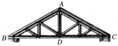
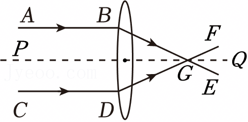
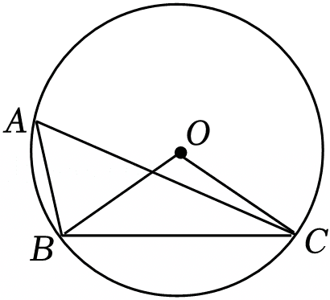
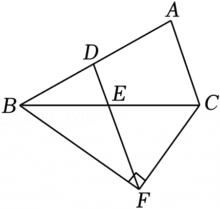
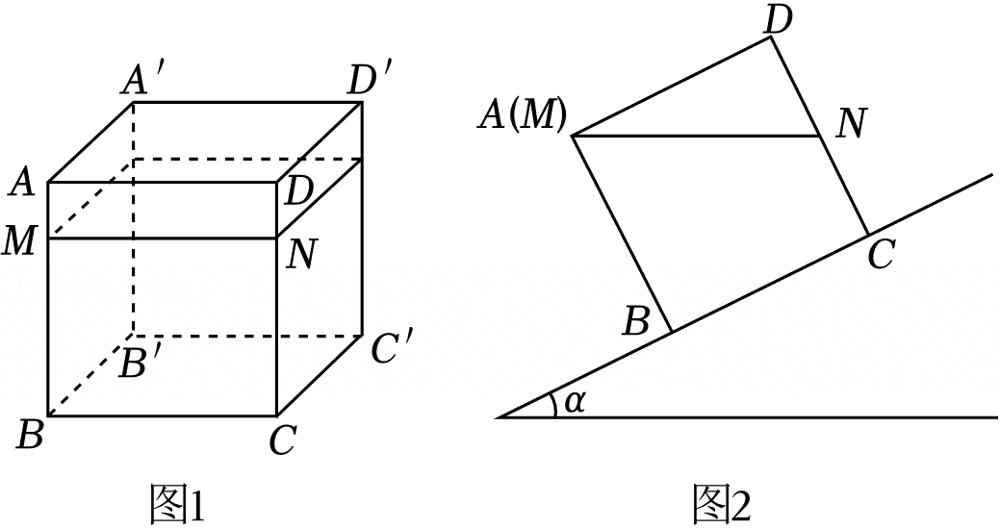
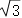
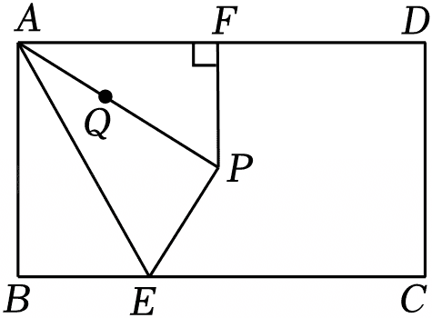
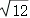
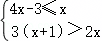
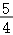

2025年江苏省扬州市中考数学试卷

一、选择题（本大题共有8小题，每小题3分，共24分.在每小题所给出的四个选项中，恰有一项是符合题目要求的，请将该选项的字母代号填涂在答题卡相应位置上）

1．（3分）下列温度中，比﹣3℃低的温度是（　　）

A．﹣5℃	B．﹣2℃	C．0℃	D．2℃

2．（3分）窗棂是中国传统木构建筑的重要元素，既散发着古典之韵，又展现了几何之美．下列窗棂图案中，是轴对称图形但不是中心对称图形的是（　　）

3．（3分）下列说法不正确的是（　　）

A．明天下雨是随机事件

B．调查长江中现有鱼的种类，适宜采用普查的方式

C．描述一周内每天最高气温的变化情况，适宜采用折线统计图

D．若甲组数据的方差S甲2＝0.13，乙组数据的方差S乙2＝0.04，则乙组数据更稳定

4．（3分）关于一元二次方程x2﹣3x+1＝0的根的情况，下列结论正确的是（　　）

A．有两个不相等的实数根

B．有两个相等的实数根

C．没有实数根

D．无法判断根的情况

5．（3分）如图，数轴上点A表示的数可能是（　　）

A．	B．	C．	D．

6．（3分）在如图的房屋人字梁架中，AB＝AC，点D在BC上，下列条件不能说明AD⊥BC的是（　　）

A．∠ADB＝∠ADC	B．∠B＝∠C

C．BD＝CD	D．AD平分∠BAC

7．（3分）如图，平行于主光轴PQ的光线AB和CD经过凸透镜折射后，折射光线BE，DF交于主光轴上一点G．若∠ABE＝130°，∠CDF＝150°，则∠EGF的度数是（　　）

A．60°	B．70°	C．80°	D．90°

8．（3分）已知m2025+2025m＝2025，则一次函数y＝（1﹣m）x+m的图象不经过（　　）

A．第一象限	B．第二象限	C．第三象限	D．第四象限

二、填空题（本大题共有10小题，每小题3分，共30分.不需写出解答过程，请把答案直接填写在答题卡相应位置上）

9．（3分）2025年3月30日，扬州鉴真半程马拉松暨大运河马拉松系列赛在市民中心广场鸣枪开跑，约30000名跑者用脚步丈量千年古城，用拼搏诠释无限热爱．将数据30000用科学记数法表示为　        　 ．

10．（3分）分解因式：a2﹣4＝　             　 ．

11．（3分）计算：（1﹣）÷＝　      　 ．

12．（3分）若a2﹣2b+1＝0，则代数式2a2﹣4b+3的值是　   　 ．

13．（3分）若多边形的每个内角都是140°，则这个多边形的边数为 　   　 ．

14．（3分）如图，点A，B，C在⊙O上，∠BAC＝50°，则∠OBC＝　     　 °．

15．（3分）如图，在△ABC中，点D，E分别是边AB，BC的中点，点F在线段DE的延长线上，且∠BFC＝90°．若AC＝4，BC＝8，则DF的长是　   　 ．

16．（3分）清代扬州数学家罗士琳痴迷于勾股定理的研究，提出了推算勾股数的“罗士琳法则”．法则的提出，不仅简化了勾股数的生成过程，也体现了中国传统数学在数论领域的贡献．由此法则写出了下列几组勾股数：①3，4，5；②5，12，13；③7，24，25；④9，40，41；⋯⋯根据上述规律，写出第⑤组勾股数为　            　 ．

17．（3分）如图1，棱长为9cm的密封透明正方体容器水平放置在桌面上，其中水面高度BM＝7cm．将此正方体放在坡角为α的斜坡上，此时水面MN恰好与点A齐平，其主视图如图2所示，则tanα＝ 　                　 ．

18．（3分）如图，在矩形ABCD中，AB＝4，BC＝4，点E是BC边上的动点，将△ABE沿直线AE翻折得到△APE，过点P作PF⊥AD，垂足为F，点Q是线段AP上一点，且AQ＝PF．当点E从点B运动到点C时，点Q运动的路径长是　                 　 ．

三、解答题（本大题共有10小题，共96分.请在答题卡指定区域内作答，解答时应写出必要的文字说明、证明过程或演算步骤）

19．（8分）计算：

（1）﹣2cos30°+（π+1）0；

（2）a（a+2）﹣a3÷a．

20．（8分）解不等式组，并写出它的所有负整数解．

21．（8分）为角逐市校园“音乐达人”大赛，小红和小丽参加了校内选拔赛，10位评委的评分情况如下（单位：分）．

表1评委评分数据

表2评委评分数据分析

根据以上信息，回答下列问题：

（1）表2中a＝　      　 ，b＝　   　 ，c＝　   　 ；

（2）你认为小红和小丽谁的成绩较好？请说明理由．

22．（8分）为打造活力校园，某校在大课间开展了丰富多彩的活动，现有4种体育类活动供学生选择：A．羽毛球，B．乒乓球，C．花样跳绳，D．踢毽子，每名学生只能选择其中一种体育活动．

（1）若小明在这4种体育活动中随机选择，则选中“乒乓球”的概率是　                　 ；

（2）请用画树状图或列表的方法，求小明和小聪随机选择选到同一种体育活动的概率．

23．（10分）某文创商店推出甲、乙两款具有纪念意义和实用价值的书签，已知甲款书签价格是乙款书签价格的倍，且用100元购买甲款书签的数量比用128元购买乙款书签的数量少3个．求这两款书签的单价．

24．（10分）如图，在平面直角坐标系中，反比例函数y＝的图象与一次函数y＝ax+b的图象交于点A（﹣1，6），B（m，﹣2）．

（1）求反比例函数、一次函数的表达式；

（2）求△OAB的面积．

25．（10分）如图，在▱ABCD中，对角线AC的垂直平分线与边AD，BC分别相交于点E，F．

（1）求证：四边形AFCE是菱形；

（2）若AB＝3，BC＝5，CE平分∠ACD，求DE的长．

26．（10分）材料的疏水性

扬州宝应是荷藕之乡．“微风忽起吹莲叶，青玉盘中泻水银”，莲叶上的水滴来回滚动，不易渗入莲叶内部，这说明莲叶具有较强的疏水性．疏水性是指材料与水相互排斥的一种性质．

【概念理解】

材料疏水性的强弱通常用接触角的大小来描述．材料上的水滴可以近似地看成球或球的一部分，经过球心的纵截面如图1所示，接触角是过固、液、气三相接触点（点M或点N）所作的气﹣液界线的切线与固﹣液界线的夹角，图1中的∠PMN就是水滴的一个接触角．

（1）请用无刻度的直尺和圆规作出图2中水滴的一个接触角，并用三个大写字母表示接触角；（保留作图痕迹，写出必要的文字说明）

（2）材料的疏水性随着接触角的变大而　     　 （选填“变强”“不变”“变弱”）．

【实践探索】

实践中，可以通过测量水滴经过球心的高度BC和底面圆的半径AC（BC⊥AC），求出∠BAC的度数，进而求出接触角∠CAD的度数（如图3）．

（3）请探索图3中接触角∠CAD与∠BAC之间的数量关系（用等式表示），并说明理由．

【创新思考】

（4）材料的疏水性除了用接触角以及图3中与△ABC相关的量描述外，还可以用什么量来描述，请你提出一个合理的设想，并说明疏水性随着此量的变化而如何变化．

27．（12分）如图，在平面直角坐标系中，二次函数y＝﹣x2﹣2x+3的图象（记为G1）与x轴交于点A，B，与y轴交于点C，二次函数y＝x2+bx+c的图象（记为G2）经过点A，C．直线x＝t与两个图象G1，G2分别交于点M，N，与x轴交于点P．

（1）求b，c的值．

（2）当点P在线段AO上时，求MN的最大值．

（3）设点M，N到直线AC的距离分别为m，n．当m+n＝4时，对应的t值有　   　 个；当m﹣n＝3时，对应的t值有　   　 个；当mn＝2时，对应的t值有　   　 个；当＝1时，对应的t值有　     　 个．

28．（12分）问题：如图1，点P为正方形ABCD内一个动点，过点P作EF∥AD，GH∥AB，矩形PHCF的面积是矩形PGAE面积的2倍，探索∠FAH的度数随点P运动的变化情况．

【从特例开始】

（1）小玲利用正方形网格画出了一个符合条件的特殊图形（如图2），请你仅用无刻度的直尺连接一条线段，由此可得此图形中∠FAH＝ 　     　 °．

（2）小亮也画出了一个符合条件的特殊图形（如图3），其中PE＝PF＝6，PG＝4，PH＝8，求此图形中∠FAH的度数；

【一般化探索】

（3）利用图1，探索上述问题中∠FAH的度数随点P运动的变化情况，并说明理由．

| 选手 | 评委评分 | 评委评分 | 评委评分 | 评委评分 | 评委评分 | 评委评分 | 评委评分 | 评委评分 | 评委评分 | 评委评分 |
|---|---|---|---|---|---|---|---|---|---|---|
| 小红 | 7 | 8 | 7 | 8 | 7 | 7 | 7 | 8 | 7 | 9 |
| 小丽 | 7 | 7 | 6 | 8 | 8 | 8 | 8 | 8 | 7 | 8 |

| 选手 | 平均数 | 中位数 | 众数 |
|---|---|---|---|
| 小红 | 7.5 | b | 7 |
| 小丽 | a | 8 | c |