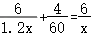
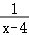
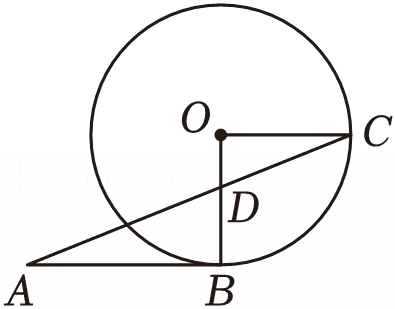
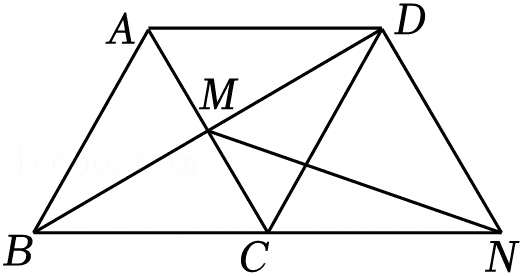
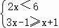
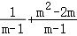
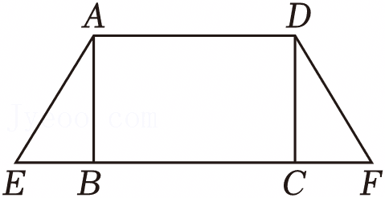
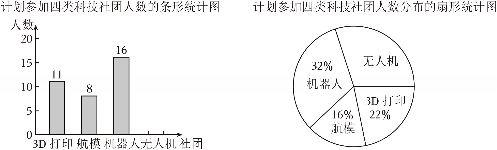

2025年江苏省无锡市中考数学试卷

一、选择题（本大题共10小题，每小题3分，共30分.在每小题所给出的四个选项中，只有一项是正确的，请用2B铅笔把答题卡上相应的选项标号涂黑.）

1．（3分）计算﹣2+3的结果为（　　）

A．﹣5	B．﹣1	C．1	D．5

2．（3分）2025年春节期间，无锡市65家备案博物馆接待游客总数约819000人次．数据819000用科学记数法表示为（　　）

A．8.19×105	B．81.9×104	C．0.819×105	D．0.819×106

3．（3分）下列运算正确的是（　　）

A．a2+a4＝a6	B．a2•a4＝a6	C．（a2）4＝a6	D．a4÷a＝a4

4．（3分）一组数据：13，14，14，16，18，这组数据的平均数和众数分别是（　　）

A．15，14	B．14，15	C．14，14	D．15，15

5．（3分）在△ABC中，D、E分别是AB、AC的中点．若DE＝4，则BC的长为（　　）

A．2	B．4	C．6	D．8

6．（3分）已知圆弧所在圆的半径为6，该弧所对的圆心角为90°，则这条弧的长为（　　）

A．2π	B．3π	C．4π	D．6π

7．（3分）分解因式a3﹣4a的结果是（　　）

A．a（a2+4）	B．a（a﹣4）

C．a（a+2）（a﹣2）	D．a（a2﹣1）

8．（3分）小亮与小红周末去十里明珠堤的环湖绿道上骑行，小亮的速度是小红速度的1.2倍，两人各自骑行了6km，小亮骑行时间比小红少用了4min．设小红的骑行速度为xkm/h，则可列方程为（　　）

A．	B．

C．	D．

9．（3分）如图，在平面直角坐标系中，O为坐标原点，Rt△OBA的直角边OB在x轴上，AO、AB分别与反比例函数y＝（k＞0，x＞0）的图象相交于点C、D，且C为AO的中点，过点C作x轴的垂线，垂足为E，连接DE．若△BDE的面积为，则k的值为（　　）

A．	B．	C．5	D．10

10．（3分）若函数y1的图象上存在点P，函数y2的图象上存在点Q，且P、Q关于y轴对称，则称函数y1和y2具有“对偶关系”，此时点P或点Q的纵坐标称为“对偶值”．下列结论：

①函数y1＝2x+3与函数y2＝﹣x+1不具有“对偶关系”；

②函数y1＝2x+3与函数y2＝﹣x+1的“对偶值”为﹣1；

③若1是函数y1＝kx+3与函数y2＝的“对偶值”，则k＝2；

④若函数y1＝﹣2x+b（﹣2≤x≤﹣1）与函数y2＝（x＞0）具有“对偶关系”，则3≤b≤．

其中正确的是（　　）

A．①④	B．②③	C．①③④	D．②③④

二、填空题（本大题共8小题，每小题3分，共24分.不需写出解答过程，请把答案直接填写在答题卡相应的位置上.）

11．（3分）|﹣3|＝　   　 ．

12．（3分）函数y＝中的自变量x的取值范围　      　 ．

13．（3分）请写出单项式a2b的一个同类项：　               　 ．

14．（3分）请写出命题“若a＞b，则a+1＞b+1”的逆命题：　                　 ．

15．（3分）正七边形的内角和为　      　 度．

16．（3分）如图，AB与⊙O相切于点B，连接BO，过点O作BO的垂线OC，交⊙O于点C，连接AC，交线段OB于点D．若AB＝3，OC＝2，则tanA的值为　                　 ．

17．（3分）如图，菱形ABCD的边长为2，∠ABC＝60°，对角线AC、BD相交于点M．过点D作AC的平行线交BC的延长线于点N，连接MN．则MN的长为　             　 ．

18．（3分）在平行四边形纸片ABCD中，∠ABC＝60°，AB＝4，BC＝8．现将该纸片折叠，折痕与纸片ABCD的两边交于点E、F．若E与A重合，F在BC上，且EF⊥BC，则被折痕分成的△EBF与四边形EFCD的面积的比为　      　 ；若折痕EF将纸片ABCD分成两个四边形，且被分成的两个四边形的面积的比为1：3，则折痕EF长的取值范围是　                  　 ．

三、解答题（本大题共10小题，共96分.请在答题卡指定区域内作答，解答时应写出文字说明、证明过程或演算步骤等.）

19．（8分）（1）解方程：x2﹣2x﹣2＝0；

（2）解不等式组：．

20．（8分）先化简，再求值：，其中m＝3．

21．（10分）如图，在矩形ABCD中，点E在CB延长线上，点F在BC延长线上，且BE＝CF，连接AE、DF．

求证：（1）△ABE≌△DCF；

（2）∠EAD＝∠FDA．

22．（10分）一只不透明的袋子中装有标号分别为1，2，3，4的4个球，这些球除标号外都相同．

（1）将球搅匀，从中任意摸出1个球，摸到标号为2的球的概率是 　                　 ；

（2）将球搅匀，从中任意摸出1个球，记录标号后不放回，再从袋子中任意摸出1个球，记录标号．求两次摸到的球标号均小于3的概率．（请用“画树状图”或“列表”等方法写出分析过程）

23．（10分）2025年1月14日，教育部办公厅印发了《中小学科学教育工作指南》（以下简称《指南》），旨在推动中小学科学教育更加重视激发学生好奇心、想象力、探求欲，培育具备科学家潜质、愿意献身科学研究事业的青少年群体．某校为落实《指南》要求，准备在七年级开设“3D打印”“航模”“机器人”“无人机”共四类科技社团（每名学生必选且仅选一个社团）．为了解学生参加各社团的意向，现随机抽取七年级部分学生进行问卷调查，并对问卷数据进行收集、整理、描述和分析，部分信息如下：

请根据以上信息，解答下列问题：

（1）本次调查的样本容量为　     　 ，并将条形统计图补充完整；（画图后请标注相应的数据）

（2）若该校七年级共有1000名学生，请估计计划参加“机器人”社团的学生人数；

（3）根据上述统计分析情况，请你为该校科技社团活动的顺利开展给出一条合理建议．

24．（10分）如图，AC为正方形ABCD的对角线．

（1）尺规作图：作AD的垂直平分线l交AD于点E，在l上确定点F，使得点F到∠BAC的两边距离相等；（不写作法，保留痕迹）

（2）在（1）的条件下，求∠EFA的度数．

（请直接写出∠EFA的度数）

25．（10分）如图，AB是⊙O的直径，D是弦AC延长线上的一点，且CD＝CA，DB的延长线交⊙O于点E．

（1）求证：AB＝BD；

（2）若AB＝3，cos∠ABE＝，求AD的长．

26．（10分）某校数学研究性学习小组为测量物体的高度，开展了如下综合与实践活动．

【活动主题】测量物体的高度

【测量工具】卷尺、标杆

【活动过程】

活动1：测量校内旗杆的高度

该小组在校内进行了旗杆高度的测量活动（示意图1）．在点F处竖立标杆EF，直立在点Q处的小军从点P处看到标杆顶E、旗杆顶M在同一条直线上．已知旗杆底端N与F、Q在同一条直线上，EF＝2.8m，PQ＝1.4m，QF＝2m，FN＝16m．

（1）求旗杆MN的高度．

活动2：测量南禅寺妙光塔的高度

南禅寺妙光塔，简称“妙光塔”，始建于北宋雍熙年间，是无锡著名的文物保护单位之一．该小组为全面了解本土历史文物，决定走出校园去测量妙光塔的高度．他们到达妙光塔后，发现塔顶A和塔底中心B均无法到达．经研究，设计并实施了如下测量活动（示意图2）．在地面一条水平步道上的点F处竖立标杆EF，直立在点Q处的小军从点P处看到标杆顶E、塔顶A在同一条直线上．小军沿FQ的方向走到点Q′处，此时标杆E′F′竖立于F′处，从点P′处看到标杆顶E′、塔顶A在同一条直线上．已知AB、EF、PQ、E′F′和P′Q′在同一平面内，点B、F、Q、F′、Q′在同一条直线上，EF＝E′F′＝2.8m，PQ＝P′Q′＝1.4m，FQ＝1.2m，F′Q′＝2.2m，QQ′＝30m．

（2）求妙光塔AB的高度．

27．（10分）已知二次函数y＝﹣m（m≠0）图象的顶点为A，与y轴交于点B，对称轴与x轴交于点C．

（1）若该函数图象经过点，求点A的横坐标；

（2）若m＜3，点P（2，y1）和Q（4，y2）在该函数图象上，证明：y1＞y2；

（3）若△ABC是等腰三角形，求m的值．

28．（10分）【数学发现】

某校数学兴趣小组进行了如下探究：以△ABC内部任意一点O为中心，画出与△ABC成中心对称的△A′B′C′．当点O处于不同位置时，从“形”的角度发现两个三角形的重叠部分只可能有两种情况：如图1所示的平行四边形，如图2所示的有三组对边分别平行的六边形（称为“平行六边形”）；从“数”的角度发现两个三角形重叠部分的面积在不断变化．

【问题解决】

组员小明选择面积为1的△ABC，以其内部任意一点O为中心，画出与之成中心对称的△A′B′C′，探究了下列问题，请你帮他解答．

（1）如图3，BC＝2，当点A关于点O的对称点A′落在边BC上时，两个三角形重叠部分为▱AQA′P．

①若AA′⊥BC，求AO的长；（请直接写出答案）

②若▱AQA′P的面积为，求A′C的长．

（2）如图4，点D为BC的中点，点O在AD上，若两个三角形的重叠部分为“平行六边形”EFGHMN，求“平行六边形”EFGHMN面积的最大值，并指出此时点O的位置．

