2025年江苏省淮安市中考数学试卷

一、选择题（本大题共8小题，每小题3分，共24分.在每小题给出的四个选项中，恰有一项符合题目要求）

1．（3分）﹣3的相反数是（　　）

A．﹣3	B．	C．	D．3

2．（3分）下列交通标志中，属于轴对称图形的是（　　）

3．（3分）2025年五一假期，淮安各大景区景点人气爆棚．经了解，淮安全市共接待游客约526.1万人次，实现旅游总收入约24.2亿元．数据“24.2亿”用科学记数法表示为（　　）

A．24.2×108	B．2.42×108

C．2.42×109	D．0.242×1010

4．（3分）下列计算正确的是（　　）

A．a3÷a＝a2	B．a2•a3＝a6	C．a7﹣a3＝a4	D．（a4）3＝a7

5．（3分）如图，将直角三角形绕直角边所在直线l旋转一周，得到的立体图形是（　　）

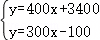

6．（3分）《九章算术》记载：“今有共买金，人出四百，盈三千四百；人出三百，盈一百．问人数、金价各几何？”意思为：“今有人合伙买金，每人出钱400，会多出3400钱；每人出钱300，会多出100钱．问合伙人数、金价各是多少？”设合伙人数为x人，金价为y钱，则可列方程组（　　）

A．

B．

C．

D．

7．（3分）如图，直线a∥b，正六边形ABCDEF的顶点A、C分别在直线a、b上，若∠1＝40°，则∠2的度数是（　　）

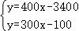

A．15°	B．20°	C．30°	D．40°

8．（3分）在平面直角坐标系中，直角三角板AOB按如图位置摆放，直角顶点与原点O重合，点A在反比例函数y＝（x＞0）的图象上，∠B＝30°．若点B坐标为（1，﹣3），则k的值是（　　）

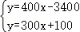

A．﹣2	B．	C．1	D．2

二、填空题（本大题共8小题，每小题3分，共24分）

9．（3分）若分式有意义，则a的取值范围是　      　 ．

10．（3分）计算：＝　   　 ．

11．（3分）等腰三角形的一个底角为50°，则它的顶角的度数为 　      　 ．

12．（3分）点P（﹣1，1）沿y轴向上平移4个单位长度后的点坐标是　         　 ．

13．（3分）如图，在▱ABCD中，对角线AC、BD交于点O，AC⊥AB，点E、F分别为BC、CD的中点，连接AE、OF，若AE＝4，则OF＝　   　 ．

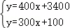

14．（3分）如图，直线l1：y＝﹣x+6经过点A（1，a），将l1绕A点顺时针旋转，旋转角为α（45°＜α＜135°），得到直线l2．点B（m，n）在l2上，若m＞1，则n的值可以是　           　 ．（填写一个值即可）

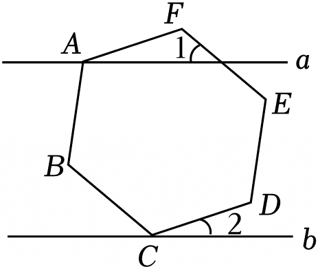

15．（3分）若x2﹣3x+1+y＝0，则2x+y的最大值是　                 　 ．

16．（3分）观察点和观察的图形在同一平面内，我们把以观察点为顶点，包含被观察图形的最小角称为从观察点观察该图形的张角．如图（1），α为观察点P观察正方形的张角．如图（2），在正方形所在平面内观察这个正方形，若张角为90°，则观察点的位置都在图中的圆弧上．如图（3），等边三角形ABC的边长为6，在三角形所在平面内观察这个三角形，若张角为30°，则所有符合条件的观察点组成的图形周长为　      　 ．

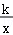

三、解答题（本大题共11小题，共102分．解答时应写出必要的文字说明、证明过程或演算步骤）

17．（10分）（1）计算：2sin60°+|﹣1|+；

（2）解不等式组：．

18．（8分）先化简，再求值：，其中a＝+1．

19．（8分）已知：如图，在△ABC和△ADE中，点D在BC上，∠B＝∠ADE，AC＝AE，∠BAD＝∠CAE．求证：△ABC≌△ADE．

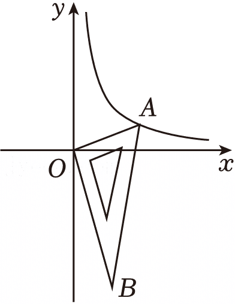

20．（8分）一个不透明的盒子里装有四张卡片，分别写有“美”“好”“淮”“安”四个字，卡片除文字外都相同，并将四张卡片充分搅匀．

（1）从盒子中随机抽取1张卡片，恰好抽到“淮”的概率是　                　 ；

（2）一次从盒子中随机抽取2张卡片，用画树状图或列表的方法，求抽取的卡片恰好1张为“美”、1张为“好”的概率．

21．（8分）为了解某品牌A、B两种型号扫地机器人的销售情况，商场对这两种型号的扫地机器人1﹣8月份的销售情况进行了调查统计，并对统计数据进行了整理分析．

数据整理：

数据分析：

请认真阅读上述信息，回答下列问题：

（1）填空：a＝　     　 ，b＝　     　 ，c＝　     　 ；

（2）请对商场八月份以后这两种型号扫地机器人的进货意向提出合理的建议，并说明理由．

22．（8分）如图，AB是半圆O的直径，点C是弦AD延长线上一点，连接CB、BD，∠CBD＝∠CAB．

（1）求证：BC是⊙O的切线；

（2）连接OD，若∠CAB＝30°，AB＝4，求扇形OBD的面积．

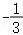

23．（8分）某商店销售一种玩具，经市场调查发现，日销售量y（件）与每件的售价x（元）满足一次函数关系，部分数据如表：

（1）求y与x之间的函数表达式（不要求写出自变量x的取值范围）；

（2）当玩具日销售额为300元时，求每件玩具的售价．

24．（8分）已知：如图，矩形ABCD．

（1）尺规作图：在CD边上找一点E，将矩形ABCD沿BE折叠，使点C落在边AD上；（不写作法，保留作图痕迹）

（2）在（1）所作图形中，若AB＝3，BC＝5，求CE的长．

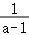

25．（10分）已知二次函数y＝﹣mx+m﹣1（m为常数）．

（1）若点（2，﹣1）在该函数图象上，则m＝　   　 ；

（2）证明：该二次函数的图象与x轴有两个不同的公共点；

（3）若该函数图象上有两个点A（m+1，y1）、B（m+p，y2），当y1＜y2时，直接写出p的取值范围．

26．（12分）综合与实践

[主题]雨天撑伞的学问

[情境]图（1）、图（2）是小丽在雨天水平撑伞的示意图，她的身体侧面可以近似看作矩形MNPQ，MN＝0.2米，MQ＝1.6米，雨伞撑开的宽度AC＝1米，伞柄的OG部分长为0.45米，点O为AC中点，OG⊥AC，点G到地面的距离是1.35米，手臂可以水平向前最长伸出0.5米，雨线AB与地面的夹角为θ，雨线AB与CD平行，AC与地面BD平行．

[问题感知]

（1）①在图（1）、图（2）中，点C到地面的距离是　      　 米；

②如图（1）所示，θ＝72°，若小丽将伞拿在胸前（OG与NP在同一条直线上），则小丽身体被雨水淋湿的部分PK＝　       　 米．（参考数据：sin72°≈0.95，cos72°≈0.31，tan72°≈3.08）

[问题探究]

（2）如图（2）所示，θ＝60°，设小丽将手臂水平前伸了x米（即线段EG的长度），身体被雨水淋湿部分PK的长度为y米，求y与x的函数表达式，并写出头部不被淋湿情况下x的取值范围．

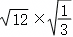

[问题解决]

（3）在（2）的条件下，小丽发现水平撑伞身体始终有部分会被淋湿，于是她将雨伞绕点G顺时针旋转一定角度（点G到地面的距离保持不变），使得AC与雨线AB垂直，如图（3）所示．试问：小丽在旋转雨伞后，是否可以通过调节手臂水平前伸长度，使得全身都不会被雨淋湿？如果可以，请求出EG的最小值；如果不可以，请说明理由．

27．（14分）探究与应用

[问题初探]（1）在等腰三角形ABC的底边BC上任取一点P（不与端点重合），连接AP，线段AB、AP、BP、CP有何数量关系？下面是小刚的部分思路和方法，请完成填空：

根据小刚的方法，可以得到线段AB、AP、BP、CP的数量关系是　                　 ．

[简单应用]（2）如图（2），在等腰直角三角形ABC中，∠ACB＝90°，点D在边AB上，AD＝AC＝2，以CD为边构造正方形CDEF，利用（1）中的结论求正方形CDEF的面积．

[灵活应用]（3）如图（3），⊙O是△ABC的外接圆，∠ABC的平分线交AC于点D，连接OB、OD，若OB＝9，OD＝5，，求BD的长．

[深度思考]（4）如图（4），在△ABC中，∠C＝120°，点D、E分别在边AC、BC上，且满足AD＝DE＝BE，AE、BD交于点P，若tan∠CAE＝，则的值为　                  　 ．

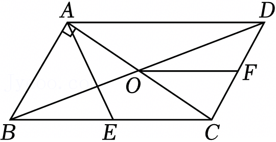

|  | 平均数 | 中位数 | 众数 |
|---|---|---|---|
| A型号 | a | 14 | 12 |
| B型号 | 12 | b | c |

| 每件的售价x/元 | … | 25 | 28 | 31 | … |
|---|---|---|---|---|---|
| 日销售量y/件 | … | 15 | 12 | 9 | … |

| 如图（1），过点A作AD⊥BC于点D，
在Rt△ABD中，∵∠ADB＝90°，∴AB2＝AD2+BD2．①
在Rt△APD中，∵∠ADP＝90°，∴AP2＝　          　 ．②
由①﹣②得：AB2﹣AP2＝BD2﹣PD2＝（BD+PD）•（BD﹣PD）．
∵AB＝AC，AD⊥BC，
∴BD＝　     　 ．
∴BD﹣PD＝CD﹣PD＝CP．
…… |
|---|