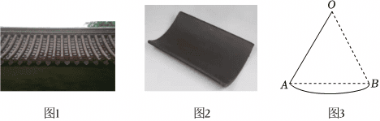
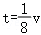
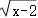
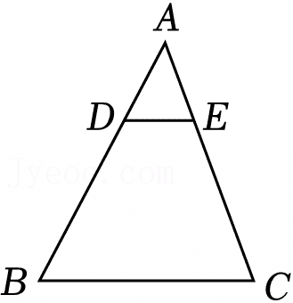
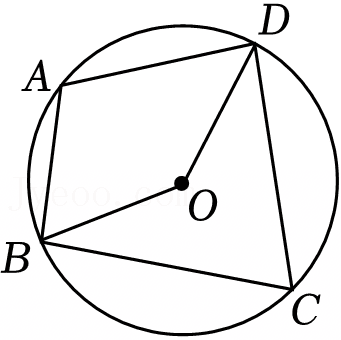
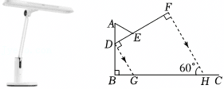
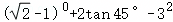
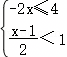
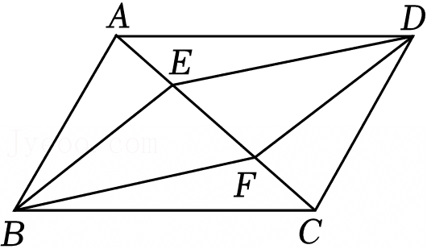
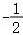

2025年江苏省盐城市中考数学试卷

一、选择题（本大题共8小题，每小题3分，共24分，在每小题给出的四个选项中，只有一项是符合题目要求的）“五一”假期，小明参观了盐城市各大博物馆，下面请跟随小明从数学的视角重温这次博物馆之旅！

1．（3分）小明从小区﹣2楼出发，实数﹣2的绝对值是（　　）

A．2	B．﹣2	C．	D．

2．（3分）小明的背包随安检传送带移动，主要涉及的图形变换是（　　）

A．平移	B．轴对称	C．旋转	D．位似

3．（3分）在非物质文化遗产展区，小明看到如下发绣作品，其中作品主体图案是轴对称图形的是（　　）

4．（3分）在文创商店，小明向服务人员询问丹顶鹤、麋鹿、勺嘴鹬三种卡通饰品哪种最畅销．“最畅销”涉及的统计量是（　　）

A．平均数	B．中位数	C．方差	D．众数

5．（3分）七巧板具有深厚的中华文化底蕴，它是由正方形、平行四边形和大小不一的等腰直角三角形组成的．小明用七巧板拼成的丹顶鹤如图所示，且过点C作直线AB∥DE．若∠1＝20°，则∠2的度数是（　　）

A．15°	B．20°	C．25°	D．30°

6．（3分）如图1是博物馆屋顶的图片，屋顶由图2中的瓦片构成，瓦片横截面如图3所示，是以点O为圆心，18cm为半径的弧，弦AB的长为18cm，则的长是（　　）

A．24πcm	B．12πcm	C．10πcm	D．6πcm

7．（3分）博物馆到小明家的路程为8km，小明回家所需时间t（单位：h）随平均速度v（单位：km/h）的变化而变化，则t与v的函数表达式是（　　）

A．t＝8v	B．	C．t＝	D．t＝8v2

8．（3分）小明了解到“五一”期间全市共接待游客约6806000人次，数据6806000用科学记数法表示为（　　）

A．0.6806×107	B．6.806×106

C．6.806×107	D．68.06×105

二、填空题（本大题共8小题，每小题3分，共24分）

9．（3分）若有意义，则x的取值范围是　      　 ．

10．（3分）分解因式：x2﹣9＝　             　 ．

11．（3分）如图，在△ABC中，DE∥BC．若AD：AB＝1：3，DE＝4，则BC＝　     　 ．

12．（3分）如图，四边形ABCD内接于⊙O，∠A＝110°，连接OB，OD，则∠BOD＝　      　 °．

13．（3分）已知圆锥的侧面积为15π，母线长为5，则圆锥的底面半径是　   　 ．

14．（3分）我国古代数学著作《算法统宗》中记载：“今有绫三尺，绢四尺，共价四钱八分；又绫七尺，绢二尺，共价六钱八分．问：绫、绢各价若干？”大意为：三尺绫和四尺绢共值四钱八分；七尺绫和二尺绢共值六钱八分．则绫、绢每尺各值多少？已知一钱等于十分，则每尺绢的价格是 　   　 分．

15．（3分）已知二次函数y＝x2﹣2x﹣3，当自变量x满足0≤x≤4时，y的取值范围是　         　 ．

16．（3分）一种遮阳伞如图，遮阳伞支架AB垂直于地面BC，点D在AB上，AD＝0.6m，D，E，F三点共线，DF＝3DE＝3AE．当太阳光线与DF垂直时，它与地面的夹角正好为60°，则DF落在地面上的投影GH＝　                  　 m．

三、解答题（本大题共11小题，共102分.解答时应写出必要的文字说明、证明过程或演算步骤）

17．（6分）计算：．

18．（6分）解不等式组：．

19．（8分）先化简，再求值：a（a+1）﹣（a+2）（a﹣2），其中a＝6．

20．（8分）如图，点E，F在▱ABCD的对角线AC上．若　   　 ，则四边形BEDF是平行四边形．请从①BE＝DF；②AE＝CF；③BE∥DF这3个选项中选择一个作为条件（写序号），使结论成立，并说明理由．

21．（8分）在学习频率与概率的相关知识时，小明与同伴一起做“同时抛掷2枚质地均匀的硬币”的试验，记录的试验结果如表．

（1）根据表中试验结果，估计“2枚硬币正面都朝上”的概率是　       　 .（精确到0.01）

（2）请你用列表或画树状图的方法解释（1）中的结论．

22．（10分）如图，AB是⊙O的弦，过点B作直线EF，以O为顶点作∠AOC＝90°，分别交EF，AB于点C，D，若CB＝CD．

（1）试判断直线EF与⊙O的位置关系，并说明理由．

（2）若⊙O的半径为3，，求BC的长．

23．（10分）6月6日是“全国爱眼日”．小明在报纸上看到某市疾控中心发布的中学生近视情况统计数据，如图1所示．

（1）图1中的数据是从全市30所中学随机抽取的部分学生视力筛查的结果．

①疾控中心收集数据，采用的调查方式是　       　 ；（填“普查”或“抽样调查”）

②根据统计图，请你分析近视率随年级升高的变化趋势．

（2）小明想了解“影响视力的主要因素”．对全校近视的985名学生进行问卷调查．问卷中设置了五个主要因素：A．不认真做眼保健操；B．长时间连续用眼；C．课间只在教室休息；D．饮食不均衡；E．睡眠时间不足．他绘制了如图2所示的条形统计图．

①从图2中可知，影响视力的最主要因素是　   　 .（填选项代号）

②结合上述统计数据，请你谈一谈如何预防近视．

24．（10分）某公司为节约成本，提高效率，计划购买A，B两款机器人．已知A款机器人的单价比B款机器人的单价多1万元，用25万元购买A款机器人的数量与用20万元购买B款机器人的数量相同．

（1）求A，B两款机器人的单价．

（2）如果购买A，B两款机器人共12台，且购买A款机器人的数量不少于B款机器人数量的一半，请设计购买成本最少的方案．

25．（10分）【生活观察】小明通过观察发现，将运动中的羽毛球看成一个点，扣杀球和网前吊球这两种击球的运动路线可以近似抽象成如下两种路线，如图1和图2所示．

【数学建模】小明发现扣杀球的路线近似为一条直线，网前吊球的路线近似为抛物线．羽毛球运动轨迹的剖面如图3所示，从A点击球，击球点是抛物线的最高点，点A到地面的距离AO＝2.4m，球网上端点B到地面的距离BC＝1.55m，人与球网之间的距离OC＝1.6m，假设两种击球路线都经过点B正上方0.05m处的点D，网前吊球和扣杀球的落点分别为点E，F．

（1）请在图3中建立合适的平面直角坐标系，并分别求出两种击球路线的函数表达式．

【模型应用】

（2）网前吊球的落点到球网的距离CE的长是　                  　 m；

（3）甲在A处击球，扣杀球时，羽毛球的平均速度约为36m/s，网前吊球时，羽毛球下降的高度h（单位：m）与时间t（单位：s）之间的关系式为h＝5t2.乙在看到甲击球的同时尝试接球，从甲击球到乙能成功接球的时间至少需要0.5s．请通过计算说明，乙能接到哪种方式的击球．

26．（12分）请根据小明的数学探究活动单，完成下列任务．

27．（14分）小明在参观科技馆时，发现很多矿物的结晶体有着其独特的几何形态和内在规律．

【发现问题】

黄铁矿的晶体（如图1）是一个正方体：它由六个面组成，每个面都是全等的正方形，每个顶点都连接3条棱．小明查阅资料后了解到，这种各面都是全等的正n边形，且各顶点连接r（r≥3）条棱的立体图形称为正多面体，如正方体又称为正六面体．

【提出问题】

小明思考：这样的正多面体有几个？

【分析问题】

一个正F面体的每个面都是全等的正n边形，有V个顶点，E条棱，且每个顶点都连接r条棱．小明对部分正F面体（如图2）进行了观察，列出以下数据．

（1）根据表中的数据，请写出F，V，E之间存在的等量关系式：　          　 ．

（2）小明进一步发现，正F面体中棱数与各面的边数之和以及棱数与各面的顶点数之和存在着一定的关系．

①从而出发：

以正方体为例，它有6个面，每个面都有4条边，则六个面的边数之和为24．又因为正方体的两个面共用一条边，所以正方体的棱数为12．正F面体的棱数E＝ 　                 　 ；（用含n，F的代数式表示）

②从顶点出发：正F面体的棱数E＝ 　                 　 .（用含r，V的代数式表示）

【解决问题】

（3）已知一个正多面体有30条棱，且每个顶点连接3条棱，求这个正多面体的面数．

（4）满足正多面体定义的几何体一共有几个？请说明你的理由．

| 抛掷次数n | 80 | 160 | 240 | 320 | 400 | 480 | 560 |
|---|---|---|---|---|---|---|---|
| 2枚正面都朝上的频数m | 18 | 37 | 61 | 78 | 103 | 118 | 141 |
| 2枚正面都朝上的频率（精确到0.001） | 0.225 | 0.231 | 0.254 | 0.244 | 0.258 | 0.246 | 0.252 |

| “θ变换” | “θ变换” | “θ变换” |
|---|---|---|
| 研究内容 | 提出概念 | 已知点P（x，y），如果点P′（x′，y′）满足，那么称点P′是点P的“θ变换”点． |
| 研究内容 | 理解概念 | 已知点，求点P的“θ变换”点P′（x′，y′）． |
| 研究内容 | 探究性质 | 如图1，已知点和点，当θ＝60°时，
①请在图1中分别画出点P，Q对应的“θ变换”点P′，Q′．
②研究发现：线段P′Q′可由线段PQ通过一次图形变换得到，点P′是点P的对应点．如果是平移，请写出平移的距离；如果是轴对称或旋转，请用无刻度的直尺和圆规在图1中作出对称轴或旋转中心．（不写作法，保留作图痕迹） |
| 研究内容 |  |  |
| 研究内容 | 运用性质 | 如图2，在平面直角坐标系中，菱形ABCD的顶点A，B，C的坐标分别为，，曲线l是反比例函数图象的“θ变换”线，θ＝45°，l交边BC于点M，N，直线OM，ON分别交边AD于点E，F，记△BOM，△CON，△DOE，△AOF的面积分别为S1，S2，S3，S4，求S1+S2+S3+S4的值． |

| 正多面体 | F | n | V | E | r |
|---|---|---|---|---|---|
| 正四面体 | 4 | 3 | 4 | 6 | 3 |
| 正方体 | 6 | 4 | 8 | 12 | 3 |
| 正八面体 | 8 | 3 | 6 | 12 | 4 |