2025年江苏省镇江市中考数学试卷

一、选择题（本大题共10小题，每小题3分，共30分．在每小题给出的四个选项中，恰有一项符合题目要求）

1．（3分）计算﹣2+3的结果是（　　）

A．5	B．﹣5	C．1	D．﹣1

2．（3分）使二次根式有意义的x的取值范围是（　　）

A．x≥2	B．x≤2	C．x＞2	D．x＜2

3．（3分）下列运算中，结果正确的是（　　）

A．a2•a3＝a5	B．a3+a3＝2a6	C．（a2）3＝a5	D．a4÷a2＝2a2

4．（3分）2024年全市共接待国内游客约55510800人次，其中数据55510800可表示为（　　）

A．55510.8万	B．5551.08万	C．555.108万	D．55.5108万

5．（3分）如图所示的几何体的主视图是（　　）

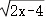

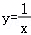

6．（3分）一组数据：82、80、82、87、90、84、85，它们的中位数是（　　）

A．82	B．84	C．85	D．87

7．（3分）如图，小丽从点A出发，沿坡度为10°的坡道向上走了120米到达点B，则她沿垂直方向升高了（　　）

A．米	B．米

C．120tan10°米	D．120sin10°米

8．（3分）已知点A（﹣1，y1）、B（a，y2）在反比例函数的图象上，若y2＞y1，则a的取值范围是（　　）

A．a＜﹣1或a＞0	B．﹣1＜a＜0	C．a＞0	D．a＜﹣1

9．（3分）如图，直线l1∥l2，直线m分别交l1、l2于点A、B，以A为圆心，AB长为半径画弧，分别交l2、l1于直线m同侧的点C、D，∠ADB＝35°，AB＝9，则的长等于（　　）

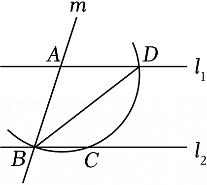

A．5π	B．4π	C．	D．

10．（3分）如图，在等腰三角形ABC中，BA＝BC，第1次操作：取AC的中点O1，将O1B绕点O1分别逆时针旋转120°和180°得到线段O1C1和O1A1；第2次操作：取A1C1的中点O2，将O2O1绕点O2分别逆时针旋转120°和180°，得到线段O2C2和O2A2；…；按照这样的操作规律，第30次操作后，得到线段O30C30和O30A30，若用点C在点A的正南方向表示初始位置，则点C30在点A30的（　　）

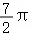

A．正东方向	B．正南方向	C．正西方向	D．正北方向

二、填空题（本大题共6小题，每小题3分，共18分）

11．（3分）如果汽车加油30升记作+30升，那么用去油10升，记作 　       　 ．

12．（3分）如图，转盘中5个扇形的面积都相等，分别涂红色和黄色．任意转动转盘1次，当转盘停止转动时，指针指向红色区域的概率是　                　 ．

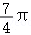

13．（3分）分解因式：x2+5x＝　         　 ．

14．（3分）关于x的一元二次方程x2+mx+1＝0有两个相等的实数根，则m的值为

15．（3分）用如图（1）所示的若干张直角三角形与四边形纸片进行密铺（不重叠、无空隙），观察示意图（图（2））可知x+2y的值等于 　      　 ．

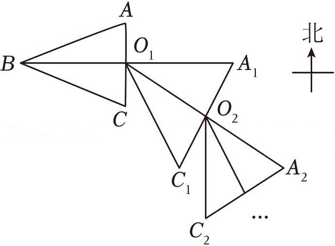

16．（3分）如图，在等腰直角三角形ABC中，∠C＝90°，AC＝BC＝8，D是AB的中点，M是边AC上的动点，作DN⊥DM，交BC于点N，延长MD到点P，使得．当△PNB面积最大时，AM的长等于 　   　 ．

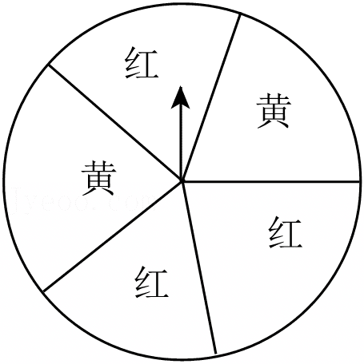

三、解答题（本大题共10小题，共72分．解答时应写出必要的文字说明、证明过程或演算步骤）

17．（5分）计算：．

18．（5分）解方程：．

19．（6分）如图，已知△ABC≌△DEF，边BC与EF、DF分别交于点O、M，AC与EF交于点N，OB＝OE．求证：△MOF≌△NOC．

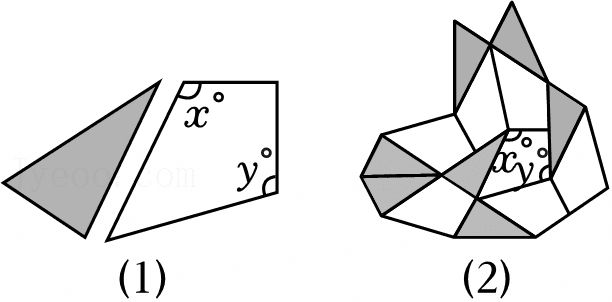

20．（6分）一只不透明的袋子中装有4个小球，分别标有数字2、3、5、7，这些球除数字外都相同．从袋子中随机摸出2个球，用列表或画树状图的方法，求摸出标有数字2和3的两个球的概率．

21．（6分）小方根据我国古代数学著作《九章算术》中的一道“折竹”问题改编了一个情境：如图，一根竹子原来高1丈（1丈＝10尺），折断后顶端触到墙上距地面9尺的点P处，墙脚O离竹根A处3尺远．请你解答：折断处B离地面多高？

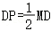

22．（6分）新一轮科技革命和产业变革深入发展，科技创新是建成科技强国的重要保障．学校兴趣小组成员收集了我国2018﹣2024年发明专利申请授权数，整理数据如下表（单位：万个，精确到0.1）：

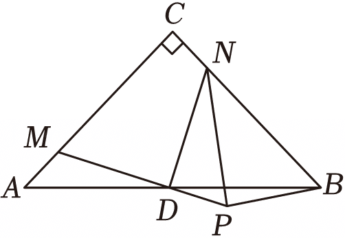

（1）计算2020到2021年我国发明专利申请授权数的增长率（精确到1%）；

（2）小组成员建立平面直角坐标系，并根据表中数据画出相对应的点（如图），从图中可以看出，这些点大致分布在一条直线附近，他们选择了两个点A（2019，45.3）、B（2024，104.5）作一条直线来近似的表示y的值随年份x不断增长的变化趋势．设直线AB上点的坐标满足函数表达式y＝kx+b．试求出k的值，并写出k的实际意义，再预测我国2025年发明专利申请授权数．

23．（6分）如图，在平面直角坐标系中，点A、B分别在反比例函数和的图象上，点A的横坐标为﹣1，点B的横坐标为n（n＞3），点C的坐标为（3，0），AC⊥BC，AC＝2BC．

（1）求点A、B的坐标和反比例函数的表达式；

（2）点D、E分别在反比例函数和的图象上，与点A、B构成以AB为边的平行四边形，则点D、E的坐标分别为 　          　 、　         　 ．

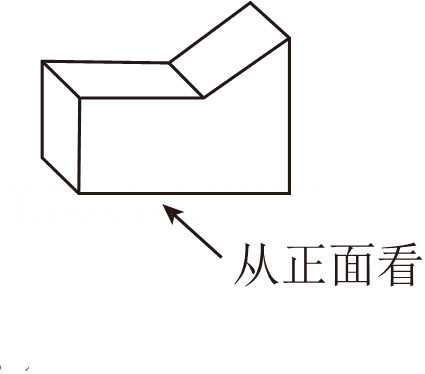

24．（10分）如图（1），过⊙O外一点M引⊙O的两条切线MA、MB，切点是A、B，∠AMB为锐角，连接MO并延长与⊙O交于点N，点P在MN的延长线上，过点P作MA的垂线，与BO的延长线相交于点E，垂足为F．

（1）求证：△EOP是等腰三角形；

（2）在图（2）中作△EOP，满足OP＝OF（尺规作图，不写作法，保留作图痕迹）；

（3）已知，在你所作的△EOP中，若PF＝2，求OE的长．

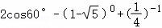

25．（10分）为什么变速自行车会“变速”？

变速自行车是常用的交通工具，图（1）所示的是某型号变速自行车的基本结构，图中A、B处分别有几个大小不同的齿轮，链条连接的两个齿轮称为主动链轮、从动链轮．

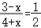

[探究]为了便于研究主动链轮与从动链轮的关系，我们先探究一组相互啮合的两个齿轮（如图（2）），通过操作发现：两个齿轮如果可以实现传动，那么两个齿轮的齿距（相邻两齿在圆上的弧长）相等，相同时间内啮合的齿数相等．

（1）已知主动轮、从动轮的齿数分别为n1、n2，主动轮每分钟转ω1圈，则每分钟啮合的齿数有 　        　 个，从动轮每分钟转ω2圈，则每分钟啮合的齿数有 　       　 个，由于相同时间内啮合的齿数相等，从而可推出ω1与ω2的关系是＝ 　                  　 ．

（2）如图（3），在主动轮与从动轮之间加入一个“惰轮”形成新的齿轮组合，已知主动轮、从动轮的齿数分别为32齿和14齿．

若主动轮的转速为每分钟70圈，求从动轮的转速，并说一说图（3）的齿轮组合在实现传动时，“惰轮”的作用是什么？

[发现]不难发现，变速自行车中的链条作用如同“惰轮”．若骑行者每分钟蹬的圈数不变，实现自行车“变速”的方法可以是 　                 　 （写出一种即可）．

26．（12分）在平面直角坐标系中，过点T（0，t）作y轴的垂线与二次函数（h、k为常数）的图象交于点E、F（点E在点F的左侧），点P在直线EF上，当点P满足PE+PF＝6时，我们称点P是该二次函数图象的T～6生长点．

（1）二次函数的图象如图所示．

①在t的不同取值5中，使该函数图象有T～6生长点的t的值是 　                  　 ；

②已知P（m，n）是该函数图象的T～6生长点，猜想n的取值范围，并说明理由．

（2）二次函数（h、k为常数）的图象经过点（6，1），若P（3，5）是该函数图象的T～6生长点，求该函数的表达式．

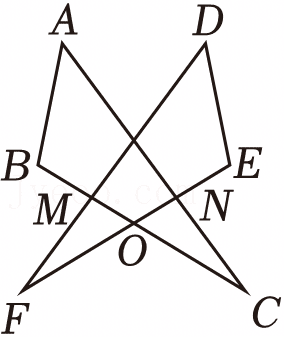

| x（年份） | 2018 | 2019 | 2020 | 2021 | 2022 | 2023 | 2024 |
|---|---|---|---|---|---|---|---|
| y/万个 | 43.2 | 45.3 | 53.0 | 69.6 | 79.8 | 92.1 | 104.5 |