# _temp

**处理时间**: 2026-02-15 21:15:47
**处理模型**: zai-org/glm-4.6v-flash
**总页数**: 7

---

## 第 1 页

一、选择题（本大题共8小题，每小题3分，共24分。在每小题所给出的四个选项中，有且只有一项是符合题目要求的，请将正确选项的字母代号填涂在答题卡相应位置上）

1. （3分）下列四个数中，最大的数是（ ）
    A．2 
    B．-2 
    C．$\frac{1}{2}$ 
    D．$-\frac{1}{2}$

2. （3分）下列计算结果为$a^3$的是（ ）
    A．$a + a^2$
    B．$(a^2)^3$
    C．$a \cdot a^2$
    D．$a^9 ÷ a^3$

3. （3分）宿迁市2025年第一季度GDP总量突破一千亿大关，约为1080亿元。数据1080亿用科学记数法表示为（ ）
    A．$1.08×10^{10}$
    B．$1.08×10^{11}$
    C．$10.8×10^{10}$
    D．$1080×10^8$

4. （3分）某几何体的三视图如图所示，这个几何体是（ ）
    A．圆柱 
    B．圆锥 
    C．正方体 
    D．长方体

5. （3分）如图，在△ABC中，AB≠AC，点D、E、F分别是边AB、AC、BC的中点，则下列结论错误的是（ ）
    A．DE∥BC 
    B．$\angle B = \angle EFC$
    C．$\angle BAF = \angle CAF$
    D．OD=OE

6. （3分）在平面直角坐标系中，点A的坐标为（3，2），将线段OA绕着点O逆时针旋转90°得线段OA'，则点A'的坐标为（ ）

---

## 第 2 页

图中显示点A在第一象限，直线OA从原点出发到A，故点A的横纵坐标均为正。选项为：  
A. (-3, 2)  
B. (-2, 3)  
C. (3, -2)  
D. (2, -3)

7.（3分）《九章算术》中记载：今有牛五、羊二，值金十两；牛二、羊五，值金八两。问牛、羊各值金几何？译文：“今有牛5头，羊2头，共值金10两；牛2头，羊5头，共值金8两。问牛、羊每头各值金多少？”若设牛每头值金x两，羊每头值金y两，则可列方程组是（ ）  
A. $\begin{cases} 5x+2y=10 \\ 2x+5y=8 \end{cases}$  
B. $\begin{cases} 5x+5y=10 \\ 2x+2y=8 \end{cases}$  
C. $\begin{cases} 2x+5y=10 \\ 5x+2y=8 \end{cases}$  
D. $\begin{cases} 5x+2y=10 \\ 2x+5y=8 \end{cases}$

8.（3分）如图，点A、B在双曲线$y_1 = \frac{k_1}{x}$ (x>0)上，直线AB分别与x轴、y轴交于点C、D，与双曲线$y_2 = \frac{k_2}{x}$ (x<0)交于点E，连接OA、OB。若$S_{\triangle AOC}=20$，$AB=3BC$，AD=DE，则$k_2$的值为（ ）  
选项：A. -10 B. -11 C. -12 D. -13

二、填空题（本大题共10小题，每小题3分，共30分。不需写出解答过程，请把答案直接填写在答题卡相应位置上）  
9.（3分）要使分式$\frac{x-1}{x}$有意义，则x的取值范围是___。

---

## 第 3 页

10.（3分）分解因式：$x^2 - 4 = $______．  
11.（3分）点P(1, a+2)在第一象限，则实数a的取值范围是______．  
12.（3分）某公司在一次招聘中，笔试和面试两部分，笔试和面试成绩按6:4计算最终成绩。小李的笔试成绩为85分，面试成绩为90分，则小李的最终成绩为___分．  
13.（3分）若等腰三角形的两边长为2cm和4cm，则该等腰三角形的周长为 ___ cm．  
14.（3分）已知圆锥的底面半径为3，高为4，则该圆锥的侧面积为______．  
15.（3分）如图，正五边形ABCDE内接于⊙O，连接AC，则∠ACD的度数为___°。  
> （图示：正五边形ABCDE内接于圆O，连接对角线AC）  
16.（3分）一块梯形木板ABCD，AD∥BC，∠BCD=90°，AD=4，BC=10，CD=6，按如图方式设计一个矩形桌面EFCG（点E在边AB上）。当EF=___时，矩形桌面面积最大。  
> （图示：梯形ABCD中，AD平行于BC，∠BCD为直角，AD=4，BC=10，CD=6；矩形EFCG的顶点E在AB边上）  
17.（3分）方程$x^2 - 2024x - 2025 = 0$的两个根分别是m、n，则$(m^2 - 2023m - 2026)(n^2 - 2023n - 2026) = $______．  
18.（3分）如图，在△ABC中，∠ACB=90°，AC=4，BC=3，点D在边AB上，过点A作AE⊥CD，垂足为E，则DE的最小值是___。  
> （图示：直角三角形ABC中，∠C=90°，AC=4，BC=3，点D在AB边上，从A向CD作垂线交于E）  

三、解答题（本大题共10小题，共96分。请在答题卡指定区域内作答，解答时应写出必要的文字说明、证明过程或演算步骤）  
19.（8分）计算：$(\sqrt{2})^2 - 2\cos30^\circ + |\sqrt{3} - 1|$．

---

## 第 4 页

20.（8分）先化简，再求值：$$\frac{x+2-\frac{5}{x-2}}{x-3} \div \frac{x-3}{x-2},$$ 其中$x=-4$.

21.（8分）2025年2月，江苏省教育厅印发《关于在义务教育学校实施“2·15专项行动”的通知》，明确提出“中小学学生每天综合体育活动时间不低于2小时”。某校采取多种举措，确保学生每天有充足的体育活动时间，同时监测学生的体质健康情况。为此，学校从全体男生中随机抽取部分学生调查他们的立定跳远成绩，并把成绩分成五档（A档160<x≤180、B档180<x≤200、C档200<x≤220、D档220<x≤240、E档240<x≤260，单位：cm），绘制成统计图。其中部分数据丢失，请结合统计图，完成下列问题：

成绩情况扇形统计图
成绩情况条形统计图

（1）扇形统计图中$n$的值为___，条形统计图中“B档”成绩的人数为___；
（2）本次抽样中，立定跳远成绩的中位数落在___档；
（3）若该校共有1200名男生，请你估计该校立定跳远成绩为“E档”的男生人数。

22.（8分）某校建议学生利用周末时间积极参与社会实践活动。某一周末有两个项目供学生选择：A文明交通劝导志愿行，B乡村教育关爱行，每名学生只能任意选择其中一个项目。
（1）甲同学选择A项目的概率为________；
（2）请用画树状图的方法，求甲、乙、丙三位同学恰好选择同一项目的概率。

23.（10分）小明和小军两位同学对某河流的宽度进行测量，如图所示，两人分别站在同侧河岸上的点A、B处，选取河对岸的一块石头C作为测量点（点A、B、C在同一水平面内），小明同学在点A处测得∠BAC为42°，小军同学在点B处测得∠ABC为61°，两人之间的距离AB为60米，求此河流的宽度。（参考数据：sin42°≈0.67，tan42°≈0.90，sin61°≈0.87，tan61°≈1.80）

---

## 第 5 页

24.（10分）实验活动：仅用一把圆规作图。
【任务阅读】如图1，仅用一把圆规在∠AOB内部画一点P，使点P在∠AOB的平分线上.
小明的作法如下：
如图2，以点O为圆心，适当长为半径画弧，分别交射线OA、OB于点E、F，再分别以点E、F为圆心，大于$\frac{1}{2}EF$长为半径画弧，两弧交于点P，则点P为所求点.
理由：如图3，连接EP、FP、OP，
由作图可知OE=OF，PE=PF，
又因为OP=OP，
所以 >△OEP≌△OFP（SSS）. 
所以∠EOP=∠FOP.
所以OP平分∠AOB.
即点P为所求点.

【实践操作】如图4，已知直线AB及其外一点P，只用一把圆规画一点Q，使点P、Q所在直线与直线AB平行，并给出证明。（保留作图痕迹，不写作法）

25.（10分）如图，点A在⊙O上，点B在⊙O外，线段OB与⊙O交于点C，过点C作⊙O的切线交直线AB于D，且AD=CD.
（1）判断直线AB与⊙O的位置关系，并说明理由；
（2）若∠B=30°，CD=4，求图中阴影部分的面积.

---

## 第 6 页

26.（10分）甲、乙两人从同一地点M出发沿同一路线匀速步行前往N处参加活动。甲比乙早出发6min，两人途中均未休息，先到达N处的人在原地休息等待，直到另一人到达N处。两人之间的路程y(m)与甲行走的时间t(min)的函数图象如图所示。
（1）乙步行的速度为 ___ m/min，MN之间的路程为 ___ m；
（2）当18≤t≤50时，求y关于t的函数表达式；
（3）甲出发多长时间时，两人之间的路程为450m。

27.（12分）定义：在平面直角坐标系中，到两个坐标轴的距离都小于或等于k的点叫“k阶近轴点”，所有的“k阶近轴点”组成的图形记为图形W。如图所示，所有的“1阶近轴点”组成的图形是以坐标原点为中心，2为边长的正方形区域。
（1）下列函数图象上存在“1阶近轴点”的是 ___ ；①$y=\frac{1}{x}$；②$y=-x+3$；③$y=x^2-2x+3$。（2）若一次函数$y=2x+m$的图象上存在“3阶近轴点”，求实数m的取值范围；（3）特别地，当点P在图形W上，且横坐标是纵坐标的k倍时，称点P是图形W的“k阶完美点”，若二次函数$y=ax^2 - ax - 2a+2$的图象上有且只有一个“2阶完美点”，求实数a的取值范围。

28.（12分）如图1，在矩形ABCD中，AB=3，BC=$3\sqrt{3}$，点M是边BC上一个动点，点N在射线CD上

---

## 第 7 页

上，∠MAN=60°。线段AM的垂直平分线分别交直线AB、AM、AN、CD于点E、F、G、H。  
(1) 直接写出∠ACB= ___ °，$\frac{EH}{AM}$ = ___ ；  
(2) 当BM=1时，求EF+GH的值；  
(3) 如图2，连接MG并延长交直线CD于点P。  
    ①求证：MG=PG；  
    ②如图3，过点P作直线EH的垂线，分别交直线EH、AN于点T、Q，连接DQ，求线段DQ的最小值。

---

------------------------------------------------------------

## 图片

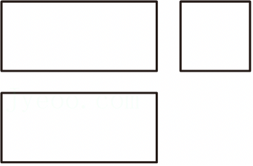

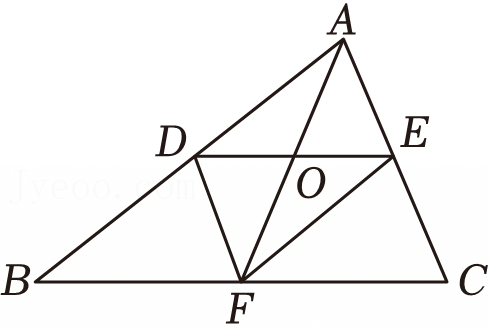

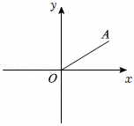

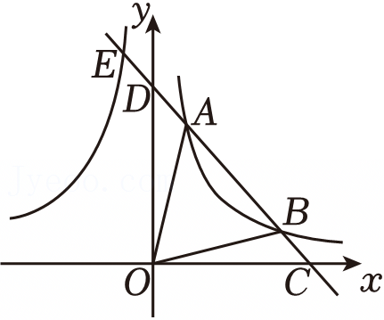

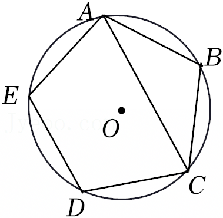

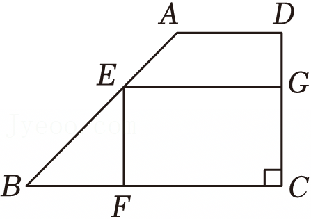

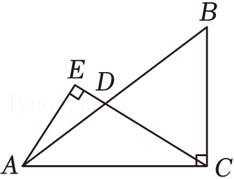

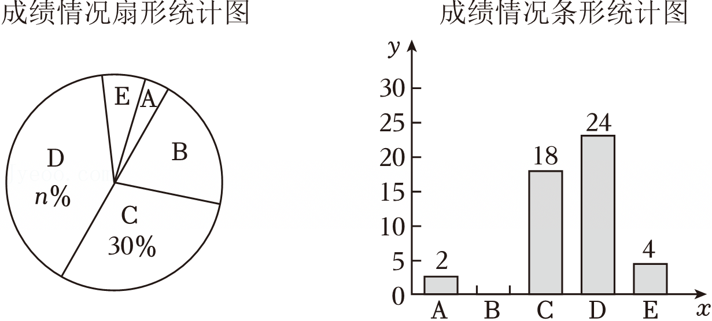

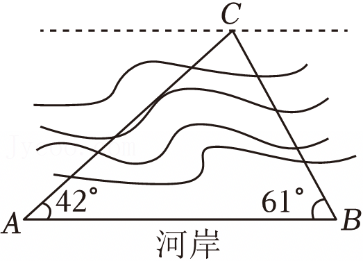

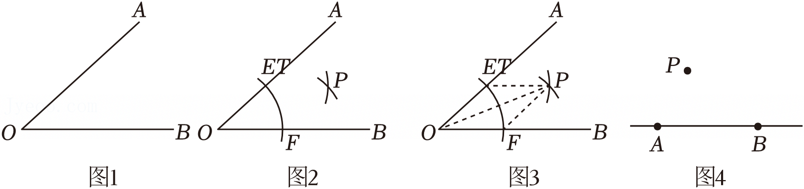

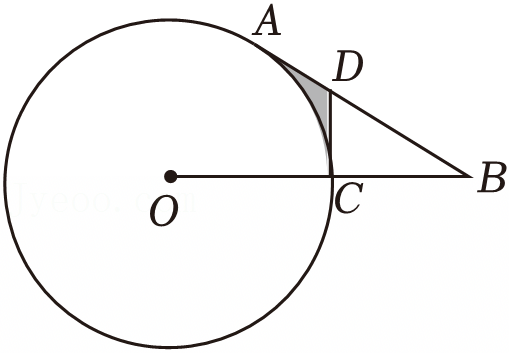

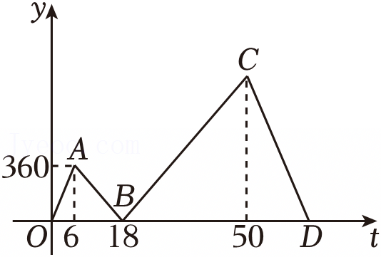

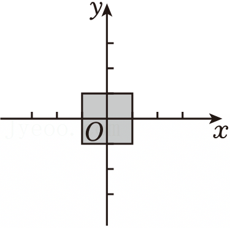

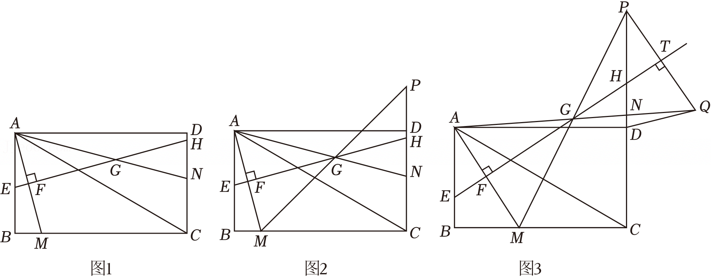
