# _temp

**处理时间**: 2026-02-15 20:52:33
**处理模型**: zai-org/glm-4.6v-flash
**总页数**: 7

---

## 第 1 页

一、选择题（本大题共8小题，每小题2分，共16分.在小题所给出的四个选项中，只有一项是正确的）  

1．(2分) 如图，数轴上点P表示的数的相反数是（ ）  
   > （注释：从图中可知点P对应数值为2，其相反数为-2）  
   A．-2  B．-1  C．0  D．$\frac{1}{2}$  

2．(2分) 若使分式$\frac{x+1}{5}$有意义，则x的取值范围是（ ）  
   > （注释：分式的分母为常数5，恒不为0，因此对任意实数x都有意义）  
   A．$x \neq -1$  B．$x = -1$  C．$x \geq -1$  D．$x > -1$  

3．(2分) 下列图形中，为三棱柱的侧面展开图的是（ ）  
   > （注释：三棱柱的侧面展开图为三个矩形连在一起）  
   A. [图A]  B. [图B]  C. [图C]  D. [图D]  

4．(2分) 如图，⊙O的半径为2，直径AB、CD互相垂直，则$\widehat{BC}$的长是（ ）  
   > （注释：连接OB、OC，∠BOC=90°，弧长公式l = rθ，其中r=2，θ=π/2弧度）  
   A．$\frac{\pi}{4}$  B．$\frac{\pi}{2}$  C．π  D．$2\pi$  

5．(2分) 如图，在Rt△ABC中，∠A=90°，AB=3，AC=4，则sinB的值是（ ）  
   > （注释：在直角三角形中，sinB = 对边/斜边 = AC / BC，先求BC = √(AB² + AC²) = 5）  
   - 计算得BC = $\sqrt{3^2 + 4^2} = \sqrt{9+16} = \sqrt{25}=5$  
   - 所以sinB = AC/BC = 4/5

---

## 第 2 页

6.（2分）如图，在菱形ABCD中，AC、BD是对角线，AB=5．若∠ABD=30°，则AC的长是（ ）  
A. $\frac{3}{5}$ B. $\frac{3}{4}$ C. $\frac{4}{5}$ D. $\frac{4}{3}$  

7.（2分）如图，将两块相同的直角三角尺按图示摆放，则AB与CD平行。这一判断过程体现的数学依据是（ ）  
A．垂线段最短 B．内错角相等，两直线平行 C．两点确定一条直线 D．平行于同一条直线的两条直线平行  

8.（2分）小华家、小丽家与图书馆位于一条笔直的街道上，小丽家位于小华家和图书馆之间，小华家到小丽家、图书馆的距离分别为300米、1800米。若小华、小丽各自从自己家同时出发，分别以v₁米/分钟、v₂米/分钟的速度匀速前往图书馆，则两人恰好同时到达．现两人各自从自己家同时出发，小丽仍然以v₂分钟的速度匀速前往图书馆，小华先以$\frac{5}{4}v_1$分钟的速率追赶小丽，与小丽相遇后，再以v₂米/分钟的速度与小丽一同前往图书馆，则小华到图书馆的距离y（米）与行进时间x（分钟）之间的函数图象可能是（ ）

---

## 第 3 页

# 二、填空题（本大题共10小题，每小题2分，共20分.不需写出解答过程，请将答案直接填写在答题卡相应位置上）

9. (2分) 4的算术平方根是 ___ .
10. (2分) 计算 $(a^2)^3=$___ .
11. (2分) 分解因式：$x^2 - 9y^2=$___ .
12. (2分) 太阳的半径约为700000千米，数据700000用科学记数法表示为 ___ .
13. (2分) 若 $\frac{x}{3} > \frac{y}{3}$ 则 $x-y$ ___ 0.（填>、<或=）.
14. (2分) 若关于$x$的一元二次方程 $x^2 - 2x + m = 0$ 有两个相等的实数根，则实数$m$的值为 ___ .
15. (2分) 如图，AB∥CD，AC⊥AD，$\angle ACD=50^\circ$，则$\angle \alpha=$___ .
16. (2分) 如图，在▱ABCD中，E是AD上一点，DE=2AE，CE、BA的延长线相交于点F，若AB=2，则AF=___ .

---

## 第 4 页

17.（2分）如图，AB是⊙O的直径，CD是⊙O的弦．若∠DCB=45°，AD=1，则AB=______．  

18.（2分）如图，在△ABC中，$\tan C = \frac{3}{4}$，D是边BC上一点，将△ACD沿AD翻折得到△AED使线段AE、BC相交于点F，若CF=5，EF=2，则AC=______．  

三、解答题（本大题共10小题，共84分。请在答题卡指定区域内作答，如无特殊说明，解答应写出文字说明、演算步骤或推理过程）  
19.（8分）先化简，再求值：$x(x+2) + (x-1)^2$，其中$x = \sqrt{3}$．  
20.（6分）解不等式组$\frac{x}{2} + 1 \geq 0$和$2x - 3 < -3$并把解集在数轴上表示出来．  

21.（8分）甲、乙两人在相同条件下10次射击的成绩如下：  
| 人员 | 环数 |  
| --- | --- |  
| 甲 | 6 7 6 8 7 6 8 6 9 7 |  
| 乙 | 5 7 5 10 5 8 6 9 8 7 |  

对以上数据进行分析，绘制成如表：  
| 人员 | 平均数 | 中位数 | 众数 | 方差: |

---

## 第 5 页

| 甲 | x甲 | 7 | m | 1 |
|---|---|---|---|---|
| 乙 | 7 | n | 5 | 2.8 |

(1) 填空: $x_{\text{甲}} = \_\_\_$，$m = \_\_\_，n = \_\_\_；$

(2) 根据以上数据，评价甲、乙两人射击成绩的稳定性，并说明理由。

22. (8分) 在5张相同的小纸条上，分别写有：① -1；② 0；③ 1；④ 正数；⑤ 负数。将这5张小纸条做成5支签，①、②、③放在不透明的盒子A中搅匀，④、⑤放在不透明的盒子B中搅匀。

(1) 从盒子A中任意抽出1支签，抽到0的概率是 \_\_\_；

(2) 先从盒子A中任意抽出1支签，再从盒子B中任意抽出1支签。求抽到的数与文字描述相符合的概率。

23. (8分) 某块绿地改进浇水方式，将漫灌方式全部改为喷灌方式，平均每天用水量减少1吨，20吨水可以使用的天数是原来的2倍。问浇水方式改进后平均每天用水多少吨？

24. (8分) 如图，在△ABC中，AB=AC，点D，E在BC上，BD=CE。

(1) 求证：$\triangle ABD \cong \triangle ACE$；

(2) 用直尺和圆规作∠DAE的平分线AF（保留作图痕迹，不要求写作法）。

25. (8分) 如图，在平面直角坐标系xOy中，一次函数$y = kx + b$的图象与反比例函数$y = \frac{m}{x}$的图象相交于点A(1, n)、B(-3, -2)，且与y轴交于点C。

(1) 求一次函数、反比例函数的表达式；

(2) 连接OA，求△OAC的面积。

26. (10分) 在四边形ABCD中，对角线AC、BD相交于点O，AB=2，AD=1.

---

## 第 6 页

(1) 若△ABD是等腰三角形，则BD= ___；  
(2) 已知OB=OD, AC=BD.  
①若OA=OC，判断四边形ABCD是怎样的特殊四边形，并说明理由；  
②如图，在△ACD中，$CD^2 = AD^2 + AC^2$，求AC的长。  

27. (10分) 如图：在平面直角坐标系xOy中，一次函数$y=-\frac{3}{2}x+3$的图象分别与x轴、y轴交于点A、B，点C是线段AB上一点，C与B不重合。二次函数$y=ax^2+bx+c(a,b,c$是常数，且$a≠0)$的图象经过点B，顶点是C。将该二次函数的图象平移后得到新抛物线，B'、C分别是B、C的对应点，且点B落在x轴正半轴上，点C的纵坐标为-2。  
(1) OB= ___；  
(2) 求点C的坐标；  
(3) 已知新抛物线与y轴交于点G(0,$\frac{5}{2}$)，点D(3,$y_1$)、E($x_2$,$y_2$)在新抛物线上，若对于满足$m < x_2 ≤ m+1$的任意实数$x_2$，$y_2 > y_1$总成立，求实数m的取值范围。  

28. (10分) 在平面xOy中以下种不同所得线段的关系.  
方式一：向右平移1个单位长度，后绕原点O按逆时针方向旋转90°；  
方式二：先绕原点O按逆时针方向旋转90°，然后向右平移1个单位长度。  
如图1小明将线段AB按方式一方式二运动：分别得到线段A₁B₁、A₂B₂，发现它们除长度相等外还有其他关系。  

【实践体验】  
(1) 如图2，小明已画出线段CD按方式一运动得到的线段C₁D₁。请你利用网格，在图2中画出线段

---

## 第 7 页

CD按方式二运动得到的线段；

## 【探索发现】
（2）在平面直角坐标系xOy中，将线段a按方式一、方式二运动，分别得到线段a₁、a₂，则线段a₁、a₂所在直线可能___（写出所有可能的序号）；  
①相交；②平行；③是同一条直线．  

## 【综合应用】
（3）如图3，已知点G（2，3），H（x，y）是第一象限内两个不重合的点，将线段GH按方式一、方式二运动，分别得到线段G₁H₁、G₂H₂（G₁、G₂是G的对应点．H₁、H₂是H的对应点）。  
①若点H₁与点G₂重合，求点H的坐标；  
②若线段G₁H₁与线段G₂H₂有公共点，直接写出y与x之间的函数表达式，并写出实数x的取值范围．

---

------------------------------------------------------------

## 图片

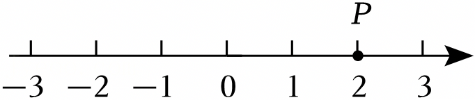

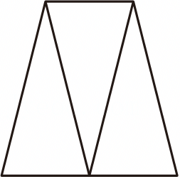

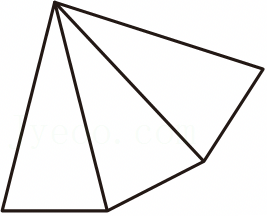

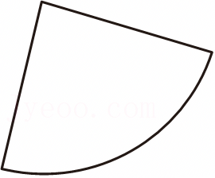

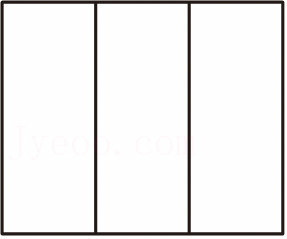

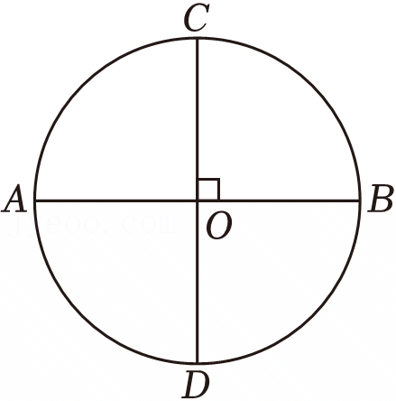

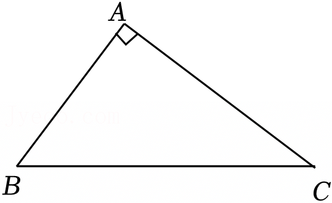

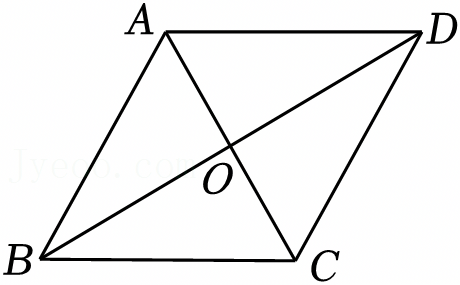

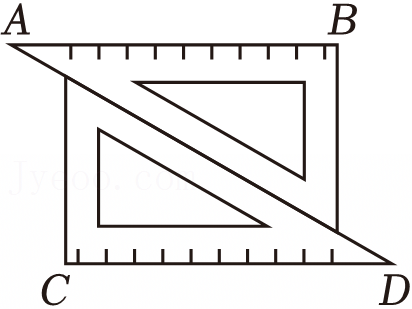

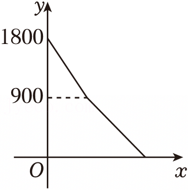

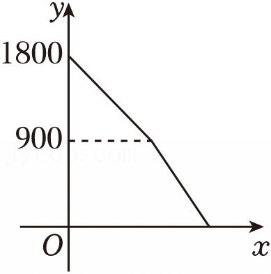

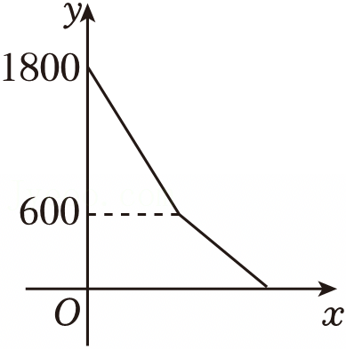

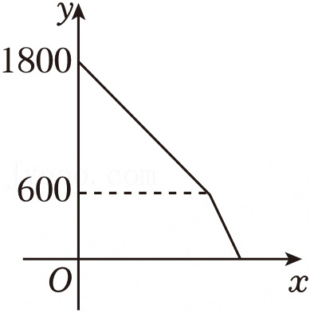

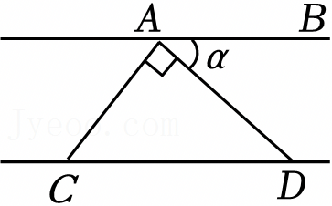

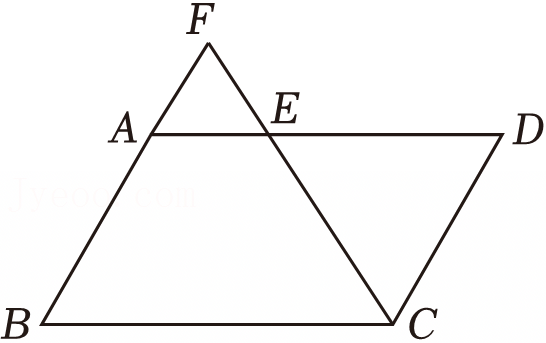

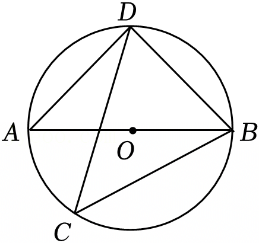

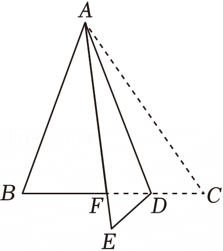

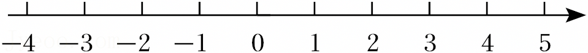

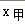

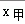

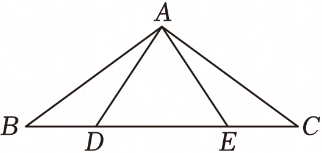

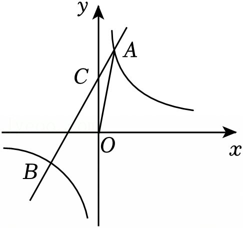

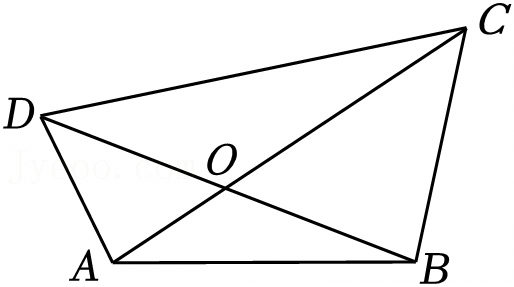

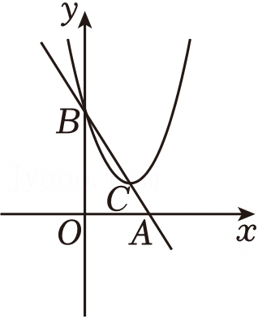

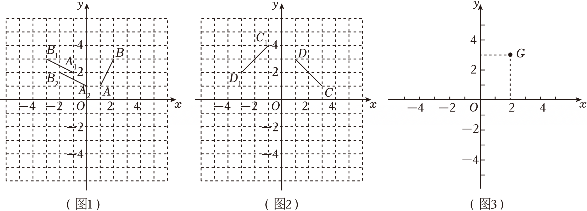
