# _temp

**处理时间**: 2026-02-15 21:23:07
**处理模型**: zai-org/glm-4.6v-flash
**总页数**: 6

---

## 第 1 页

一、选择题（本大题共有8小题，每小题3分，共24分.在每小题所给出的四个选项中，只有一项符合题意，请将正确选项对应的字母代号填涂在答题卡相应位置）

1. （3分）-$\frac{1}{2}$的相反数是（ ）
   A.$\frac{1}{2}$
   B.$-\frac{1}{2}$
   C.2
   D.-2

2. （3分）传统纹样作为中华传统文化的一部分，具有深厚的底蕴。徐州出土汉代玉器的下列纹样，既是轴对称图形又是中心对称图形的是（ ）
   A. 
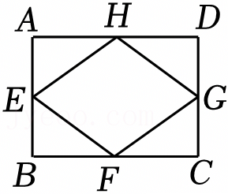
*第一个选项的曲线图案，类似云纹或波浪形*

   B. 
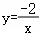
*第二个选项是四瓣花状对称图案*

   C. 
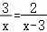
*第三个选项是回字形结构，由两个回字组成*

   D. 
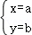
*第四个选项是螺旋状或涡旋图案*

3. （3分）一只不透明的袋子中装有4个红球与2个黑球，每个球除颜色外都相同。从中任意摸出3个球，下列事件为必然事件的是（ ）
   A.至多1个球是红球
   B.至多有1个球是黑球
   C.至少有1个球是红球
   D.至少有1个球是黑球

4. （3分）下列运算正确的是（ ）
   A.$3a^2 - 2a^2 = 1$
   B.$(a^2)^3 = a^5$
   C.$(3a)^2 = 6a^2$
   D.$a^2 \cdot a^4 = a^6$

5. （3分）使$\sqrt{x-1}$有意义的$x$的取值范围是（ ）
   A.$x \neq 1$
   B.$x \geq 1$
   C.$x > 1$
   D.$x \geq 0$

6. （3分）下列计算错误的是（ ）
   A.$\sqrt{2} + \sqrt{3} = \sqrt{5}$
   B.$\sqrt{2} \times \sqrt{3} = \sqrt{6}$
   C.$\sqrt{8} \div \sqrt{2} = 2$
   D.$(-\sqrt{3})^2 = 3$

7. （3分）如图为一个正方体的展开图，将其折成一个正方体，所得图形可能是（ ）
   
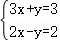
*展开图由六个正方形组成，左上角有一个十字交叉的图案，然后是四个横向排列的正方形和一个纵向连接的部分*

   A. 
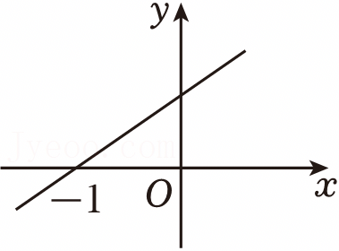
*选项A的正方体示意图，显示特定面的位置关系*

   B. 

*选项B的正方体示意图*

   C. 

*选项C的正方体示意图*

   D. 
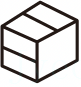
*选项D的正方体示意图*

8. （3分）如图为一次函数$y=kx+b$的图象，关于$x$的不等式$k(x-3)+b < 0$的解集为（ ）
   

*直角坐标系中的一次函数直线图像，显示斜率和截距信息*

---

## 第 2 页

[坐标系的直线图，显示过点(-1,0)和原点的斜线]
A. x < -4  B. x > -4  C. x < 2  D. x > 2

二、填空题（本大题共有10小题，每小题3分，共30分.不需要写出解答过程，请将答案直接填写在答题卡相应位置）
9. (3分) 2025年“五一”假期，约有166200人次的参观者走进淮塔园林接受红色教育。将166200用科学记数法表示为$1.662 \times 10^5$．
10. (3分) 小明家1～5月的电费（单位：元）分别为：137，140，140，117，104。该组数据的中位数是137．
11. (3分) 若二元一次方程组$\begin{cases} 3x + y = 3 \\ 2x - y = 2 \end{cases}$的解为$\begin{cases} x = a \\ y = b \end{cases}$，则$a + b$的值为1．
12. (3分) 分式方程$\frac{3}{x} = \frac{2}{x - 3}$的解为$x = 9$．
13. (3分) 若点A(6, y₁)，B(5, y₂)都在函数$y = -\frac{2}{x}$的图象上，则y₁ ____ y₂（填“>”“=”或“<”）．

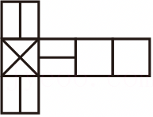
*矩形ABCD示意图，各边中点分别为E(F,G,H)，标注顶点A,B,C,D的位置和各边长度AB=3,BC=4*

14. (3分) 如图，E，F，G，H分别为矩形ABCD各边的中点。若AB=3，BC=4，则四边形EFGH的周长为10．

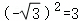
*三角形ABC折叠示意图，点A落在BC上的D处，折痕为CE，标注顶点和各部分面积关系*

15. (3分) 如图，将三角形纸片ABC折叠，使点A落在边BC上的点D处，折痕为CE。若△ABC的面积为8，△BCE的面积为5，则BD:DC=3:5．
16. (3分) 二次函数$y = x^2 + x + 1$的最小值为$\frac{3}{4}$．
17. (3分) 如图所示，用黑白两色棋子摆图形，依此规律，第n个图形中黑色棋子的个数为$n+1$（假设规律）．

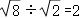
*黑白两色棋子摆成的图形示意图，显示前几个图形的黑白棋子分布规律*

---

## 第 3 页

（用含n的代数式表示）。  

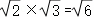
*展示三个由黑点和白点组成的图案序列，第1个图案有4个黑点（2行2列），第2个图案有7个黑点和2个白点（3行3列），第3个图案更多黑点和白点，呈现规律增长*
  

18.（3分）如图为二次函数$y=ax^2+bx+c$的图象，下列代数式的值为负数的是___（写出所有正确结果的序号）。  
①$a$；  
②$2a+b$；  
③$c$；  
④$b^2-4ac$；  
⑤$a-b+c$。  

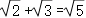
*直角坐标系中二次函数抛物线，开口向下，与x轴交于两点（约在x=-1和x=2处），与y轴正半轴相交，顶点位于第一象限上方*
  

三、解答题（本大题共有10小题，共86分.请在答题卡指定区域内作答，解答时应写出文字说明、证明过程或演算步骤）  
19.（10分）计算：  
(1) $(-1)^{2025}+2026^0-(\frac{1}{3})^{-1}+\sqrt[3]{27}$；  
(2) $\frac{(1+\frac{1}{x-1})}{-\frac{x}{x^2-1}}$。  

20.（10分）（1）解方程：$x^2+2x-4=0$；  
(2) 解不等式组：$\begin{cases} 2x-1<3 \\ -\frac{x}{2}<2 \end{cases}$。  

21.（7分）如图，甲、乙为两个可以自由转动的转盘，它们分别被分成了4等份与3等份，每份内均标有字母，转盘停止转动后，若指针落在两个区域的交线上，则重转一次。  
(1) 转动甲盘，待其停止转动后，指针落在A区域的概率为___；

---

## 第 4 页

(2) 转动甲、乙两个转盘，用列表或画树状图的方法，求转盘停止转动后甲盘指针落在C区域且乙盘指针未落在Q区域的概率。

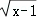
*甲为表格结构：第一行A B，第二行D C；乙为三角形，标注有P、Q、R三个区域*

22.（7分）为了解某景区外地自驾游客的分布情况，某日小桐随机调查了该景区附近部分宾馆停车场的车辆数，根据车牌号归属地的不同，绘制了如图统计图（不完整）：

*左侧为“不同归属地的车辆数条形统计图”，横轴是“车牌号归属地”（苏、鲁、豫、皖、其他），纵轴是“车辆数”；右侧为“不同归属地的车辆数扇形统计图”，显示“苏50%”“皖18%”“豫？”“其他8%”*

根据图中信息，解答下列问题。
（1）小桐共调查了______辆车，“豫”对应扇形的圆心角为____°；
（2）补全条形统计图；
（3）若该景区附近宾馆停车场当日共有450辆外地自驾游客的车辆，估计其中车牌号归属地为“皖”的车辆有多少？

---

## 第 5 页

25.（8分）下圆墩是“彭城七里”的起点，也是徐州城市历史的源头。某校数学综合与实践小组到下圆墩遗址公园参观，发现一处三角形的景观墙（如图），记作△ABC，同学们测得BC=22.2m，∠B＝34.2°，∠C＝9.8°，求AC的长度。（精确到0.1m，参考数据：sin34.2°≈0.56，cos34.2°≈0.83，tan34.2°≈0.68，sin9.8°≈0.17，cos9.8°≈0.99，tan9.8°≈0.17）

*圆O内接三角形ABC，点B、C在圆周上，A也在圆周上，BC为弦，点D在圆外与BC所在直线相交（图中显示圆心O，三角形ABC内接于圆）*

*三角形ABC的示意图，顶点分别为A、B、C，形成三角形形状*

26.（8分）“连弧纹镜”为战国至两汉时期备受推崇的铜镜设计，通常由六到十二个连续的等弧连成一圈，构成了别具一格的装饰图案。图1为徐州博物馆藏“八连弧纹镜”，纹饰中有八个连续的等弧连成一圈。图2为另一件连弧纹镜（残件）的示意图。

（1）若将图2中的连弧纹镜补全，则该铜镜应为“___连弧纹镜”；

（2）请用无刻度的直尺与圆规，补全图2中所有残缺的弧，使其“破镜重圆”。（保留作图痕迹，不写作法）

*图1为八连弧纹镜实物图，圆形铜镜带有八个连续等弧纹饰*

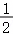
*图2为残件示意图，显示部分缺失的弧形结构*

27.（8分）急刹车时，停车距离是指骑车人从意识到应当刹车到车辆停下来所走的距离，记作ym；反应距离是指骑车人意识到应当刹车到实施刹车所走的距离，记作d₁m；刹车距离是指骑车人实施刹车到车辆停下来所走的距离，记作d₂m，已知y=d₁+d₂，d₁与骑行速度成正比，d₂与骑行速度的平方成正比。当骑行速度为13km/h时，反应距离为2.6m，刹车距离为1m。

（1）若骑行速度为26km/h，则d₁=___m，d₂=___m；

（2）设骑行速度为xkm/h，求y关于x的函数表达式；

---

## 第 6 页

(3) 当刹车距离为2m时，停车距离为多少？（精确到0.1m，参考数据：$\sqrt{2} \approx 1.41$，$\sqrt{3} \approx 1.73$，$\sqrt{5} \approx 2.24$)

28．（12分）如图1，将Rt△AOB绕直角顶点O旋转至△COD，点A，B的对应点分别为C，D。连接AD，BC，AC，BD，直线AC与BD交于点E。

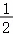
*图1显示Rt△AOB绕直角顶点O旋转得到△COD，连接AD、BC、AC、BD，直线AC与BD交于点E，标注各顶点和线段。*

(1) △AOD与△BOC的面积存在怎样的数量关系？请说明理由；
(2) 如图2，连接OE，若AB，CD，OE的中点分别为P，Q，R．求证：P，Q，R三点共线；

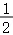
*图2显示Rt△AOB绕直角顶点O旋转得到△COD，连接AD、BC、AC、BD，直线AC与BD交于E，并标注AB、CD、OE的中点P、Q、R。*

(3) 已知AB=5，随着OA，OB及旋转角的变化，若存在以A，B，C，D为顶点的四边形，其面积为S，则S的最大值为____．

---

------------------------------------------------------------

## 未匹配图片

