# _temp

**处理时间**: 2026-02-15 21:31:34
**处理模型**: zai-org/glm-4.6v-flash
**总页数**: 7

---


## 第 1 页

一、选择题（本大题共8小题，每小题3分，共24分.在每小题所给出的四个选项中，恰有一项是符合题目要求的，请将该选项的字母代号填涂在答题卡相应位置上）
1．(3分) 下列温度中，比 -3℃低的温度是（ ） A．-5℃ B．-2℃ C.0℃ D.2℃
2．(3分) 窗棂是中国传统木构建筑的重要元素，既散发着古典之韵，又展现了几何之美。下列窗棂图案中，是轴对称图形但不是中心对称图形的是（ ）  

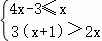
*左侧为圆形窗棂图案（选项A），右侧为八边形窗棂图案（选项B）*
  
A．  

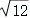
*圆形窗棂图案，由多个交叉线条构成对称结构*

B．  

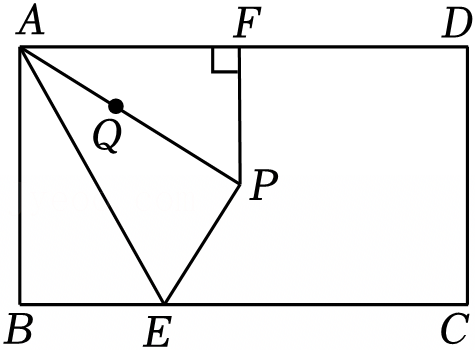
*八边形窗棂图案，边数为8的规则多边形内含交叉线条*
  
C．  


*方形窗棂图案，包含中心扇形装饰和周围几何线条*

D．  

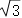
*黑色方形窗棂图案，由四个小方块组成对称结构，内部有曲线线条*

3．(3分) 下列说法不正确的是（ ）  
A. 明天下雨是随机事件  
B. 调查长江中现有鱼的种类，适宜采用普查的方式  
C. 描述一周内每天最高气温的变化情况，适宜采用折线统计图  
D. 若甲组数据的方差$S_{\text{甲}}^2=0.13$，乙组数据的方差$S_{\text{乙}}^2=0.04$，则乙组数据更稳定
4．(3分) 关于一元二次方程$x^2 - 3x + 1 = 0$的根的情况，下列结论正确的是（ ）  
A. 有两个不相等的实数根  
B. 有两个相等的实数根  
C. 没有实数根  
D. 无法判断根的情况
5．(3分) 如图，数轴上点A表示的数可能是（ ）  

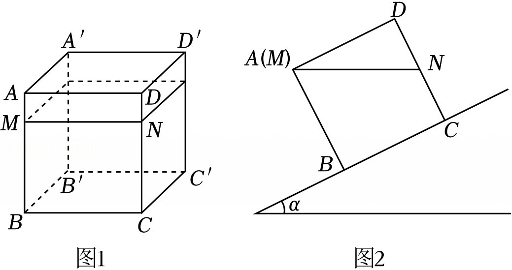
*数轴示意图，包含原点和点A的位置标注*


---


## 第 2 页

-1 0 1 2 3 4 5
A. $\sqrt{2}$ B. $\sqrt{3}$ C. $\sqrt{7}$ D. $\sqrt{10}$
6．（3分）在如图的房屋人字梁架中，AB=AC，点D在BC上，下列条件不能说明AD⊥BC的是（）  

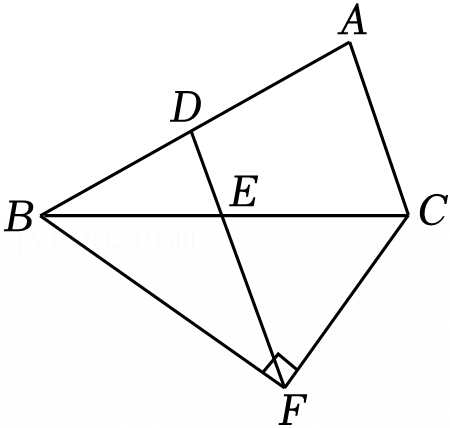
*房屋人字梁架示意图，三角形ABC，A为顶点，B、C为底边两端，D在BC边上，标注各点和线段关系*
  
A．∠ADB=∠ADC B．∠B=∠C C．BD=CD D．AD平分∠BAC  

7．（3分）如图，平行于主光轴PQ的光线AB和CD经过凸透镜折射后，折射光线BE，DF交于主光轴上一点G. 若∠ABE=130°，∠CDF=150°，则∠EGF的度数是（）  

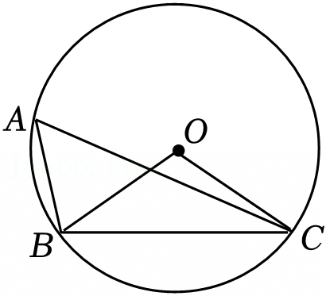
*包含主光轴PQ，光线AB从左侧平行于PQ射向凸透镜，折射为BE；光线CD从下方平行于PQ射向凸透镜，折射为DF，两折射线交于G点，标注角度∠ABE=130°和∠CDF=150°*
  
A. 60° B. 70° C. 80° D. 90°  

8．（3分）已知$m^{2025}+2025m=2025$，则一次函数$y=(1-m)x+m$的图象不经过（ ）  

二、填空题（本大题共有10小题，每小题3分，共30分.不需写出解答过程，请把答案直接填写在答题卡相应位置上）  
9．（3分）2025年3月30日...将数据30000用科学记数法表示为______．  

10．（3分）分解因式：$a^2-4=$______．  

11．（3分）计算：(1 - x) ÷ x = ____．  

12．（3分）若$a^2-2b+1=0$，则代数式$2a^2-4b+3$的值是___．  

13．（3分）若多边形的每个内角都是140°，则这个多边形的边数为___．  

14．（3分）如图，点A,B,C在⊙O上，∠BAC=50°，则∠OBC=___°．

---


## 第 3 页

15.（3分）如图，在△ABC中，点D，E分别是边AB，BC的中点，点F在线段DE的延长线上，且∠BFC=90°. 若AC=4，BC=8，则DF的长是___。


*三角形ABC示意图，点D、E分别是AB、BC中点，点F在DE延长线，标注角度∠BFC=90°，边AC=4，BC=8*

16.（3分）清代扬州数学家罗士琳痴迷于勾股定理的研究，提出了推算勾股数的“罗士琳法则”. 法则的提出，不仅简化了勾股数的生成过程，也体现了中国传统数学在数论领域的贡献. 由此法则写出了下列几组勾股数：①3，4，5；②5，12，13；③7，24，25；④9，40，41；……根据上述规律，写出第⑤组勾股数为___。
17.（3分）如图1，棱长为9cm的密封透明正方体容器水平放置在桌面上，其中水面高度BM=7cm. 将此正方体放在坡角为α的斜坡上，此时水面MN恰好与点A齐平，其主视图如图2所示，则tanα=___。

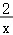
*正方体容器示意图（图1），标注棱长9cm，水面高度BM=7cm，各顶点标记A,B,C等*


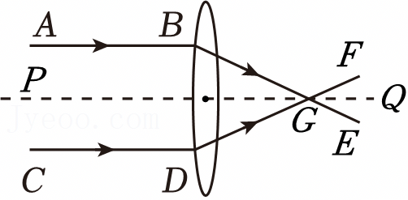
*斜坡上的正方体主视图（图2），显示水面MN与点A齐平，标注坡角α*

18.（3分）如图，在矩形ABCD中，AB=4，BC=4√3，点E是BC边上的动点，将△ABE沿直线AE翻折得到△APE，过点P作PF⊥AD，垂足为F，点Q是线段AP上一点，且AQ=\frac{1}{2}PF. 当点E从点B运动到点C时，点Q运动的路径长是___。

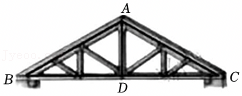
*矩形ABCD示意图，标注AB=4，BC=4√3，△ABE沿AE翻折得到△APE，PF⊥AD，AQ与PF关系标注*


---


## 第 4 页

三、解答题（本大题共有10小题，共96分.请在答题卡指定区域内作答，解答应写出必要的文字说明、证明过程或演算步骤）

19. (8分) 计算：
(1) $\sqrt{12} - 2\cos30^\circ + (\pi+1)^0$;
(2) $a(a+2) - a^3 \div a$.

20. (8分) 解不等式组 $$\begin{cases}4x-3 \leq x \\ 3(x+1) > 2x\end{cases}$$，并写出它的所有负整数解。

21. (8分) 为角逐市校园“音乐达人”大赛，小红和小丽参加了校内选拔赛，10位评委的评分情况如下（单位：分）。
表1评委评分数据
| 选手 | 评委评分 |
|------|----------|
| 小红 | 7 8 7 8 7 7 7 8 7 9 |
| 小丽 | 7 7 6 8 8 8 8 8 7 8 |

表2评委评分数据分析
| 选手 | 平均数 | 中位数 | 众数 |
|------|--------|--------|------|
| 小红 | 7.5    | b      | 7    |
| 小丽 | a      | 8      | c    |

根据以上信息，回答下列问题：
(1) 表2中$a=$___，$b=$___，$c=$___；
(2) 你认为小红和小丽谁的成绩较好？请说明理由．

22. (8分) 为打造活力校园，某校在大课间开展了丰富多彩的活动，现有4种体育类活动供学生选择：A.羽毛球，B.乒乓球，C.花样跳绳，D.踢毽子，每名学生只能选择其中一种体育活动。
(1) 若小明在这4种体育活动中随机选择，则选中“乒乓球”的概率是______；
(2) 请用画树状图或列表的方法，求小明和小聪随机选择选到同一种体育活动的概率．


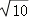
*四边形ABCD为矩形（A在左上角，B在左下角，C在右下角，D在右上角），AD与BC平行且水平，AB与CD垂直向下。点F位于AD边上，且∠AFE为直角（F处有直角符号）。点E位于BC边上，连接AE和EP（P在内部区域），图中包含线段AF、FE、EP等几何元素。*


---


## 第 5 页

23. （10分）某文创商店推出甲、乙两款具有纪念意义和实用价值的书签，已知甲款书签价格是乙款书签价格的$\frac{5}{4}$倍，且用100元购买甲款书签的数量比用128元购买乙款书签的数量少3个。求这两款书签的单价。

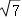
*左侧为甲款书签（类似扇形带装饰），右侧为乙款书签（圆形带花纹）*


24. （10分）如图，在平面直角坐标系中，反比例函数$y = \frac{k}{x}$的图象与一次函数$y = ax + b$的图象交于点A(-1,6)，B(m,-2)．
（1）求反比例函数、一次函数的表达式；
（2）求△OAB的面积。

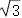
*直角坐标系，包含原点O，反比例函数曲线和一次函数直线交于A(-1,6)、B(m,-2)两点，坐标轴标注清晰*


25. （10分）如图，在□ABCD中，对角线AC的垂直平分线与边AD，BC分别相交于点E，F．
（1）求证：四边形AFCE是菱形；
（2）若AB=3，BC=5，CE平分∠ACD，求DE的长。

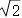
*平行四边形ABCD，对角线AC交于点O，垂直平分线EF分别与AD、BC交于E、F，标注各顶点和交点*


26. （10分）材料的疏水性 扬州宝应是荷藕之乡。“微风忽起吹莲叶，青玉盘中泻水银”，莲叶上的水滴来回滚动，不易渗入莲叶内部，这说明莲叶具有较强的疏水性。疏水性是指材料与水相互排斥的一种性质。

---


## 第 6 页

```markdown

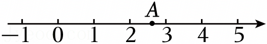
*左侧显示粉色荷花和绿色荷叶的图片；右侧是水滴接触角示意图（图1），标注了空气（气相）、气-液界线、水滴（液相）、固液界线和材料（固相）；右侧是半圆形水滴在平面上的简化图（图2）；下方是圆与平面的接触角示意图（图3）*


【概念理解】
材料疏水性的强弱通常用接触角的大小来描述。材料上的水滴可以近似地看成球或球的一部分，经过球心的纵截面如图1所示，接触角是通过固、液、气三相接触点（点M或N）所作的气-液界线的切线与固-液界线的夹角，图1中的∠PMN就是水滴的一个接触角。

(1) 请用无刻度的直尺和圆规作出图2中水滴的一个接触角，并用三个大写字母表示接触角；（保留作图痕迹，写出必要的文字说明）

(2) 材料的疏水性随着接触角的变大而____（选填“变强”“不变”“变弱”）。

【实践探索】
实践中，可以通过测量水滴经过球心的高度BC和底面圆的半径AC（BC⊥AC），求出∠BAC的度数，进而求出接触角∠CAD的度数（如图3）。

(3) 请探索图3中接触角∠CAD与∠BAC之间的数量关系（用等式表示），并说明理由。

【创新思考】
(4) 材料的疏水性除了用接触角以及图3中与△ABC相关的量描述外，还可以用什么量来描述，请你提出一个合理的设想，并说明疏水性随着此量的变化而如何变化。

27. （12分）如图，在平面直角坐标系中，二次函数$y=-x^2-2x+3$的图象（记为$G_1$）与x轴交于点A，B，与y轴交于点C，二次函数$y=x^2+bx+c$的图象（记为$G_2$）经过点A，C。直线$x=t$与两个图象$G_1$，$G_2$分别交于点M，N，与x轴交于点P。

(1) 求b，c的值。
```

---


## 第 7 页

(2) 当点P在线段AO上时，求MN的最大值。  
(3) 设点M，N到直线AC的距离分别为m，n. 当$m + n = 4$时，对应的t值有___个；当$m - n = 3$时，对应的t值有___个；当$mn = 2$时，对应的t值有___个；当$n = 1$时，对应的t值有___个。  


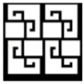
*左侧坐标系中，抛物线与直线交于A、C点，点P在x=t的直线上，M、N为相关点，标注坐标轴和各点位置；右侧备用图显示抛物线和直线交点及C点位置。*


28.（12分）问题：如图1，点P为正方形ABCD内一个动点，过点P作EF∥AD，GH∥AB，矩形PHCF的面积是矩形PGAE面积的2倍，探索∠FAH的度数随点P运动的变化情况。  

【从特例开始】  
（1）小玲利用正方形网格画出了一个符合条件的特殊图形（如图2），请你仅用无刻度的直尺连接一条线段，由此可得此图形中∠FAH=___°。  


*正方形网格中的特殊图形，包含点A、B、C、D及动点P相关构造，标注角度和线段连接关系。*
  

（2）小亮也画出了个符合条件的特殊图形（如图3），其中PE=PF=6，PG=4，PH=8，求此图形中∠FAH的度数；  


*正方形网格中的另一个特殊图形，标注点E、F、G、H及各线段长度和角度关系。*
  

【一般化探索】  
（3）利用图1，探索上述问题中∠FAH的度数随点P运动的变化情况，并说明理由。  


*正方形ABCD内动点P及相关线段EF、GH构造的示意图，标注角度变化分析区域。*


---


------------------------------------------------------------

## 未匹配图片


