# _temp

**处理时间**: 2026-02-15 21:12:06
**处理模型**: zai-org/glm-4.6v-flash
**总页数**: 8

---

## 第 1 页

一、选择题：本大题共8小题，每小题3分，共24分. 在每小题给出的四个选项中，只有一项是符合题目要求的. 请将选择题的答案用2B铅笔涂在答题卡相对应的位置上.

1.（3分）下列实数中，比2小的数是（ ）
    A.5
    B.4
    C.3
    D.-1

> 注释：比较实数大小，-1 < 0 < 2 < 3 < 4 < 5。

2.（3分）如图，将直角三角形绕它的一条直角边所在直线旋转一周后形成的几何体是（ ）
    A.
    B.
    C.
    D.

> 注释：直角三角形绕一条直角边旋转形成圆锥。

3.（3分）据人民网消息，2025年第一季度，苏州市货物贸易进出口总值为63252000万元，其中出口40317000万元，创历史同期新高，同比增长11.5%。数据40317000用科学记数法可表示为（ ）
    A.$0.40317 \times 10^8$
    B.$4.0317 \times 10^7$
    C.$40.317 \times 10^6$
    D.$40317 \times 10^3$

> 注释：科学记数法形式为$a\times10^n$（$1\leq|a|<10$），40317000=4.0317×10⁷。

4.（3分）下列运算正确的是（ ）
    A.$a \cdot a^3 = a^3$
    B.$a^6 \div a^2 = a^3$
    C.$ (ab)^2 = a^2b^2$
    D.$ (a^3)^2 = a^5$

> 注释：幂的运算性质：同底数幂乘法指数相加，除法指数相减；积的乘方等于每个因式分别乘方再相乘。

5.（3分）如图，在A，B两地间修一条笔直的公路，从A地测得公路的走向为北偏东70°。若A，B两地同时开工，要使公路准确接通，则∠α的度数应为（ ）
    A.100°
    B.105°
    C.110°
    D.115°

> 注释：利用平行线的内错角相等或方向角的补角关系求解。

6.（3分）一只不透明的袋子中，装有3个白球和若干个红球，这些球除颜色外都相同，搅匀后从中任

---

## 第 2 页

意摸出一个球，摸到白球的概率为$\frac{3}{5}$，则红球的个数为（ ）  
A.1  B.2  C.3  D.4  

7．(3分)声音在空气中传播的速度随温度的变化而变化，科学家测得一定温度下声音传播的速度$v$($m/s$)与温度$t$($℃$)部分对应数值如表：  
| 温度 t (℃) | -10 | 0 | 10 | 30 |  
|------------|-----|---|----|----|  
| 声音传播的速度 v ($m/s$) | 324 | 330 | 336 | 348 |  

研究发现，$v$、$t$满足公式$v=at+b$（$a,b$为常数，且$a≠0$），当温度$t$为15℃时，声音传播的速度$v$为（ ）  
A.333$m/s$ B.339$m/s$ C.341$m/s$ D.342$m/s$

8．(3分)如图，在正方形ABCD中，E为边AD的中点，连接BE，将△ABE沿BE翻折，得到△A'BE，连接A'C，A'D，则下列结论不正确的是（ ）  
A.$A'D\parallel BE$  B.$A'C=\sqrt{2}A'D$  C.△A'CD的面积=△A'DE的面积  D.四边形A'BED的面积=△A'BC的面积  

二、填空题：本大题共8小题，每小题3分，共24分。把答案直接填在答题卡相对应的位置上。  
9．(3分)因式分解：$x^2-9=$______。  
10．(3分)某篮球队在一次联赛中共进行了6场比赛，得分依次为71，71，65，71，66，这组数据的众数为___。  
11．(3分)若$y=x+1$，则代数式$2y-2x+3$的值为___。  
12．(3分)过A,B两点画一次函数$y=-x+2$的图象，已知点A的坐标为(0,2)，则点B的坐标可以

---

## 第 3 页

为___（填一个符合要求的点的坐标即可）．  
13.（3分）已知$x_1$,$x_2$是关于$x$的一元二次方程$x^2 + 2x - m = 0$的两个实数根，其中$x_1=1$，则$x_2=$___．  

14.（3分）“苏州之眼”摩天轮是亚洲最大的水上摩天轮，共设有28个回转式太空舱全景轿厢，其示意图如图所示。该摩天轮高128m（即最高点离水面平台MN的距离），圆心O到MN的距离为68m，摩天轮匀速旋转一圈用时30min．某轿厢从点A出发，10min后到达点B，此过程中，该轿厢所经过的路径（即$\widehat{AB}$）长度为___ m。（结果保留π）  

15.（3分）如图，∠MON=60°，以O为圆心，2为半径画弧，分别交OM，ON于A，B两点，再分别以A，B为圆心，$\sqrt{6}$为半径画弧，两弧在∠MON内部相交于点C，作射线OC，连接AC，BC，则tan∠BCO=___。（结果保留根号）  

16.（3分）如图，在△ABC中，AC=3，BC=2，∠C=60°，D是线段BC上一点（不与端点B，C重合），连接AD，以AD为边，在AD的右侧作等边三角形ADE，线段DE与线段AC交于点F，则线段CF长度的最大值为___．

---

## 第 4 页

### 三、解答题：本大题共11小题，共82分.把解答过程写在答题卡相对应的位置上，解答时应写出必要的计算过程、推演步骤或文字说明.作答时用2B铅笔或黑色水签字笔。

17.(5分) 计算：$|-5|+3^{2}-\sqrt{16}$.

18.(5分) 解不等式组：
$$
\begin{cases}
3x + 1 > x - 3 \\
\dfrac{x-1}{2} > \dfrac{x}{3}
\end{cases}
$$

19.（6分）先化简，再求值：$\dfrac{2}{(x-1)+1}\cdot\dfrac{\dfrac{x^2-x}{x^2+2x+1}}$，其中$x = -2$.

20.(6分) 为了弘扬社会主义核心价值观，学校决定组织“立鸿鹄之志，做有为少年”主题观影活动，建议同学们利用周末时间自主观看. 现有A,B,C共3部电影，甲、乙2位同学分别从中任意选择1部电
影观看.
(1) 甲同学选择A电影的概率为________；
(2) 求甲、乙2位同学选择不同电影的概率（请用画树状图或列表等方法说明理由）.

21.(6分) 如图，C是线段AB的中点，$\angle A = \angle ECB$，CD∥BE.
(1) 求证：△DAC≌△ECB；
(2) 连接DE，若AB=16，求DE的长.

22.（8分）随着人工智能的快速发展，初中生使用AI大模型辅助学习快速普及，并呈现出多样化趋势某研究性学习小组采用简单随机抽样的方法，对本校九年级学生一周使用AI大模型辅助学习的时间

---

## 第 5 页

（用x表示，单位：min）进行了抽样调查，把所得的数据分组整理，并绘制成频数分布直方图：
抽取的学生一周使用AI大模型辅助学习时间频率分布表
| 组别 | 时间x(min) | 频率 |
|------|------------|------|
| A    | 20≤x<40   | 0.16 |
| B    | 40≤x<60   | 0.24 |
| C    | 60≤x<80   | 0.30 |
| D    | 80≤x<100  | 0.20 |
| E    | 100≤x≤120 | 0.10 |
| 合计 |           | 1    |

根据提供的信息回答问题：
（1）请把频数分布直方图补充完整（画图后标注相应数据）；
> 
（2）调查所得数据的中位数落在___组（填组别）；
（3）该校九年级共有750名学生，根据抽样调查结果，估计该校九年级学生一周使用AI大模型辅助学习的时间不少于60min的学生人数。
抽取的学生一周使用AI大模型
辅助学习时间频率分布直方图
频数
15
12
10
8
5
5
0
20 40 60 80 100 120 时间/min

23. （8分）如图，一次函数y=2x+4的图象与x轴，y轴分别交于A，B两点，与反比例函数y=x（k≠0，x>0）的图象交于点C，过点B作x轴的平行线与反比例函数y=x（k≠0，x>0）的图象交于点D。连接CD。
（1）求A，B两点的坐标；
> 
（2）若△BCD是以BD为底边的等腰三角形，求k的值。

---

## 第 6 页

# 24. (8分) 综合与实践  
小明同学用一副三角板进行自主探究。如图，△ABC中，$∠ACB = 90^\circ$，CA=CB，△CDE中，$∠DCE = 90^\circ$，$∠E = 30^\circ$，AB=CE=12cm。  

【观察感知】  
(1) 如图①，将这副三角板的直角顶点和两条直角边分别重合，AB，DE交于点F，求∠AFD的度数和线段AD的长。(结果保留根号)  

【探索发现】  
(2) 在图①的基础上，保持△CDE不动，把△ABC绕点C按逆时针方向旋转一定的角度，使得点A落在边DE上（如图②）。  
    ①求线段AD的长；(结果保留根号)  
    ②判断AB与DE的位置关系，并说明理由。  

图① 图②  

# 25. (10分) 如图，在四边形ABCD中，BD=CD，∠C=∠BAD。以AB为直径的⊙O经过点D，且与边CD交于点E，连接AE，BE。  
    (1) 求证：BC为⊙O的切线；

---

## 第 7 页

（2）若$AB=\sqrt{10}$，$\sin\angle AED = \frac{\sqrt{10}}{10}$，求BE的长．  

26.（10分）两个智能机器人在如图所示的Rt△ABC区域工作，∠ABC=90°，AB=40m，BC=30m，直线BD为生产流水线且BD平分△ABC的面积（即D为AC中点）。机器人甲从点A出发，沿A→B的方向以v₁(m/min)的速度匀速运动，其所在位置用点P表示；机器人乙从点B出发，沿B→C→D的方向以v₂(m/min)的速度匀速运动，其所在位置用点Q表示。两个机器人同时出发，设机器人的时间为t(min)，记点P到BD的距离（即垂线段PP'的长）为d₁(m)，点Q到BD的距离（即垂线段QQ'的长）为d₂(m)。当机器人乙到达终点时，两个机器人立即同时停止运动，此时d₁=7.5m。d₂与t的部分对应数值如表(t₁<t₂)：  

| t（min） | 0    | t₁   | t₂   | 5.5 |
|----------|------|------|------|-----|
| d₂（m）  | 0    | 16   | 16   | 0   |

(1) 机器人乙运动的路线长为___m；  

(2) 求$t_2 - t_1$的值；  

(3) 当机器人甲、乙到生产流水线BD的距离相等（即d₁=d₂）时，求t的值．  

27.（10分）如图，二次函数$y=-x^2+2x+3$的图象与x轴交于A、B两点（点A在点B的左侧），与y轴交于点C。作直线BC，M(m, y₁)，N(m+2, y₂)为二次函数$y=-x^2+2x+3$图象上两点．  

(1) 求直线BC对应函数的表达式；  

(2) 试判断是否存在实数m使得$y_1 + 2y_2 = 10$。若存在，求出m的值；若不存在，请说明理由．

---

## 第 8 页

（3）已知P是二次函数$y = -x^2 + 2x + 3$图象上一点（不与点M，N重合），且点P的横坐标为1 - m，作△MNP．若直线BC与线段MN，MP分别交于点D，E，且△MDE与△MNP的面积比为1：4，请直接写出所有满足条件的m的值。  

（备用图）

---

------------------------------------------------------------

## 图片

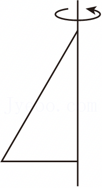

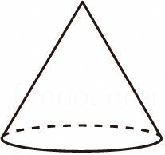

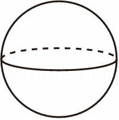

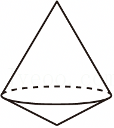

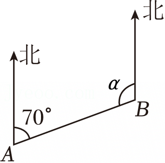

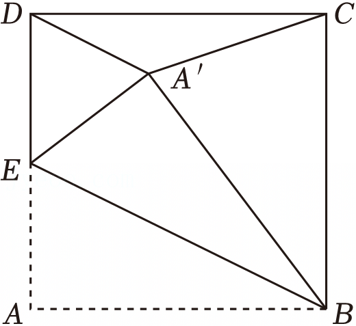

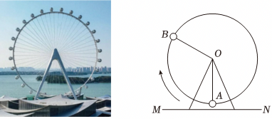

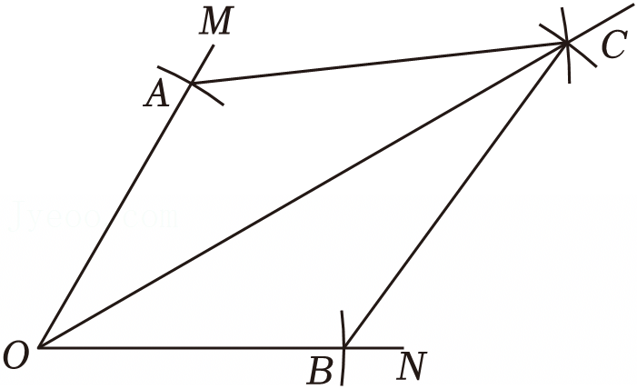

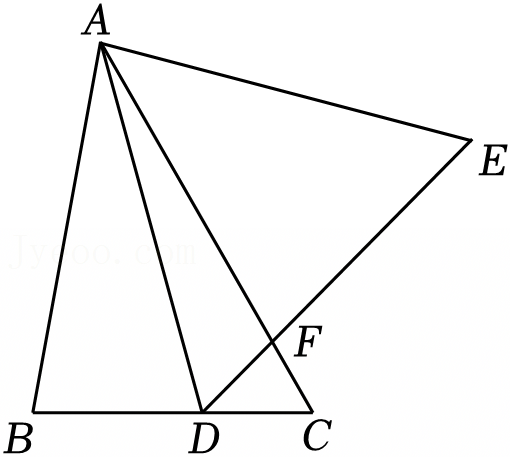

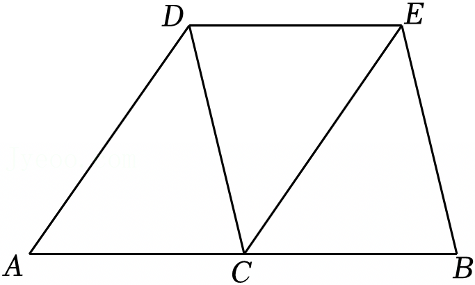

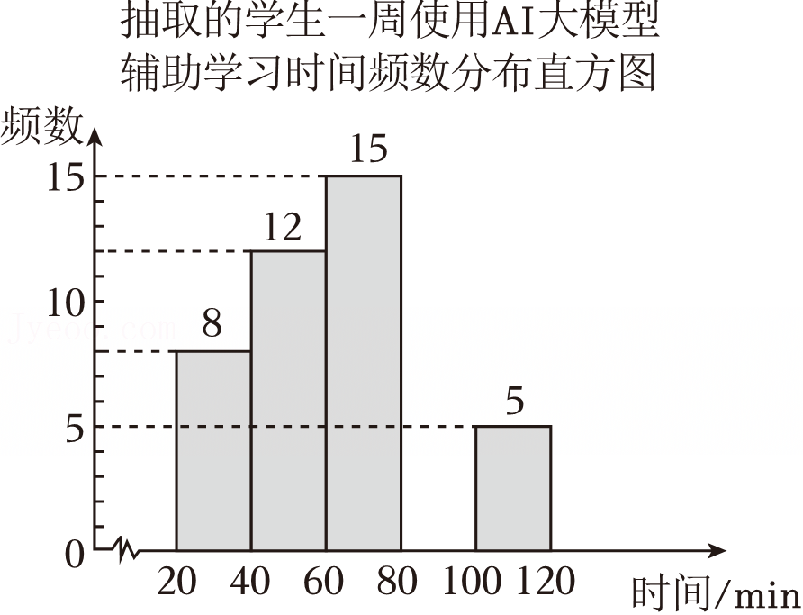

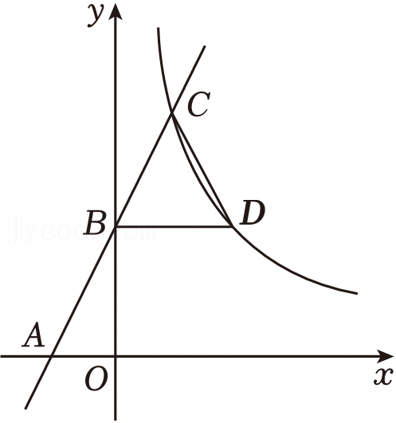

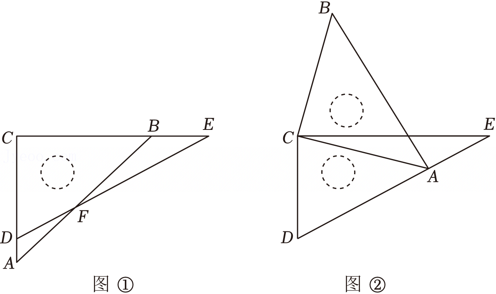

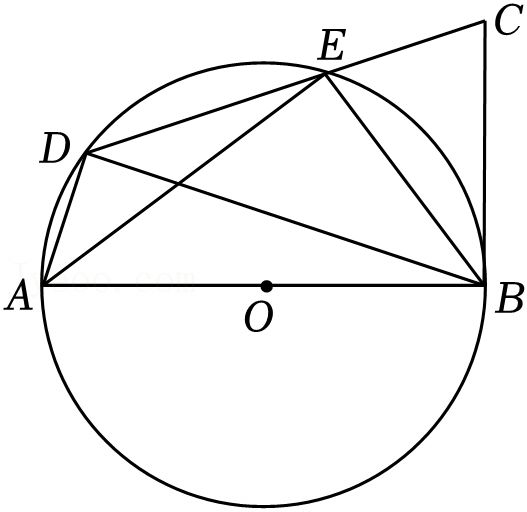

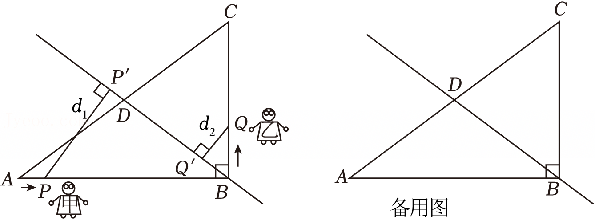

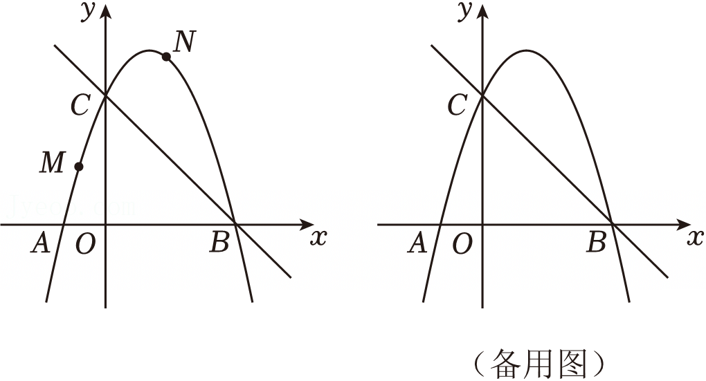
