# _temp

**处理时间**: 2026-02-15 21:34:55
**处理模型**: zai-org/glm-4.6v-flash
**总页数**: 7

---

## 第 1 页

# 2025年江苏省镇江市中考数学试卷

一、选择题（本大题共10小题，每小题3分，共30分。在每小题给出的四个选项中，恰有一项符合题目要求）

1. （3分）计算 -2+3 的结果是（ ）  
   A. 5  
   B. -5  
   C. 1  
   D. -1  

2. （3分）使二次根式$\sqrt{2x-4}$有意义的$x$的取值范围是（ ）  
   A. $x\geq2$  
   B. $x\leq2$  
   C. $x>2$  
   D. $x<2$

3. （3分）下列运算中，结果正确的是（ ）  
   A. $a^2 \cdot a^3 = a^5$  
   B. $a^3 + a^3 = 2a^6$  
   C. $(a^2)^3 = a^5$  
   D. $a^4 \div a^2 = 2a^2$

4. （3分）2024年全市共接待国内游客约55510800人次，其中数据5551080可表示为（ ）  
   A. 55510.8万  
   B. 5551.08万  
   C. 555.108万  
   D. 55.5108万  

5. （3分）如图所示的几何体的主视图是（ ）  

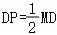
*几何体示意图，从正面看的主视图选项A到D，包括立体组合体的主视图选择*
  
   A.  
   B.  
   C.  
   D.  

6. （3分）一组数据：82、80、82、87、90、84、85，它们的中位数是（ ）  
   A. 82  
   B. 84  
   C. 85  
   D. 87  

7. （3分）如图，小丽从点A出发，沿坡度为10°的坡道向上走了120米到达点B，则她沿垂直方向升高了（ ）  

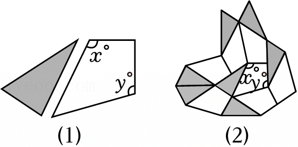
*直角三角形示意图，标注点A、B及角度10°和垂直高度虚线*
  
   A. $\frac{120}{\tan 10^\circ}$米  
   B. $\frac{120}{\sin 10^\circ}$米  
   C. $120\tan 10^\circ$米  
   D. $120\sin 10^\circ$米

---

## 第 2 页

8.（3分）已知点A（-1，y₁）、B（a，y₂）在反比例函数$\frac{1}{x}$的图象上，若$y_2 > y_1$，则a的取值范围是（ ）
A. $a < -1$或$a > 0$ B. $-1 < a < 0$ C. $a > 0$ D. $a < -1$

9.（3分）如图，直线$l_1 \parallel l_2$，直线m分别交l₁、l₂于点A、B，以A为圆心，AB长为半径画弧，分别交$l_2$、$l_1$于直线m同侧的点C、D，$\angle ADB = 35^\circ$，AB=9，则$\stackrel{\frown}{CD}$的长等于（ ）

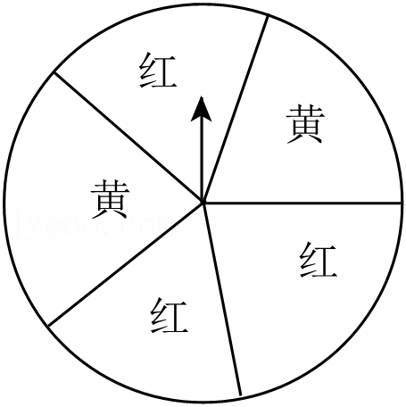
*直线l₁平行于l₂，直线m交l₁于A、l₂于B。以A为圆心AB长画弧交l₂于C、l₁于D，标注∠ADB=35°，AB=9*

A. 5π B. 4π C. $\frac{7}{2}\pi$ D. $\frac{7}{4}\pi$

10.（3分）如图，在等腰三角形ABC中，BA=BC，第1次操作：取AC的中点O₁，将O₁B绕点O₁分别逆时针旋转120°和180°得到线段O₁C₁和O₁A₁；第2次操作：取A₁C₁的中点O₂，将O₂O₁绕点O₂分别逆时针旋转120°和180°，得到线段O₂C₂和O₂A₂；…；按照这样的操作规律，第30次操作后，得到线段O₃₀C₃₀和O₃₀A₃₀。若用点C在点A的正南方向表示初始位置，则点C₃₀在点A₃₀的（ ）

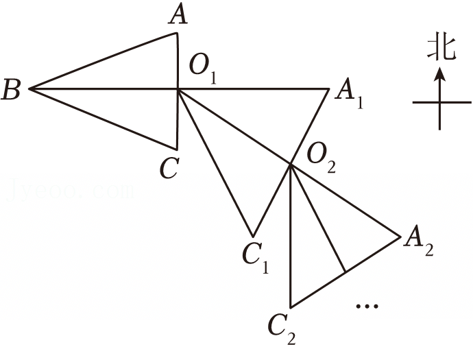
*等腰三角形ABC，BA=BC，标注中点O1、O2等操作过程，有北方向指示箭头*

A. 正东方向 B. 正南方向 C. 正西方向 D. 正北方向

二、填空题（本大题共6小题，每小题3分，共18分）
11.（3分）如果汽车加油30升记作+30升，那么用去油10升，记作______。
12.（3分）如图，转盘中5个扇形的面积都相等，分别涂红色和黄色。任意转动转盘1次，当转盘停止转动时，指针指向红色区域的概率是________。

---

## 第 3 页

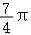
*一个圆形被分成6个扇形区域，标注有“红”“黄”字样，其中红色区域3块，黄色区域3块，圆心处有箭头指向一个方向*

13. （3分）分解因式：$x^2 + 5x = $ ___ .  
14. （3分）关于$x$的一元二次方程$x^2 + mx + 1 = 0$有两个相等的实数根，则$m$的值为___  
15. （3分）用如图（1）所示的若干张直角三角形与四边形纸片进行密铺（不重叠、无空隙），观察示意图（图（2））可知$x+2y$的值等于___ .  

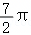
*图(1)显示一个直角三角形和一个四边形纸片，标注角度x°、y°；图(2)显示若干张这样的纸片密铺的示意图*

16. （3分）如图，在等腰直角三角形ABC中，∠C=90°，AC=BC=8，D是AB的中点，M是边AC上的动点，作DN⊥DM交BC于点N，延长MD到点P，使得$\frac{DP}{MD} = \frac{1}{2}$．当△PNB面积最大时，AM的长等于___ .  

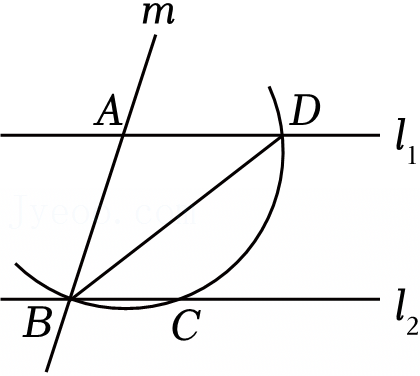
*等腰直角三角形ABC，∠C=90°，AC=BC=8，D是AB中点，M在AC上动点，DN⊥DM交BC于N，MD延长到P满足DP=1/2 MD，标注各点和线段关系*

三、解答题（本大题共10小题，共72分．解答应写出必要的文字说明、证明过程或演算步骤）  
17. （5分）计算：$2\cos60^\circ - (1-\sqrt{5})^0 + (\frac{1}{4})^{-1}$ .  
18. （5分）解方程：$\frac{3-x}{4+x} = \frac{1}{2}$ .  
19. （6分）如图，已知△ABC≌△DEF，边BC与EF、DF分别交于点O、M，AC与EF交于点N，OB=OE．求证：△MOF≌△NOC．  

*图中显示△ABC和△DEF全等，边BC与EF交于O，DF交BC于M，AC与EF交于N，且OB=OE*

---

## 第 4 页

<几何图形>

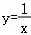
*图形显示交错的线段，顶点标记为A、D在上方，B、E在中部左侧和右侧，F、C在下方，交点O处有M、N标注*

20.（6分）一只不透明的袋子中装有4个小球，分别标有数字2、3、5、7，这些球除数字外都相同。从袋子中随机摸出2个球，用列表或画树状图的方法，求摸出标有数字2和3的两个球的概率。

21.（6分）小方根据我国古代数学著作《九章算术》中的一道“折竹”问题改编了一个情境：如图，一根竹子原来高1丈（1丈=10尺），折断后顶端触到墙上距地面9尺的点P处，墙脚O离竹根A处3尺远。请你解答：折断处B离地面多高？

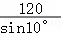
*左侧为古代数学著作《九章算术》的封面或相关文字内容，右侧为折竹问题示意图，包含地面、墙、点P、A、O等标注*

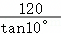
*折竹问题的示意图，显示地面水平线段AO，O处有墙垂直于地面，点P在墙上距地面9尺处，折断后竹子顶端到P点，B为折断处位置，标注各点距离关系*

22.（6分）新一轮科技革命和产业变革深入发展，科技创新是建成科技强国的重要保障。学校兴趣小组成员收集了我国2018 - 2024年发明专利申请授权数，整理数据如下表（单位：万个，精确到0.1）：

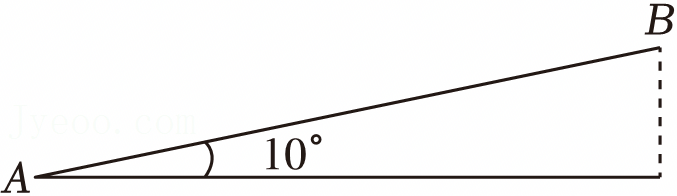
*折线统计图，横轴为年份2018-2024，纵轴为发明专利申请授权数（万个），图中显示从A(2019,45.3)到B(2024,104.5)的上升趋势*

| x（年份） | 2018 | 2019 | 2020 | 2021 | 2022 | 2023 | 2024 |
|-----------|------|------|------|------|------|------|------|
| y/万个    | 43.2 | 45.3 | 53.0 | 69.6 | 79.8 | 92.1 | 104.5 |
（1）计算2020到2021年我国发明专利申请授权数的增长率（精确到1%）；  
（2）小组成员建立平面直角坐标系，并根据表中数据画出相对应的点（如图），从图中可以看出，这些点大致分布在一条直线附近，他们选择了两个点A（2019，45.3）、B（2024，104.5）作一条直线来近似的表示y的值随年份x不断增长的变化趋势。设直线AB上点的坐标满足函数表达式$y=kx+b$。试求出k的值，并写出k的实际意义，再预测我国2025年发明专利申请授权数。

---

## 第 5 页

23.（6分）如图，在平面直角坐标系中，点A、B分别在反比例函数$y=\frac{2}{x}$和$y=\frac{k}{x}(k>0)$的图象上，点A的横坐标为-1，点B的横坐标为n(n>3)，点C的坐标为(3, 0)，AC⊥BC，AC=2BC。

（1）求点A、B的坐标和反比例函数$y=\frac{k}{x}(k>0)$的表达式；
（2）点D、E分别在反比例函数$\frac{y=k}{x}(k>0)$和$y=\frac{2}{x}$的图象上，与点A、B构成以AB为边的平行四边形，则点D、E的坐标分别为___、___。

*平面直角坐标系示意图，包含点A(-1, y_A)、点B(n, y_B)、点C(3,0)，AC与BC垂直，标注各点位置及坐标轴*

24.（10分）如图（1），过⊙O外一点M引⊙O的两条切线MA、MB，切点是A、B，∠AMB为锐角，连接MO并延长与⊙O交于点N，点P在MN的延长线上，过点P作MA的垂线，与BO的延长线相交于点E，垂足为F.

（1）求证：△EOP是等腰三角形；
（2）在图（2）中作△EOP，满足OP=OF（尺规作图，不写作法，保留作图痕迹）；
（3）已知$\sin∠AMB=\frac{\sqrt{5}}{3}$，在你所作的△EOP中，若PF=2，求OE的长.

*图(1)示意图：圆O，外部点M引切线MA、MB交圆于A、B，连接MO延长交圆于N，MN上取P，过P作MA垂线交BO延长于E，F为垂足；图(2)示意图：圆O及点M、A、B的位置示意*

25.（10分）为什么变速自行车会“变速”？变速自行车是常用的交通工具，图（1）所示的是某型号变速自行车的基本结构，图中A、B处分别有几个大小不同的齿轮，链条连接的两个齿轮称为主动链轮、从动链轮.

*变速自行车基本结构示意图，显示A、B处的不同齿轮及链条连接关系*

---

## 第 6 页

[探究]为了便于研究主动链轮与从动链轮的关系，我们先探究一组相互啮合的两个齿轮（如图（2）），通过操作发现：两个齿轮如果可以实现传动，那么两个齿轮的齿距（相邻两齿在圆上的弧长）相等，相同时间内啮合的齿数相等。  

(1) 已知主动轮、从动轮的齿数分别为\(n_1\)、\(n_2\)，主动轮每分钟转\(\omega_1\)圈，则每分钟啮合的齿数有 ___个，从动轮每分钟转\(\omega_2\)圈，则每分钟啮合的齿数有 ___个，由于相同时间内啮合的齿数相等，从而可推出\(\frac{\omega_1}{\omega_2} = \) ________ 。  

*两个相互啮合的齿轮示意图，标注主动轮、从动轮及齿距*
  

(2) 如图（3），在主动轮与从动轮之间加入一个“惰轮”形成新的齿轮组合，已知主动轮、从动轮的齿数分别为32齿和14齿。若主动轮的转速为每分钟70圈，求从动轮的转速，并说一说图（3）的齿轮组合在实现传动时，“情轮”的作用是什么？  

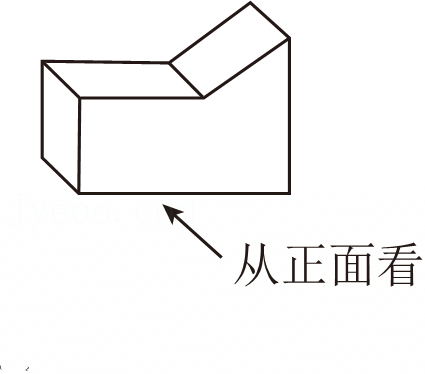
*齿轮组合示意图，包含14齿从动轮、情轮和32齿主动轮的啮合关系*
  

[发现]不难发现，变速自行车中的链条作用如同“惰轮”。若骑行者每分钟蹬的圈数不变，实现自行车“变速”的方法可以是 ________ （写出一种即可）。  

26. （12分）在平面直角坐标系中，过点\(T(0, t)\)作y轴的垂线与二次函数\(\frac{1}{2}(x-h)^2 + k\)（h、k为常数）的图象交于点E、F（点E在点F的左侧），点P在直线EF上，当点P满足\(PE+PF=6\)时，我们称点P是该二次函数图象的T~6生长点。  

(1) 二次函数\(\frac{1}{2}x^2\)的图象如图所示。  
①在\(t\)的不同取值\(\frac{2}{5}\)、\(\frac{9}{2}\)、5中，使该函数图象有T~6生长点的\(t\)的值是 ________ ；  
②已知\(P(m, n)\)是该函数图象的T~6生长点，猜想\(n\)的取值范围，并说明理由。  

(2) 二次函数\(\frac{1}{2}(x-h)^2 + k\)（h、k为常数）的图象经过点\((6, 1)\)，若\(P(3, 5)\)是该函数图象

---

## 第 7 页

的T~6生长点，求该函数的表达式。

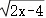
*直角坐标系中抛物线图像，显示开口向上的二次函数曲线，顶点位于(-1, -1)附近，经过原点和(1,0)左右位置，x轴和y轴刻度清晰可见。*

---

------------------------------------------------------------

## 未匹配图片

