# _temp

**处理时间**: 2026-02-15 21:25:39
**处理模型**: zai-org/glm-4.6v-flash
**总页数**: 6

---


## 第 1 页

一、选择题（本大题共6小题，每小题2分，共12分. 在每小题所给出的四个选项中，恰有一项是符合题目要求的，请将正确选项前的字母代号填涂在答题卡相应位置上）  
1. （2分）-2的绝对值是（ ）  
   A. $\frac{1}{2}$ B. $\frac{1}{2}$ C. -2 D. 2  

2. （2分）下列图形中，一定有外接圆的是（ ）  
   A. 三角形 B. 四边形 C. 五边形 D. 六边形  

3. （2分）要使分式$\frac{x+y}{x-y}$有意义，字母$x,y$须满足（ ）  
   A. $x \neq y$ B. $x \neq -y$ C. $x \geq y$ D. $x \geq -y$  

4. （2分）$10^{-6}$的算术平方根是（ ）  
   A. 0.0001 B. 0.001 C. $\pm0.0001$ D. $\pm0.001$  

5. （2分）实数$-a$, $a$, $\frac{1}{a}$在数轴上对应点的位置如图所示。下列四个点中，表示1的点可能是（ ）  
   A. P B. Q C. R D. S  

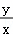
*数轴示意图，显示点P、Q、R、S的位置，其中P对应$-a$，Q对应$a$，R对应$\frac{1}{a}$，S在R右侧。数轴上标注了各点的位置关系。*
  

6. （2分）如图，在平面直角坐标系中，已知下列变换：①沿y轴翻折；②沿函数$y=x+2$的图象翻折；③绕原点按顺时针方向旋转45°；④绕点(1, -1)按顺时针方向旋转90°。其中，能使函数$y=2x+4$的图象经过一种变换后过点P(2, 2)的个数是（ ）

---


## 第 2 页

```markdown

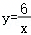
*直角坐标系中绘制函数y=2x+4的直线，标注原点O和点P的位置*


A. 1 B. 2 C. 3 D. 4

二、填空题（本大题共10小题，每小题2分，共20分.请把答案填写在答题卡相应位置上）

7. （2分）已知一组数据8, 10, 12, 9, 11，这组数据的平均数是___ .

8. （2分）若等腰三角形的周长为12，则它的腰长可以是___（写出一个即可）.

9. （2分）计算$(\sqrt{3}+\sqrt{2})(\sqrt{12}-\sqrt{8})$的结果是___ .

10. （2分）已知$x=2$是方程$\frac{1}{x-a} + \frac{2a}{a-x}=1$的解，则$a$的值是___ .

11. （2分）设方程$x^2+2x-9=0$的正根介于整数$m$与$m+1$之间，则$m=$___ .

12. （2分）一枚圆形古钱币的正中间是一个正方形孔，它的部分尺寸（单位：mm）如图，这枚古钱币的半径为___ m.


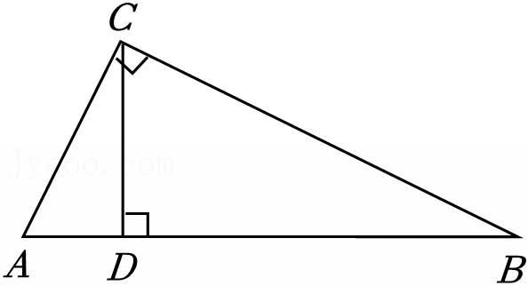
*圆形古钱币示意图，显示圆内有一个边长为10 mm的正方形孔，圆外标注半径相关尺寸7 mm*

```

---


## 第 3 页

14.（2分）已知反比例函数 $y = \frac{6}{x}$，则当 1≤x≤3 时，x 的最小值是________．  

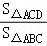
*直角三角形ABC，C点为直角顶点，CD垂直于AB，D在AB上*
  

15.（2分）如图，点E，F在矩形ABCD内，Rt△ABE≌Rt△CDF．若AB=25，AD=30，AE=15，则EF的长为________．  

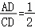
*矩形ABCD，A在左上角、B在右上角、C在右下角、D在左下角；点E、F分别在矩形内，标注Rt△ABE与Rt△CDF全等关系及各边长信息*
  

16.（2分）如图，扇形OAB的圆心角为260°，若点P在该扇形内，则∠APB的度数的范围是___．  


*扇形OAB，圆心O，弧AB对应的圆心角标注为260°；点A、B、O及内部点P的位置示意*
  


三、解答题（本大题共11小题，共88分，请在答题卡指定区域内作答，解答时应写出文字说明、证明过程或演算步骤）  

17.（7分）解不等式组 $\begin{cases} 2x - 1 > 3 \\ x + 2 < 4x - 1 \end{cases}$．  

18.（7分）尺规作图：如图，点P在直线l外，过点P作与直线l平行的直线．  

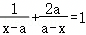
*点P位于直线l外部，标注直线l和点P的位置示意*
  

19.（8分）某商店销售两种饮料，A饮料“满三免一”（即每买3杯只需付2杯的钱），B饮料满5杯按8折销售．小丽买了A，B饮料各1杯，用了20元；小明买了3杯A饮料和5杯B饮料，用了56元．A，B两种饮料每杯分别是多少元？

---


## 第 4 页

20.（7分）已知$a<b<0$，试比较$\frac{1}{2}a^2$与$\frac{1}{2}b^2$的大小.

21.（8分）甲袋子中装有2个相同的小球，它们分别写有数字1和3，乙袋子中装有3个相同的小球，它们分别写有数字1，2和4。先从甲袋子中随机取出1个小球，再从乙袋子中随机取出2个小球。
（1）取出的3个小球上所写数字没有4的概率是________；
（2）取出的3个小球上所写数字都不相同的概率是多少？

22.（7分）某校准备从甲、乙两名学生中选拔一名参加跳远比赛，共进行了3次测试，每次各跳远3次，统计成绩如下表（单位：m）。
|       | 第1次测试 | 第2次测试 | 第3次测试 |
|-------|------------|-----------|-----------|
| 甲    | ×          | 4.82      | 5.36      |
|       |            | 5.56      | 6.15      |
|       |            |           | ×         |
|       |            |           | 5.81      |
|       |            |           | ×         |
|       |            |           | 5.78      |
| 乙    | 4.65       | 5.76      | 5.53      |
|       |            | 5.67      | ×         |
|       |            |           | 5.90      |
|       |            |           | 5.30      |
|       |            |           | 6.05      |
|       |            |           | 5.86      |
注：×表示缺规。
将上述成绩分成“犯规”“一般成绩”“优秀成绩”三类，其中，$5.75m$以下为“一般成绩”，$5.75m$及以上为“优秀成绩”，并绘制条形统计图。
（1）补全条形统计图。

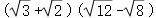
*条形统计图，横轴显示"犯规、一般成绩、优秀成绩"，纵轴是次数，甲的柱子：犯规约3次，一般成绩4次，优秀成绩3次；乙的柱子：犯规约1次，一般成绩2次，优秀成绩4次（根据数据推测）*

（2）你认为哪名学生参加跳远比赛较为合适？为什么？

23.（8分）如图，O是□ABCD的对称中心，BC与⊙O相切于点E。
（1）求证：直线AD是⊙O的切线。
选择其中一位同学的想法，完成证明。


*平行四边形ABCD，O是对称中心，BC与圆O相切于E，标注各点A、B、C、D、O、E的位置*

选择其中一位同学的想法，完成证明。

---


## 第 5 页

(2) 当AB与⊙O相切时，□ABCD是菱形吗？说明理由。

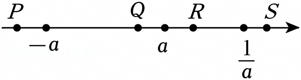
*平行四边形ABCD内含圆O，点E在BC边上，标注各顶点A、B、C、D及圆心O和切点位置*


24.（8分）如图，在长方形电子屏ABCD中，AB=8m，AD=5m，一条公益广告画面的动态效果设计如下：动点P从点A出发沿边AB，BC以2m/s的速度向点C运动，随着DP的移动，画面逐渐展开。
（1）写出展开的画面面积S（单位：m²）关于点P的运动时间t（单位：s）的函数表达式；

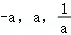
*长方形ABCD，A在左下角，B在右下角，C右上角，D左上角；三角形APD阴影部分表示展开画面区域*

（2）当展开的画面面积达到电子屏面积的4时开始播放广告语，播放时间持续3s，求播放结束时展开的画面面积。
> 注释：先计算电子屏面积，再确定t值，然后计算后续面积

25.（8分）如图，码头B位于码头A的南偏东30°方向，A，B之间的距离为40km，灯塔P在AB的中点处。轮船甲从A出发，沿正南方向航行，轮船乙从B出发，沿正东方向航行。当甲航行到C处时，乙航行了相同的距离到达D处，此时，C，P，D三点恰好在一条直线上。求甲航行的距离AC。

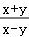
*坐标系中A在上方，B在南偏东30°方向，标注角度30°，AB=40km，P为AB中点，C从A正南出发，D从B正东出发，三点共线CPD*


26.（9分）（1）将函数$y=-x^2+2$的图象向右平移2个单位长度，平移后的函数图象与y轴交点的纵坐标是____．

---


## 第 6 页

(2) 平移函数 $y = -x^2 + 2$ 的图象，在这个过程中，它的顶点都在一次函数 $y = kx + 2$ 的图象上。设平移后的函数图象的顶点 P 的横坐标为 $m$，与 y 轴交点的纵坐标为 $n$，n 随 m 的变化而变化。

①若 $k=2$，当 $0 \le m \le 3$ 时，求 $n$ 的取值范围。  
②设函数 $y = kx + 2$ 的图象与 x 轴、y 轴的交点分别为 A，B，点 P 在线段 AB 上。当 k 取不同值时，下列关于 n 的变化趋势的描述：(a) n 随 m 的增大而增大；(b) n 随 m 的增大而减小；(c) n 随 m 的增大先增大后减小；(d) n 随 m 的增大先减小后增大。其中，所有可能出现的序号是 ___（说明：全部填对的得满分，有填错的不得分）．  

27. （11分）某纸杯的尺寸（单位：cm）如图(1)所示，展开它的侧面得到扇环纸片 ABCD（可以看作扇形纸片 OAD 剪去扇形纸片 OBC 后剩余的部分）。  


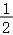
*图(1)展示了一个圆锥的轴截面和其侧面展开图。左侧为圆锥立体示意图，标注了高度9 cm、底面半径6 cm以及顶点O；右侧为扇环纸片平面展开图，包含两个同心圆弧AD与BC及矩形区域。*


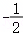
*图(2)展示了一个矩形纸片ABCD，其中AB=a，BC=b。内部绘制了两个扇形弧线（对应扇环的上、下部分），标注了顶点A、B、C、D。*
  

(1) $\widehat{AD}$ 的长为 ___ cm，$OB=$ ___ cm。  

(2) 记 $a \times b$ 表示两边长分别为 a, b（a≤b，单位：cm）的矩形纸片的大小。  
①图(2)是可以剪出扇环纸片 ABCD 的一张矩形纸片，它的一边与 $\widehat{AD}$ 相切，点 B，C 在对边上，点 A，D 分别在另外两边上，直接写出 a, b 的值。  
②用一张 $18.2 \times 25.7$ 的矩形纸片可以剪出扇环纸片 ABCD 吗？说明理由。  
③若一张 $15 \times b$ 的矩形纸片可以剪出扇环纸片 ABCD，写出求 b 的范围的思路（无需算出最终结果）．

---


------------------------------------------------------------

## 未匹配图片


