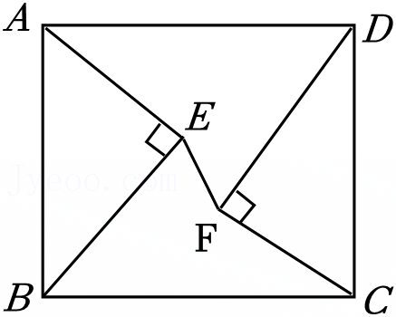

一、选择题（本大题共6小题，每小题2分，共12分. 在每小题所给出的四个选项中，恰有一项是符合题目要求的，请将正确选项前的字母代号填涂在答题卡相应位置上）
1. （2分）-2的绝对值是（ ）
A. $\frac{1}{2}$ B. $\frac{1}{2}$ C. -2 D. 2
2. （2分）下列图形中，一定有外接圆的是（ ）
    A. 三角形 B. 四边形 C. 五边形 D. 六边形
3. （2分）要使分式$\frac{x+y}{x-y}$有意义，字母$x$，$y$须满足（ ）
    A. $x \neq y$ B. $x \neq -y$ C. $x \geq y$ D. $x \geq -y$
4. （2分）$10^{-6}$的算术平方根是（ ）
    A. 0.0001 B. 0.001 C. $\pm0.0001$ D. $\pm0.001$
5. （2分）实数$-a$，$a$，$\frac{1}{a}$在数轴上对应点的位置如图所示. 下列四个点中，表示1的点可能是（ ）
    
![图片：<think>用户问的是详细描述这张图片的内容，首先需要识别类型，然后描述关键元素和细节，包括文字标注等。首先看图片是一个数轴示意图，属于几何图形或数学示意图。

首先，图片中有一个水平数轴，从左到右有箭头指向右边。标记的点依次是P、Q、R、S四个点。各点的位置标注如下：P点在左边，旁边标有“-a”；然后中间有点，Q点对应的位置标有“a”，接着R点，然后S点对应的是1/a。数轴上的刻度或点分布：P在最左端，然后是另一个点（可能没有特别标记），然后到Q点，标注为a；之后R点在Q和S之间？或者看顺序：P、中间一点、Q、中间一点、R、中间一点、S。具体标注文字：“P”在最左侧，“-a”在P下方；“Q”在中间位置，下方标“a”；“R”在其右侧；“S”再右侧，下方标“1/a”。数轴上有箭头向右。

需要准确描述：这是一幅数轴示意图（属于数学示意图），数轴上从左到右依次标记点P、Q、R、S。各点对应标注为：P点下方是“-a”，Q点下方是“a”，S点下方是“1/a”。数轴上有箭头指向右侧，表示正方向。

关键元素包括：数轴、四个点P、Q、R、S的位置顺序，以及对应的数值标注：-a（在P附近）、a（在Q处）、1/a（在S处）。需要注意点的位置关系：P在最左，然后是中间一点，接着Q标为a，再一点到R，再到S标1/a。

现在按照要求组织语言，不超过200字，准确描述类型、关键元素和标注。</think>
这是一幅数轴示意图（数学图形），水平数轴向右延伸有箭头。从左至右依次标记点P、Q、R、S：P点下方标注“-a”，Q点下方标注“a”，S点下方标注“1/a”。各点按顺序分布，体现数值大小关系。](./images/image5.png)

    A. P B. Q C. R D. S
6. （2分）如图，在平面直角坐标系中，已知下列变换：①沿y轴翻折；②沿函数$y=x+2$的图象翻折；③绕原点按顺时针方向旋转45°；④绕点(1, -1)按顺时针方向旋转90°. 其中，能使函数$y=2x+4$的图象经过一种变换后过点P(2, 2)的个数是（ ）

![图片：<think>用户问的是详细描述这张图片的内容，首先需要识别类型，然后描述关键元素和细节。首先看图片是一个坐标系中的直线图像，包含y轴、x轴，原点O，一条直线方程是y=2x+4，还有一个点P在直线上方或附近？根据图示，点P的位置大概在某个坐标位置。

首先确定类型：几何图形（具体是平面直角坐标系内的函数图像）。

关键元素：平面直角坐标系，x轴和y轴交于原点O；直线方程y=2x+4通过坐标系；点P位于第一象限内某处，用黑点表示。需要准确引用文字“y=2x+4”，标注点P的位置。

描述要简洁，不超过200字，确保包含坐标系的网格线（虚线），直线方程，原点O，点P的位置等。

现在组织语言：这是一幅平面直角坐标系示意图，x轴、y轴交于原点O，虚线网格构成背景。直线y=2x+4从左下到右上穿过第一、二象限，与y轴交点为(0,4)。点P位于第一象限内（约坐标(3,2)附近？不过根据图示位置，可能需要看具体格子数，但描述中不需要精确坐标，只说位置）。准确引用文字“y=2x+4”，标注点P。

检查要求：识别类型、关键元素和细节、准确引用文字、简洁不超过200字。现在输出描述文本。</think>
这是一幅平面直角坐标系示意图（几何图形），x轴与y轴交于原点O，背景为虚线网格。直线方程为 \( y = 2x + 4 \)，从左下到右上穿过第一、二象限，与y轴交点为(0,4)。点P位于第一象限内（约坐标(3,2)附近），用黑点标注。图中准确引用文字“\( y = 2x + 4 \)”。](./images/image6.png)

A. 1 B. 2 C. 3 D. 4

二、填空题（本大题共10小题，每小题2分，共20分。请把答案填写在答题卡相应位置上）
7. （2分）已知一组数据8，10，12，9，11，这组数据的平均数是___。
8. （2分）若等腰三角形的周长为12，则它的腰长可以是___（写出一个即可）．
9. （2分）计算$(\sqrt{3}+\sqrt{2})(\sqrt{12}-\sqrt{8})$的结果是___．
10. （2分）已知$x=2$是方程$\frac{1}{x-a} + \frac{2a}{a-x} = 1$的解，则$a$的值是___．
11. （2分）设方程$x^2+2x-9=0$的正根介于整数$m$与$m+1$之间，则$m=$___．
12. （2分）一枚圆形古钱币的正中间是一个正方形孔，它的部分尺寸（单位：mm）如图，这枚古钱币的半径为___m。

13. （2分）如图，在Rt△ABC中，∠ACB=90°，CD是边AB上的高，$\frac{AD}{CD}=\frac{1}{2}$，则$\frac{S_{\triangle ACD}}{S_{\triangle ABC}}$的值是___．

14.（2分）已知反比例函数$y = \frac{6}{x}$，则当1≤x≤3时，x的最小值是________．  

15.（2分）如图，点E，F在矩形ABCD内，Rt△ABE≌Rt△CDF．若AB=25，AD=30，AE=15，则EF的长为________．  

16.（2分）如图，扇形OAB的圆心角为260°，若点P在该扇形内，则∠APB的度数的范围是___．  

三、解答题（本大题共11小题，共88分，请在答题卡指定区域内作答，解答时应写出文字说明、证明过程或演算步骤）  

17.（7分）解不等式组$\begin{cases}2x - 1 > 3 \\ x + 2 < 4x - 1\end{cases}$．  

18.（7分）尺规作图：如图，点P在直线l外，过点P作与直线l平行的直线．  

19.（8分）某商店销售两种饮料，A饮料“满三免一”（即每买3杯只需付2杯的钱），B饮料满5杯按8折销售．小丽买了A，B饮料各1杯，用了20元；小明买了3杯A饮料和5杯B饮料，用了56元．A，B两种饮料每杯分别是多少元？

20．（7分）已知$a<b<0$，试比较$\frac{1}{2}a^{2}$与$\frac{1}{b^{2}}$的大小。  

21．（8分）甲袋子中装有2个相同的小球，它们分别写有数字1和3，乙袋子中装有3个相同的小球，它们分别写有数字1，2和4。先从甲袋子中随机取出1个小球，再从乙袋子中随机取出2个小球。  
（1）取出的3个小球上所写数字没有4的概率是________；  
（2）取出的3个小球上所写数字都不相同的概率是多少？  

22．（7分）某校准备从甲、乙两名学生中选拔一名参加跳远比赛，共进行了3次测试，每次各跳远3次，统计成绩如下表（单位：m）。  
|       | 第1次测试 | 第2次测试 | 第3次测试 |
|-------|------------|-----------|-----------|
| 甲     | ×          | 4.82      | 5.36      | 5.56      | 6.15    | ×        | 5.81      | ×        | 5.78    |
| 乙     | 4.65       | 5.76      | 5.53      | 5.67      | ×        | 5.90      | 5.30      | 6.05      | 5.86    |

注：×表示犯规。  
将上述成绩分成“犯规”“一般成绩”“优秀成绩”三类，其中，$5.75m$以下为“一般成绩”，$5.75m$及以上为“优秀成绩”，并绘制条形统计图。  
（1）补全条形统计图。  

![图片：<think>用户问的是详细描述这张图片的内容，首先需要识别类型，然后描述关键元素。首先看图片是一个统计图表，具体是条形图（柱状图）。横轴是“成绩”，分为犯规、一般成绩、优秀成绩三个类别。纵轴是“频数”。图中有甲和乙两组数据，用不同颜色的条形表示，白色代表甲，灰色代表乙。

接下来观察每个类别的数值：犯规类别中，甲的频数是3（白色条形高度到3），乙的是1（灰色条形高度到1）。一般成绩类别，甲没有显示？不对，看图表，“一般成绩”对应的条形，甲的部分可能为0？不仔细看，图中“一般成绩”只有乙的条形，高度4，而甲是否有？然后优秀成绩中，甲是3，乙是4。需要准确读取每个类别的甲和乙的数量。

具体来说：
- 犯规：甲（白）频数3，乙（灰）频数1。
- 一般成绩：甲无条形（或为0），乙频数4。
- 优秀成绩：甲频数3，乙频数4。

纵轴刻度从0到5，每个单位间隔。图例显示“□ 甲”“■ 乙”（不过图中是白色和灰色）。

现在按照要求组织语言：

这是一张统计图表（条形图），横轴为“成绩”，分为“犯规”“一般成绩”“优秀成绩”三类；纵轴为“频数”。甲用白色条形，乙用灰色条形。各分类数据：犯规类甲3人、乙1人；一般成绩类甲0人、乙4人（或甲无显示）；优秀成绩类甲3人、乙4人。

需要准确描述关键元素和细节，不超过200字，不添加其他内容。</think>
这是一张统计图表（条形图），横轴为“成绩”，分为“犯规”“一般成绩”“优秀成绩”三类；纵轴为“频数”。甲用白色条形，乙用灰色条形。各分类数据：犯规类甲3人、乙1人；一般成绩类甲无显示（或0）、乙4人；优秀成绩类甲3人、乙4人。](./images/image21.png)
  
（2）你认为哪名学生参加跳远比赛较为合适？为什么？  

23．（8分）如图，O是▱ABCD的对称中心，BC与⊙O相切于点E。  
（1）求证：直线AD是⊙O的切线。  
> 可以过点O作AD的垂线……  
> 也可以连接EO并延长……  

选择其中一位同学的想法，完成证明。

(2) 当AB与⊙O相切时，□ABCD是菱形吗？说明理由。

24. (8分) 如图，在长方形电子屏ABCD中，AB=8m，AD=5m，一条公益广告画面的动态效果设计如下：动点P从点A出发沿边AB，BC以2m/s的速度向点C运动，随着DP的移动，画面逐渐展开。
(1) 写出展开的画面面积S（单位：m²）关于点P的运动时间t（单位：s）的函数表达式；
(2) 当展开的画面面积达到电子屏面积的4时开始播放广告语，播放时间持续3s，求播放结束时展开的画面面积。

25. (8分) 如图，码头B位于码头A的南偏东30°方向，A，B之间的距离为40km，灯塔P在AB的中点处。轮船甲从A出发，沿正南方向航行，轮船乙从B出发，沿正东方向航行。当甲航行到C处时，乙航行了相同的距离到达D处，此时，C，P，D三点恰好在一条直线上。求甲航行的距离AC。

26. (9分) (1) 将函数$y= -x^2+2$的图象向右平移2个单位长度，平移后的函数图像与y轴交点的纵坐标是___．

(2) 平移函数$y = -x^2 + 2$的图象，在这个过程中，它的顶点都在一次函数$y = kx + 2$的图象上。设平移后的函数图象的顶点P的横坐标为$m$，与y轴交点的纵坐标为$n$，$n$随$m$的变化而变化。
①若$k=2$，当$0 \leq m \leq 3$时，求$n$的取值范围。
②设函数$y = kx + 2$的图象与x轴、y轴的交点分别为A，B，点P在线段AB上。当$k$取不同值时，下列关于$n$的变化趋势的描述：(a)$n$随$m$的增大而增大；(b)$n$随$m$的增大而减小；(c)$n$随$m$的增大先增大后减小；(d)$n$随$m$的增大先减小后增大。其中，所有可能出现的序号是______（说明：全部填对的得满分，有填错的不得分）。

27. （11分）某纸杯的尺寸（单位：cm）如图(1)所示，展开它的侧面得到扇环纸片ABCD（可以看作扇形纸片OAD剪去扇形纸片OBC后剩余的部分）。  

<figure style="text-align: center;">
  <!-- 这里原本是图片位置 -->
</figure>
(1) $\widehat{AD}$的长为___ cm，$OB = $ ___ cm。  
(2) 记$a \times b$表示两边长分别为$a$，$b$（$a \leq b$，单位：cm）的矩形纸片的大小。  
①图(2)是可以剪出扇环纸片ABCD的一张矩形纸片，它的一边与$\widehat{AD}$相切，点B，C在对边上，点A，D分别在另外两边上，直接写出$a$，$b$的值。  

![图片：<think>用户问的是详细描述这张图片的内容，首先需要识别图片类型，然后描述关键元素和细节，包括文字标注等。

首先看图片分为两个部分：(1) 和 (2)。图(1)是一个扇形卷成的圆台结构，有O点作为顶点，OA和OB是两条半径，长度分别是9（OA的线段标注为9）和6（OB的底部直径？不对，图中显示OA到A的距离是9，垂直方向从O到B是9？或者看标注：左边有一个箭头指向A，标有“-9→”，然后从O到B的虚线，长度9，底部的圆环部分，内径6（从B点向左的水平箭头标为“<6->”）。所以图(1)是一个扇形展开图，用于制作圆台，OA=9，OB=6？或者可能是圆锥的侧面展开图。

然后图(2)是一个矩形内的两个弧线，标注A、D在上方，B、C在下边，左边高度a，上底b。所以需要准确描述每个部分的关键元素和文字标注。

现在按照要求：识别类型是几何图形（示意图），关键元素包括两个子图：(1) 扇形O-ABCD？不，图(1)中点O为圆心，OA和OB是半径，长度分别为9和6，弧AD和弧BC，形成圆台的侧面展开图。标注有“9”在OA上方，“6”在底部内径处，箭头指示方向。

然后图(2)是一个矩形，内部有两个同心扇形弧线AB和CD？不，图中A、D在上边，B、C在下边，左边高度a，上底b，两个弧线分别从A到D经过B和C，形成类似圆台的侧面展开后的矩形部分。

需要准确引用文字标注：“-9→”，“6”，“O”，(1)，(2)等。然后描述结构：图(1)是扇形，圆心O，半径OA=9，OB=6，弧AD与弧BC；图(2)是矩形内含两个同心弧AB、CD，标注a（高）、b（宽）。

现在组织语言，不超过200字，准确简洁。</think>
<|begin_of_box|>图片包含两幅几何图形示意图。(1)为扇](./images/image28.png)

<figure style="text-align: center;">
  <!-- 这里原本是图片位置 -->
</figure>
②用一张18.2×25.7的矩形纸片可以剪出扇环纸片ABCD吗？说明理由。  
③若一张15×$b$的矩形纸片可以剪出扇环纸片ABCD，写出求$b$的范围的思路（无需算出最终结果）。

