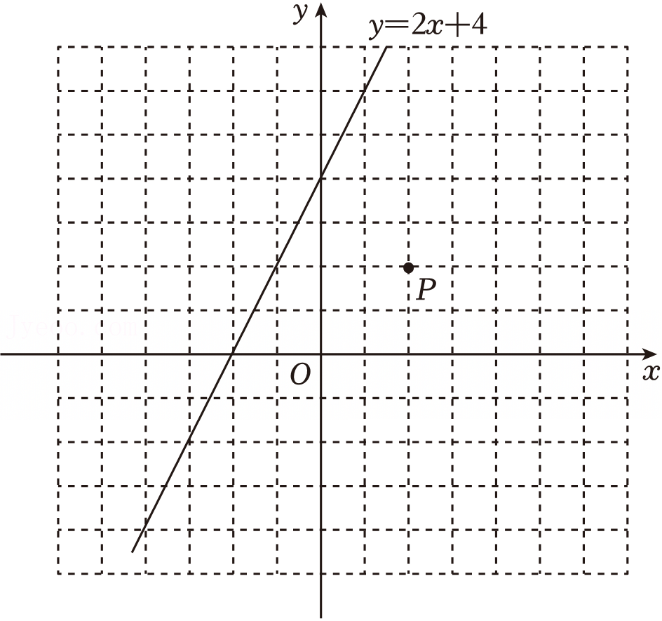
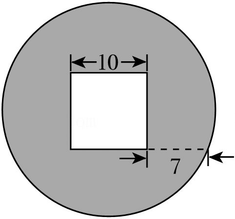
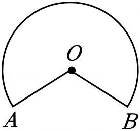
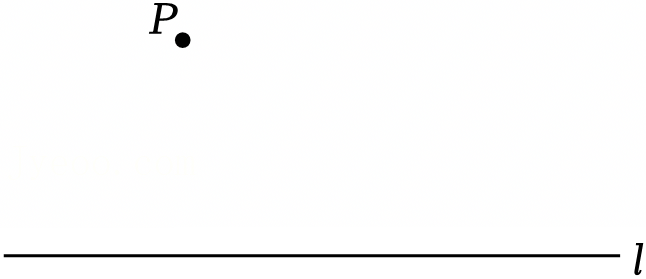
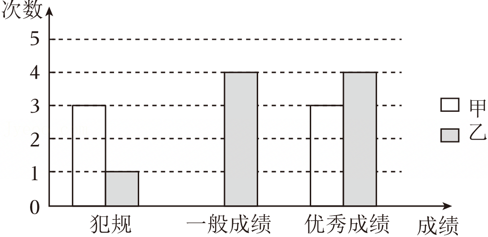
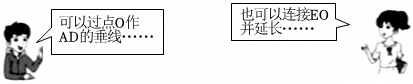
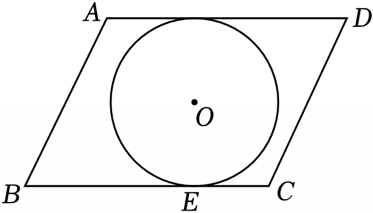
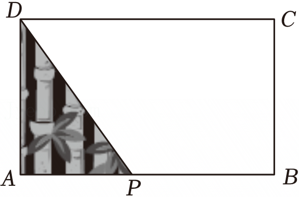
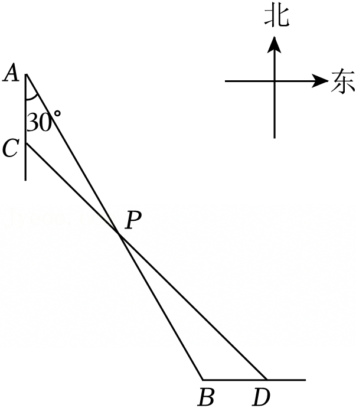
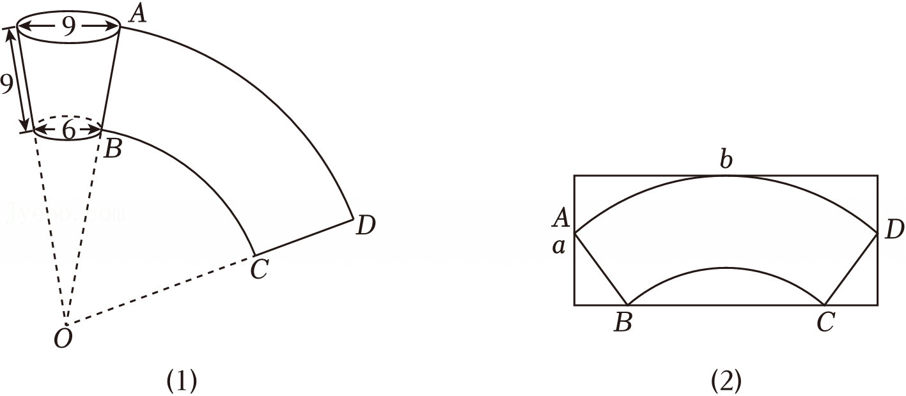

一、选择题（本大题共6小题，每小题2分，共12分. 在每小题所给出的四个选项中，恰有一项是符合题目要求的，请将正确选项前的字母代号填涂在答题卡相应位置上）  

1. （2分）-2的绝对值是（ ）  
   A. $\frac{1}{2}$ 
   B. $\frac{1}{2}$
   C. -2
   D. 2  

2. （2分）下列图形中，一定有外接圆的是（ ）  
   A. 三角形
   B. 四边形
   C. 五边形
   D. 六边形  

3. （2分）要使分式$\frac{x+y}{x-y}$有意义，字母x,y须满足（ ）  
   A. x≠y
   B. x≠-y
   C. x≥y
   D. x≥-y  

4. （2分）$10^{-6}$的算术平方根是（ ）  
   A. 0.0001
   B. 0.001
   C. ±0.0001
   D. ±0.001  

5. （2分）实数-a，a，$\frac{1}{a}$在数轴上对应点的位置如图所示。下列四个点中，表示1的点可能是（ ）  

   A. P
   B. Q
   C. R
   D. S  

6. （2分）如图，在平面直角坐标系中，已知下列变换：①沿y轴翻折；②沿函数$y=x+2$的图象翻折；③绕原点按顺时针方向旋转45°；④绕点(1, -1)按顺时针方向旋转90°。其中，能使函数$y=2x+4$的图象经过一种变换后过点P(2, 2)的个数是（ ）

A. 1 B. 2 C. 3 D. 4

二、填空题（本大题共10小题，每小题2分，共20分。请把答案填写在答题卡相应位置上）

7. （2分）已知一组数据8,10,12,9,11，这组数据的平均数是___。

8. （2分）若等腰三角形的周长为12，则它的腰长可以是____（写出一个即可）.

9. （2分）计算(√3 + √2)(√12 - √8)的结果是___。

10. （2分）已知x=2是方程x - a/(1+2a)=1/a - x的解，则a的值是___。

11. （2分）设方程x²+2x-9=0的正根介于整数m与m+1之间，则m=___。

12. （2分）一枚圆形古钱币的正中间是一个正方形孔，它的部分尺寸（单位：mm）如图，这枚古钱币的半径为___ m。

13. （2分）如图，在Rt△ABC中，∠ACB=90°，CD是边AB上的高，CD/AD = 1/2，则S△ACD/S△ABC的值是___。

14.（2分）已知反比例函数$y = \frac{6}{x}$，则当1≤x≤3时，x的最小值是________．  

15.（2分）如图，点E，F在矩形ABCD内，Rt△ABE≌Rt△CDF.若AB=25，AD=30，AE=15，则EF的长为________．  

![图片：<think>用户现在需要描述这张图片的内容，首先看类型是几何图形。然后识别关键元素：正方形ABCD，对角线AC和BD相交？不，图中A、B、C、D是正方形的四个顶点，连接了A到C的对角线？不对，图中有AE垂直于某条线，DF垂直于另一条线。首先看图形结构：这是一个正方形ABCD（顶点顺序应该是A在左上，B左下，C右下，D右上），对角线AC和BD相交？然后E在对角线上，有AE⊥BE？不，图中E在AC上吗？不对，图中标注了E处有一个直角符号，F处也有。所以关键元素：正方形ABCD，顶点A、B、C、D；对角线（比如AC和BD），点E在对角线上且AE垂直于某条边？不仔细看：图中从A到C的对角线，E在中间有直角符号（AE⊥BE？不对，应该是AE垂直于AB？不，图中E的位置是在正方形内部，连接A到E的线段与另一条形成直角。然后F点在对角线上，DF垂直于FC？

现在按照要求：类型是几何图形。关键元素：正方形ABCD（顶点A、B、C、D），对角线AC、BD相交？不，图中显示的是正方形的四个边AB、BC、CD、DA，然后对角线AC和BD？不对，图中有AE连接到E，E处有直角符号（表示AE垂直于BE？或者AE垂直于某条从B来的线），F点在另一条对角线上（比如BD或AC）且有DF⊥FC？

现在准确描述：这是一幅几何图形，展示正方形ABCD，顶点按顺序为A（左上）、B（左下）、C（右下）、D（右上）。内部有两条对角线（AC、BD），点E在对角线上且AE与某边垂直（标注直角符号），点F在另一条对角线上且有DF与某边垂直（也有直角符号）。

现在整理：图片类型为几何图形。内容是正方形ABCD，顶点A、B、C、D构成正方形的四个角](./images/image15.png)
  

16.（2分）如图，扇形OAB的圆心角为260°，若点P在该扇形内，则∠APB的度数的范围是__．  

  

三、解答题（本大题共11小题，共88分，请在答题卡指定区域内作答，解答时应写出文字说明、证明过程或演算步骤）  
17.（7分）解不等式组$\begin{cases}2x-1 > 3 \\ x+2 < 4x-1\end{cases}$．  

18.（7分）尺规作图：如图，点P在直线l外，过点P作与直线l平行的直线．  

  

19.（8分）某商店销售两种饮料，A饮料“满三免一”（即每买3杯只需付2杯的钱），B饮料满5杯按8折销售。小丽买了A，B饮料各1杯，用了20元；小明买了3杯A饮料和5杯B饮料，用了56元．A，B两种饮料每杯分别是多少元？

20.（7分）已知 $a<b<0$，试比较 $\frac{1}{2}a^2$ 与 $\frac{1}{2}b^2$ 的大小.

21.（8分）甲袋子中装有2个相同的小球，它们分别写有数字1和3，乙袋子中装有3个相同的小球，它们分别写有数字1，2和4。先从甲袋子中随机取出1个小球，再从乙袋子中随机取出2个小球。
（1）取出的3个小球上所写数字没有4的概率是________；
（2）取出的3个小球上所写数字都不相同的概率是多少？

22.（7分）某校准备从甲、乙两名学生中选拔一名参加跳远比赛，共进行了3次测试，每次各跳远3次，统计成绩如下表（单位：m）。
|       | 第1次测试 | 第2次测试 | 第3次测试 |
|-------|------------|------------|------------|
| 甲     | ×          | 4.82       | 5.36       |
|        |            | 5.56       | 6.15       |
|        |            |            | ×          |
|        |            |            | 5.81       |
|        |            |            | ×          |
|        |            |            | 5.78       |
| 乙     | 4.65       | 5.76       | 5.53       |
|        |            | 5.67       | ×          |
|        |            |            | 5.90       |
|        |            |            | 5.30       |
|        |            |            | 6.05       |
|        |            |            | 5.86       |

注：×表示犯规。
将上述成绩分成“犯规”“一般成绩”“优秀成绩”三类，其中，5.75m以下为“一般成绩”，5.75m及以上为“优秀成绩”，并绘制条形统计图。
（1）补全条形统计图。

（2）你认为哪名学生参加跳远比赛较为合适？为什么？

23.（8分）如图，O是□ABCD的对称中心，BC与⊙O相切于点E。
（1）求证：直线AD是⊙O的切线。
选择其中一位同学的想法，完成证明。

(2) 当AB与⊙O相切时，□ABCD是菱形吗？说明理由。  

  

24. (8分) 如图，在长方形电子屏ABCD中，AB=8m，AD=5m，一条公益广告画面的动态效果设计如下：动点P从点A出发沿边AB，BC以2m/s的速度向点C运动，随着DP的移动，画面逐渐展开。  
(1) 写出展开的画面面积S（单位：m²）关于点P的运动时间t（单位：s）的函数表达式；  
(2) 当展开的画面面积达到电子屏面积的4时开始播放广告语，播放时间持续3s，求播放结束时展开的画面面积。  

  

25. (8分) 如图，码头B位于码头A的南偏东30°方向，A，B之间的距离为40km，灯塔P在AB的中点处。轮船甲从A出发，沿正南方向航行，轮船乙从B出发，沿正东方向航行。当甲航行到C处时，乙航行了相同的距离到达D处，此时，C，P，D三点恰好在一条直线上。求甲航行的距离AC。  

  

26. (9分) (1) 将函数$y=-x^2+2$的图象向右平移2个单位长度，平移后的函数图像与y轴交点的纵坐标是___。  

(2) 平移函数$y = -x^2 + 2$的图象，在这个过程中，它的顶点都在一次函数$y = kx + 2$的图象上。设平移后的函数图象的顶点P的横坐标为$m$，与y轴交点的纵坐标为$n$，n随m的变化而变化。
①若$k=2$，当$0 \leq m \leq 3$时，求$n$的取值范围。  
②设函数$y = kx + 2$的图象与x轴、y轴的交点分别为A，B，点P在线段AB上。当k取不同值时，下列关于n的变化趋势的描述：(a)n随m的增大而增大；(b)n随m的增大而减小；(c)n随m的增大先增大后减小；(d)n随m的增大先减小后增大。其中，所有可能出现的序号是___（说明：全部填对的得满分，有填错的不得分）。  

27. （11分）某纸杯的尺寸（单位：cm）如图（1）所示，展开它的侧面得到扇环纸片ABCD（可以看作扇形纸片OAD剪去扇形纸片OBC后剩余的部分）。  
  
（1）$\widehat{AD}$的长为___ cm，$OB=$ ___ cm。  

  
（2）记$a \times b$表示两边长分别为a，b（a≤b，单位：cm）的矩形纸片的大小。  
①图(2)是可以剪出扇环纸片ABCD的一张矩形纸片，它的一边与$\widehat{AD}$相切，点B，C在对边上，点A，D分别在另外两边上，直接写出a，b的值。  
②用一张$18.2 \times 25.7$的矩形纸片可以剪出扇环纸片ABCD吗？说明理由。  
③若一张$15 \times b$的矩形纸片可以剪出扇环纸片ABCD，写出求$b$的范围的思路（无需算出最终结果）。

