# 第二十四章 数据的分析

# 24.1 数据的集中趋势

# 基础达标

1.( ·德宏期末)若样本数据 $3 , 6 , a , 4 , 2$ 的平均数是 ,则 $a$ 的值为 ( )

A.5 B.8 C.10 D.12

2.某公司招聘职员,公司对应聘者进行了面试和笔试(满分均为 分),规定笔试成绩占 $40 \%$ ,面试成绩占 $60 \%$ .应聘者蕾蕾的笔试成绩和面试成绩分别为 分和 分 她的最终成绩是( )

. 分 分 分 分

3.( ·龙东地区) 年 月 日至 月 日第九届亚冬会在哈尔滨市举办,本届亚冬会的吉祥物是一对可爱的东北虎“滨滨”和“妮妮”.某专卖店“滨滨”和“妮妮”套盒纪念品连续六天的销售量(单位:套)分别为 , , , , ,,这组数据的众数和中位数分别是 ( )

A. 136,136 B.138,136   
C.136,129 D.136,138

4.下面是抽查的某班 名同学中考体育测试成绩统计表.

<table><tr><td rowspan=1 colspan=1>成绩/分</td><td rowspan=1 colspan=1>30</td><td rowspan=1 colspan=1>25</td><td rowspan=1 colspan=1>20</td><td rowspan=1 colspan=1>15</td></tr><tr><td rowspan=1 colspan=1>人数</td><td rowspan=1 colspan=1>2</td><td rowspan=1 colspan=1>x</td><td rowspan=1 colspan=1>y</td><td rowspan=1 colspan=1>1</td></tr></table>

若成绩的平均数是 分,中位数是 $a$ 分,众数 是 $b$ 分,则 $a - b$ 的值是 ( )

A.-5 B.-2.5 C.2.5 D.5

5.在一次体检中,甲、乙、丙、丁四名同学的平均身高为 $1 . 6 5 \mathrm { ~ m ~ }$ ,而甲、乙、丙三名同学的平均身高为 $1 . 6 3 \mathrm { ~ m ~ }$ ,下列说法一定正确的是 ( )

四名同学身高的中位数一定是其中一名同学的身高  
丁同学的身高一定高于其他三名同学的身高  
丁同学的身高为 $1 . 7 1 \mathrm { m }$   
四名同学身高的众数一定是 $1 . 6 5 \mathrm { ~ m ~ }$

6.( ·德阳改编)为了推进“阳光体育”,学校积极开展球类运动 在一次定点投篮测试中 每人投篮 次 八年级某班统计全班 名学生投中的次数,并记录如下:

<table><tr><td rowspan=1 colspan=1>投中次数</td><td rowspan=1 colspan=1>0</td><td rowspan=1 colspan=1>1</td><td rowspan=1 colspan=1>2</td><td rowspan=1 colspan=1>3</td><td rowspan=1 colspan=1>4</td><td rowspan=1 colspan=1>5</td></tr><tr><td rowspan=1 colspan=1>人数</td><td rowspan=1 colspan=1>1</td><td rowspan=1 colspan=1>：</td><td rowspan=1 colspan=1>10</td><td rowspan=1 colspan=1>17</td><td rowspan=1 colspan=1>：</td><td rowspan=1 colspan=1>6</td></tr></table>

表格中有两处数据不小心被墨汁遮盖了,下列关于投中次数的统计量中可以确定的是(

平均数 中位数C.众数 平均数与中位数

7.( ·杭州期中)现有数据 $1 , 4 , 3 , 2 , 4 , x$ .若该组数据的中位数是 ,则 $x = \underline { { \underline { { \vphantom { 1 2 } } } } } _ {  } = \underline { { \underline { { \vphantom { 1 2 } } } } } _ {  } $

8.某学校科学兴趣小组为了了解自己育种的树苗的生长情况,随机抽取 株树苗测量其高度,统计结果如下表:

<table><tr><td rowspan=1 colspan=1>高度/厘米</td><td rowspan=1 colspan=1>40</td><td rowspan=1 colspan=1>50</td><td rowspan=1 colspan=1>60</td><td rowspan=1 colspan=1>70</td></tr><tr><td rowspan=1 colspan=1>株数</td><td rowspan=1 colspan=1>2</td><td rowspan=1 colspan=1>4</td><td rowspan=1 colspan=1>3</td><td rowspan=1 colspan=1>1</td></tr></table>

由此估计这批树苗的平均高度为 厘米.

9.某男子足球队队员的年龄分布如图所示,这些队员年龄的众数是

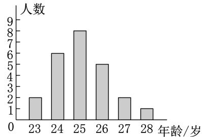  
第9题

10.某校规定学生的数学学期综合成绩是由平时、期中和期末三项成绩按 $3 : 3 : 4$ 的比计算所得的.若某学生本学期数学的平时、期中和期末成绩分别是 分 分和 分 则他本学期数学学期综合成绩是 分.

11.( ·北京改编)某学校举办的“青春飞扬”主题演讲比赛分为初赛和决赛两个阶段.初赛由 名教师评委和 名学生评委给每位选手打分 百分制 .对评委给某位选手的打分进行整理、描述和分析.下面给出了部分信息.

教师评委打分数据: , , , , , ,, , , .

学生评委打分 $_ { \mathcal { X } }$ (分)的频数分布直方图如图所示,已知数据分 组,第 组: $8 2 { \leqslant } x { \ < } 8 5$ ;第 组: $8 5 { \leqslant } x { \ < } 8 8$ ;第 组: $8 8 \leqslant x < 9 1$ ;第组: $9 1 { \leqslant } x { \ < } 9 4$ ;第 组: $9 4 { \leqslant } x { \ < } 9 7$ ;第 组:$9 7 { \leqslant } x { \leqslant } 1 0 0 .$ .

评委打分数据的平均数、中位数、众数如下表:

<table><tr><td rowspan=1 colspan=1></td><td rowspan=1 colspan=1>平均数</td><td rowspan=1 colspan=1>中位数</td><td rowspan=1 colspan=1>众数</td></tr><tr><td rowspan=1 colspan=1>教师评委</td><td rowspan=1 colspan=1>91</td><td rowspan=1 colspan=1>91</td><td rowspan=1 colspan=1>m</td></tr><tr><td rowspan=1 colspan=1>学生评委</td><td rowspan=1 colspan=1>90.8</td><td rowspan=1 colspan=1>n</td><td rowspan=1 colspan=1>93</td></tr></table>

根据以上信息 回答问题() $m$ 的值为 , $n$ 的值位于学生评委打分数据分组的第 组;

()若去掉教师评委打分中的最高分和最低分,记其余 名教师评委打分的平均数为 $\overline { { x } }$ 分,则 $\overline { { x } }$ (填“ ”“ ”或 $= ^ { \pmb { \mathscr { s } } }$ ).

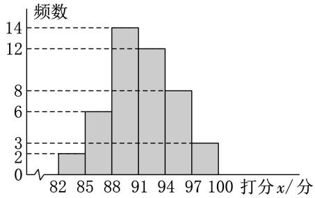  
第11题

12.为宣传世界海洋日,某校八年级举行了主题为“珍惜海洋资源,保护海洋生物多样性”的知识竞赛活动.为了解全年级 名学生此次竞赛成绩(百分制)的情况,随机抽取了部分参赛学生的成绩,整理并绘制出如下不完整的统计表和如图所示的不完整的统计图.请根据图表信息,解答下列问题:

()本次调查一共随机抽取了 名参 赛学生的成绩;

()表中 $a = \_$ ()所抽取的参赛学生的成绩的中位数落在的“组别”是 ;

()请你估计该校八年级竞赛成绩达到 分以上(含 分)的学生人数.

<table><tr><td rowspan=1 colspan=1>组别</td><td rowspan=1 colspan=1>成绩x/分</td><td rowspan=1 colspan=1>频数</td></tr><tr><td rowspan=1 colspan=1>A</td><td rowspan=1 colspan=1>60≤x&lt;70</td><td rowspan=1 colspan=1>a</td></tr><tr><td rowspan=1 colspan=1>B</td><td rowspan=1 colspan=1>70≤x&lt;80</td><td rowspan=1 colspan=1>10</td></tr><tr><td rowspan=1 colspan=1>C</td><td rowspan=1 colspan=1>80≤x&lt;90</td><td rowspan=1 colspan=1>14</td></tr><tr><td rowspan=1 colspan=1>D</td><td rowspan=1 colspan=1>90≤x≤100</td><td rowspan=1 colspan=1>18</td></tr></table>

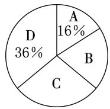  
第12题

13.今年植树节,某校开展了“植树造林,从我做起”的植树活动.该校参加本次植树活动的全体学生被分成了 个植树小组,按学校要求,每个植树小组至少植树 棵.经过一天的植树活动,校团委为了了解本次植树任务的完成情况,从这 个植树小组中随机抽查了个小组,并对这 个小组植树的棵数进行了统计 结果如图所示.

()求所统计的这组数据的中位数和平均数;()求抽查的这 个小组中,完成本次植树任务的小组所占的百分比;  
()在本次植树活动中,估计该校学生共植树多少棵.

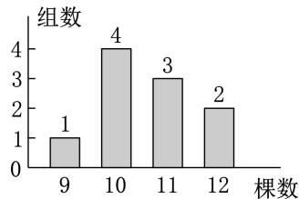  
第13题

# 价素养提升

14.某中学开展“唱青春之歌”比赛活动,八年级 ()班和八年级()班根据初赛成绩,各选出 名选手参加复赛,成绩如图所示.

()根据图中信息填写下表:

<table><tr><td rowspan=1 colspan=1>班乡级</td><td rowspan=1 colspan=1>中位数/分</td><td rowspan=1 colspan=1>众数/分</td></tr><tr><td rowspan=1 colspan=1>八年级(1)班</td><td rowspan=1 colspan=1></td><td rowspan=1 colspan=1></td></tr><tr><td rowspan=1 colspan=1>八年级(2)班</td><td rowspan=1 colspan=1></td><td rowspan=1 colspan=1></td></tr></table>

()通过计算得知八年级()班的平均成绩为分,请计算八年级()班的平均成绩;

()请结合两个班级复赛成绩的平均数和中 位数,分析哪个班级的复赛成绩好些.

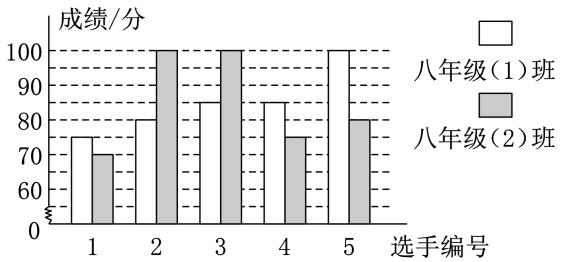  
第14题

# 24.2 数据的离散程度

# 基础达标

1.( ·上海)科学家同时培育了甲、乙、丙、丁 四种花,开花时长数据统计如下表.开花时长最 短的并且最平稳的花是 ( )

<table><tr><td rowspan=1 colspan=1>种类</td><td rowspan=1 colspan=1>甲种类</td><td rowspan=1 colspan=1>乙种类</td><td rowspan=1 colspan=1>丙种类</td><td rowspan=1 colspan=1>丁种类</td></tr><tr><td rowspan=1 colspan=1>平均数</td><td rowspan=1 colspan=1>2.3</td><td rowspan=1 colspan=1>2.3</td><td rowspan=1 colspan=1>2.8</td><td rowspan=1 colspan=1>3.1</td></tr><tr><td rowspan=1 colspan=1>方差</td><td rowspan=1 colspan=1>1. 05</td><td rowspan=1 colspan=1>0.78</td><td rowspan=1 colspan=1>1. 05</td><td rowspan=1 colspan=1>0.78</td></tr></table>

甲种类 乙种类 丙种类 丁种类

2.( ·广元)在某文艺晚会节目评选中,某班选送的节目得分(单位:分)如下: , , , ,, , .分析这组数据,下列说法错误的是( )

中位数是 方差是众数是 平均数是

3.如图,比较 组、 组中两组数据的平均数及方差,下列说法正确的是 ( )

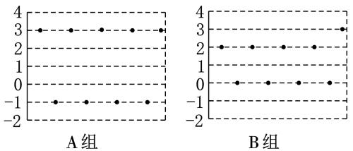  
第3题

组、 组的平均数及方差分别相等组、 组的平均数相等, 组的方差大组的平均数、方差比 组大组、 组的平均数相等, 组的方差大

4.一组数据 $x _ { 1 } , x _ { 2 } , x _ { 3 } , \cdots , x _ { n }$ 的方差是 $a$ ,平均数是 $b$ ,则另一组数据 $3 x _ { 1 } + 2 , 3 x _ { 2 } + 2 , 3 x _ { 3 } +$ $2 , \cdots , 3 x _ { n } + 2$ 的方差和平均数分别是 ( )

A. $a , b$ B. $9 a , 3 b + 2$   
C. $3 b , 2 a$ D. $3 a + 2 , b + 2$

5.已知一组数据 $7 , 2 , 5 , x , 8$ 的平均数是 ,则这组数据的方差为

6.( ·遂宁)体育老师要在甲和乙两人中选择人参加篮球投篮大赛,下表是两人 次训练成绩,从稳定性的角度考虑,老师应该选

参加比赛(填“甲”或“乙”).

<table><tr><td rowspan=1 colspan=1>甲</td><td rowspan=1 colspan=1>8</td><td rowspan=1 colspan=1>8</td><td rowspan=1 colspan=1>7</td><td rowspan=1 colspan=1>9</td><td rowspan=1 colspan=1>8</td></tr><tr><td rowspan=1 colspan=1>乙</td><td rowspan=1 colspan=1>6</td><td rowspan=1 colspan=1>9</td><td rowspan=1 colspan=1>7</td><td rowspan=1 colspan=1>9</td><td rowspan=1 colspan=1>9</td></tr></table>

7.今年某果园随机从甲、乙、丙三个品种的枇杷树中各选了 棵,每棵产量的平均数 $\overline { { x } }$ (千克)及方差 $s ^ { 2 }$ (千克2)如下表所示:

<table><tr><td rowspan=1 colspan=1>品种</td><td rowspan=1 colspan=1>甲</td><td rowspan=1 colspan=1>乙</td><td rowspan=1 colspan=1>丙</td></tr><tr><td rowspan=1 colspan=1>x/千克</td><td rowspan=1 colspan=1>45</td><td rowspan=1 colspan=1>45</td><td rowspan=1 colspan=1>42</td></tr><tr><td rowspan=1 colspan=1>s²/千克²</td><td rowspan=1 colspan=1>1.8</td><td rowspan=1 colspan=1>2.3</td><td rowspan=1 colspan=1>1.8</td></tr></table>

明年准备从这三个品种中选出一种产量既高又稳定的枇杷树进行种植,则应选的品种是(填“甲”“乙”或“丙”).

8.为了比较甲、乙两种水稻的长势,农技人员从两块试验田中 分别随机抽取了 棵 将测得的数据绘制成如图所示的统计图.请你根据统计图所提供的信息,计算平均数和方差,并比较两种水稻的长势.

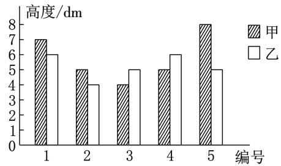  
第 题

9.在某旅游景区上山的一条小路上,有一些断断续续的台阶.如图所示为其中的甲、乙两段台阶路的示意图,图中的数表示每一级台阶的高度(单位: $\mathrm { c m } , \mathrm { \ ' }$ ),请你用所学过的有关统计的知识回答下列问题 数据 , , , , , 的方差 $s _ { \mathbb { H } } ^ { 2 } = \frac { 2 } { 3 }$ ,数据 , , , , , 的方差$s _ { \mathsf { Z } } ^ { 2 } = { \frac { 3 5 } { 3 } } { \bigg ) } :$

()分别求甲、乙两段台阶路台阶高度的平均数.哪段台阶路走起来更舒服 与哪个数据 平均数、中位数、方差)有关?()为方便游客行走,需要重新整修上山的小路 对于这两段台阶路 在总高度及台阶数不变的情况下 请你提出合理的整修建议.

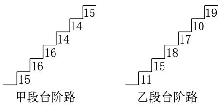  
第9题

10.某校团委在八、九年级各抽取 名团员开展知识竞赛,为便于统计成绩,制定了取整数的计分方式,满分 分,得到如下图表:

<table><tr><td rowspan=1 colspan=1></td><td rowspan=1 colspan=1>众数/分</td><td rowspan=1 colspan=1>中位数/分</td><td rowspan=1 colspan=1>方差/分²</td></tr><tr><td rowspan=1 colspan=1>八年级</td><td rowspan=1 colspan=1>7</td><td rowspan=1 colspan=1>b</td><td rowspan=1 colspan=1>1.88</td></tr><tr><td rowspan=1 colspan=1>九年级</td><td rowspan=1 colspan=1>a</td><td rowspan=1 colspan=1>8</td><td rowspan=1 colspan=1>1.56</td></tr></table>

()请通过计算说明哪个年级的平均成绩比较好.

请根据图表中的信息 回答问题.

$\textcircled{1}$ 表中的 $a = \_$ ， $b = \_$ ：

$\textcircled{2}$ 现要给成绩突出的年级颁奖,如果分别从众数和方差两个角度来分析 那么应该给哪个年级颁奖?

()若规定成绩为 分获一等奖, 分获二等奖, 分获三等奖,则哪个年级的获奖率高?

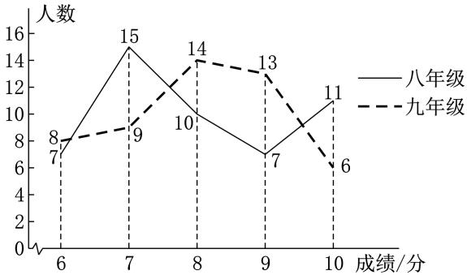  
第10题

11.一分钟投篮测试规定 得 分及以上为合格得 分及以上为优秀,甲、乙两组同学的一次测试成绩如下表:

<table><tr><td rowspan=1 colspan=1>成绩/分</td><td rowspan=1 colspan=1>4</td><td rowspan=1 colspan=1>5</td><td rowspan=1 colspan=1>6</td><td rowspan=1 colspan=1>7</td><td rowspan=1 colspan=1>8</td><td rowspan=1 colspan=1>9</td></tr><tr><td rowspan=1 colspan=1>甲组人数</td><td rowspan=1 colspan=1>1</td><td rowspan=1 colspan=1>2</td><td rowspan=1 colspan=1>5</td><td rowspan=1 colspan=1>2</td><td rowspan=1 colspan=1>1</td><td rowspan=1 colspan=1>4</td></tr><tr><td rowspan=1 colspan=1>乙组人数</td><td rowspan=1 colspan=1>1</td><td rowspan=1 colspan=1>1</td><td rowspan=1 colspan=1>4</td><td rowspan=1 colspan=1>5</td><td rowspan=1 colspan=1>2</td><td rowspan=1 colspan=1>2</td></tr></table>

()请你根据上述统计数据,把下表和如图 $\textcircled{1}$ 所示的统计图补充完整(合格率和优秀率精确到 $0 . 1 \%$ ).

一分钟投篮测试成绩分析表  

<table><tr><td rowspan=1 colspan=1>组别</td><td rowspan=1 colspan=1>平均数/分</td><td rowspan=1 colspan=1>方差/分²</td><td rowspan=1 colspan=1>中位数/分</td><td rowspan=1 colspan=1>合格率</td><td rowspan=1 colspan=1>优秀率</td></tr><tr><td rowspan=1 colspan=1>甲组</td><td rowspan=1 colspan=1></td><td rowspan=1 colspan=1>2.56</td><td rowspan=1 colspan=1>6</td><td rowspan=1 colspan=1>80.0%</td><td rowspan=1 colspan=1>26.7%</td></tr><tr><td rowspan=1 colspan=1>乙组</td><td rowspan=1 colspan=1>6.8</td><td rowspan=1 colspan=1>1. 76</td><td rowspan=1 colspan=1></td><td rowspan=1 colspan=1>86.7%</td><td rowspan=1 colspan=1>13.3%</td></tr></table>

()小明和小慧的一段对话如图 $\textcircled{2}$ 所示,请你根据()中的表,写出两条支持小慧的观点的理由.

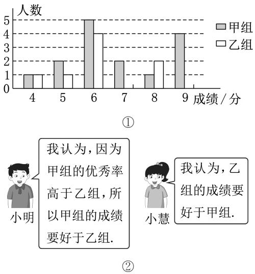  
一分钟投篮测试成绩统计图

# 素养提升

12.为选派一名同学参加全市实践活动技能竞赛,, 两名同学在校实习基地现场进行加工直径为 $2 0 \mathrm { m m }$ 的零件的测试,他们各加工的 个零件的相关数据依次如下图表所示:

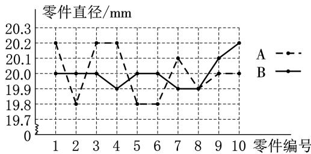

第12题  

<table><tr><td rowspan=1 colspan=1></td><td rowspan=1 colspan=1>平均数/mm</td><td rowspan=1 colspan=1>方差/mm²</td><td rowspan=1 colspan=1>完全符合要求的个数</td></tr><tr><td rowspan=1 colspan=1>A</td><td rowspan=1 colspan=1>20</td><td rowspan=1 colspan=1>0.026</td><td rowspan=1 colspan=1>2</td></tr><tr><td rowspan=1 colspan=1>B</td><td rowspan=1 colspan=1>20</td><td rowspan=1 colspan=1>s</td><td rowspan=1 colspan=1>5</td></tr></table>

根据测试得到的有关数据,解答下列问题:

()考虑平均数与完全符合要求的个数,你认为 同学的成绩好些(填“ ”或“”).

()计算出 $s _ { \mathrm { B } } ^ { 2 }$ 的值,从平均数与方差的角度,说明谁的成绩好一些.

()考虑图中折线走势及竞赛中加工零件个数远远超过 的实际情况 你认为派谁去参加比赛较合适 说明你的理由.

# 24.3 数据的四分位数

# 基础达标

正确的是

1.( ·重庆模拟)从小到大排列的一组数据:80,86,90,96,110,120,126,134,则这组数据的下四分位数为 ( )

A.88 B.90   
C.123 D.126

2.( ·南阳期末)某赛季篮球运动员甲参加了场比赛,每场比赛个人得分(单位:分)分别为 , , , , , , , , , , , ,.该组数据的四分位数分别为, , , ,, , D.24.5,35,40

3.( ·温州模拟)已知 名学生的期中考试数学成绩数据分别为 $9 8 , 1 1 0 , m$ , ,且上四分位数为 ,则 $m$ 的值为 ( )

A.115 B.116   
C.117 D.118

4.( ·宁夏)某班 名学生参加一分钟跳绳测试,成绩(单位:次)如下表:

<table><tr><td rowspan=1 colspan=1>成绩</td><td rowspan=1 colspan=1>171及以下</td><td rowspan=1 colspan=1>172</td><td rowspan=1 colspan=1>173</td><td rowspan=1 colspan=1>174</td><td rowspan=1 colspan=1>175及以上</td></tr><tr><td rowspan=1 colspan=1>人数</td><td rowspan=1 colspan=1>3</td><td rowspan=1 colspan=1>8</td><td rowspan=1 colspan=1>6</td><td rowspan=1 colspan=1>5</td><td rowspan=1 colspan=1>2</td></tr></table>

则本次测试成绩数据的第二四分位数是(

A.172 B.172.5   
C.173 D.5

5.( ·芜湖期末)在统计学中经常用一组数据的最小值、下四分位数、中位数、上四分位数和最大值画出箱线图来反映数据的分布情况.如图 $\textcircled{1}$ ,在箱线图中,位于最下面和最上面的实横线分别表示下边缘(最小值)和上边缘(最大值),中间箱体的底端是下四分位数,箱体内部的实横线表示中位数, $x$ ”表示平均数,箱体的顶端是上四分位数.异常值是明显偏离样本的个别值.已知甲班和乙班人数相等,在一次考试中两班成绩的箱线图如图 $\textcircled{2}$ 所示,则下列说法甲班成绩比乙班成绩集中甲班成绩的上四分位数是 分甲班有同学的成绩超过 分甲班的平均分高于乙班的平均分

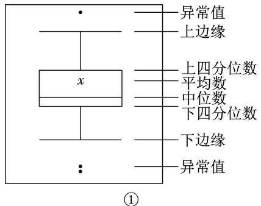

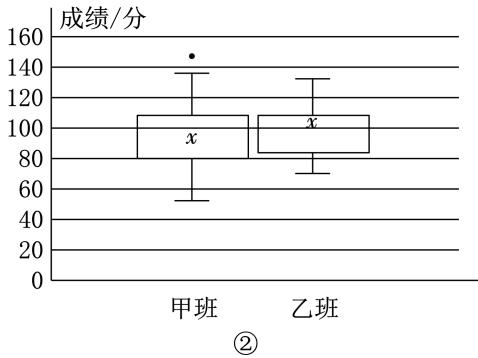  
第5题

6.( ·湖北模拟)已知一组数据 , , ,, , , ,,,,,,则它们的上四分位数为

7.( ·南充)已知一组数据: $6 , 6 , m , 7 , 7 , 8 .$ .若这组数据的众数为 则这组数据的中位数为

8.如图是根据某班 名同学一周的体育锻炼情况绘制的统计图,该班 名同学一周参加体育锻炼时间数据的中位数是 ,上四分位数是

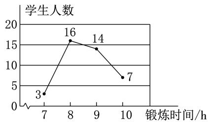  
第8题

9.以下数据是从某校八年级一次数学测试中随机抽取的 名同学的成绩(单位:分):

28 60 44 81 68 33 70 88 39 21   
92 51 77 55 96 88 44 28 37 59   
93 78 97 65 34 88 43 57 13 30   
94 80 48 52 65 54 92 80 51 82

请根据以上数据估计该校八年级这次数学测试成绩的四分位数 并根据四分位数对这次数学测试成绩进行分析.

10.( ·安徽模拟)箱线图是用来表示一组或多组数据分布情况的统计图,因形似箱子而得名.在箱线图中(如图 $\textcircled{1}$ ),箱体中部的实线表示中位数;中间箱体的上、下底,分别是数据的上四分位数和下四分位数;整个箱体的高度为四分位距;位于最下面和最上面的实横线分别表示最小值和最大值(有时候箱子外部会有一些点,它们是数据中的异常值).图 $\textcircled{2}$ 为某地区年 月和 月的空气质量指数( )箱线图 值越小,空气质量越好; 值超过 ,说明污染严重

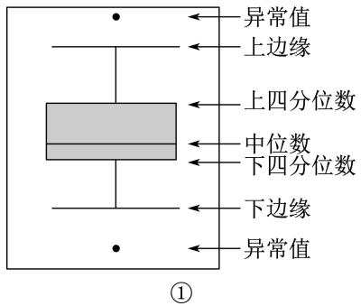

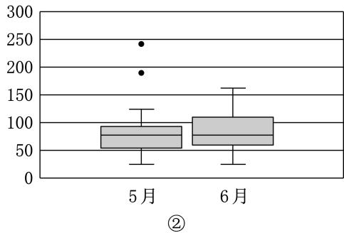  
某地区空气质量指数(AQI)的箱线图  
第10题

给出下列结论: $\textcircled{1}$ 该地区 年 月有严重污染天气; $\textcircled{2}$ 该地区 年 月的 值比月的 值集中; $\textcircled{3}$ 该地区 年 月的值比 月的 值集中; $\textcircled{4}$ 从整体上看 该地区 年 月的空气质量略好于月.试就这四条结论的正确性加以分析.

11.在一次人才招聘会上,有一家公司的招聘员告诉你:“我们公司的收入水平很高.去年,在名员工中,最高年收入达到了 万元,员工年收入的平均数是 万元.”而你的预期是获得 万元年薪.

()你是否能够判断年薪为 万元的员工在这家公司算高收入者? 为什么?

如果招聘员继续告诉你 员工年收入的变化范围是从 万元到 万元.”这个信息是否足以使你作出自己是否受聘的决定? 为什么?

如果招聘员继续给你提供了如下信息 员工收入的第一四分位数为 . 万元 第三四分位数为 . 万元,你又该如何使用这条信息来作出是否受聘的决定?

()根据()中招聘员提供的信息,你能估计出这家公司员工年收入的第二四分位数是多少吗? 为什么平均数比估计出的第二四分位数高很多?

# 素养提升

12.如图所示为 名学生参加数学竞赛的成绩,并由小到大排列.这组数据的四分位数依次为

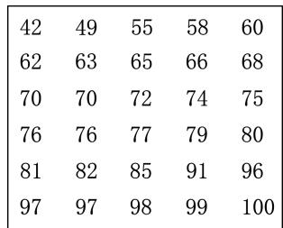  
第12题

13.甲、乙两组的测试成绩数据如下:甲: , , , , , , , , , ;乙: , , , , , , , , , .

()求甲组数据的四分位数;

()根据四分位数可绘制如图所示的箱线图, 观察图中乙组的箱线图,绘制甲组的箱线图;

()根据箱线图和对四分位数的理解,谈谈你 对两组成绩的看法.

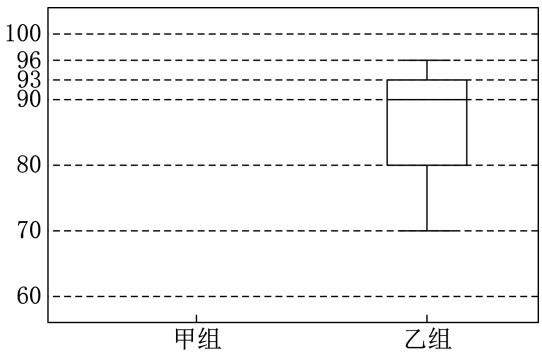  
第13题

# 24.4 数据的分组

# 基础达标

1.在某校举办的学习强国演讲比赛中,六位评委给小华的评分(单位:分)分别为 ,.,.,.,.,,则小华此次演讲比赛得分数据的离差平方和为 ( )

A.1.5 B.2.5 C.3.5 D.4.5

2.“爱护环境,人人有责.”为减少塑料垃圾袋的使用,小明统计了他家某一周每天使用塑料垃圾袋的数量(单位:个):,,,,,,.对这组数据说法错误的是 ( )

众数是 平均数是离差平方和是 方差是

3.小庆、小铁、小娜、小萌四名同学均从 ,,,,这五个数字中选出四个数字,求其离差平方和,他们求出的结果不正确的是 ( )

A.10 B.8.75 C.5 D.4

4.已知一组数据中各数据与这组数据的平均数的差的平方和,即离差平方和是 $( x _ { 1 } - \overline { { x } } ) ^ { 2 } + ( x _ { 2 } -$ ${ \overline { { x } } } ) ^ { 2 } + \cdots + ( x _ { 1 0 } - { \overline { { x } } } ) ^ { 2 } = 5 0$ ,则这组数据的方差为 ( )

A.50 B. $\sqrt { 5 0 }$ C.5 D. $\sqrt { 5 }$

5.一个小组共有 名学生,在体育课的一次“定位投篮”的测试中,他们投中个数分别为 , ,,,,,这 名学生测试成绩的离差平方和为

6.若数据 $3 , a , 3 , 5 , 3$ 的平均数是 ,则这组数据的众数是 , $a$ 的值是 ,离差平方和是

7.若把 ,,, 分成 , 和 , 两组,则它们的组内离差平方和为

8.若一组数据 $1 , 4 , 6 , x , 5 , 5 , 9$ 的平均数是 ,则这组数据的四分位数分别是 ,离差平方和是

9.某小组的五名同学的身高(单位: )分别为.把这 个数据从小到大排列后进行了分组,前 个数据分成一组,后个数据分成另一组.求:

()组内离差平方和;  
()组间离差平方和.

10.有多种方法可以对数据进行分组,但是,使得组内离差平方和最小 的方法是最传统的 也是最合理的.下表是把 ,,,, 这 个数据从小到大排列后进行了分组.

<table><tr><td rowspan=1 colspan=2>分组情况</td><td rowspan=2 colspan=1>组内离差平方和</td><td rowspan=2 colspan=1>组间离差平方和</td><td rowspan=2 colspan=1>离差平方和</td></tr><tr><td rowspan=1 colspan=1>第一组数据</td><td rowspan=1 colspan=1>第二组数据</td></tr><tr><td rowspan=1 colspan=1>1</td><td rowspan=1 colspan=1>2,3,4,5</td><td rowspan=1 colspan=1>5</td><td rowspan=1 colspan=1>5</td><td rowspan=1 colspan=1>10</td></tr><tr><td rowspan=1 colspan=1>1,2</td><td rowspan=1 colspan=1>3,4,5</td><td rowspan=1 colspan=1>a</td><td rowspan=1 colspan=1>b</td><td rowspan=1 colspan=1>10</td></tr><tr><td rowspan=1 colspan=1>1,2,3</td><td rowspan=1 colspan=1>4,5</td><td rowspan=1 colspan=1>C</td><td rowspan=1 colspan=1>d</td><td rowspan=1 colspan=1>10</td></tr><tr><td rowspan=1 colspan=1>1,2,3,4</td><td rowspan=1 colspan=1>5</td><td rowspan=1 colspan=1>5</td><td rowspan=1 colspan=1>5</td><td rowspan=1 colspan=1>10</td></tr></table>

根据分组的情况请直接写出 $a , b , c , d$ 的值,并说明如何分组比较合理.

11.艺术测评主要是为掌握学生艺术素养发展状况,改进美育教学.某校根据义务教育阶段音乐、美术等学科的课程标准,在九年级随机抽取了若干名同学进行艺术测评与分析,下面是对九年级 班抽测到的 名同学的测评分值的数据分析过程:

【收集与整理】 名同学的测评分值分组统计如下:

<table><tr><td rowspan=1 colspan=1>分组方式</td><td rowspan=1 colspan=1>组别</td><td rowspan=1 colspan=1>测评分值</td></tr><tr><td rowspan=2 colspan=1>方式一(按平均分相同分组)</td><td rowspan=1 colspan=1>I组</td><td rowspan=1 colspan=1>80，85，85，90，100</td></tr><tr><td rowspan=1 colspan=1>Ⅱ组</td><td rowspan=1 colspan=1>80，85，90，90,95</td></tr><tr><td rowspan=2 colspan=1>方式二(按分数段分组)</td><td rowspan=1 colspan=1>甲组</td><td rowspan=1 colspan=1>80,80,85，85，85</td></tr><tr><td rowspan=1 colspan=1>乙组</td><td rowspan=1 colspan=1>90,90,90，95，100</td></tr></table>

【描述与分析】分组数据统计量分析表:

<table><tr><td rowspan=1 colspan=1>分组方式</td><td rowspan=1 colspan=1>组别别</td><td rowspan=1 colspan=1>中位数</td><td rowspan=1 colspan=1>众数方差</td><td rowspan=1 colspan=1>众数方差</td><td rowspan=1 colspan=1>组内离差平方和</td></tr><tr><td rowspan=2 colspan=1>方式一</td><td rowspan=1 colspan=1>I组</td><td rowspan=1 colspan=1>m</td><td rowspan=1 colspan=1>85</td><td rowspan=1 colspan=1>46</td><td rowspan=2 colspan=1>360</td></tr><tr><td rowspan=1 colspan=1>Ⅱ组</td><td rowspan=1 colspan=1>90</td><td rowspan=1 colspan=1>90</td><td rowspan=1 colspan=1>26</td></tr><tr><td rowspan=2 colspan=1>方式二</td><td rowspan=1 colspan=1>甲组</td><td rowspan=1 colspan=1>85</td><td rowspan=1 colspan=1>85</td><td rowspan=1 colspan=1>6</td><td rowspan=2 colspan=1>110</td></tr><tr><td rowspan=1 colspan=1>乙组</td><td rowspan=1 colspan=1>90</td><td rowspan=1 colspan=1>n</td><td rowspan=1 colspan=1>16</td></tr><tr><td rowspan=1 colspan=6>说明：组内离差平方和表达了各小组内数据的离散程度.它的值越小，说明这种分组方式中同组成员之间的水平越接近</td></tr></table>

根据以上信息,解答下列问题:

()如图,扇形统计图中“ 分”对应的圆心 角度数为 ;

(2)m= ,n

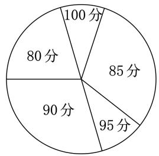  
10名同学测评分值的扇形统计图  
第11题

# 【判断与决策】

为深入推进小组学习 促进同学间的互帮

互助、共同进步,请你根据以上信息,选择一种利于开展小组学习的分组方式,并说明你这样选择的理由.

# 素养提升

12.某日 时八个城市的气温如下表(温度由低到高排序):

<table><tr><td rowspan=1 colspan=1>城市</td><td rowspan=1 colspan=1>拉萨</td><td rowspan=1 colspan=1>西宁</td><td rowspan=1 colspan=1>贵阳</td><td rowspan=1 colspan=1>福州</td></tr><tr><td rowspan=1 colspan=1>温度/℃</td><td rowspan=1 colspan=1>19</td><td rowspan=1 colspan=1>20</td><td rowspan=1 colspan=1>23</td><td rowspan=1 colspan=1>27</td></tr><tr><td rowspan=1 colspan=1>城1市</td><td rowspan=1 colspan=1>广州</td><td rowspan=1 colspan=1>杭州</td><td rowspan=1 colspan=1>南京</td><td rowspan=1 colspan=1>上海</td></tr><tr><td rowspan=1 colspan=1>温度/℃</td><td rowspan=1 colspan=1>29</td><td rowspan=1 colspan=1>30</td><td rowspan=1 colspan=1>31</td><td rowspan=1 colspan=1>32</td></tr></table>

()将八个城市分为两组,共有七种情况(七个间隔 试填写下表中的空格 结果保留小数点后一位).

()根据组内离差平方和最小的原则,把八个城市分为两组,应如何分组?

()结合地理知识,谈谈()中分组方法的合理性.

<table><tr><td rowspan=1 colspan=1>分组</td><td rowspan=1 colspan=1>第一组离差平方和</td><td rowspan=1 colspan=1>第二组离差平方和</td><td rowspan=1 colspan=1>组内离差平方和</td></tr><tr><td rowspan=1 colspan=1>第1个间隔</td><td rowspan=1 colspan=1>0</td><td rowspan=1 colspan=1>117.7</td><td rowspan=1 colspan=1>117. 7</td></tr><tr><td rowspan=1 colspan=1>第2个间隔</td><td rowspan=1 colspan=1>0.5</td><td rowspan=1 colspan=1>53.3</td><td rowspan=1 colspan=1>53.8</td></tr><tr><td rowspan=1 colspan=1>第3个间隔</td><td rowspan=1 colspan=1>8.7</td><td rowspan=1 colspan=1>14.8</td><td rowspan=1 colspan=1>23.5</td></tr><tr><td rowspan=1 colspan=1>第4个间隔</td><td rowspan=1 colspan=1></td><td rowspan=1 colspan=1></td><td rowspan=1 colspan=1></td></tr><tr><td rowspan=1 colspan=1>第5个间隔</td><td rowspan=1 colspan=1>75.2</td><td rowspan=1 colspan=1>2.0</td><td rowspan=1 colspan=1>77.2</td></tr><tr><td rowspan=1 colspan=1>第6个间隔</td><td rowspan=1 colspan=1>109.3</td><td rowspan=1 colspan=1>0.5</td><td rowspan=1 colspan=1>109.8</td></tr><tr><td rowspan=1 colspan=1>第7个间隔</td><td rowspan=1 colspan=1>143.7</td><td rowspan=1 colspan=1>0</td><td rowspan=1 colspan=1>143. 7</td></tr></table>

# 第二十四章特训

# 一、选择题

1.( ·宜宾)一组数据 ,,,,a 的平均数为,则 $a$ 的值是 ( )

B.8 D.10

2.数据 ,, ,,, 的下四分位数为 ( )

A.5 B.6 C.7 D.10

3.数据 ,,,, 的离差平方和为

A.2 B.3 C.10 D. $\sqrt { 1 0 }$

4. ·乐山 某学校食堂有 元 元和 元三种价格的午餐供师生选择 每人限定一份月销售情况如图所示 则师生购买午餐的平均价格为 ( )

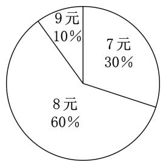  
第4题

. 元 . 元 元 . 元

5. ·广元 为用好红色资源 讲好红色故事李老师安排了 名学生收集红色文化书籍 他们收集到的红色文化书籍本数如下表:

<table><tr><td rowspan=1 colspan=1>书籍本数</td><td rowspan=1 colspan=1>2</td><td rowspan=1 colspan=1>3</td><td rowspan=1 colspan=1>4</td><td rowspan=1 colspan=1>5</td><td rowspan=1 colspan=1>6</td></tr><tr><td rowspan=1 colspan=1>人数</td><td rowspan=1 colspan=1>2</td><td rowspan=1 colspan=1>2</td><td rowspan=1 colspan=1>2</td><td rowspan=1 colspan=1>3</td><td rowspan=1 colspan=1>1</td></tr></table>

下列关于书籍本数的描述正确的是众数是 平均数是中位数是 方差是

6.( ·烟台)求一组数据方差的算式为 $s ^ { 2 } =$ $\frac { 1 } { n } \times [ ( 6 - \overline { { x } } ) ^ { 2 } + ( 8 - \overline { { x } } ) ^ { 2 } + ( 8 - \overline { { x } } ) ^ { 2 } + ( 6 -$ ${ \overline { { x } } } ) ^ { 2 } + ( 7 - { \overline { { x } } } ) ^ { 2 } ]$ .由算式提供的信息，下列说法错误的是 ( )

A. $n$ 的值是该组数据的平均数是该组数据的众数是若该组数据加入两个数 ,,则这组新数据的方差变小

# 二、填空题

7.( ·青岛)为弘扬传统文化、培养学生的劳动意识,某校在端午节期间举行了包粽子活动,每个粽子的标准质量为 $1 0 0 \ \mathrm { g } .$ .甲、乙两名同学各包了 个粽子,每个粽子的质量(单位:)如下:甲: , , , , ;乙: , , , , .甲、乙两名同学包的粽子的质量比较稳定的是(填“甲”或“乙”).

8.( ·德阳)某校拟招聘一名优秀的数学教师,设置了笔试、面试、试讲三项水平测试,综合成绩按照笔试占 $30 \%$ ,面试占 $30 \%$ ,试讲占$40 \%$ 进行计算.小徐的三项测试成绩如图所示,则她的综合成绩为 分.

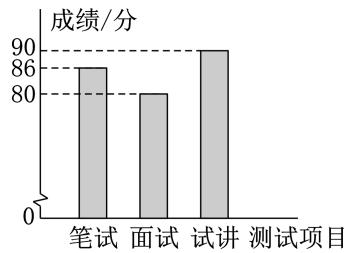  
第8题

9.( ·福建)某公司为选拔英语翻译员,举行听、说、读、写综合测试,其中听、说、读、写各项成绩(百分制)按 $4 : 3 : 2 : 1$ 的比计算最终成绩.参与选拔的甲、乙两名员工的听、说、读、写各项测试成绩及最终成绩(单位:分)如表:

<table><tr><td rowspan=1 colspan=1>员  工</td><td rowspan=1 colspan=1>听</td><td rowspan=1 colspan=1>说</td><td rowspan=1 colspan=1>读</td><td rowspan=1 colspan=1>写</td><td rowspan=1 colspan=1>最终成绩</td></tr><tr><td rowspan=1 colspan=1>甲</td><td rowspan=1 colspan=1>A</td><td rowspan=1 colspan=1>70</td><td rowspan=1 colspan=1>80</td><td rowspan=1 colspan=1>90</td><td rowspan=1 colspan=1>82</td></tr><tr><td rowspan=1 colspan=1>乙</td><td rowspan=1 colspan=1>B</td><td rowspan=1 colspan=1>90</td><td rowspan=1 colspan=1>80</td><td rowspan=1 colspan=1>70</td><td rowspan=1 colspan=1>82</td></tr></table>

由以上信息,可以判断 , 的大小关系是A (填 $>$ ”“ ”或 $= ^ { \pmb { \mathscr { s } } }$ ”).

10.( ·甘孜)在完成劳动课布置的“青稞生长状态观察”的实践作业时,需要测量青稞的穗长.同学们查阅资料得知:由于受仪器精度和观察误差影响, $n$ 次测量会得到 $n$ 个数据 $a _ { 1 }$ ,$a _ { 2 } , \cdots , a _ { n }$ .若 $a$ 与各个测量数据的差的平方和最小,则将 $a$ 作为测量结果的最佳近似值.若名同学对某株青稞的穗长测量得到的数据分别是 .,.,.,.,.,则这株青稞穗长的最佳近似值为

# 三、解答题

11.如图所示为由甲、乙两组数据分别得到的箱线图.试根据图中信息回答下列问题:

()比较两组数据的中位数;

()比较两组数据的波动大小;

比较两组数据的最大值.

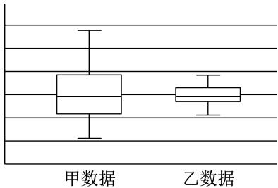  
第11题

12.( ·辽宁)种下绿色希望,建设美丽辽宁.某学校学生积极参与春季义务植树活动,在活动结束后,该学校为了解八年级学生植树棵数的情况,随机抽取若干名八年级参加植树的学生,统计每人的植树棵数,并对数据进行整理、描述和分析,部分信息如下图表:

抽取的八年级学生植树棵数的人数统计表  

<table><tr><td rowspan=1 colspan=1>棵数</td><td rowspan=1 colspan=1>1</td><td rowspan=1 colspan=1>2</td><td rowspan=1 colspan=1>3</td><td rowspan=1 colspan=1>4</td><td rowspan=1 colspan=1>5</td></tr><tr><td rowspan=1 colspan=1>人娄数</td><td rowspan=1 colspan=1>4</td><td rowspan=1 colspan=1>10</td><td rowspan=1 colspan=1>m</td><td rowspan=1 colspan=1>6</td><td rowspan=1 colspan=1>n</td></tr></table>

请根据以上信息,解答下列问题:

()求 $m , n$ 的值;

()求被抽取的八年级学生植树棵数的中位数;

()本次植树活动中,植树棵数不少于 的学生将被学校评为“绿动先锋”,该学校八年级有名学生参加了此次植树活动,请你估计这些学生中被评为“绿动先锋”的人数.

# 抽取的八年级学生植树棵数的人数扇形统计图

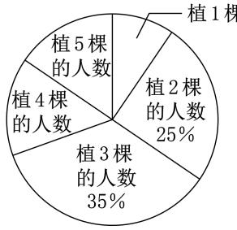  
第12题

13.( ·广西)某班需从甲、乙两名同学中推荐一人参加校史馆讲解员的选拔,班委决定从口头表达能力、思维能力、表现力、仪容仪表四项内容进行考查.全班同学投票确定了各项所占的百分比,结果如图 $\textcircled{1}$ 所示,再对甲、乙进行考查并逐项打分,成绩如图 $\textcircled{2}$ 所示.

()在所考查的四项内容中,甲比乙更具优势的有哪些?

()按照图 $\textcircled{1}$ 的各项占比计算甲、乙的综合成绩,并确定推荐人选.

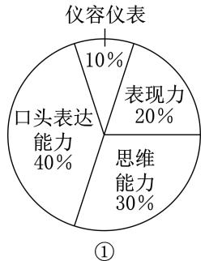

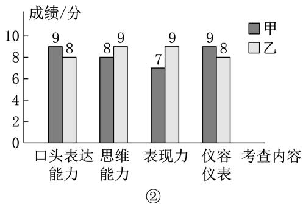  
第 题

14. ·青海 为了解学生物理实验操作情况随机抽取小青和小海两名同学的 次实验得分,并对他们的得分情况从以下两方面整理描述如下:

$\textcircled{1}$ 操作规范性:

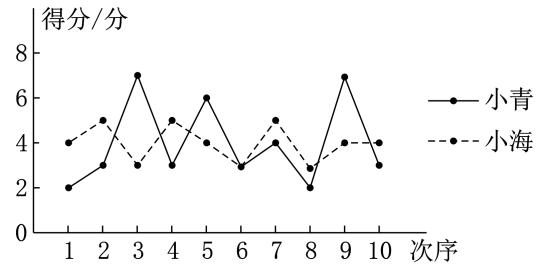  
第14题

$\textcircled{2}$ 书写准确性(单位:分):小青:,,,,,,,,,;小海:,,,,,,,,,.

操作规范性和书写准确性的得分数据统计表:

<table><tr><td rowspan=2 colspan=1>学生</td><td rowspan=1 colspan=2>操作规范性</td><td rowspan=1 colspan=2>书写准确性</td></tr><tr><td rowspan=1 colspan=1>平均数</td><td rowspan=1 colspan=1>方差</td><td rowspan=1 colspan=1>平均数</td><td rowspan=1 colspan=1>中位数</td></tr><tr><td rowspan=1 colspan=1>小青</td><td rowspan=1 colspan=1>4</td><td rowspan=1 colspan=1>s</td><td rowspan=1 colspan=1>1.8</td><td rowspan=1 colspan=1>a</td></tr><tr><td rowspan=1 colspan=1>小海</td><td rowspan=1 colspan=1>4</td><td rowspan=1 colspan=1>s</td><td rowspan=1 colspan=1>b</td><td rowspan=1 colspan=1>2</td></tr></table>

根据以上信息,回答下列问题:

()表格中的 $a = \_$ ,比较 $s _ { 1 } ^ { 2 }$ 和 $s _ { 2 } ^ { 2 }$ 的大小:

计算表格中 $b$ 的值综合上表的统计量 请你对两名同学的得分进行评价;

()为了取得更好的成绩,你认为在实验过程中还应该注意哪些方面?