# 附：答案与解析

# 第十九章 二次根式

# 19.1 二次根式及其性质

1. 2. 3. 4. 5. 6. 7.

8.() () . () $\frac { 5 } { 3 }$ () () () $3 - { \sqrt { 7 } }$

9. 10. 11. $m { \geqslant } 9$

12.由数轴,可知 $1 { < } a { < } 0 { < } b { < } 1$ ,则 $a + 1 > 0 , b - 1 < 0$ ,$a - b < 0 .$ ：原式 $= a + 1 + 2 - 2 b - b + a = 2 a - 3 b + 3$

13.() $- 2$ ()由题意,可得 $5 - y \geqslant 0 , y - 5 \geqslant 0 , \ \therefore \ y =$ . $\scriptstyle x ^ { 2 } = 0 + 0 + 4 = 4 , \therefore x = 2$ 或 x . $x + y = 2 +$ $5 = 7$ 或 $x + y = - 2 + 5 = 3$

14.由题意,知 $2 a - 4 \geqslant 0$ 且 $2 - a \geqslant 0$ ,解得 $a = 2 , \div b -$ $5 = 0$ 解得 $b = 5 .$ .由三角形的三边关系 易知腰长为 底边长为 , 该等腰三角形的周长为 $5 + 5 + 2 = 1 2$

15. $a , b , c$ 是 $\triangle A B C$ 的三边长 $a + b + c > 0 , b + c >$ a,c+a>b,a+b>c.:a+b-c>0,b-c-a<0,c-$a - b { < } 0 , \therefore$ 原式 $= \mid a + b + c \mid - \mid a + b - c \mid + \mid b - c -$ $a \mid - \mid c - a - b \mid = a + b + c - a - b + c - b + c + a + c - a -$ $b = - 2 b + 4 c$

# 19.2 二次根式的乘法与除法

1. 2. 3. 4. 5. 6. 7. 8.() $2 \sqrt { 6 }$ (2)3 (3) $4 x \sqrt { y }$ (4)2 9.(1)3 5 (2) $\frac { \sqrt { 6 m } } { 2 m }$

() 10. 11.

12.() $\sqrt { 2 6 }$ () () $\sqrt { 3 ( x - 1 ) }$ (4) $- \sqrt { 2 ( 7 m - 2 ) }$

9.当 $a = { \sqrt { 5 } } - 2$ 时, $a ^ { 2 } - ( { \sqrt { 5 } } + 2 ) a + 3 = ( { \sqrt { 5 } } - 2 ) ^ { 2 } -$ $( { \sqrt { 5 } } + 2 ) \times ( { \sqrt { 5 } } - 2 ) + 3 = 5 - 4 { \sqrt { 5 } } + 4 - ( 5 - 4 ) + 3 = 5 -$ $4 { \sqrt { 5 } } + 4 - 1 + 3 = 1 1 - 4 { \sqrt { 5 } }$

$1 0 , \ \because \ x$ 表示 $\sqrt { 4 7 }$ 的整数部分, $y$ 表示它的小数部分, $6 <$ $\sqrt { 4 7 } < 7 , \ : \dot { \bullet } , \ : x = 6 , y = \sqrt { 4 7 } - 6 , \ : \dot { \bullet } , \ : ( \ : \sqrt { 4 7 } + x ) y =$ $( { \sqrt { 4 7 } } + 6 ) \times ( { \sqrt { 4 7 } } - 6 ) = 4 7 - 3 6 = 1 1 .$ . 这个钱包里有元

11.剩余部分的面积为 $( 2 \sqrt { 3 } + 3 \sqrt { 5 } ) ^ { 2 } - ( 2 \sqrt { 3 } + \sqrt { 1 0 } ) \times$ $( { \sqrt { 6 } } - { \sqrt { 5 } } ) = ( 1 2 + 1 2 { \sqrt { 1 5 } } + 4 5 ) - ( 6 { \sqrt { 2 } } + 2 { \sqrt { 1 5 } } - 2 { \sqrt { 1 5 } } -$ ${ 5 \sqrt { 2 } } ) = ( { 5 7 + 1 2 \sqrt { 1 5 } - \sqrt { 2 } } ) \mathrm { c m } ^ { 2 }$

13.(1) $\frac { 7 } { 2 }$ () $- { \frac { 3 } { 4 } }$ (3)56 (4)-8y x

14.设圆形花坛的半径为 $r$ .由题意 得 $\pi r ^ { 2 } = \sqrt { 1 4 0 \pi } \times$ ${ \sqrt { 3 5 \pi } } = 7 0 \pi , { \stackrel { . } { \cdot } } , r ^ { 2 } = 7 0 . \ { \stackrel { . . } { \cdot } } \ r > 0 , { \stackrel { . . } { \cdot } } \ r = { \sqrt { 7 0 } } . \ .$ 这个圆形花坛的半径为 $\sqrt { 7 0 }$

15.()两名同学的解法都正确 ()答案不唯一,如 $\cdot { \sqrt { 1 0 } } = { \sqrt { \frac { 7 0 } { 7 } } } = { \frac { \sqrt { 7 0 } } { \sqrt { 7 } } } = { \frac { b } { a } } , \ \therefore \ { \sqrt { 4 . 9 } } = { \sqrt { \frac { 4 9 } { 1 0 } } } =$ ${ \sqrt { \frac { 4 9 \times 1 0 } { 1 0 \times 1 0 } } } = { \frac { 7 } { 1 0 } } { \sqrt { 1 0 } } = { \frac { 7 } { 1 0 } } \cdot { \frac { b } { a } } = { \frac { 7 b } { 1 0 a } }$

# 19.3 二次根式的加法与减法

1.D 2.B 3.B 4.D 5.(1) $\sqrt { 5 }$ (2) $\sqrt { 2 }$ (3) $\frac 1 3$

() 6. 7. $2 + 4 { \sqrt { 3 } }$

8.() $\sqrt { 3 }$ () () (4) $\frac { 3 1 } { 6 }$

(5) $2 \sqrt { 2 }$

$\begin{array}{c} { \begin{array} { r l } & { \| { \boldsymbol { \mathcal { X } } } ( \mathbf { x } ) \| _ { \infty } ^ { 2 } } \\ & { = { \frac { \| \mathbf { x } \| _ { \infty } ^ { 3 } } { \sqrt { 6 } } } \{ \begin{array} { l l } { 1 } & { 0 \leq x \leq 0 } \\ { 1 } & { 0 \leq x \leq { \frac { \| \mathbf { x } \| _ { \infty } ^ { 2 } } { \sqrt { 6 } } } } \\ { 2 } & { 0 \leq x \leq { \frac { \| \mathbf { x } \| _ { \infty } ^ { 3 } } { \sqrt { 6 } } } } \end{array}  \leq { \frac { \| \mathbf { x } \| _ { \infty } ^ { 2 } } { \sqrt { 6 } } } \{ \begin{array} { l l } { 1 \leq x ^ { 2 } } \\ { 2 } & { 0 \leq x \leq 1 } \\ { 3 } \end{array}  } \\ & { \quad + \| \mathbf { x } \| _ { \infty } ^ { 4 } } \\ & { \quad \leq x \leq 0 . 3 \{ \frac { \| \mathbf { x } \| _ { \infty } ^ { 3 } } { \sqrt { 6 } } } \end{array}  } \\ & { \quad + { \frac { \| \mathbf { x } \| _ { \infty } ^ { 4 } } { \sqrt { 6 } } } \{ \begin{array} { l l } { 1 } & { 0 \leq x \leq 0 } \\ { 2 } & { 0 \leq x \leq 1 } \\ { 3 } \end{array}  } \\ & { \quad + { \frac { \| \mathbf { x } \| _ { \infty } ^ { 4 } } { \sqrt { 6 } } } \{ \begin{array} { l l } { 1 } & { 0 \leq x \leq 1 } \\ { 2 } & { 0 \leq x \leq 1 } \\ { 3 } \end{array}  } \\ & { \quad \leq { \frac { \| \mathbf { x } \| _ { \infty } ^ { 3 } } { \sqrt { 6 } } } \end{array}  } \\ & { \| { \boldsymbol { \mathcal { X } } } ( \mathbf { x } ) \| _ { \infty } ^ { 2 } \{ \begin{array} { l l } { 1 } & { 0 \leq x \leq 0 } \\ { 2 } & { 0 \leq x \leq 0 } \\ { 3 } \end{array}  } \\ & { \| { \boldsymbol { \mathcal { X } } } ( \mathbf { x } ) \| _ { \infty } ^ { 2 } \{ \begin{array} { l l } { 1 } & { 0 \leq x \leq 0 } \\ { 2 } & { 0 \leq x \leq 0 } \\ { 2 } & { 0 \leq x \leq 1 } \end{array}  } \\ &  \quad \leq  \frac  \| \mathbf { x } \| _  $ $\frac { 2 \times ( 9 9 \sqrt { 9 7 } - 9 7 \sqrt { 9 9 } ) } { ( 9 9 \sqrt { 9 7 } + 9 7 \sqrt { 9 9 } ) \times ( 9 9 \sqrt { 9 7 } - 9 7 \sqrt { 9 9 } ) } = 1 - \frac { \sqrt { 3 } } { 3 } + \frac { \sqrt { 3 } } { 3 } -$ ${ \frac { \sqrt { 5 } } { 5 } } + { \frac { \sqrt { 5 } } { 5 } } - { \frac { \sqrt { 7 } } { 7 } } + \cdots + { \frac { \sqrt { 9 7 } } { 9 7 } } - { \frac { \sqrt { 9 9 } } { 9 9 } } = 1 - { \frac { \sqrt { 9 9 } } { 9 9 } } = 1 - { \frac { \sqrt { 1 1 } } { 3 3 } }$

# 第十九章特训

一、1. 2. 3. 4. 5. 6.

$$
= { \begin{array} { l l l l l l l l } { { \underline { { \mathbf { 7 . } } } } } & { 3 { \sqrt { 3 } } } & { \mathbf { 8 . } } & { - 2 { \sqrt { 3 } } } & { \mathbf { 9 . } } & { 6 4 } & { \mathbf { 1 0 . } } & { 4 } & { \mathbf { 1 1 . } } & { 2 { \sqrt { 2 } } } \end{array} }
$$

12. 解析 如图 连接 $F H { , } E G$ 交于点 $O _ { \ast }$ .根据题意 易知点 $O$ 为正方形 $A B C D$ 、正方形 EFGH 的中心. $S _ { \triangle E O F } =$ $\begin{array} { l } { { \frac { 1 } { 4 } S _ { \tt d E \tt d \% E E F G H } , \tt ~ E \tt d \tt ~ S _ { \tt d E \tt d \% E F F G H } = 4 S _ { \tt d E O F } . \ U ^ { * } S _ { \tt d i j \boxplus A M F E P } = } } \\ { { S _ { \tt d E \tt d \boxplus E E F G H } , \ \underbrace { : } _ { \tt d } S _ { \tt d E \tt d j \boxplus A B C D } \ = \ 5 S _ { \tt d E \tt d j \boxplus E F G H } , \ S _ { \tt d i j \boxplus A M F E P } \ = } } \end{array}$ $4 S _ { \triangle E O F }$ .∵ 易 得 $S _ { \bar { \pi } \dot { \Im } \bar { \mathcal { H } } A M F E P } = \frac { 1 } { 4 } S _ { \bar { \pi } \bar { \mathcal { H } } \bar { \mathcal { H } } A B C D } - S _ { \triangle E O F } ,$ · $\frac { 1 } { 4 } S _ { \tt I E \mathcal { H } \tt f A B C D } = 5 S _ { \triangle E O F } .$ 设正方形 ABCD 的边长为 $2 x$ 则易得 $O F { = } O E { = } x { - } a . \therefore { \frac { 1 } { 4 } } \cdot 2 x \bullet 2 x { = } { \frac { 5 } { 2 } } ( x { - } a ) ^ { 2 } ,$ 解得 (5± 10)a.∵ a= 10-2,∴ x= 10或x=$\frac { 7 \sqrt { 1 0 } - 2 0 } { 3 } . : \frac { 7 \sqrt { 1 0 } - 2 0 } { 3 } < \sqrt { 1 0 } - 2 , \therefore x = \sqrt { 1 0 } .$ .∴ $S _ { \scriptscriptstyle \mathrm { { \vec { 1 } E } \mathcal { \hat { H } } \vec { 1 } B C D } } = 2 \sqrt { 1 0 } \times 2 \sqrt { 1 0 } = 4 0 ,$ .∴ 这块正方形地砖的面积为 .

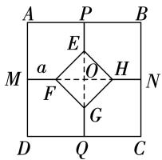  
第 题

三、13.() ()

14.()原式 $= x ^ { 2 } + 2 x + 1 - 2 x - 2 = x ^ { 2 } - 1 .$ .当 $x = \sqrt { 2 }$ 时,原式 $= 2 - 1 = 1$ 原式 $= { \frac { a ^ { 2 } - 1 } { a } } \cdot { \frac { a } { a - 1 } } = a + 1 .$ .当 $a =$ ${ \frac { \sqrt { 3 } } { 2 } } - 1$ 时,原式 $= \frac { \sqrt { 3 } } { 2 } - 1 + 1 = \frac { \sqrt { 3 } } { 2 }$

15.() $\frac { 2 } { 3 - \sqrt { 7 } } = \frac { 2 \times ( 3 + \sqrt { 7 } ) } { ( 3 - \sqrt { 7 } ) \times ( 3 + \sqrt { 7 } ) } = \frac { 2 \times ( 3 + \sqrt { 7 } ) } { 9 - 7 } = 3 +$ ( ) $a = { \frac { 1 } { 3 + 2 { \sqrt { 2 } } } } = { \frac { 3 - 2 { \sqrt { 2 } } } { ( 3 + 2 { \sqrt { 2 } } ) \times ( 3 - 2 { \sqrt { 2 } } ) } } =$ $\frac { 3 - 2 \sqrt { 2 } } { 9 - 8 } = 3 - 2 \sqrt { 2 } , \therefore a - 3 = - 2 \sqrt { 2 } . \therefore ( a - 3 ) ^ { 2 } = 8 ,$ ,即 $a ^ { 2 } - 6 a + 9 = 8 , \ \div \ a ^ { 2 } - 6 a = - 1 , \ \div \ 3 a ^ { 2 } - 1 8 a = - 3 .$ . $\therefore 3 a ^ { 2 } - 1 8 a + 1 = - 3 + 1 = - 2$

16.() $\begin{array} { r l r } { 9 + 2 \sqrt { 3 } } & { { } } & { 1 5 + 2 \sqrt { 3 } } \end{array}$ 解析: $S _ { 3 } - S _ { 2 } = ( a +$ $2 { \sqrt { b } } ) ^ { 2 } - ( a + { \sqrt { b } } ) ^ { 2 } = ( a + 2 { \sqrt { b } } + a + { \sqrt { b } } ) ( a + 2 { \sqrt { b } } - a -$ $\sqrt { b } ~ ) = ( 2 a + 3 \sqrt { b } ~ ) ~ \bullet \sqrt { b } = 3 b + 2 a \sqrt { b } ~ , \therefore$ 当 $a = 1 , b = 3$ 时，$\begin{array} { c } { { S _ { 3 } - S _ { 2 } = 9 + 2 \sqrt { 3 } . ~ { \stackrel { . . . } { \ddots } } ~ S _ { 4 } - S _ { 3 } = ( a + 3 \sqrt { b } ~ ) ^ { 2 } - ( a + } } \\ { { { } } } \\ { { 2 \sqrt { b } ~ ) ^ { 2 } = ( a + 3 \sqrt { b } + a + 2 \sqrt { b } ~ ) ( a + 3 \sqrt { b } - a - 2 \sqrt { b } ) = } } \end{array}$ $( 2 a + 5 { \sqrt { b } } ) \bullet { \sqrt { b } } = 5 b + 2 a { \sqrt { b } } , { \dot { \cdots } }$ 当 $a = 1 , b = 3$ 时, $S _ { 4 } -$ $S _ { 3 } = 1 5 + 2 { \sqrt { 3 } }$

(2) $S _ { n + 1 } - S _ { n } = 6 n - 3 + 2 \sqrt { 3 } \quad \because a = 1 , b = 3 , \therefore S _ { n + 1 } -$ S $\mathfrak { z } _ { n } = ( 1 + \sqrt { 3 } n ) ^ { 2 } - [ 1 + \sqrt { 3 } ( n - 1 ) ] ^ { 2 } = [ 1 + \sqrt { 3 } n + \frac { 1 } { 2 }$ 1+${ \sqrt { 3 } } \left( n - 1 \right) ] [ 1 + { \sqrt { 3 } } n - 1 - { \sqrt { 3 } } \left( n - 1 \right) ] = \left[ 2 + { \sqrt { 3 } } \left( 2 n - 1 \right) \right]$ $1 ) ] \times \sqrt { 3 } = 3 ( 2 n - 1 ) + 2 \sqrt { 3 } = 6 n - 3 + 2 \sqrt { 3 } ( 3 )$ T t$t _ { 2 } + t _ { 3 } + \cdots + t _ { 5 0 } = S _ { 2 } - S _ { 1 } + S _ { 3 } - S _ { 2 } + S _ { 4 } - S _ { 3 } + \cdots +$ $S _ { 5 1 } - S _ { 5 0 } = S _ { 5 1 } - S _ { 1 } . \mathrm { ~ } \because \mathrm { ~ } S _ { 5 1 } , S _ { 1 }$ 分别是边长为 $a + 5 0 { \sqrt { b } } \ , a$ 的正方形的面积 当 $a = 1 , b = 3$ 时 $T = ( 1 + 5 0 \sqrt { 3 } ) ^ { 2 } -$ $1 ^ { 2 } = 1 + 1 0 0 { \sqrt { 3 } } + 7 ~ 5 0 0 - 1 = 1 0 0 { \sqrt { 3 } } + 7 ~ 5 0 0$

# 第二十章 勾股定理

# 20.1 勾股定理及其应用

1. 2. 3. 4. 5. 6. 7. 8. $3 ~ \mathrm { c m }$

9.() () () 10. 11. 或   
12. 13.

14.如图所示

$$
\frac { 1 } { - 2 - 1 0 1 } \frac { 1 - e ^ { - \frac { 1 } { 2 } } } { 1 2 } \frac { 1 _ { \bullet } ^ { 1 } } { 3 \sqrt { 1 0 } 4 }
$$

第14题

15.(1) $S _ { \triangle A B C } = 3 \times 3 - \Big ( \frac { 1 } { 2 } \times 3 \times 1 + \frac { 1 } { 2 } \times 2 \times 1 + \frac { 1 } { 2 } \times$ $2 \times 3 ) = \frac { 7 } { 2 }$ () $A C = { \sqrt { 2 ^ { 2 } + 1 ^ { 2 } } } = { \sqrt { 5 } }$ ()设点 $B$ 到边$A C$ 的距离为 $h$ ,则 $S _ { \triangle A B C } = \frac { 1 } { 2 } A C \cdot h = \frac { 7 } { 2 }$ $h = \frac { 7 \sqrt { 5 } } { 5 }$ . 即点 $B$ 到边 $A C$ 的距离为 $\frac { 7 { \sqrt { 5 } } } { 5 }$

16.() 在 $\mathrm { R t } \triangle A B C$ 中, $\angle B = 9 0 ^ { \circ } , A B = 7 { \mathrm { ~ c m } } , A C =$ $2 5 \ \mathrm { c m } , \therefore \ B C = { \sqrt { A C ^ { 2 } - A B ^ { 2 } } } = 2 4 \ \mathrm { c m }$ ()连接 $P Q$ .由题意,得 $A P = 2 \times 1 = 2 \left( { \mathrm { c m } } \right) , B Q = 6 \times 2 = 1 2 ( { \mathrm { c m } } )$ ,: $B P { = } A B { - } A P { = } 5 { \mathrm { ~ c m . ~ } } \cdots$ 在 $\mathrm { R t } \triangle B P Q$ 中,由勾股定理,得 $P Q = \sqrt { B P ^ { 2 } + B Q ^ { 2 } } = 1 3 ~ \mathrm { c m }$ ()设当运动 $t$ 时,$A P { = } C Q$ .由题意，得 $t = 2 4 - 6 t$ ,解得 $t = { \frac { 2 4 } { 7 } }$ 24. 当运动$\frac { 2 4 } { 7 }$ 时, $. A P { = } C Q$

17.()连接 $A D$ . $A B { = } A C$ , $\angle B A C = 9 0 ^ { \circ } , D$ 为边 $B C$ 的中点, $A D \perp B C$ , $A D = D B = D C$ . $\angle A D C =$ $\angle E D F = 9 0 ^ { \circ } . \therefore \angle A D C - \angle F D C = \angle E D F - \angle F D C ,$ ,即$\angle A D F = \angle C D E . \ \because D F = D E , \ \therefore \ \triangle A D F \cong \triangle C D I$ E.AF CE () $C E ^ { 2 } + B F ^ { 2 } = { \frac { 1 } { 2 } } B C ^ { 2 }$ 理由: $\triangle A B C$ 和 $\triangle D E F$ 都是等腰直角三角形, $A C = A B$ , $D E = D F$ ,$\therefore A C ^ { 2 } + A B ^ { 2 } = B C ^ { 2 } , \angle D F E = \angle D E F = 4 5 ^ { \circ } , \therefore \angle A F D =$ $1 3 5 ^ { \circ } , A C ^ { 2 } = { \frac { 1 } { 2 } } B C ^ { 2 } . \because \triangle A D F { \overset { \circ } { \ = } } \triangle C D E , \therefore \angle A F D =$ $\angle C E D = 1 3 5 ^ { \circ }$ , $\angle D A F = \angle D C E$ . 易 得 $\angle B A D =$ $\angle A C D = 4 5 ^ { \circ } , \therefore \ \angle B A D + \angle D A F = \angle A C D + \angle D C E .$ .$\angle B A F = \angle A C E . \ \stackrel { \cdot \cdot } { \cdot } \ A B = C A , A F = C E , \therefore \bigtriangleup B A F \stackrel { \angle } { = } \ B A F \stackrel { \angle } { = } \ B A F$ 2$\triangle A C E . \therefore B F = A E . \because \angle A E C = \angle C E D - \angle D E F =$ $1 3 5 ^ { \circ } - 4 5 ^ { \circ } = 9 0 ^ { \circ } , \therefore$ 在 $\mathrm { R t } \triangle A C E$ 中, $C E ^ { 2 } + A E ^ { 2 } = A C ^ { 2 }$ .$\therefore C E ^ { 2 } + B F ^ { 2 } = { \frac { 1 } { 2 } } B C ^ { 2 } .$ .

18.由折叠,得 $B ^ { \prime } M { = } B M$ .设 $B ^ { \prime } M { = } B M { = } x$ ,则 $M C =$ $\begin{array} { r } { B C - B M = \sqrt { 2 } + 1 - x . \textcircled { 1 } } \end{array}$ 当 $\angle B ^ { \prime } M C = 9 0 ^ { \circ }$ 时，如图 $\textcircled{1}$ 所示.在 $\mathrm { R t } \triangle { M B ^ { \prime } C }$ 中,易知 $\angle C = 4 5 ^ { \circ } , \therefore \angle M B ^ { \prime } C = \angle C =$ $4 5 ^ { \circ } , \therefore B ^ { \prime } M = M C$ . $\scriptstyle { x = { \sqrt { 2 } } + 1 - x }$ ,解得 $x = { \frac { { \sqrt { 2 } } + 1 } { 2 } }$ ： $B M = { \frac { { \sqrt { 2 } } + 1 } { 2 } }$ $\textcircled{2}$ 当 $\angle M B ^ { \prime } C = 9 0 ^ { \circ }$ 时,如图 $\textcircled{2}$ 所示.在$\mathrm { R t } \triangle { M B ^ { \prime } C }$ 中,易知 $\angle C = 4 5 ^ { \circ } , \therefore \ \angle B ^ { \prime } M C = \angle C = 4 5 ^ { \circ }$ .$B ^ { \prime } M = B ^ { \prime } C .$ . 由勾股定理,易得 $M C = \sqrt { 2 } \ B ^ { \prime } M .$ .： ${ \sqrt { 2 } } + 1 - x = { \sqrt { 2 } } x$ ,解得 $x = 1$ . $B M = 1$ .综上所述,的长为 $\cdot { \frac { \sqrt { 2 } + 1 } { 2 } }$ 或

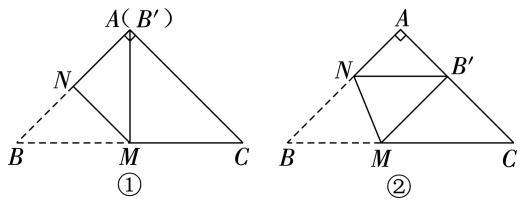  
第18题

19. 蚂蚁能够最快到达目的地的可能路径有如图所示的 $A C _ { 1 } ^ { \prime }$ 和 $A C _ { 1 }$ ()如图,若蚂蚁沿着木柜表面经线段$A _ { 1 } B _ { 1 }$ 到点 $C _ { 1 } ^ { \prime }$ ，则爬过的最短路径的长是 $A C _ { 1 } ^ { \prime } =$ ${ \sqrt { 4 ^ { 2 } + ( 4 + 5 ) ^ { 2 } } } = { \sqrt { 9 7 } }$ ;若蚂蚁沿着木柜表面经线段 $B B _ { 1 }$ 到点 $C _ { 1 }$ ,则爬过的最短路径的长是 $A C _ { 1 } = \sqrt { ( 4 + 4 ) ^ { 2 } + 5 ^ { 2 } } =$ $\sqrt { 8 9 }$ . $\sqrt { 8 9 } < \sqrt { 9 7 }$ , 蚂蚁爬过的最短路径的长是$\sqrt { 8 9 }$ ()如图,过点 $B _ { 1 }$ 作 $B _ { 1 } E \bot A C _ { 1 }$ 于点 $E$ ,连接$A B _ { 1 \cdot } \ \because S _ { \triangle A B _ { 1 } c _ { 1 } } = \frac { 1 } { 2 } B _ { 1 } C _ { 1 } \ \bullet A A _ { 1 } = \frac { 1 } { 2 } A C _ { 1 } \bullet B _ { 1 } E ,$ ： $B _ { 1 } E { = } \frac { B _ { 1 } C _ { 1 } \cdot A A _ { 1 } } { A C _ { 1 } } { = } \frac { 4 { \times } 5 } { { \sqrt { 8 9 } } } { = } \frac { 2 0 } { 8 9 } { \sqrt { 8 9 } } .$ . 点 $B _ { 1 }$ 到最短路径的距离为 $\frac { 2 0 } { 8 9 } \sqrt { 8 9 }$

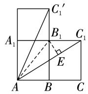  
第19题

# 20.2 勾股定理的逆定理及其应用

1. 2. 3. 4. 5. $\frac { 1 3 } { 2 }$ 6. ${ \sqrt { 3 } } \ \mathrm { c m }$ 或 $\sqrt [ ] { 5 } \mathrm { ~ c m }$

7. 8. $\sqrt { 6 5 }$

9.连接 $A C$ .在 $\mathrm { R t } \triangle A C D$ 中, $\angle A D C = 9 0 ^ { \circ } , A D = 8 , C D =$ $6 , \dot { \bullet } \cdot A C = \sqrt { A D ^ { 2 } + C D ^ { 2 } } = 1 0 .$ .在 $\triangle A B C$ 中, $A C ^ { 2 } +$ 2 2 2 ,AB2 2 , AC2 BC2$A B ^ { 2 } , \dotsc \triangle A B C$ 为直角三角形,且 $\angle A C B = 9 0 ^ { \circ }$ . 该图形的面积 $\stackrel { ! } { = } S _ { \bigtriangleup A B C } - S _ { \bigtriangleup A C D } = \frac { 1 } { 2 } \times 1 0 \times 2 4 - \frac { 1 } { 2 } \times 6 \times 8 = 9 6$ 10.()如图,连接 $B D , \because D E$ 垂直平分 $A B , \dotsc A D =$ BD.: $A D ^ { 2 } - D C ^ { 2 } = B C ^ { 2 } , \therefore B D ^ { 2 } - D C ^ { 2 } = B C ^ { 2 } , \therefore \bigtriangleup B C D$ 是直角三角形, $\angle C = 9 0 ^ { \circ }$ ()设 $A D = B D = x$ ,则 $C D =$ $A C - A D = 8 - x$ .由(1)，得 $B D ^ { 2 } - D C ^ { 2 } = B C ^ { 2 } , \therefore x ^ { 2 } -$ $( 8 - x ) ^ { 2 } = 4 ^ { 2 }$ ,解得 $x = 5 .$ . $A D { = } 5$

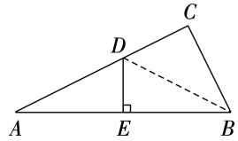  
第10题

11.()理由: $A D = 3 0 \mathrm { c m } , A B = 4 0 \mathrm { c m } , B D = 5 0 \mathrm { c m }$ ,而$3 0 ^ { 2 } + 4 0 ^ { 2 } = 5 0 ^ { 2 } , \therefore A D ^ { 2 } + A B ^ { 2 } = B D ^ { 2 }$ . $\triangle D A B$ 是直角三角形 且 $\angle A = 9 0 ^ { \circ }$ 即 $D A \bot A B$ . 答案不唯一 如用 $1 0 ~ \mathrm { c m }$ 的刻度尺在边 $A B$ 上量取 $A M { = } 3 ~ \mathrm { c m }$ ,在边 $A D$ 上量取 $A N { = } 4 \ \mathrm { c m }$ ,连接 $M N$ ,量取 $M N$ 的长度.若 $M N =$ $5 ~ \mathrm { c m }$ ,则 $\angle A = 9 0 ^ { \circ }$ ,即 $D A \bot A B$ ;若 $M N \neq 5 ~ \mathrm { c m }$ ,则 $D A$ 不垂直于 $A B$

12.设 $M N$ 与 $A C$ 相交于点 $E$ .由题意,得 $A B = 5$ 海里,$B C { = } 1 2$ 海里 $A C { = } 1 3$ 海里， $\cdot \ 5 ^ { 2 } + 1 2 ^ { 2 } = 1 3 ^ { 2 } \ , \div \ A B ^ { 2 } +$ $B C ^ { 2 } = A C ^ { 2 }$ . $\triangle A B C$ 为直角三角形 且 $\angle A B C = 9 0 ^ { \circ }$ .： ${ \bf \nabla } \cdot { \bf \nabla } _ { M N \bot A C } ,$ , 船 $C$ 到达 $M N$ 线的最短距离是 $C E$ 的长. S ABC $S _ { \triangle A B C } = \frac { 1 } { 2 } A B \cdot B C = \frac { 1 } { 2 } A C \cdot B E \cdot \angle \cdot B E = \frac { 6 0 } { 1 3 } \Im$ 海里. $C E = { \sqrt { B C ^ { 2 } - B E ^ { 2 } } } = { \frac { 1 4 4 } { 1 3 } }$ 海 里. ${ \frac { 1 4 4 } { 1 3 } } \div 1 3 =$ $\frac { 1 4 4 } { 1 6 9 }$ 小时 $\approx 5 1$ 分钟 时 分 $+ 5 1$ 分钟 $= 1 0$ 时分, 船 $C$ 最早约会在 时 分到达 $M N$ 线

13.都是直角三角形 理由:在正方形 $A B C D$ 中, $A B =$ $B C = C D = A D = 4$ ， $\angle A = \angle C = \angle D = 9 0 ^ { \circ } , \therefore \bigtriangleup A B E$ ，$\triangle B C F , \triangle E F D$ 都是直角三角形.由勾股定理,得 $B E ^ { 2 } =$ $A E ^ { 2 } + A B ^ { 2 } = 2 ^ { 2 } + 4 ^ { 2 } = 2 0 , B F ^ { 2 } = B C ^ { 2 } + C F ^ { 2 } = 4 ^ { 2 } + ( 4 -$ $1 ) ^ { 2 } = 2 5 , E F ^ { 2 } = E D ^ { 2 } + D F ^ { 2 } = ( 4 - 2 ) ^ { 2 } + 1 ^ { 2 } = 5 , \therefore B E ^ { 2 } +$ $E F ^ { 2 } = B F ^ { 2 } , \allowbreak \therefore \triangle B E F$ 是直角三角形. 小明按这种方法剪得的三角形都是直角三角形.

# 第二十章特训

一、1. 2. 3. 4. 5.

二、6. $\sqrt { 1 3 }$ 7. 或 8. 9.

10.() 解析:由题可知 $t = 1 ^ { k } + 1 ^ { k } = 1 + 1 = 2$ .

() $\textcircled{1} \textcircled{2}$ 解析: $\textcircled{1}$ 当 $k = 2 , t = 1$ 时,则 $1 = { \left( \frac { a } { c } \right) } ^ { 2 } + { }$   
$\left( { \frac { b } { c } } \right) ^ { 2 } = { \frac { a ^ { 2 } + b ^ { 2 } } { c ^ { 2 } } }$ 即 $a ^ { 2 } + b ^ { 2 } = c ^ { 2 }$ 三角形为直角三角  
形,故 $\textcircled{1}$ 正确. $\textcircled{2}$ 当 $k = 1 , a = \frac { 1 } { 2 } b + 2 , c = 1$   
$\frac { b } { c } = a + b = \frac { 1 } { 2 } b + 2 + b = \frac { 3 } { 2 } b + 2 , \because a + b > c , a + c > b ,$ $\frac { 1 } { 2 } b + 2 + b > 1 ,$   
$b + c > a , \therefore \Big \{ \frac { 1 } { 2 } b + 2 + 1 > b$ 解得 $2 { < } b { < } 6 .$ .当 $b = 2$ 时,?? 1 2 b+2，

$t = \frac { 3 } { 2 } \times 2 + 2 = 5$ ;当 $b = 6$ 时, $t = \frac { 3 } { 2 } \times 6 + 2 { = } 1 1$ ,∴ 易得$5 { < } t { < } 1 1$ ,故 $\textcircled{2}$ 正确. $\textcircled { 3 } \because k = 1 , t { \leqslant } \frac { 5 } { 3 } , \dot { \div } \ t = \frac { a } { c } + \frac { b } { c } =$ $\frac { a + b } { c } { \leqslant } \frac { 5 } { 3 } . \dddot { \bullet } \ c { > } 0 , \pm . \ a + b { \leqslant } \frac { 5 } { 3 } c .$ $a + b > c , \dotsc c <$ $a + b \leqslant \frac { 5 } { 3 } c$ .不妨设 $a = n$ ，则 $b = n + 1 , c = n + 2 , \therefore n +$ $2 { < } 2 n { + } 1 { \leqslant } \frac { 5 } { 3 } ( n { + } 2 )$ ),解得 $1 { < } n { \leqslant } 7 . \ { \div } \ n$ 的值可取 ,,,,,,共 个. 满足条件的 $\triangle A B C$ 的个数为 ,故 $\textcircled{3}$ 错误.综上所述,正确的是 $\textcircled{1} \textcircled{2}$ .

三、11.() ()当 是直角三角形的斜边长时,第三边的长为 ${ \sqrt { 3 ^ { 2 } - 1 ^ { 2 } } } = 2 { \sqrt { 2 } }$ ;当 和 是直角三角形的直角边长时,第三边的长为 ${ \sqrt { 1 ^ { 2 } + 3 ^ { 2 } } } = { \sqrt { 1 0 } }$ , 第三边的长为 $2 \sqrt { 2 }$ 或 $\sqrt { 1 0 }$

12.()由 题 意,可 得 $\angle P B C = 3 0 ^ { \circ }$ , $\angle M A B = 6 0 ^ { \circ }$ ,： $\angle C B Q = 6 0 ^ { \circ }$ $, \angle B A N = 3 0 ^ { \circ } . \because Q B / / A N , \therefore \angle A B Q =$ $\angle B A N = 3 0 ^ { \circ }$ . $\angle A B C = 9 0 ^ { \circ }$ . $A B = B C = 1 0 \mathrm { k m } .$ ,： $A C = { \sqrt { A B ^ { 2 } + B C ^ { 2 } } } = 1 0 { \sqrt { 2 } } \approx 1 4 . 1 ( { \mathrm { k m } } ) . { \dot { \cdots } } { \mathrm { ~ } } A , C$ 两港之间的距离约为 $1 4 . 1 \ \mathrm { k m }$ ()由()知, $\triangle A B C$ 为等腰直角三角形, $\angle B A C = 4 5 ^ { \circ }$ . $\angle C A M = 6 0 ^ { \circ } - 4 5 ^ { \circ } =$ $1 5 ^ { \circ } . \therefore C$ 港在 $A$ 港北偏东 $1 5 ^ { \circ }$ 方向

13. 四边形 $A B C D$ 的面积 $\stackrel { ! } { \mathop { \left\downarrow \right.} { = } 5 \times 7 - \frac { 1 } { 2 } \times 1 \times 7 - \frac { 1 } { 2 } \times \ln } $ $2 \times 4 - \frac { 1 } { 2 } \times 1 \times 2 - \frac { 1 } { 2 } \times ( 1 + 5 ) \times 3 = 3 5 - \frac { 7 } { 2 } - 4 - 1 - 9 =$ . ()如图,连接 $B D . \stackrel { \cdot \cdot } { \cdot } B C ^ { 2 } = 2 ^ { 2 } + 4 ^ { 2 } = 2 0 , C D ^ { 2 } =$ $1 ^ { 2 } + 2 ^ { 2 } = 5 , B D ^ { 2 } = 3 ^ { 2 } + 4 ^ { 2 } = 2 5 , B C ^ { 2 } + C D ^ { 2 } = B D ^ { 2 }$ ，$\therefore \angle B C D = 9 0 ^ { \circ }$

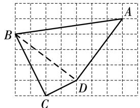  
第 题

14.() $a$ ()对正实数 $a , b , c$ ,运算 $\otimes$ ”满足结合律 ${ ( a \otimes b ) \widetilde { \bigotimes } c = a \bigotimes ( b \bigotimes c ) }$ ) 理由:∵ $( a \otimes b ) \otimes c = \frac { a b } { a + b } \otimes$ $c = \frac { \displaystyle \frac { a b } { a + b } \bullet c } { \displaystyle \frac { a b } { a + b } + c } = \frac { \displaystyle \frac { a b c } { a + b } } { \displaystyle \frac { a b + a c + b c } { a + b } } = \frac { a b c } { a b + a c + b c } , a \otimes ( b \otimes c ) =$ $a \otimes { \frac { b c } { b + c } } = { \frac { a \bullet { \frac { b c } { b + c } } } { a + { \frac { b c } { b + c } } } } = { \frac { \frac { a b c } { b + c } } { \frac { a b + a c + b c } { b + c } } } = { \frac { a b c } { a b + a c + b c } } ,$ 边 $=$ 右边. 对正实数 $a , b , c$ ,运算 $\otimes$ ”满足结合律 $\zeta _ { a } \otimes$ $b ) { \bigotimes } c = a { \bigotimes } ( b { \bigotimes } c ) .$

(3) $\frac { 5 } { 6 }$ 解析 由题意 得 $\angle A F B = 9 0 ^ { \circ } , \therefore \ A F ^ { 2 } + B F ^ { 2 } =$

$A B ^ { 2 } , \because A F { = } a , B F { = } b$ ,且 $a > b$ ,正方形 ABCD 的面积为 $6 , \dot { \pm } \cdot a ^ { 2 } + b ^ { 2 } = 2 6 .$ . 四个直角三角形全等 $A E =$ $B F { = } b , \ \therefore \ E F { = } A F { - } A E { = } a { - } b , \ \div \ \cdot$ 正方形EFGH的面积为 , $( a - b ) ^ { 2 } = 1 6$ ,即 $a ^ { 2 } + b ^ { 2 } - 2 a b = 1 6 , \therefore 2 6 -$ $2 a b = 1 6 , \ \therefore \ a b = 5 , \ \therefore \ ( a + b ) ^ { 2 } = ( a - b ) ^ { 2 } + 4 a b = 1 6 + 4 \times$ $5 { = } 3 6 , \ { \div } \ a + b { = } 6$ (负值舍去). $\begin{array} { r l } {  { ( 2 a ) \bigotimes b \bigotimes ( 2 a ) = } } \end{array}$ $( 2 a ) \bigotimes ( 2 a ) \bigotimes b = a \bigotimes b = \frac { a b } { a + b } = \frac { 5 } { 6 } .$

# 第二十一章 四 边 形

# 21.1 四边形及多边形

1. 2. 3. 4. 5. 6. $4 : 3 : 2 : 1$

7. $1 8 0 0 ^ { \circ }$ 8.1144

9.如图, $\cdot \angle A P Q , \angle N Q P , \angle D J K , \angle J K E , \angle H R Q$ 是 五边形PQRKJ 的外角, $\angle A P Q + \angle N Q P + \angle D J K +$ $\angle J K E + \angle H R Q = 3 6 0 ^ { \circ } . \because \angle A + \angle B = \angle A P Q , \angle M +$ $\angle N = \angle N Q P , \angle C + \angle D = \angle D J K , \angle E + \angle F =$ $\angle J K E , \angle H + \angle G = \angle H R Q , \therefore \angle A + \angle B + \angle C +$ $\angle D + \angle E + \angle F + \angle G + \angle H + \angle M + \angle N = \angle A F$ Q $\angle D J K + \angle J K E + \angle H R Q + \angle N Q P = 3 6 0 ^ { \circ }$

$$
\sum \limits _ { C } ^ { A } \sum \limits _ { \boldsymbol { J } } ^ { N } \boldsymbol { \phi } ^ { \mathrm { T } } = \left( \begin{array} { l } { \boldsymbol { \lambda } } \\ { \boldsymbol { \mu } } \end{array} \right) ^ { T } \sum \limits _ { \boldsymbol { F } } ^ { N } \boldsymbol { M } _ { \boldsymbol { \mathrm { ~ } } } ^ { \mathrm { T } }
$$

第9题

10. 小东能走回点 $A$ 从点 $A$ 出发 每走 $6 \mathrm { m }$ 向左转 $6 0 ^ { \circ } , \therefore 3 6 0 ^ { \circ } \div 6 0 ^ { \circ } = 6 .$ . 需走 $6 \times 6 = 3 6 ( \mathrm { m } )$ ) 走过的路径是一个边长为 $6 \textrm { m }$ 的正六边形 ()内角和为 $( 6 -$ $2 ) \times 1 8 0 ^ { \circ } = 7 2 0 ^ { \circ }$

11.()设 $A C$ 与 $B E$ 相交于点 $H , A D$ 与 $B E$ 相交于点$G _ { \bullet } : \ \ " \ \ " \angle A H G$ 是 $\triangle H C E$ 的外角，： $\angle A H G = \angle C +$ $\angle E . \because \ \angle A G H$ 是 $\triangle G B D$ 的外角, $\angle A G H = \angle B +$ $\angle D . \ \stackrel { . . } { : } \ \angle A + \angle A H G + \angle A G H = 1 8 0 ^ { \circ } , \therefore \ \angle A + \angle B +$ $\angle C + \angle D + \angle E = 1 8 0 ^ { \circ }$ ()没有变化 理由:由三角形的外角性质,知 $\angle B A C = \angle E + \angle C , \angle D A E = \angle B +$ $\angle D . \ \ddot { \bf \langle { \dot { \pi } } \cdot { \angle B A C + \angle C A D + \angle D A E = 1 8 0 ^ { \circ } } , \dot { \bf \mu } \cdot { \angle C A D + } }$ $\angle B + \angle C + \angle D + \angle E = 1 8 0 ^ { \circ }$ . 五个角的和没有变化.

12.设这个内角的度数为 $_ { \mathcal { X } }$ ,这个多边形的边数为 $n$ .由题意 得 $1 ~ 6 8 0 ^ { \circ } + x = ( n - 2 ) \times 1 8 0 ^ { \circ } , ~ \div \cdot \mathrm { ~ 1 ~ } 6 8 0 ^ { \circ } + x$ 是 $1 8 0 ^ { \circ }$ 的整数倍. $1 ~ { 6 8 0 } ^ { \circ } = 1 8 0 ^ { \circ } \times 9 + { 6 0 } ^ { \circ } , 0 ^ { \circ } < x < 1 8 0 ^ { \circ } , \therefore ~ x +$ $6 0 ^ { \circ } = 1 8 0 ^ { \circ }$ . $x = 1 2 0 ^ { \circ } , \therefore 1 6 8 0 ^ { \circ } + 1 2 0 ^ { \circ } = ( n - 2 ) \times 1 8 0 ^ { \circ }$ ，解得 $n { = } 1 2 , \ \cdots$ 这个内角的度数是 $\boldsymbol { 1 2 0 ^ { \circ } }$ 他求的是十二边形的内角和

13. 设这个外角的度数是 $x ^ { \circ }$ 则 $( 5 - 2 ) \times 1 8 0 - ( 1 8 0 -$ $x ) + x = 6 0 0$ ，解得 $\begin{array} { r } { x = 1 2 0 , \ldots } \end{array}$ 这个外角的度数是 $\boldsymbol { 1 2 0 ^ { \circ } }$ 存在 设边数为 $n$ 这个外角的度数是 $y ^ { \circ }$ 则 $( n -$

$2 ) \times 1 8 0 - ( 1 8 0 - y ) + y = 6 0 0 .$ .整理,得 $y = 5 7 0 - 9 0 n$ .： $\cdot \mathrm { \Delta } 0 { < } y { < } 1 8 0$ ,即 $0 < 5 7 0 - 9 0 n < 1 8 0 .$ ,且 $n$ 为正整数,： $n = 5$ 或 $n { = } 6 , \therefore$ 这个多边形的边数还可以是 ,这个外角的度数为 $3 0 ^ { \circ }$   
14.()根据题中所给条件,可知 $( 5 - 2 ) \times 1 8 0 ^ { \circ } \times$ $\frac { 8 } { 1 + 2 + 3 + 4 + 8 } { = } 2 4 0 ^ { \circ }$ . 凸多边形的每一个内角都小于$1 8 0 ^ { \circ }$ , 这个角不可能是凸五边形的内角 ()答案不唯一,如将度数比改为 $8 : 2 : 3 : 4 : 8$ 凸五边形的内角和为$( 5 - 2 ) \times 1 8 0 ^ { \circ } = 5 4 0 ^ { \circ } , \therefore \ 5 4 0 ^ { \circ } \times { \frac { 8 } { 8 + 2 + 3 + 4 + 8 } } = 1 7 2 . \ 8 ^ { \circ } ,$ ,$5 4 0 ^ { \circ } \times { \frac { 2 } { 8 + 2 + 3 + 4 + 8 } } = 4 3 . \ 2 ^ { \circ } , 5 4 0 ^ { \circ } \times { \frac { 3 } { 8 + 2 + 3 + 4 + 8 } } =$ $6 4 . 8 ^ { \circ } , 5 4 0 ^ { \circ } \times \frac { 4 } { 8 + 2 + 3 + 4 + 8 } = 8 6 . 4 ^ { \circ } .$ 各内角的度数分别为 $1 7 2 , 8 ^ { \circ } , 4 3 , 2 ^ { \circ } , 6 4 , 8 ^ { \circ } , 8 6 , 4 ^ { \circ } , 1 7 2 , 8 ^ { \circ }$

# 21.2 平行四边形

1. 2. 3. 4. 5. 6. $3 0 ^ { \circ }$ 7.(,)

8. $3 6 ^ { \circ }$ 9. $\frac { 1 } { 2 }$ 10.3

11.() 四边形 ABCD 是平行四边形, $A B = C D$ ,$A D = B C , \angle B = \angle D . \because A F = C E , \therefore A D - A F = B C -$ $C E$ ，即 $D F = B E$ .在 $\triangle A B E$ 和 $\triangle C D F$ 中， $\scriptstyle { \left\{ \begin{array} { l l } { A B = C D , } \\ { \angle B = \angle D , } \\ { B E = D F , } \end{array} \right. }$ ,： $\triangle A B E { \cong } \triangle C D F$ ()添加条件不唯一,如 $B E { = } C E$ 理由: $A F = C E$ , $B E = C E$ , $A F = B E$ . 四边形$A B C D$ 是平行四边形, $A D / / B C$ . 四边形ABEF 是平行四边形.

12.() $\angle B A C = \angle A C D = 9 0 ^ { \circ } , \therefore \ A B / / E C . \ \because \ E$ 是的中点,∴ EC=1 $A B = { \frac { 1 } { 2 } } C D , \therefore A B =$ EC.四边形 $A B C E$ 是平行四边形（2）… $\angle A C D =$ $9 0 ^ { \circ } , A C = 4 , A D = 4 { \sqrt { 2 } } , { \dot {  } } C D = { \sqrt { A D ^ { 2 } - A C ^ { 2 } } } = 4$ .$\cdot \ A B = { \frac { 1 } { 2 } } C D = 2 . \ \therefore \ S _ { \perp \perp \ x \ x } = A B \cdot A C = 2 \times 4 = 8$

13.() 四边形 $A B C D$ 是平行四边形, $A D { = } C B$ ,$\angle A = \angle C , A D / / C B . \therefore \angle A D B = \angle C B D . ^ { \because } \ E D \bot D B ,$ ,$F B \perp B D$ , $\angle E D B = \angle F B D = 9 0 ^ { \circ } , \ : \ : \dot { \because } \ : \angle A D B -$ $\angle E D B = \angle C B D - \angle F B D$ ,即 $\angle A D E = \angle C B F$ .在$\triangle A E D$ 和 $\triangle C F B$ 中, $\left\{ \begin{array} { l l } { \angle A D E { = } \angle C B F , } \\ { A D { = } C B , } \\ { \angle A { = } \angle C , } \end{array} \right. \therefore \ \triangle A E D \overset { \circ } { = }$ $\triangle C F B$ ()过 点 $D$ 作 $D H \perp A B$ ,垂 足 为 $H$ .在$\mathrm { R t } \triangle A D H$ 中, $\angle A = 3 0 ^ { \circ } , \therefore D A = 2 D H .$ .在 $\mathrm { R t } \triangle D E B$ 中,$\angle D E B = 4 5 ^ { \circ }$ , 易证 $E B = 2 D H . \therefore E B = D A .$ .由(),知$\triangle A E D { \cong } \triangle C F B$ , $A E { = } C F$ . 四边形 $A B C D$ 是平行四边形, $A B = C D$ . $A B - A E { = } C D - C F$ ,即 $E B =$ DF.: $D A = D F$

$\scriptstyle { \left\{ \begin{array} { l l } { \angle E A O = \angle D C O } \\ { A O = C O , } \\ { \angle A O E = \angle C O D } \end{array} \right. }$ ,  
14.( )在 $\triangle A O E$ 和 $\triangle C O D$ 中,,  
： $\triangle A O E { \cong } \triangle C O D . \ \therefore \ O E = O D .$ .又 $A O { = } C O$ , 四  
边形AECD 是平行四边形 (2)∵ $A B = C B , A O = C O$ ,  
OB AC,即 $D E \bot A C . \because A C = 8 , \therefore C O = { \frac { 1 } { 2 } } A C = 4 .$   
在 $\mathrm { R t } \triangle C O D$ 中,由勾股定理,得 $O D { = } \sqrt { C D ^ { 2 } { - } C O ^ { 2 } } { = }$   
$\sqrt { 5 ^ { 2 } - 4 ^ { 2 } } = 3 . \ \dot { \cdots } \ D E = 2 O D = 6 . \ \dot { \cdots } \ S _ { \perp \perp \perp \perp \perp E A E C D } = \frac { 1 } { 2 } A C \ \cdot$ ·  
$O E + \frac { 1 } { 2 } A C \cdot O D = \frac { 1 } { 2 } A C \cdot D E = \frac { 1 } { 2 } \times 8 \times 6 = 2 4$ 15.() 四边形 $A B C D$ 是平行四边形, $A B / / D C$ .$\angle O B E ~ = ~ \angle O D F .$ .在 $\triangle C B E$ 和 $\triangle { O D F }$ 中,$\angle O B E { = } \angle O D F$ ,  
$\scriptstyle \{ \angle B O E = \angle D O F , \therefore \ \triangle O B E \ @ \triangle O D F . \ \land \ B O = D O$ $\boldsymbol { \cdot } _ { B E = D F }$ ,  
$\left( 2 \right) : : E F \bot A B , A B / / D C , \angle A = 4 5 ^ { \circ } , : : \angle G E A =$ $\angle G F D = 9 0 ^ { \circ } , \angle A = \angle G = 4 5 ^ { \circ } , \therefore A E = G E . \ \because \ B D \bot$ AD, $\therefore \angle A D B = \angle G D O = 9 0 ^ { \circ } , \therefore \angle G O D = \angle G = 4 5 ^ { \circ }$ $D G = D O . \because \angle G F D = 9 0 ^ { \circ } ,$ 即 $D F \bot G O , \therefore { \cal O F } =$ $F G = 1$ ，由（1)，知 $\triangle O B E \cong \triangle O D F , \therefore \ O E = O F = 1$ ： $G E { = } O E { + } O F { + } F G { = } 3 , \ \therefore \ A E { = } G E { = } 3$   
16.延 长 $A C , B D$ 交 于 点 $F , \ \because \ A D$ 平 分 $\angle B A C$ $\scriptstyle \angle B A D = \angle F A D . { \because } \ B D \bot A O$ ,且交 $A O$ 的延长线于点 $D$ , $\angle A D B = \angle A D F = 9 0 ^ { \circ }$ .又 $A D = A D$ ,： $\triangle A B D { \cong } \triangle A F D$ . $A B = A F$ , $B D = F D$ . $A B -$ $A C = A F - A C = C F$ . $E$ 是 $B C$ 的中点， $B D = F D$ ，: $E D$ 是 $\triangle B C F$ 的 中 位 线. $D E { = } { \frac { 1 } { 2 } } C F$ $D E =$ ${ \frac { 1 } { 2 } } ( A B - A C )$

17.()四边形 $A C G D$ 是平行四边形 理由: $\triangle A B C$ 是等腰直角三角形, $\angle A C B = 9 0 ^ { \circ } , \therefore A C = B C , A B ^ { 2 } =$ $A C ^ { 2 } + B C ^ { 2 }$ . $A B ^ { 2 } = 2 A C ^ { 2 }$ . $A B = { \sqrt { 2 } } A C .$ .同理 可得$B D { = } \sqrt { 2 } A B , \therefore B D { = } \sqrt { 2 } { \times } \sqrt { 2 } A C { = } 2 A C , { \because } G$ 为 $B D$ 的中点, $B D { = } 2 D G . \therefore A C { = } D G .$ .易得 $\angle A B C = \angle A B D =$ $4 5 ^ { \circ } , \therefore \angle C B D = 9 0 ^ { \circ }$ . $\angle A C B = 9 0 ^ { \circ }$ ，： $\angle A C B +$ $\angle C B D = 1 8 0 ^ { \circ } , \therefore A C / / B D . \therefore$ 四边形 $A C G D$ 是平行四边形. $( 2 ) \because \triangle A B D$ 和 $\triangle A C E$ 均是等腰直角三角形,$\angle E A C = \angle B A D = 9 0 ^ { \circ } , \therefore A E = A C , A B = A D$ , $\angle E A C +$ $\angle C A B = \angle B A D + \angle C A B$ ,即 $\angle E A B = \angle C A D$ .在$\triangle E A B$ 和 $\triangle C A D$ 中, $\left\{ \begin{array} { l l } { A E = A C , } \\ { \angle E A B = \angle C A D , \therefore \bigtriangleup E A B \cong } \\ { A B = A D , } \end{array} \right.$ $\triangle C A D . \therefore B E = D C$ , $\angle E B A = \angle C D A$ .设 $A B$ 与 $C D$ 相交于点 $H$ ,则 $\angle A H D + \angle C D A = 9 0 ^ { \circ }$ . $\angle A H D =$ $\angle B H F , \therefore \angle B H F + \angle E B A = 9 0 ^ { \circ }$ . $\angle B F H = 9 0 ^ { \circ }$ ,即$B E \bot D C$

18.() $\textcircled{1}$ 如图 $\textcircled{1}$ ,在 $\triangle A B C$ 中, $\angle A C B = 9 0 ^ { \circ }$ , $\angle A =$ $\angle B = 4 5 ^ { \circ } , \therefore A C = B C . \therefore$ 由勾股定理,易得 $A C = B C =$ ${ \sqrt { 2 } } h$ .如图 $\textcircled{2}$ ,在 $\triangle D E F$ 中, $\angle D E F = 9 0 ^ { \circ }$ , $\angle F = 3 0 ^ { \circ }$ ,： $E F { = } 2 h$ , $D F { = } 2 D E$ .由勾股定理,易得 $D E { = } \frac { 2 \sqrt { 3 } } { 3 } h$ .综上所述 含 $4 5 ^ { \circ }$ 角的三角尺的直角边长为 ${ \sqrt { 2 } } h , { \sqrt { 2 } } h$ 含 $3 0 ^ { \circ }$ 角的三角尺的直角边长为 $2 h$ , ${ \frac { 2 { \sqrt { 3 } } } { 3 } } h$ $\textcircled{2}$ 如图 $\textcircled{3}$ .由题意,易知 $\angle M N G = \angle N G H = \angle G H M = \angle H M N = 9 0 ^ { \circ } .$ . 四边形MNGH 是长方形. $M N { = } { \sqrt { 2 } } h { - } \frac { 2 { \sqrt { 3 } } } { 3 } h { = } \frac { 3 { \sqrt { 2 } } - 2 { \sqrt { 3 } } } { 3 } h$ $M H { = } 2 h - \sqrt { 2 } h = ( 2 - \sqrt { 2 } ) h , \therefore S _  \mathrm { \scriptsize { E \hat { \imath } } \mathrm { { \scriptsize { \it { M } } \mathrm { { \scriptsize { \it { M } } \mathrm { { \scriptsize { \it { M } } \mathrm { { \scriptsize { \it { \it { M } } \mathrm { { \scriptsize { \it { \it { M } } \mathrm { { \scriptsize { \it { \it { \it { M } } \mathrm { { \scriptsize { \it { \it { \it { \it { M } } \Lambda } } \mathrm { { { \scriptsize { \it { \it { \it { M } } \Lambda } \mathrm { { { \scriptsize { \it { \it { \it { M } } \Lambda } } \mathrm { { { \scriptsize { \it { \it { \it { M } } \Lambda } } \mathrm { { { \scriptsize { \it { \it { \it { M } } \Lambda } } \mathrm { { { \scriptsize { \it { \it { \it { M } } \Lambda } } \mathrm { { { \scriptsize { \it { \it { \it { M } } \it { \it { \it { \it { M } } } \mathrm { { \it { \it { \it { \it { M } } \Lambda } } \mathrm } } } } } } } } } } } } } } } } } } } } } } } } } } } } } } } } } } } } } } } } } } } } = M N \ $ ·$M H = \frac { 3 \sqrt { 2 } - 2 \sqrt { 3 } } { 3 } h \ \bullet \ ( 2 - \sqrt { 2 } ) h = \frac { 6 \sqrt { 2 } - 6 - 4 \sqrt { 3 } + 2 \sqrt { 6 } } { 3 } h ^ { 2 } .$ .${ \frac { 6 { \sqrt { 2 } } - 6 - 4 { \sqrt { 3 } } + 2 { \sqrt { 6 } } } { 3 } } h ^ { 2 }$ 小平行四边形的面积为 ()如图 $\textcircled{4}$ 所示

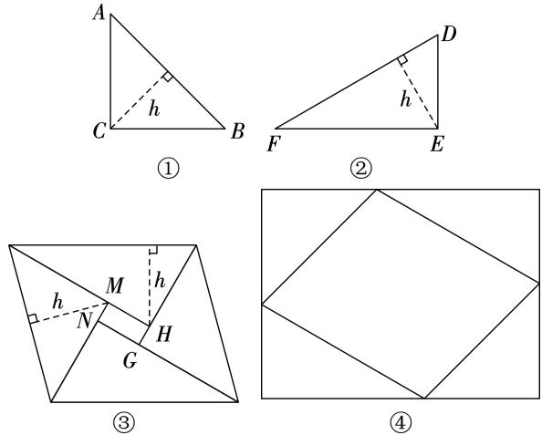  
第 题

# 21.3 特殊的平行四边形

# 21.3.1 矩 形

1. 2. 3. 4. 5. 6. 7. 8.

9.6.5 10. $3 ~ { \sqrt { 1 7 } }$ 11.5 12.(8,4)或 $\left( { \frac { 5 } { 2 } } , 7 \right)$

13.4.8

14.()如图,线段 $B O$ 即为所求作 ()如图. $\because O$ 是$A C$ 的中点, $A O { = } C O$ . 将中线 $B O$ 绕点 $O$ 逆时针旋转 $1 8 0 ^ { \circ }$ 得到 DO $B O = D O , B , O , D$ 三点共线. 四边形ABCD 是平行四边形. $\angle A B C = 9 0 ^ { \circ }$ , 四边形$A B C D$ 是矩形

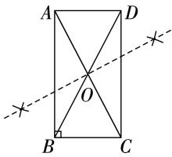  
第14题

15.() 四边形 $A B C D$ 是平行四边形, $A D / / B C$ ,$A D { = } B C , \because C$ 是 $B E$ 的中点，∴ $B C { = } C E . \ \therefore \ A D { = } C E$ .： $A D / / B C$ ,即 $A D / / C E$ , 四边形 $A C E D$ 是平行四边形() 四 边 形 ABCD 是 平 行 四 边 形, $A B = D C$ .： $A B { = } A E , \therefore D C { = } A E .$ 四边形 $A C E D$ 是平行四边形, 四边形ACED 是矩形  
16. 四边形 ABCD 是矩形, $A D / / B C , A B / / C D$ .： $\angle C A B = \angle A C D$ .由 折 叠 的 性 质,可 得 $\angle E A B =$ $\angle E A C = \frac { 1 } { 2 } \angle C A B , \angle A C F = \angle F C D = \frac { 1 } { 2 } \angle A C D .$ .: $\scriptstyle \angle E A C = \angle A C F . { \therefore A E / / C F } .$ .又 $A F / / C E$ 四边形 $A E C F$ 是平行四边形. 四边形 ABCD 为矩形,∴ $\angle B = 9 0 ^ { \circ }$ .在 $\mathrm { R t } \triangle A B C$ 中, $A B = 6 , A C = 1 0 , \dot { \bullet } \ B C =$ ${ \sqrt { 1 0 ^ { 2 } - 6 ^ { 2 } } } = 8 .$ .由折叠的性质,得 $\angle A M E = \angle B = 9 0 ^ { \circ }$ ,$A M = A B = 6 , B E = E M . \therefore \angle E M C = 9 0 ^ { \circ } , C M = A C - 1$ $A M { = } 4 .$ 设 $C E { = } x$ ，则 $B E { = } E M { = } 8 { - } x$ .在 $\mathrm { R t } \triangle E M C$ 中，： $E M ^ { 2 } + C M ^ { 2 } = C E ^ { 2 } , \therefore ~ ( 8 - x ) ^ { 2 } + 4 ^ { 2 } = x ^ { 2 }$ ,解得 $x = 5$ .四边形 AECF 的面积为 $\begin{array} { r } { A B \cdot C E = 6 \times 5 = 3 0 . } \end{array}$ .在$\mathrm { R t } \triangle A B E$ 中,由勾股定理,得 $A E = { \sqrt { 6 ^ { 2 } + ( 8 - 5 ) ^ { 2 } } } =$ $3 \sqrt { 5 }$ .设 $A E$ 与 $C F$ 之间的距离为 $h$ . $A E \cdot h = 3 0$ 即$3 \sqrt { 5 } h = 3 0$ ,解得 $h { = } 2 { \sqrt { 5 } } , \therefore A E$ 与 $C F$ 之间的距离为 $2 \sqrt { 5 }$ 17.()如图,连接 $D E . \because A D$ 是边 $B C$ 上的高, $C E$ 是边$A B$ 上的中线,∴ 易得 $E D = A E = B E = \frac { 1 } { 2 } A B$ $C D =$ $A E , \therefore E D { = } C D . \ i .$ 点 $D$ 在线段 $C E$ 的垂直平分线上() $\textcircled{1} \because D$ 是 $B C$ 的中点, $B D = C D . \ \because \ D E = B E =$ CD,: $B D = D E = B E$ ： $\triangle B D E$ 是等边三角形.： $\angle B = 6 0 ^ { \circ }$ $\textcircled{2}$ 如图,过点 $E$ 作 $E H \perp B D$ 于点 $H$ .： $C D = 5 , \therefore E D = B E = C D = 5 , \therefore \bigtriangleup E B D$ 是等腰三角形. $\ \stackrel { \bullet \cdot } { \cdot } \ E H \bot B D , \therefore \ B H = D H = { \frac { 1 } { 2 } } B D = 3 .$ 在 $\mathrm { R t } \triangle E H D$ 中,由勾股定理,得 $E H = { \sqrt { E D ^ { 2 } - D H ^ { 2 } } } = { \sqrt { 5 ^ { 2 } - 3 ^ { 2 } } } = 4 .$ .在 $\mathrm { R t } \triangle E H C$ 中, $C H { = } D H { + } C D { = } 3 { + } 5 { = } 8$ ,由勾股定理,得 $C E { = } \sqrt { E H ^ { 2 } { + } C H ^ { 2 } } = \sqrt { 4 ^ { 2 } + 8 ^ { 2 } } { = } 4 \sqrt { 5 }$

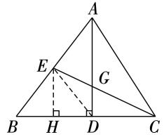  
第17题

18. $\mathrm { ( 1 ) } \ \stackrel { \bullet \cdot } { \ } P H \bot O B , M D \bot O B , \therefore \ \angle P H D = 9 0 ^ { \circ } , P H / \sim$ MD. $\because P M / / O B , Q R / / O B , \therefore \angle P Q R = \angle P H D = 9 0 ^ { \circ } ,$ PM//QR.：四边形PQRM是平行四边形.又： $\angle P Q R =$ $9 0 ^ { \circ }$ , 四边形 PQRM 是矩形 () $\angle A O B = 3 \angle B O N$ 理由: 四边形 PQRM 是矩形, $P S = S R = S Q =$ $\begin{array} { c } { { \frac 1 2 P R . \stackrel { . } { \cdot } \angle S Q R = \angle S R Q . ~ \stackrel { . } { \times } \stackrel { . } { \cdot } ~ O P = \frac 1 2 P R , \stackrel { . } { \cdot } ~ O P = } } \\ { { P S . ~ \stackrel { . } { \cdot } . \angle P O S = \angle P S O . ~ \stackrel { . } { \cdot } ~ Q R ~ / / O B , ~ \stackrel { . } { \cdot } ~ \angle S Q R = } } \end{array}$

BON. $\angle P S O = \angle S Q R + \angle S R Q = 2 \angle S Q R =$   
$2 \angle B O N$ . $\angle P O S = 2 \angle B O N .$ . $\angle A O B = \angle P O S +$   
$\angle B O N = 2 \angle B O N + \angle B O N = 3 \angle B O N .$ .

# 21.3.2 菱 形

1. 2. 3. 4. 5. 6. 7. 8. $4 \sqrt { 1 3 }$

9. $\frac { 1 2 0 } { 1 3 }$ 10. $\left( \frac { \sqrt { 3 } } { 3 } , 0 \right)$ 11. $2 \sqrt { 3 }$ 12.

13. 四边形 ABCD 是平行四边形, $A D / / B C$ .$\angle A E B = \angle F B E . \because E F / / A B , .$ 四边形 ABFE 是平行四边形. BE 平分 $\angle A B C$ , $\angle A B E = \angle F B E$ .$\angle A B E = \angle A E B$ . $A B = A E$ . 四边形 ABFE 是菱形

14.如图,取 $A B$ 的中点 $E$ ,连接 $C E , O E , A C ,$ .由题意,得$A B = B C = 2 . \ \because \angle A B C = 6 0 ^ { \circ } , \therefore \ \triangle A B C$ 是等边三角形.∵ $E$ 为 $A B$ 的 中 点,∴ $B E = { \frac { 1 } { 2 } } A B = 1$ , $C E \bot A B$ .∴ $C E = { \sqrt { B C ^ { 2 } - B E ^ { 2 } } } = { \sqrt { 3 } }$ .在 $\mathrm { R t } \triangle A B O$ 中, $E$ 为斜边的中点,∴ $O E { = } \frac { 1 } { 2 } A B { = } 1 . \stackrel { \because } { \because } O C { \leqslant } O E { + } C E { = } \sqrt { 3 } +$ 1,∴ 当 $O , E , C$ 三点共线时, $\boldsymbol { O C }$ 的长最大,最大值为$\sqrt { 3 } + 1$

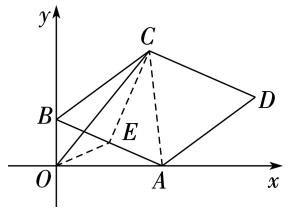  
第 题

15.() $A B / / C D$ , $\angle C A B = \angle D C A$ . AC 为$\angle D A B$ 的 平 分 线, $\angle C A B = \angle D A C .$ . $\angle D C A =$ DAC. $C D { = } A D$ . $A B { = } A D$ , $A B { = } C D . \because A B / /$ $C D$ ,四边形 $A B C D$ 是平行四边形.： $A D { = } A B$ ，四边形 ABCD 是菱形 () 四边形 ABCD 是菱形,$\therefore A C \bot B D , O A = O C = { \frac { 1 } { 2 } } A C , O B = O D = { \frac { 1 } { 2 } } B D = 3 .$ 在$\mathrm { R t } \triangle A O B$ 中 $\angle A O B = 9 0 ^ { \circ } , \therefore \ O A = \sqrt { A B ^ { 2 } - O B ^ { 2 } } =$ ${ \sqrt { 5 ^ { 2 } - 3 ^ { 2 } } } = 4 . \ { \stackrel { \cdots } { \cdot } } \ C E \bot A B , { \dot { \therefore } } \ \angle A E C = 9 0 ^ { \circ } .$ .在 $\mathrm { R t } \triangle A E C$ 中, $O$ 为斜边 $A C$ 的中点, $O E = \frac { 1 } { 2 } A C = O A = 4$

16.() 四边形 $A B C D$ 是平行四边形, $O A = O C$ ,BE//DF. : $\angle O E A = \angle O F C$ .在 $\triangle A O E$ 和 $\triangle C O F$ 中，$\angle O E A = \angle O F C$ ,  
$\scriptstyle \{ \angle A O E = \angle C O F , \therefore \ \triangle A O E \supseteq \triangle C O F . \ \therefore \ A E = C F$ $\scriptstyle { \log = { O C } }$ ,

()添加条件不唯一,如 $E F \perp B D$ 理由: 四边形$A B C D$ 是平行四边形, $O B { = } O D$ . $\triangle A O E { \cong } \triangle C O F$ ,: $O E { = } O F$ . 四边形 BFDE 是平行四边形. $E F \perp$ $B D$ ,．四边形BFDE 是菱形.

17.() 四边形 $A B C D$ 是平行四边形, $A D / / B C$ .： $\angle O A F = \angle O C E . \because E F$ 是线段 $A C$ 的垂直平分线,： $O A = O C$ , $E F \perp A C$ .在 $\triangle A O F$ 和 $\triangle C O E$ 中,$\angle O A F { = } \angle O C E$ ,  
$\scriptstyle \left\{ O A = O C \right.$ AOF COE. $A F { = } C E$ .又$\angle A O F = \angle C O E$ ,  
： $A F / / C E$ , 四边形 $A E C F$ 是平行四边形.又 $E F \bot$ $A C$ ,．四边形 AECF是菱形（2）由（1)，知四边形是菱形, $O A = O C , E F \bot A C , \therefore \ C E = A E = 2 .$ ,$O E { = } O F$ .: AC⊥AB,: EF//AB.: $\angle O E C = \angle B =$ $3 0 ^ { \circ } . \therefore O C = { \frac { 1 } { 2 } } C E = 1 . \therefore O E = { \sqrt { 2 ^ { 2 } - 1 ^ { 2 } } } = { \sqrt { 3 } } . \therefore A C =$ $2 O C = 2 , E F = 2 O E = 2 { \sqrt { 3 } }$ . 四边形 $A E C F$ 的面积为$\frac { 1 } { 2 } A C \cdot E F = \frac { 1 } { 2 } \times 2 { \times } 2 \sqrt { 3 } = 2 \sqrt { 3 }$

18. 四边形 ABCD 是矩形 $\angle A = \angle C = 9 0 ^ { \circ }$ ，$A B { } = C D , A B / / C D , A D / / B C . \therefore \angle A B D = \angle C D B .$ 由折叠的性质,可知 $\angle E B D = \frac { 1 } { 2 } \angle A B D , \angle F D B = \frac { 1 } { 2 } \angle C D B ,$ .： $\scriptstyle \angle E B D = \angle F D B . { \dot { \bullet } } \ x B / / D F . { \dot { \bullet } } .$ 四边形 BFDE 是平行四边形 () 四边形 BFDE 是菱形, $B E { = } D E$ ,$\angle E B D = \angle F B D$ . 四边形 $A B C D$ 是矩形, $\angle A B C =$ $9 0 ^ { \circ }$ .由折叠的性质 可知 $\angle A B E = \angle E B D , \therefore \angle A B C =$ $\angle A B E + \angle E B D + \angle F B D = 3 \angle A B E = 9 0 ^ { \circ } . \therefore \angle A B E =$ $3 0 ^ { \circ }$ . $B E = 2 A E$ . 在 $\mathrm { R t } \triangle A B E$ 中,由勾股定理,得$A E ^ { 2 } + A B ^ { 2 } = B E ^ { 2 }$ ,即 $A E ^ { 2 } + 2 ^ { 2 } = ( 2 A E ) ^ { 2 } . \therefore A E = \frac { 2 \sqrt { 3 } } { 3 } .$ .： $D E = B E = 2 A E = \frac { 4 \sqrt { 3 } } { 3 }$ 菱 形 BFDE 的 面 积 为$D E \cdot A B { = } \frac { 4 \sqrt { 3 } } { 3 } { \times } 2 { = } \frac { 8 \sqrt { 3 } } { 3 }$

# 21.3.3 正 方 形

1. 2. 3. 4. 5. 6. 7. 8. $1 5 ^ { \circ }$ 或   
$4 5 ^ { \circ }$ 9. 10. $6 \sqrt { 2 }$ 11. $\frac { \sqrt { 3 4 } } { 2 }$ 12. 13. $2 \sqrt { 3 }$

14.() 四边形 $A B C D$ 是正方形, $A B { = } A D$ , $\angle B =$ $\angle B A D = \angle A D C = 9 0 ^ { \circ } .$ . $\angle A D F = 1 8 0 ^ { \circ } - \angle A D C = 9 0 ^ { \circ }$ .: $\angle B = \angle A D F$ .在 $\triangle A B E$ 和 $\triangle A D F$ 中, $\scriptstyle { \left\{ \begin{array} { l l } { A B = A D , } \\ { \angle B = \angle A D F } \\ { B E = D F , } \end{array} \right. }$ ,$\therefore \bigtriangleup A B E { \cong } \bigtriangleup A D F ( 2 ) \ \because \ \bigtriangleup A B E { \cong } \bigtriangleup A D F , \therefore A E =$ $A F = 5$ ， $\angle B A E = \angle D A F . \because \angle B A E + \angle E A D = 9 0 ^ { \circ }$ ，： $\angle D A F + \angle E A D = 9 0 ^ { \circ }$ 即 $\angle E A F = 9 0 ^ { \circ }$ . $E F =$ $\sqrt { A E ^ { 2 } + A F ^ { 2 } } = 5 \sqrt { 2 }$

15.() 四边形 $A B C D$ 是正方形, $A B = C B$ ,$\angle A B C = 9 0 ^ { \circ }$ . $\triangle E B F$ 是等腰直角三角形 $\angle E B F =$ $9 0 ^ { \circ } , \therefore B F = B E . \ \because \ \angle A B F = 9 0 ^ { \circ } - \angle C B F ,$ , $\angle C B E =$ $9 0 ^ { \circ } - \angle C B F$ , $\angle A B F = \angle C B E$ .在 $\triangle A B F$ 和 $\triangle C B E$ 中, $\left. \begin{array} { l } { A B = C B , } \\ { \angle A B F = \angle C B E , \therefore \triangle A B F \overset { \triangledown } { = } \triangle C B E \quad ( \frac { \triangledown } { \partial \mathbf { E } } \rbrack \mathrm { ~ , ~ } } \\ { B F = B E , } \end{array} \right.$ () CEF是直角三角形 理由: $\triangle E B F$ 是等腰直角三角形,$\angle E B F = 9 0 ^ { \circ }$ , $\angle B F E = \angle F E B = 4 5 ^ { \circ }$ . $\angle A F B =$ $1 8 0 ^ { \circ } ~ - ~ \angle B F E ~ = ~ 1 3 5 ^ { \circ } .$ .又 $\triangle A B F \cong \triangle C B E$ ,: $\angle A F B = \angle C E B = 1 3 5 ^ { \circ }$ . $\angle C E F = \angle C E B \ -$ $\angle F E B = 1 3 5 ^ { \circ } - 4 5 ^ { \circ } = 9 0 ^ { \circ } . \therefore \bigtriangleup C E F$ 是直角三角形.

16. $( 1 ) \because E , F$ 分别是边 $A B , A C$ 的中点,∴ $E F / / B C$ ,$E F { = } { \frac { 1 } { 2 } } B C$ .同理，可得 $G H / / B C , G H = \frac { 1 } { 2 } B C , \therefore E F / /$ $G H , E F = G H$ .四边形EFHG是平行四边形() $E , F , G$ 分别是 $A B , A C , P B$ 的中点, $E F =$ $\frac { 1 } { 2 } B C = 5 , E G = \frac { 1 } { 2 } A P = 3 .$ 由(1),知四边形 EFHG 是平行四边形, 四边形 $E F H G$ 的周长为 $2 ( E F + E G ) = 2 \times$ $( 5 + 3 ) = 1 6$ ()当线段 $A P , B C$ 满足 $A P { = } B C$ 且 $A P \bot$ $B C$ 时,四边形 EFHG 是正方形 理由:∵ $A P = B C$ ,$E F = \frac { 1 } { 2 } B C , E G = \frac { 1 } { 2 } A P , \therefore E F = E G . \therefore \mathcal { O } E F .$ HG是菱形. $\cdot _ { \textit { E } , F , G }$ 分别是 $A B , A C , P B$ 的中点, $E F / / B C$ ,$E G / / A P . \stackrel {  } { : } A P \bot B C , \therefore E F \bot E G . \therefore$ ·菱形EFHG 是正方形.

17.() $\because D E \bot B C , \therefore \angle D F B = 9 0 ^ { \circ } , \because \angle A C B = 9 0 ^ { \circ } ,$ ,$\angle A C B = \angle D F B . \therefore A C / / D E . \because M N / / A B$ ,即 CE$A D$ ,四边形 $A D E C$ 是平行四边形．： $C E = A D$

()四边形 BECD 是菱形 理由: $D$ 为 $A B$ 的中点,$A D = B D$ . $C E = A D$ $B D = C E$ . BD CE四边形 BECD 是平行四边形. $\angle A C B = 9 0 ^ { \circ } , D$ 为的中点, $C D = B D$ . 四边形 BECD 是菱形.

() 四边形 BECD 是正方形, $\angle B D E = 4 5 ^ { \circ }$ . DE$A C , \therefore \angle A = \angle B D E = 4 5 ^ { \circ }$

18.()两条小路等长且相互垂直 理由: 四边形ABCD是正方形, $B A = A D = C D , \angle B A E = \angle D = \angle C = 9 0 ^ { \circ } .$ .： $D E { = } C F$ $\dot { } , \dot { } \dot { } \cdot  \ \dot { A } D - D E = C D - C F$ ,即 $A E = D F$ .在 $\triangle B A E$ 和 $\triangle A D F$ 中, $\left. \begin{array} { l } { B A = A D , } \\ { \angle B A E = \angle D , \therefore \ \triangle B A E \cong } \\ { A E = D F , } \end{array} \right.$ ADF. $B E = A F$ ， $\angle A B E = \angle D A F$ . $\angle B A E =$ $\angle B A O + \angle D A F = 9 0 ^ { \circ } , \therefore \angle B A O + \angle A B E = 9 0 ^ { \circ } .$ ： $\cdot \angle A O B = 1 8 0 ^ { \circ } - ( \angle B A O + \angle A B E ) = 9 0 ^ { \circ } . \therefore A F \bot$ BE.:小路 $A F$ 与小路 $B E$ 等长，且相互垂直．（2）能修建成 $A D = A B = C D = 4$ 米, $A E = 3$ 米, $D E =$ $C F = 1$ 米.在 $\mathrm { R t } \triangle A B E$ 中，由勾股定理，得 $B E =$ ${ \sqrt { A B ^ { 2 } + A E ^ { 2 } } } = { \sqrt { 4 ^ { 2 } + 3 ^ { 2 } } } = 5$ (米).由(),得 $A F { = } B E { = }$ 5米, $, A F \perp B E . \ \because \ S _ { \triangle A B E } = { \frac { 1 } { 2 } } B E \cdot O A = { \frac { 1 } { 2 } } A B \cdot A E$ ： $O A = { \frac { A B \cdot A E } { B E } } = { \frac { 3 \times 4 } { 5 } } = 2 .$ .(米). $O F { = } A F { - } O A { = }$

$5 - 2 . 4 { = } 2 . 6$ (米). $2 , 6 { > } 2 , 5$ , 路段 $O B$ 上不存在符合题意的点 $P$ . 点 $P$ 在边 $B C$ 上.在 $\mathrm { R t } \triangle P C F$ 中,由勾股定理 得 $P C = { \sqrt { F P ^ { 2 } - F C ^ { 2 } } } = { \sqrt { 2 . 5 ^ { 2 } - 1 ^ { 2 } } } = { \frac { \sqrt { 2 1 } } { 2 } } ($ (米).$\therefore B P = B C - P C = \left( 4 \mathrm { - } \frac { \sqrt { 2 1 } } { 2 } \right) \ast \cdot \because 4 - \frac { \sqrt { 2 1 } } { 2 } > 1 . 5 ,$ ,能修建成这样的小路 能修建 条

19.() 四边形 $A B C D$ 是正方形, $A D { = } A B$ , $\angle D A E =$ $\angle B A E$ .在 $\triangle A D E$ 和 $\triangle A B E$ 中, $\scriptstyle { \left\{ \begin{array} { l l } { A D = A B , } \\ { \angle D A E = \angle B A E { \mathrm { . } } } \\ { A E = A E , } \end{array} \right. }$ ,： $\therefore \bigtriangleup A D E \cong \bigtriangleup A B E . \therefore D E = B E$ () $\angle E B C = \angle F B C$ 理由:如 图,设 $B C , D F$ 交 于 点 $H . ~ \because ~ D F \perp x$ 轴,$\angle D C H = 9 0 ^ { \circ } , \ \therefore \ \angle H F B = \angle D C H . \ \because \ \angle D H C =$ $\angle B H F , \therefore \angle C B F = \angle C D F . \because \angle A D E \cong \angle A B E$ ,： $\angle A D E = \angle A B E . \because \angle A D C = \angle A B C = 9 0 ^ { \circ }$ ,： $\angle A D C - \angle A D E = \angle A B C - \angle A B E$ ,即 $\angle E D C =$ $\angle E B C . \therefore \angle E B C = \angle F B C ,$ . ( )如图,过点 $D$ 作$D G \bot y$ 轴于点 $G$ ，则易得四边形 $O G D F$ 是矩形.四边形 ABCD 是 正 方 形 $A D = A B$ $\angle B A D = 9 0 ^ { \circ }$ .： $\angle D G A = \angle A O B = 9 0 ^ { \circ } , \therefore \ \angle B A O = 9 0 ^ { \circ } - \angle G A D =$ ADG. BAO ADG. $A O = D G$ , $B O = A G$ .点 $A , B$ 的坐标分别为 $\left( 0 , 1 2 \right) , \left( 5 , 0 \right) , \Dot { \dots } A O = D G =$ $1 2 , A G = B O = 5 , \ \therefore \ D F = O G = 1 2 + 5 = 1 7 , B F = O F -$ $B O { = } G D { - } O B { = } 1 2 { \mathrm { - } } 5 { = } 7 . \ \cdots \ B E { = } D E , { \dot {  } } \ \triangle B E F$ 的周长为 $B E + E F + B F = D E + E F + B F = D F + B F = 1 7 +$ $7 { = } 2 4$

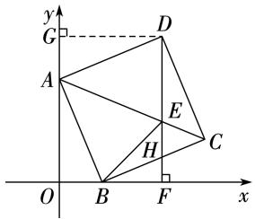  
第 题

# 第二十一章特训

一、1. 2. 3. 4. 5. 6. 7. 8.

二、9. $5 7 ^ { \circ }$ 10. 11. 12. $8 { \sqrt { 3 } }$ 13.答案不唯一,如 $\textcircled{1} \textcircled{2}$ 14.

三、15. 四边形 $A B C D$ 是平行四边形, $B C / / A D$ ,  
$B C = A D = 5$ ： $\angle D = \angle F C E . \because E$ 是 $C D$ 的中点，$\left\{ \begin{array} { c } { \angle D = \angle I } \\ { D E = C E , } \\ { \angle A E D = } \end{array} \right.$ ,  
： $D E { = } C E$ .在 $\triangle A D E$ 和 $\triangle F C E$ 中,$\angle A E D = \angle F E C$ ,  
: $\triangle A D E \cong \triangle F C E$ . $A D = F C = 5 .$ . $B { \cal F } = B { \cal C } +$   
$F C = 5 + 5 = 1 0$   
16.() $O$ 是 $A C$ 的中点, $O A = O C . \stackrel { \cdot \cdot } { \cdot } O B = O D$ ,  
四边形 $A B C D$ 是平行四边形. $\angle A B C = 9 0 ^ { \circ }$ , 四边形 $A B C D$ 是矩形 () $A B = a$ , $B C = b$ , $\triangle A O B$ 的周长为 $l _ { 1 }$ , $\triangle B O C$ 的周长为 $l _ { 2 }$ ,四边形 $A B C D$ 的周长为 $l _ { 3 }$ ,： $\bullet l _ { 2 } - l _ { 1 } = B C - A B = b - a = 2 , l _ { 3 } = 2 ( A B + B C ) =$ $2 ( a + b ) = 2 8 . \ \stackrel { . } { \cdot } \ \left\{ { b - a = 2 , } \atop { b + a = 1 4 }  \right.$ 解 得 $\begin{array} { l } { { \displaystyle { a = 6 } , } } \\ { { \displaystyle { b = 8 } . } } \end{array} \dot { \bf { \sigma } } \dot { \bf { \sigma } } \cdot { \bf { \sigma } } A B = 6 ,$ ,  
$B C = 8 , \therefore A C = \sqrt { A B ^ { 2 } + B C ^ { 2 } } = 1 0$

17. $\because B G / / A F , \therefore \ \angle A F E = \angle B G E$ ， $\angle F A E =$ $\angle G B E . \because E$ 是 $A B$ 的中点, $A E = B E$ .在 $\triangle A E F$ 和$\triangle B E G$ 中, $\left. \begin{array} { l } { { \angle A F E { = } \angle B G E , } } \\ { { \angle F A E { = } \angle G B E , \therefore \bigtriangleup A E F \cong \bigtriangleup B E G } } \\ { { A E { = } B E , } } \end{array} \right.$

(2)选择不唯一,如选择 $\textcircled{1}$ 四边形 $A G B F$ 是矩形 由(1),知△AEF≌△BEG.∴ $A F { = } B G$ .∵ $A F / / B G$ ,∴ 四边形 AGBF 是平行四边形.∴ $E F = { \frac { 1 } { 2 } } F G$ .∵四边形$A B C D$ 是平行四边形,∴ $A B = C D$ .∵ $E F = { \frac { 1 } { 2 } } C D$ : $F G { = } A B$ . 四边形 $A G B F$ 是矩形

18.() 四边形 $A B C D$ 为正方形, $A D { = } C B$ ,CB$A D$ $\angle A D E = \angle C B F$ .在 $\triangle A D E$ 和 $\triangle C B F$ 中，$\scriptstyle { | A D = C B }$   
$\scriptstyle \angle A D E = \angle C B F , \therefore \bigtriangleup A D E \cong \bigtriangleup C B F$ ()如图,连接$\scriptstyle { \boldsymbol { D } } E = B F$ ,  
$A C$ 交 $B D$ 于点 $O _ { ☉ }$ . 四边形 $A B C D$ 为正方形, $B D { = } 1 0$ ,∴ BD 垂直平分 $A C , O A = O C = O B = O D = { \frac { 1 } { 2 } } B D = 5 .$ ： $A F = C F$ , $A E = C E$ .由(),可知 $\triangle A D E { \cong } \triangle C B F$ ,： $A E { = } C F$ . $A F = C F = A E = C E$ . 四边形 $A E C F$ 是菱形. $E F { = } 2 O F$ . 四边形 $A E C F$ 的周长为 $4 \sqrt { 3 4 }$ ,: $A F = { \sqrt { 3 4 } }$ .在 $\mathrm { R t } \triangle A O F$ 中,由勾股定理,得 $O F =$ $\scriptstyle { \sqrt { A F ^ { 2 } - O A ^ { 2 } } } = { \sqrt { ( { \sqrt { 3 4 } } ) ^ { 2 } - 5 ^ { 2 } } } = 3 , \ { \dot { \bullet } } \ \ E F = 2 O F = 6$

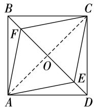  
第18题

19.() $O , D$ 分别是边 $A B , B C$ 的中点, OD 是$\triangle A B C$ 的中位线. $O D / / A C$ ,即 $E D / / A C . \stackrel { \cdot \cdot } { \cdot } A E / / B C$ ,四边形 $A E D C$ 是平行四边形. $A E { = } C D$ . $D$ 是边$B C$ 的中点, $B D { = } C D$ . $A E { = } B D$ . $A E / / B D$ , 四边形 $A E B D$ 是平行四边形 ()四边形AEBD 是矩形： $A B { = } A C , D$ 是边 $B C$ 的中点, $A D \bot B C . \therefore \angle A D B =$ $9 0 ^ { \circ }$ .由()可知,四边形 AEBD 是平行四边形, 四边形是矩形

20.() 点 $B , D$ 关于 $A C$ 所在直线对称, $B D \bot A C$ ,$B O { = } D O . \ \because \ A B / / C D , \therefore \ \angle A B O { = } \angle C D O .$ 在 $\triangle A B O$ 和

$\angle A B O = \angle C D O$ ,$\triangle C D O$ 中, $\scriptstyle \left\{ B O = D O \right.$ $\triangle A B O \cong \triangle C D O .$ .$\angle A O B = \angle C O D$ ,： $A B { = } C D . \ \because \ A B / / C D , \ . .$ 四边形 $A B C D$ 是平行四边形. $B D \bot A C$ , 四边形 $A B C D$ 是菱形 ()由(),得四边形 $A B C D$ 是菱形. $O C = O A = { \frac { 1 } { 2 } } A C , A D = B C =$ $C D = 5$ ..BE=BC+CE=5+3=8.∵DE⊥BC,$\angle E = 9 0 ^ { \circ }$ .在 $\mathrm { R t } \triangle C E D$ 中,由勾股定理,得 $D E =$ ${ \sqrt { C D ^ { 2 } - C E ^ { 2 } } } = { \sqrt { 5 ^ { 2 } - 3 ^ { 2 } } } = 4$ ;在 $\mathrm { R t } \triangle B E D$ 中,由勾股定理,得 $B D = \sqrt { B E ^ { 2 } + D E ^ { 2 } } = \sqrt { 8 ^ { 2 } + 4 ^ { 2 } } = 4 \sqrt { 5 } . \because S _ { \ast \ast \ast \ast \mathrm { U A B C D } } =$ $D E \cdot B C = \frac { 1 } { 2 } A C \cdot B D = O C \cdot B D$ ，即 $D E \cdot B C = O C$ $B D , \therefore \ O C = { \frac { D E \cdot B C } { B D } } = { \frac { 4 \times 5 } { 4 { \sqrt { 5 } } } } = { \sqrt { 5 } }$

# 第二十二章 函 数

# 22.1 函数的概念

1. 2. 3. 4. 5. $x { \leqslant } 3$ 且 $x \neq 2$ 6. $\pm 2$

7. $_ { y } = \frac { 3 6 0 } { x }$ 8. $y = - x ^ { 2 } + 2 0 x ( 0 < x < 1 0 )$

9. $\mathrm { { } } y = 3 0 - 0 . \ 5 t$ 变量: $y \cdot t$ 常量: ,.

10.() 等腰三角形的两腰相等,周长为 $1 0 \ \mathrm { c m } , \therefore \ 2 x +$ $_ { y } = 1 0 . ~ \therefore ~ y$ 关于 $_ { \mathcal { X } }$ 的函数解析式为 $y = - 2 x + 1 0$ () 三角形两边之和大于第三边, $2 x > y$ ,即 $2 x >$ $- 2 x + 1 0 . \therefore x > 2 . 5 . \because y > 0$ ,即 $- 2 x + 1 0 > 0$ , $x < 5$ .： $_ { \mathcal { X } }$ 的取值范围是 $2 , 5 { < } x { < } 5$

$\textstyle { \binom { - 4 k + b = - 3 } { 2 k + b = 0 } }$ , $\left\{ { { k = \frac { 1 } { 2 } } , \atop { b = - 1 . } } \right.$   
11.()根据题 意,可 得 解 得.  
∴ 当 $x { < } 4$ 时, $y$ 与 $_ { \mathcal { X } }$ 之间的函数解析式为 ${ } _ { y } = { \frac { 1 } { 2 } } x - 1$

()若 $x < 4$ ,则 ${ \frac { 1 } { 2 } } x - 1 = - 1$ ，解得 $x = 0 .$ 若 $x \geqslant 4$ ，则 的 $_ { \mathcal { X } }$ 的值为 或 () $2 { < } x { < } 6$

12.() $6 { \sqrt { 2 } } \ \mathrm { c m }$ () $6 \sqrt { 2 }$ ()当 $0 { \leqslant } { x } { \leqslant } 6$ 时,如图$\textcircled{1}$ . $A F = x$ , $\angle D F E = 9 0 ^ { \circ }$ ,易 得 $\angle C A B = 4 5 ^ { \circ }$ ,$\angle A G F = 4 5 ^ { \circ } = \angle C A B . \ \therefore \ F G = A F = x \ \mathrm { c m } . \ \therefore \ S = \nonumber$ ${ \frac { 1 } { 2 } } x ^ { 2 }$ .当 $6 { < } _ { \mathcal { X } } { \leqslant } 6 { \sqrt { 2 } }$ 时,如图 $\textcircled{2}$ .∵ 易得 $G F { = } B F { = } A B -$ $A F = ( 1 2 - x ) \mathrm { c m } , \therefore \ S = { \frac { 1 } { 2 } } \times 6 { \sqrt { 2 } } \times 6 { \sqrt { 2 } } - { \frac { 1 } { 2 } } ( 1 2 - x ) ^ { 2 } =$ -1 2+12x-36.当6 2<x≤12时,如图③.∵ 易得$B F { = } F G { = } ( 1 2 { - } x ) \mathrm { c m } , { \therefore } D G { = } D F { - } F G { = } ( 6 { \sqrt { 2 } } - 1 2 + 1$ $x ) \mathrm { c m } ,$ ：易得 $D H = H G = { \frac { D G } { \sqrt { 2 } } } = \left( 6 { - } 6 { \sqrt { 2 } } + { \frac { \sqrt { 2 } } { 2 } } x \right) \mathrm { { c m } } .$ ： $: S = { \frac { 1 } { 2 } } \times 6 { \sqrt { 2 } } \times 6 { \sqrt { 2 } } - { \frac { 1 } { 2 } } \left( 6 - 6 { \sqrt { 2 } } + { \frac { \sqrt { 2 } } { 2 } } x \right) ^ { 2 } = - { \frac { 1 } { 4 } } x ^ { 2 } +$ $( \ 6 \ - \ 3 { \sqrt { 2 } } ) x + 3 6 { \sqrt { 2 } } - 1 8 .$ .综 上 所 述, $S \ =$ $\left\{ \begin{array} { l } { \displaystyle \frac { 1 } { 2 } x ^ { 2 } ( 0 \leqslant x \leqslant 6 ) , } \\ { \displaystyle - \frac { 1 } { 2 } x ^ { 2 } + 1 2 x - 3 6 ( 6 < x \leqslant 6 \sqrt { 2 } ) , } \\ { \displaystyle - \frac { 1 } { 4 } x ^ { 2 } + ( 6 - 3 \sqrt { 2 } ) x + 3 6 \sqrt { 2 } - 1 8 ( 6 \sqrt { 2 } < x \leqslant 1 2 ) } \end{array} \right.$

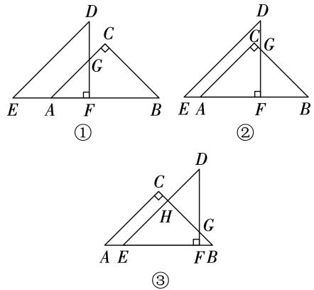  
第 题

# 22.2 函数的表示

1. 2. 3. 4. 5.() () 6.   
7.12

8.()时间 离家的距离 () ()当 $0 { \leqslant } _ { \mathcal { X } } { \leqslant }$ 时,速度为 $1 2 0 0 \div 4 = 3 0 0 ( \mathrm { m / m i n } )$ .当 $1 2 { \leqslant } x { \leqslant } 1 4$ 时,速度为 $( 1 ~ 5 0 0 - 6 0 0 ) \div ( 1 4 - 1 2 ) = 4 5 0 ( \mathrm { m / \mathrm { m i n } ) }$ ). $3 0 0 <$ , 小潘骑车最快的速度是 $4 5 0 ~ \mathrm { m / m i n }$

9.(1) $6 0 ~ \mathrm { k m / h }$ (2)3 (3)由题意,得 $y _ { \mathbb { H } } = 6 0 t$ , $y _ { Z } =$ ${ \frac { 3 0 0 } { 4 - 1 } } ( t - 1 ) = 1 0 0 t - 1 0 0 . \ { \dot { \cdots } } \ 6 0 t = 1 0 0 t - 1 0 0$ ,解得 $t =$ $2 , 5 , \because 2 . 5 \mathrm { - } 1 \mathrm { = } 1 , 5 \mathrm { ( h ) }$ ), 乙车出发 $1 . 5 \mathrm { h }$ 后追上甲车

() $\textcircled{1}$ 当乙车未出发时, $6 0 t = 5 0$ ,解得 $\scriptstyle t = { \frac { 5 } { 6 } } . \textcircled { 2 }$ 当甲、乙两车未相遇时, $6 0 t - ( 1 0 0 t - 1 0 0 ) = 5 0$ ,解得 $t = \frac { 5 } { 4 }$ . $\textcircled{3}$ 当甲、乙两车相遇后,且乙车未到达 城时, $1 0 0 t - 1 0 0 -$ $6 0 t = 5 0$ ,解得 $t = \frac { 1 5 } { 4 }$ $\textcircled{4}$ 当乙车到达 城时, $6 0 t + 5 0 =$ ,解得 $t = \frac { 2 5 } { 6 }$ + 甲车行驶的时间为 $\frac { 5 } { 6 }$ 或 $\frac { 5 } { 4 } \mathrm { h }$ 或 $\frac { 1 5 } { 4 }$ h.  
或 $\frac { 2 5 } { 6 } \mathrm { ~ h ~ }$

10.() $y = 1 0 - 0 . 5 x$ ()如图所示 () $\textcircled{1}$ 不能 当$x = 1 6$ 时， $y = 1 0 - 0 . 5 x = 1 0 - 0 . 5 \times 1 6 = 2 . \because 2 < 4 _ { \cdot }$ ，此船按原速前进不能通过此桥 $\textcircled{2}$ 当 $y = 4$ 时, $1 0 -$ $0 , 5 x { = } 4$ ,解得 $x = 1 2$ . 请船长将速度提高到 ${ \frac { 1 6 \times 2 4 } { 1 2 } } =$

$3 2 ( \mathrm { { k m } / \mathrm { { h } ) } }$ )及以上

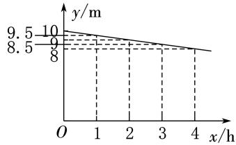  
第10题

# 第二十二章特训

一、1. 2. 3. 4.

二、5. $x { > } 2$ 6. $y = 5 0 \mathrm { - } 0 . 1 5 x$ 7. $\frac 1 2$ 8.42三 9. 小华出发的时间 $t$ 他们距起点的距离 $s$ (2)53.5(3)设 $_ { \mathcal { X } }$ 时 小华追上小周. $5 x = 1 0 0 +$ $3 , 5 x$ ,解得 $x = \frac { 2 0 0 } { 3 }$ ${ \frac { 2 0 0 } { 3 } } \times 5 = { \frac { 1 0 0 0 } { 3 } } ( \mathrm { m } )$ ). 当小华追上小周时,他们距起点的距离为 $\frac { 1 0 0 0 } { 3 } \mathrm { m }$

10.()出发后的时长 $_ { \mathcal { X } }$ 离山脚的相对高度 $y$ ()   
20 (3)300 600 (4)60或105

11.() ()易知当点 $P$ 与点 $A$ 或 $C$ 重合时,不符合题意. $\textcircled{1}$ 当点 $P$ 在 $A B$ 上(不与点 $A$ 重合),点 $F$ 在 $B C$ 的左侧或 $B C$ 上 即 $0 { < } t { \leqslant } 2$ 时 矩形 PDEF 和 $\triangle A B C$ 的重叠部分为矩形PDEF. $S = S _ { \# \# \# P D E F } = P D \cdot P F = 2 t$ ·$\frac { 1 } { 2 } \cdot 2 t = 2 t ^ { 2 }$ . $\textcircled{2}$ 当点 $P$ 在 $A B$ 上(不与点 $B$ 重合),点 $F$ 在 $B C$ 的右侧,即 $2 { < } t { < } 3$ 时,如图 $\textcircled{1}$ ,此时矩形 PDEF 和$\triangle A B C$ 的重叠部分为五边形,不符合题意. $\textcircled{3}$ 当点 $P$ 在$B C$ 上(不与点 $C$ 重合)时,如图 $\textcircled{2}$ ,设 $E F$ 与 $B C$ 交于点$G$ ，此时矩形PDEF 和 $\triangle A B C$ 的重叠部分为梯形 $P D E G$ 由题意,可得 $P B = 2 \sqrt { 2 } ( t - 3 ) = 2 \sqrt { 2 } t - 6 \sqrt { 2 } ,$ $A C = A B =$ $6 . \ \dot { \bullet ^ { \bullet } } \ B C = 6 \sqrt 2 . \ \dot { \bullet ^ { \bullet } } \ P C = B C - P B = 1 2 \sqrt 2 - 2 \sqrt 2 t . \ \bullet ^ { \bullet } \ 0 \leqslant$ $P B { < } 6 { \sqrt { 2 } } , \therefore 0 { \leqslant } 2 { \sqrt { 2 } } t { - } 6 { \sqrt { 2 } } { < } 6 { \sqrt { 2 } } , \therefore 3 { \leqslant } t { < } 6 , \cdots$ 易得$\angle F P G = \angle C = \angle P G F = \angle E G C = \angle D P C = 4 5 ^ { \circ } .$ ，$\therefore P F = F G , E G = E C , P D = D C , \therefore P C = { \sqrt { 2 } } P D =$ $1 2 \sqrt { 2 } - 2 \sqrt { 2 } \ t . \ \dot { \bullet } \ P D = E F = 1 2 - 2 t , \ \stackrel { \cdot \cdot } { : } \ P D = 2 P F ,$ ,$\ . \ P F = F G = 6 - t , \ \therefore \ E G = E F - F G = 6 - t , \ \therefore \ S = 1$ $S _ { \oplus \oplus \tt F P D E G } = \frac { 1 } { 2 } \left( E G + P D \right) \bullet D E = \frac { 1 } { 2 } ( 6 - t + 1 2 - 2 t ) ( 6 -$ $\scriptstyle t ) = { \frac { 3 } { 2 } } ( 6 - t ) ^ { 2 }$ .综上所述, $ { \boldsymbol { S } } = \left\{ \begin{array} { l l } { 2 t ^ { 2 } ( 0 < t \leqslant 2 ) , } \\ { 3 } \\ { \frac { 2 } { 2 } ( 6 - t ) ^ { 2 } ( 3 \leqslant t < 6 ) } \end{array} \right.$

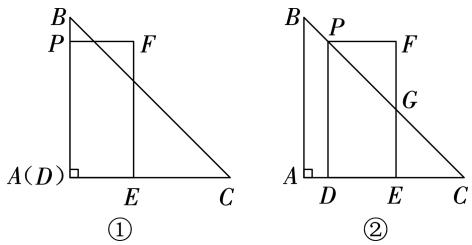  
第11题

# 第二十三章 一次函数

# 23.1 一次函数的概念

1. 2. 3. 4. 5. 6. 7. 8.

9. $y = 1 2 x + 2$

10. 函数 $y = ( m - 2 ) x ^ { 3 - | m | } + 2 n - 5$ 是正比例函数,： $\left\{ { 3 - 1 m \atop m - 2 \neq 0 } \right. \nonumber$ 解得 $\begin{array} { r } { \{ { n = 2 . 5 } ,  } \\ {  \begin{array} { r l } { m = - 2 . } \end{array} } \end{array}$ 函数解析式为 $y = - 4 x$ .

11.()设 $y - 2 = k \left( 2 x + 3 \right)$ .把 $x = 1$ , $y = 1 2$ 代入,得 $1 2 - 2 { = } 5 k$ ,解得 $k { = } 2 . \ \therefore \ y { - } 2 { = } 2 ( 2 x { + } 3 )$ ,即 $y = 4 x +$ $8 . \dot { \cdot } \cdot \boldsymbol { y }$ 与 $_ { \mathcal { X } }$ 之间的函数解析式为 $y = 4 x + 8$ ()当 $y = 4$ 时, $4 x + 8 = 4$ ,解得 $x = - 1$

12.() $y = 0 . 1 x , y$ 是 $_ { \mathcal { X } }$ 的正比例函数 () 海拔每升高 $1 ~ \mathrm { k m }$ ,气温下降 $5 ~ \mathrm { { } ^ { \circ } C }$ , $_ { x = 2 8 - 5 y }$ ,即 ${ } _ { y = - \frac { 1 } { 5 } x + }$ 28,y 不是x 的正比例函数

13.()设 $y + 6 = k \left( x + 1 \right) \left( k \neq 0 \right)$ .把 $\scriptstyle x = 3 , y = 2$ 代入,得 $2 + 6 = k \left( 3 + 1 \right)$ ),解得 $k = 2 , \ \bullet \ \cdot \ y + 6 = 2 ( x + 1 ) . \ \bullet \ \cdot \ y =$ $2 x - 4$ ()在 $y = 2 x - 4$ 中,当 $x = 0$ 时, $y = - 4$ ,: $A ( 0 , - 4 )$ ).当 $y = 0$ 时, $2 x - 4 = 0$ ,解得 $x = 2 , \overset { \cdot } { \underset { \cdot } { \cdot } } B ( 2$ ,). $\triangle A O B$ 的面积 $\scriptstyle = { \frac { 1 } { 2 } } \times 2 \times 4 = 4$

14. 依题意 得 $\stackrel {  \begin{array} { l } { {  m - 2 9 }  \ne 0 , } } \\ { {  ( m - 3 0 ) ^ { 2 } = 1  } } \end{array}$ 解得 $m = 3 1$ ,

(2）∵ $\cdot \ \frac { 1 } { m + m ^ { 2 } } { = } \frac { 1 } { m ( 1 + m ) } { = } \frac { 1 } { m } - \frac { 1 } { m + 1 } .$ - 1 .∴ 原式=1-$\frac { 1 } { 2 } + \frac { 1 } { 2 } - \frac { 1 } { 3 } + \frac { 1 } { 3 } - \frac { 1 } { 4 } + \cdots + \frac { 1 } { 3 1 } - \frac { 1 } { 3 2 } = 1 - \frac { 1 } { 3 2 } = \frac { 3 1 } { 3 2 }$

# 23.2 一次函数的图象和性质

1. 2. 3. 4. 5. 6. 7. $1 { < } k { < } 3$ $\mathbf { 8 } , \mathbf { > { \mu } 9 }$ . $y = x - 2$ 10. $k _ { 2 } { \ < } k _ { 3 } { \ < } k _ { 1 }$

11.() 一次函数 $y = k x + b$ （ $k \neq 0$ )的图象经过点$( - 1 , 1 ) , ( 2 , 7 ) , \dot { \mathfrak { a } } \left\{ _ { 2 k + b = 7 } ^ { - k + b = 1 } \right.$ ,解得 一次函数.的解析式为 $y = 2 x + 3$ ()如图所示

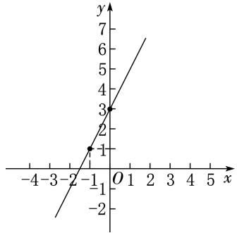  
第 题

12.()根据题意,设 $y - 1 = k \left( x + 3 \right)$ ). 当 $x = - 1$ 时,$y = 3 , \therefore 3 - 1 = k ( - 1 + 3 )$ ，解得 $k = 1 . \ \therefore \ y - 1 = x + 3$ ，即 $y = x + 4 . { \overset { \cdot } { \cdot } } y$ 与 $_ { \mathcal { X } }$ 之间的函数解析式为 $y = x + 4$ ()将 $( a , - 2 )$ )代入 $y = x + 4$ ,得 $\cdot 2 { = } a + 4$ ,解得 $a = - 6$ ()不在 理由:当 $x = - 2$ 时, $y = - 2 + 4 = 2 \neq 5$ ,则点$( - 2 , 5 )$ )不在这个函数的图象上.

13.(1)在 $_ { y = \frac { 1 } { 2 } x }$ 中,当 $x = 2$ 时, $y = 1$ ,∴ 点 $A$ 的坐标为(2,1).易知直线 $l _ { 3 }$ 对应的函数解析式为 ${ _ { y } } = { \frac { 1 } { 2 } } { _ { x } } - 4$ 当 $y = - 2$ 时, $\scriptstyle - 2 = { \frac { 1 } { 2 } } x - 4$ ，解得 $\ x { = } 4 , \therefore$ 点 $C$ 的坐标为(, ).设直线 $l _ { 2 }$ 对应的函数解析式为 $y = k x + b$ .将$A ( 2 , 1 ) , C ( 4 , - 2 )$ 代人，得 $\binom { 2 k + b = 1 , } { 4 k + b = - 2 }$ 解得 $\left\{ \begin{array} { l l } { { k = - { \frac { 3 } { 2 } } , } } \\ { { } } \\ { { b = 4 . } } \end{array} \right.$ ,,  
直线 $l _ { 2 }$ 对应的函数解析式为 $y = - \frac { 3 } { 2 } x + 4$ （2）易知点 $D$ 的坐标为(,),点 $B$ 的坐标为 $( 0 , - 4 ) , \dot { { \dots } } \ { \cal B D } { = } 8 .$ .点 $C$ 的坐标为 $( 4 , - 2 ) , \therefore$ 点 $C$ 到 $y$ 轴的距离为 .∴ $\triangle B D C$ 的面积 $\stackrel { \cdot } { \_ } = \frac { 1 } { 2 } \times 8 \times 4 = 1 6$

14.()(, ) ( ,) () $\textcircled{1}$ 点 $P \left( \boldsymbol { a } , \boldsymbol { b } \right)$ )在线段$A B$ 上(不与点 $A , B$ 重合), $. A ( 0 , 1 0 ) , B ( - 5 , 0 ) , \Dot { \langle } . \ b =$ $2 a + 1 0 , - 5 < a < 0 , O A = 1 0 , O B = 5 . \ \dot { \cdot } \ \dot { s } \ S _ { \triangle P B O } = \frac { 1 } { 2 } O B$ ·$( 2 a + 1 0 )$ ),即 $S = \frac { 5 } { 2 } ( 2 a + 1 0 ) = 5 a + 2 5 ( - 5 < a < 0 )$ $\textcircled { 2 } 2 \sqrt { 5 }$ 解析: 易得 $\angle P F O = \angle F O E = \angle O E P = 9 0 ^ { \circ }$ ,四边形 PFOE 为矩形. $E F { = } O P , \because O$ 为定点 点 $P$ 在线段 $A B$ 上运动(不与点 $A , B$ 重合), 当 $O P \bot A B$ 时,$O P$ 的长取得最小值,此时 $E F$ 的长取得最小值. $O A =$ $1 0 , O B = 5 , \angle A O B = 9 0 ^ { \circ } , \therefore A B = { \sqrt { 5 ^ { 2 } + 1 0 ^ { 2 } } } = 5 { \sqrt { 5 } } , \because$ 此日 $\mathrm { \bf f } \frac { 1 } { 2 } A B \mathrm { \bf \bullet } O P = \frac { 1 } { 2 } O B \mathrm { \bf \bullet } O A , \therefore O P = \frac { O B \bullet O A } { A B } = \frac { 5 \times 1 0 } { 5 \sqrt { 5 } } =$ $2 { \sqrt { 5 } } , \ { \dot { \bullet } } \ F F { = } { O P = } 2 { \sqrt { 5 } }$ ,即 $E F$ 长的最小值为 $2 \sqrt { 5 }$ .

# 23.3 一次函数与方程(组)、不等式

1. 2. 3. 4. 5. 6. $x { < } - 3$

$$
\left\{ { \begin{array} { l l l } { x = 5 , } \\ { y = { \frac { 1 3 } { 6 } } } & { 8 . \ 9 : 2 0 } \end{array} } \right.
$$

9.()将 $P \left( - 2 , - 5 \right)$ )代入 $y = 2 x + b$ ,得 $- 5 = 2 \times$ $( - 2 ) + b$ ,解得 $b = - 1$ ;将 $P \left( - 2 , - 5 \right)$ )代入 $\scriptstyle y = a x - 3$ ,得 $- 5 = - 2 a - 3$ 解得 $a = 1$ 根据图象可得方程$2 x + b = a x - 3$ 的解是 $x = - 2$

10.()把 $P \left( 1 , b \right)$ )代入 $y = 2 x + 1$ ,得 $b { = } 2 \times 1 { + } 1 { = } 3$ , ∴ 点 $P$ 的坐标为(1,3) (2) $x = 4$ (3)设 $Q ( t , 2 t + 1 )$ ). 在 $y = 2 x + 1$ 中,当 $y = 0$ 时, $2 x + 1 = 0$ ,解得 $x = - { \frac { 1 } { 2 } }$ , $\therefore A \left( - { \frac { 1 } { 2 } } , 0 \right) . \stackrel { \because } { \cdots } S _ { \triangle A B P } = { \frac { 1 } { 2 } } S _ { \triangle A B Q } , \therefore { \frac { 1 } { 2 } } \times \left( 4 + { \frac { 1 } { 2 } } \right) \times$ $\scriptstyle 3 = { \frac { 1 } { 2 } } \times { \frac { 1 } { 2 } } \times \left( 4 + { \frac { 1 } { 2 } } \right) \times | 2 t + 1 |$ ,解得 $t = \frac { 5 } { 2 }$ 或 $t = - { \frac { 7 } { 2 } }$ ∴ 点 $Q$ 的坐标为 $\left( \frac { 5 } { 2 } , 6 \right)$ 或 $\left( - \frac { 7 } { 2 } , - 6 \right)$

11.() ()如图 $\textcircled{1}$ 所示 () $r  { ( 1 ) ( - 2 , 0 ) }$ ) $\textcircled{2}$ 当$x { < } - 2$ 时 $y$ 随 $_ { \mathcal { X } }$ 的增大而减小；当 $x { \geqslant } - 2$ 时， $y$ 随 $_ { \mathcal { X } }$ 的增大而增大

(4) $k { \leqslant } - 1$ 或 $k { > } 1$ 解析 函数 $y = k x + k \left( k \neq 0 \right)$ 的图象是过定点 $( - 1 , 0 )$ )的直线,如图 $\textcircled{2}$ ,观察图象,若关于 $_ { \mathcal { X } }$ 的方程 $\left| x + 2 \right| = k x + k \left( k \neq 0 \right)$ )只有一个解,则 $k$ 的取值范围是 $k { \leqslant } - 1$ 或 $k > 1$ .

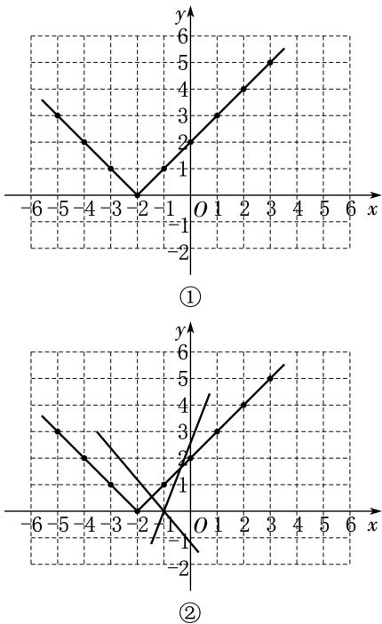  
第 题

# 23.4 实际问题与一次函数

1. 2. 3. 4. 5.租 辆丙客车(答案不唯一) 租 辆甲客车, 辆乙客车和 辆丙客车  
6.()变量 常量 () $\textcircled { 1 } Q { = } 4 0 { - } 2 . 5 x$ $\textcircled{2}$ 令 $Q = 0$ ,则 $4 0 - 2 . 5 x = 0$ ,解得 $x = 1 6$ ,即这辆汽车最多能行驶 $1 6 \mathrm { { h } }$ 7.() 解析:根据题意和表格中的数据,可得火车运输的总费用为 $2 0 0 \times ( 6 0 0 \div 1 0 0 ) + 6 0 0 \times 1 5 +$ $2 \ 0 0 0 { = } 1 2 \ 2 0 0$ (元),汽车运输的总费用是 $2 0 0 \times ( 6 0 0 \div$ $8 0 ) + 6 0 0 \times 2 0 + 9 0 0 = 1 4 4 0 0 ($ (元).  
()火车运输的总费用 $y _ { 1 }$ (元)与 $_ { \mathcal { X } }$ (千米)之间的函数解析式为 $y _ { 1 } = 2 0 0 \times \frac { x } { 1 0 0 } + 1 5 x + 2 ~ 0 0 0 = 1 7 x + 2 ~ 0 0 0$ ,汽车运输的总费用 $y _ { 2 }$ (元)与 $_ { \mathcal { X } }$ (千米)之间的函数解析式为 $y _ { 2 } =$ $2 0 0 \times \frac { x } { 8 0 } + 2 0 x + 9 0 0 = 2 2 . 5 x + 9 0 0$ (3)令 $1 7 x +$ $2 \ 0 0 0 { < } 2 2 . \ 5 x + 9 0 0 , \div \ x > 2 0 0 , \ { \div }$ 如果选择火车运输方式合算,那么 $_ { \mathcal { X } }$ 的取值范围是 $x { > } 2 0 0$

8.() 装运 种脐橙的车辆为 $_ { \mathcal { X } }$ 辆,装运 种脐橙的 车辆为 $y$ 辆, 装运 种脐橙的车辆为 $( 2 0 - x - y )$ )辆.

： $6 x + 5 y + 4 ( 2 0 - x - y ) = 1 0 0$ ,整理,得 $y = - 2 x + 2 0$ ()由()知,装运 ,, 三种脐橙的车辆分别为 $_ { \mathcal { X } }$ 辆、$( - 2 x + 2 0 )$ )辆、 $. x$ 辆.由题意,得 $\stackrel { \left\{ x \geqslant 4 , \right. }  { - 2 x + 2 0 \geqslant 4 }$ 解得 $4 \leqslant$ ,$x { \leqslant } 8 . \because x$ 为整数，： $_ { \mathcal { X } }$ 的值为 $4 , 5 , 6 , 7 , 8 , \cdots$ 安排方案有 种.方案一 装运 种脐橙 辆车 种脐橙 辆车种脐橙 辆车 方案二 装运 种脐橙 辆车 种脐橙辆车 种脐橙 辆车 方案三 装运 种脐橙 辆车种脐橙 辆车, 种脐橙 辆车;方案四:装运 种脐橙辆车, 种脐橙 辆车, 种脐橙 辆车;方案五:装运种脐橙 辆车 种脐橙 辆车 种脐橙 辆车()设利润为 $W$ 元,则 $W { = } 6 x \times 1 ~ 2 0 0 { + } 5 ( - 2 x { + } 2 0 ) \times$ 16 $) 0 + 4 x \times 1 ~ 0 0 0 = - 4 ~ 8 0 0 x + 1 6 0 ~ 0 0 0 , ~ : : \ - 4 ~ 8 0 0 < 0$ ，： $W$ 随 $_ { \mathcal { X } }$ 的增大而减小. $4 { \leqslant } x { \leqslant } 8 , { \dot { \ldots } }$ 当 $x = 4$ 时 $W$ 取得最大值,为 $- 4 ~ 8 0 0 \times 4 + 1 6 0 ~ 0 0 0 = 1 4 0 ~ 8 0 0 . ~ \div .$ 当装运种脐橙 辆车 种脐橙 辆车 种脐橙 辆车时 获利最大,最大利润为 元

# 第二十三章特训

一、1. 2. 3. 4. 5.

二、6.9 7. $y = 2 x - 1$ 8. $\left. \begin{array} { l l l } { { x = 4 , } } & { { { \bf \Pi } } } & { { { \bf \Pi } } } \\ { { y = 6 } } & { { { \bf \Pi } } } & { { 7 . \ 9 \times 1 0 ^ { 4 } } } \end{array} \right.$

10. $x { < } 1$

三、11.(1) $\therefore S _ { \triangle P A O } = \frac { 1 } { 2 } O A \bullet y _ { P } , \div \cdot S = \frac { 1 } { 2 } \times 4 \times$ $( - x + 6 )$ ),即 $S = - 2 x + 1 2$ () $0 { < } \boldsymbol { x } { < } 6$

12.() 点 $A ( - 6 , 0 )$ )在直线 $y = k x + 3$ 上, $\therefore - 6 k +$ $3 { = } 0$ ,解得 $k = \frac { 1 } { 2 }$ .∴ 解不等式  
∴ 不等式 $k x + 3 > 2$ 的解集为 $x { > } - 2$ (2)在 ${ } y = { \frac { 1 } { 2 } } x + { }$ 中,令 $x = 0$ ,得 $y = 3 , \therefore B ( 0 , 3 ) . \ \therefore \ O B = 3 . \ \because \ A ( - 6 ,$ ,0) $\therefore \mathrm { \Delta } O A = 6 . \therefore \mathrm { \Delta } S _ { \triangle A O B } = \frac { 1 } { 2 } \times 6 \times 3 = 9 .$ .设 $P \left( m , { \frac { 1 } { 2 } } m + \right.$ 3 . $\therefore S _ { \triangle B O P } = \frac { 1 } { 2 } \times 3 | m | = \frac { 1 } { 4 } \times 9 . \ \therefore \ m = \pm \frac { 3 } { 2 }$ .∴ 点 $P$ 的坐标为 $\Big ( \frac { 3 } { 2 } , \frac { 1 5 } { 4 } \Big ) \frac { \mathtt { m } } { \mathtt { m } } \Big ( - \frac { 3 } { 2 } , \frac { 9 } { 4 } \Big )$   
13.()设足球的单价为 $m$ 元,则篮球的单价为 $( m +$   
)元.根据题意,得 ${ \frac { 1 0 \ 0 0 0 } { m + 2 0 } } = { \frac { 8 \ 0 0 0 } { m } }$ 解得 $m = 8 0 .$ .经检验  
$m = 8 0$ 是所列分式方程的根，且符合题意.：. $8 0 + 2 0 =$   
(元). 篮球的单价为 元,足球的单价为 元  
购买篮球 $_ { \mathcal { X } }$ 个 购买足球 $1 2 0 - x )$ 个.根据题$\scriptstyle \int _ { x } \geqslant 1$   
意,得 $\scriptstyle \left| 1 2 0 - x \geqslant 1 \right.$ , 解得 $7 2 { \leqslant } x { \leqslant } 1 1 9 .$ . $y = 1 0 0 x +$ $\lfloor 1 2 0 - x { \leqslant } { \frac { 2 } { 3 } } x$ ，  
$8 0 ( 1 2 0 - x ) = 2 0 x + 9 6 0 0 ( 7 2 \leqslant x \leqslant 1 1 9$ 且 $_ { \mathcal { X } }$ 为整数 .  
$2 0 { > } 0 , \therefore { }  y$ 随 $_ { \mathcal { X } }$ 的增大而增大. $7 2 { \leqslant } x { \leqslant } 1 1 9$ ,且 $_ { \mathcal { X } }$   
为整数 当 $x = 7 2$ 时 $y$ 的值最小 $1 2 0 - 7 2 =$

(个). 购买篮球 个、足球 个的总费用最低

14. 解析 由图象可知 两地之间的距离为 $1 8 0 \ \mathrm { k m } , \mathrm { B } , \mathrm { C }$ 两地之间的距离为 $1 2 0 \ \mathrm { k m } , 1 8 0 + 1 2 0 =$ $3 0 0 ( \mathrm { k m } )$ ), $a = 3 0 0$ ,轿车的速度为 $1 8 0 \div 1 . 5 { = } 1 2 0 ( \mathrm { k m / h } )$ ),$3 0 0 \div 1 2 0 = 2 . 5 ( \mathrm { h } )$ .根据图象 得 $1 . 5 + ( 3 - b ) = 2 . 5$ 解得$b = 2$

() $3 - \frac { 1 } { 3 } = \frac { 8 } { 3 } \left( { \mathrm { h } } \right) , \frac { 8 } { 3 } \div 2 = \frac { 4 } { 3 } \left( { \mathrm { h } } \right) , \therefore N \left( \frac { 8 } { 3 } , 0 \right) ,$ $M \Big ( \frac { 4 } { 3 } , 1 2 0 \Big )$ ,货车的速度为 $1 2 0 \div { \frac { 4 } { 3 } } { = } 9 0 ( \mathrm { k m / h } )$ ). $y =$ $1 2 0 - 9 0 \Big ( x - \frac { 4 } { 3 } \Big ) = - 9 0 x + 2 4 0 . \ \dot { . } ;$ 在货车从 地返回地的过程中,货车距出发地的距离 $y \left( \mathrm { k m } \right)$ )与行驶时间$x ( \mathrm { h } )$ 之间的函数解析式为 $y = - 9 0 x + 2 4 0 \Big ( \frac { 4 } { 3 } \leqslant x \leqslant \frac { 8 } { 3 } \Big )$

()当 $\scriptstyle 0 \leqslant x \leqslant { \frac { 4 } { 3 } }$ 时,得 $( 1 2 0 + 9 0 ) x + 4 0 = 3 0 0$ ,解得 $x =$ $\frac { 2 6 } { 2 1 }$ 6;当 $\frac { 4 } { 3 } < x \leqslant 1 . 5$ 时,两车之间的距离一直在减小,且总 是小于 $4 0 ~ \mathrm { k m }$ ;当 $1 . 5 { < } _ { x } { \leqslant } 2$ 时,得 $9 0 \left( { \it x } - \frac { 4 } { 3 } \right) = 4 0$ ,解得 $x = \frac { 1 6 } { 9 }$ ;当 $2 < x \leqslant \frac { 8 } { 3 }$ 时,得 $1 8 0 + 1 2 0 ( x - 2 ) + 4 0 - 9 0 x +$ $2 4 0 { = } 3 0 0$ ,解得 $x = \frac { 8 } { 3 }$ ;当 $\frac { 8 } { 3 } < x \leqslant 3$ 时,两车之间的距离 一直在减小,且总是小于 $4 0 \ \mathrm { k m } ,$ .∴ 轿车出发 $\frac { 2 6 } { 2 1 }$ h或 $\frac { 1 6 } { 9 }$ h 或 $\frac { 8 } { 3 }$ 时与货车相距 $4 0 ~ \mathrm { k m }$

# 第二十四章 数据的分析

# 24.1 数据的集中趋势

1. 2. 3. 4. 5. 6. 7. 8.   
9.25岁 10.88

11.()

$( 2 ) <$ 解析:若去掉教师评委打分中的最高分和最低分,记其余8名教师评委打分的平均数为 $_ { \mathcal { X } }$ 分,则 $\overline { { x } } = \frac { 1 } { 8 } \times$ $( 8 8 + 9 0 + 9 1 + 9 1 + 9 1 + 9 1 + 9 2 + 9 2 ) = 9 0 , 7 5 , \div , \overline { { x } } < 9 1 .$ .

12.() () () ()估计该校八年级竞赛成绩达到 分以上 含 分 的学生人数为 $5 0 0 \times { \frac { 1 4 + 1 8 } { 5 0 } } =$ 320

13. 所统计的这组数据的中位数为 $\frac { 1 0 + 1 1 } { 2 } = 1 0 . 5$ ,平均数为 ${ \frac { 1 } { 1 0 } } \times ( 9 \times 1 + 1 0 \times 4 + 1 1 \times 3 + 1 2 \times 2 ) = 1 0 . 6$

${ \frac { 4 + 3 + 2 } { 1 0 } } \times 1 0 0 \% = 9 0 \%$ 抽查的这 个小组中, $90 \%$ 的小组完成了本次植树任务 $( 3 ) \because 1 0 . 6 \times$ $1 1 5 { = } 1 2 1 9$ (棵), 在本次植树活动中,估计该校学生共植树 棵

14.() ()八年级()班的平均成绩为 $\frac { 7 5 + 8 0 + 8 5 + 8 5 + 1 0 0 } { 5 } = 8 5$ 分 两个班级复赛成绩的平均数都相同,八年级()班的中位数高, 在平均数相同的情况下 中位数高的八年级 班的复赛成绩好些

# 24.2 数据的离散程度

1. 2. 3. 4. 5. . 6.甲 7.甲

8.∵ $\cdot { \frac { - } { x _ { \mathbb { H } } } } = { \frac { 1 } { 5 } } \times ( 7 + 5 + 4 + 5 + 8 ) = 5 . 8 ( \mathrm { d m } ) , { \overline { { x } } } _ { Z } = { \frac { 1 } { 5 } } \times$ $( 6 + 4 + 5 + 6 + 5 ) = 5 . ~ 2 ( \mathrm { d m } ) , 5 . ~ 8 > 5 . ~ 2 , \therefore ~ x _ { \mathrm { H } } > \overline { { x } } _ { z } .$ .∴ 甲种水稻比乙种水稻长得高一些.∵ $s _ { \mathbb { H } } ^ { 2 } = \frac { 1 } { 5 } \times [ ( 7 -$ . $8 ) ^ { 2 } + ( 5 - 5 . 8 ) ^ { 2 } + ( 4 - 5 . 8 ) ^ { 2 } + ( 5 - 5 . 8 ) ^ { 2 } + ( 8$ $5 . 8 ) ^ { 2 } ] = 2 . 1 6 ( \mathrm { d m } ^ { 2 } ) , s _ { Z } ^ { 2 } = \frac { 1 } { 5 } \times [ ( 6 - 5 . ~ 2 ) ^ { 2 } + ( 4 -$ $5 . 2 ) ^ { 2 } + ( 5 - 5 . 2 ) ^ { 2 } + ( 6 - 5 . ~ 2 ) ^ { 2 } + ( 5 - 5 . ~ 2 ) ^ { 2 } ] =$ $0 . 5 6 ( \mathrm { d m } ^ { 2 } ) , 2 . 1 6 > 0 . 5 6 , \bullet , s _ { \scriptscriptstyle { \mathbb { H } } } ^ { 2 } > s _ { z } ^ { 2 } ,$ . 乙种水稻比甲种水稻长得整齐一些

9.()甲段台阶路台阶高度的平均数为 ${ \frac { 1 } { 6 } } \times ( 1 5 + 1 6 +$ $1 6 + 1 4 + 1 4 + 1 5 ) = 1 5 ( { \mathrm { c m } } )$ ),乙段台阶路台阶高度的平均数为 ${ \frac { 1 } { 6 } } \times ( 1 1 + 1 5 + 1 8 + 1 7 + 1 0 + 1 9 ) = 1 5 ( { \mathrm { c m } } )$ )() $s _ { \mathbb { H } } ^ { 2 } < s _ { Z } ^ { 2 }$ , 甲段台阶路台阶高度的波动小. 甲段台阶路走起来更舒服 与方差有关 ()将每级台阶的高度均整修为 $1 5 ~ \mathrm { c m }$ ,使方差为 $\mathrm { 0 ~ c m ^ { 2 } }$ ,游客行走比较舒服 言之有理即可

10.() 6×7+7×15+8×10+9×7+10×11 ,$\frac { 6 \times 8 + 7 \times 9 + 8 \times 1 4 + 9 \times 1 3 + 1 0 \times 6 } { 5 0 } { = } 8 0$ (分), 两个年级的平均成绩一样好 () $\textcircled{1}$ $\textcircled{2}$ 从众数角度看, 八年级团员成绩的众数为 分,九年级团员成绩的众数为分, 应该给九年级颁奖.从方差角度看, 八年级团员成绩的方差为 . 分2,九年级团员成绩的方差为. 分2 $, 1 . 5 6 { < } 1 . 8 8 ,$ 应该给九年级颁奖 ()八年级的获奖率 ${ \stackrel { \cdot = } { \operatorname { \frac { 1 0 + 7 + 1 1 } { 5 0 } } } } \times 1 0 0 \% = 5 6 \%$ ,九年级的获奖率 $=$ $\frac { 1 4 + 1 3 + 6 } { 5 0 } \times 1 0 0 \% = 6 6 \%$ .∵ $6 6 \% > 5 6 \%$ ,∴ 九年级的获奖率高

11.()补全分析表如下表,补全统计图如图所示()理由: $\textcircled{1}$ 甲、乙两组的平均数一样,乙组的方差小于甲组, 乙组的成绩比甲组稳定; $\textcircled{2}$ 乙组的合格率比甲组高, 乙组的成绩好于甲组(言之有理即可).

一分钟投篮测试成绩分析表  

<table><tr><td rowspan=1 colspan=1>组别</td><td rowspan=1 colspan=1>平均数/分</td><td rowspan=1 colspan=1>方差/分²</td><td rowspan=1 colspan=1>中位数/分</td><td rowspan=1 colspan=1>合格率</td><td rowspan=1 colspan=1>优秀率</td></tr><tr><td rowspan=1 colspan=1>甲组</td><td rowspan=1 colspan=1>6.8</td><td rowspan=1 colspan=1>2.56</td><td rowspan=1 colspan=1>6</td><td rowspan=1 colspan=1>80.0%</td><td rowspan=1 colspan=1>26.7%</td></tr><tr><td rowspan=1 colspan=1>乙组</td><td rowspan=1 colspan=1>6.8</td><td rowspan=1 colspan=1>1.76</td><td rowspan=1 colspan=1>7</td><td rowspan=1 colspan=1>86.7%</td><td rowspan=1 colspan=1>13.3%</td></tr></table>

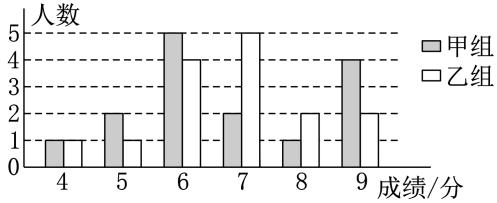  
一分钟投篮测试成绩统计图  
第 题

12.(1)B (2)由题图,得 $s _ { \mathrm { B } } ^ { 2 } = \frac { 1 } { 1 0 } { \times } \lbrack 5 { \times } ( 2 0 \mathrm { - } 2 0 ) ^ { 2 } + 3 { \times }$ ( . )2 ( . )2 ( . )2] . .： $s _ { \mathrm { A } } ^ { 2 } { = } 0 . 0 2 6 , 0 . 0 2 6 { > } 0 . 0 0 8 , \therefore s _ { \mathrm { A } } ^ { 2 } { > } s _ { \mathrm { B } } ^ { 2 } . \div . \mathrm { B }$ 同学成绩的波动性小,即 同学的成绩好一些 ()派 同学去参加比赛较合适 理由 从图中折线走势可知 尽管 同学的成绩前面起伏较大,但后来逐渐稳定,误差小,而 同学的误差逐渐变大 预测 同学的潜力大 派 同学去参赛更容易比出好成绩 言之有理即可 .

# 24.3 数据的四分位数

1. 2.

3. 解析 名学生的期中考试数学成绩数据分别为98,110,m,120,且上四分位数为118,∴ ${ \frac { m + 1 2 0 } { 2 } } = 1 1 8$ ,解得 $m { = } 1 1 6$ .

4. 5. 6. 7. 8.

9.将 个数据从小到大排列,可得:

13 21 28 28 30 33 34 37 39 43 48 52 60 65 65 68 78 80 80 81 82 88 88 88 92 92 93 94 96

观察上面的排序 估计该校八年级这次数学测试成绩的第一四 分 位 数 为 $\frac { 4 3 + 4 4 } { 2 } = 4 3 . \ 5$ 分 第二四分位数为$\frac { 5 9 + 6 0 } { 2 } = 5 9 . 5 \AA$ (分),第三四分位数为 $\frac { 8 1 + 8 2 } { 2 } = 8 1 . 5 ^ { }$ (分),从四分位数的数值,得半数学生的成绩在 $4 3 . 5 \sim 8 1 . 5 $ 分之间,考虑到最低分为 分,最高分为 分,结合第一、三四分位数可说明成绩在前 $2 5 \%$ 的学生分数差距相对较小,后 $2 5 \%$ 的学生的分数差距较大(合理即可)

10.对于结论 $\textcircled{1}$ ,由题图 $\textcircled{2}$ ,可知 月有 值超过的异常值,则该地区 年 月有严重污染天气,故结论$\textcircled{1}$ 正确;对于结论 $\textcircled{2}$ ,题图 $\textcircled{2}$ 中 月的箱体高度比 月的箱体高度小 说明 月的 值比 月的 值集中故结论 $\textcircled{2}$ 错误 结论 $\textcircled{3}$ 正确 对于结论 $\textcircled{4}$ 虽然 月有严重污染天气 但由题图 $\textcircled{2}$ 可知 月箱体整体上比 月箱体偏下且箱体高度小 值整体集中于较小值 说明从整体上该地区 年 月的空气质量略好于 月 故结论$\textcircled{4}$ 正确

11.()不能 平均年收入和最高年收入相差太大,高收入的员工占极少数. 已经知道至少有一个人的年收入为 万元, 其他员工的年收入之和为 $1 0 \times 5 0 -$ $2 0 0 { = } 3 0 0$ (万元),每人平均年收入为 $3 0 0 \div 4 9 \approx 6 . 1 2$ (万元).如果再有几个年收入特别高的 那么其他员工的年收入将会更低, 不能判断 ()不能 要看员工年收入的中位数是多少 ()可以确定有 $7 5 \%$ 的员工年收入在 . 万元以上,其中 $2 5 \%$ 的员工年收入在 . 万元以上,可以考虑受聘 员工年收入的第二四分位数大约是 $\frac { 4 . 5 + 9 . 5 } { 2 } =$ (万元) 受年收入 万元这个极端值的影响, 平均数比估计出的第二四分位数高很多

12. , .,

13.()把甲组的成绩数据从小到大排列为 , , , ,$8 9 , 9 1 , 9 2 , 9 6 , 9 8 , 1 0 0 , \therefore Q _ { 2 } = \frac { 8 9 + 9 1 } { 2 } = 9 0 , Q _ { 1 } = 7 0 , Q _ { 3 } =$ ()如图所示 ()根据箱线图和对四分位数的理解,可知甲组成绩比较分散 乙组成绩比较集中 合理即可

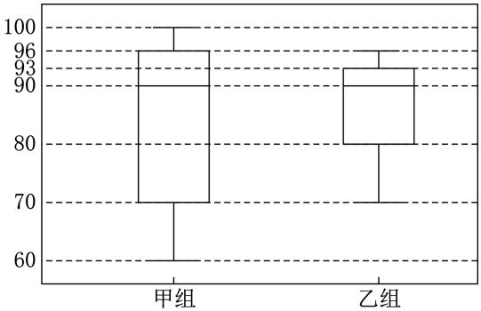  
第13题

# 24.4 数据的分组

1. 2. 3. 4. 5. 6. 7.

8. ,,

9.从小到大排列为 , , , , ,则 $\overline { { x } } = \frac { 1 } { 5 } \times$ $( 1 6 0 + 1 6 5 + 1 6 7 + 1 7 0 + 1 7 8 ) = 1 6 8 .$ .()按要求分为两组,第 组: , , ;第 组: , . $\overline { { x } } _ { 1 } = \frac { 1 } { 3 } \times$ $( 1 6 0 + 1 6 5 + 1 6 7 ) = 1 6 4 , d _ { 1 } ^ { 2 } = ( 1 6 0 - 1 6 4 ) ^ { 2 } + ( 1 6 5 -$ $1 6 4 ) ^ { 2 } + ( 1 6 7 - 1 6 4 ) ^ { 2 } = 2 6 ; { \overline { { x } } } _ { 2 } = { \frac { 1 } { 2 } } \times ( 1 7 0 + 1 7 8 ) = 1 7 4 ,$ ,$d _ { 2 } ^ { 2 } = ( 1 7 0 - 1 7 4 ) ^ { 2 } + ( 1 7 8 - 1 7 4 ) ^ { 2 } = 3 2 . \ \div \ d _ { 1 } ^ { 2 } + d _ { 2 } ^ { 2 } = 2 6 +$ $3 2 { = } 5 8$ ,即组内离差平方和为 ()组间离差平方和$d _ { 1 2 } ^ { ~ 2 } = 3 \times ( 1 6 4 - 1 6 8 ) ^ { 2 } + 2 \times ( 1 7 4 - 1 6 8 ) ^ { 2 } = 1 2 0$

10. $a = 2 , 5 , b = 7 , 5 , c = 2 , 5 , d = 7 , 5 .$ .由分组的情况 可知把 个数据分成 $\left\{ 1 , 2 \right\}$ 和 两组或 $\left\{ 1 , 2 , 3 \right\}$ 和 $\{ 4 , 5 \}$ 两组的组内离差平方和最小 这样的分组比较合理

11.() $3 6 ^ { \circ }$ () ()方式二利于开展小组学习理由:方式二的组内离差平方和小于方式一,说明组内成员之间的水平更接近,更利于开展小组学习,促进同学间的互帮互助、共同进步(合理即可).

12.() . . . ()按第 个间隔分组,能使组内离差平方和最小,此时将八个城市分为两组如下:{拉萨,西宁,贵阳}和{福州,广州,杭州,南京,上海}中的分组方法 是将八个城市按地域分成中国的西部和东部.西部的三个城市气温相对接近(稍低),而东部的五个城市气温也相对接近 偏高 合理即可

# 第二十四章特训

一、1. 2. 3. 4. 5. 6.

二、7.甲 $\mathbf { 8 . \ 8 5 . 8 9 . > 1 0 . \ 6 . 1 }$ 三 11. 两组数据的中位数基本相等 甲数据的波动程度比乙数据大 甲数据的最大值大于乙数据的最大值

12.()抽取的总人数为 $1 0 \div 2 5 \% = 4 0$ , $m = 4 0 \times$ $3 5 \% = 1 4 , n = 4 0 - 4 - 1 0 - 1 4 - 6 = 6$ ()将数据从小到大排序后,位于第 个和第 个数据均为 , 中位数为 ()估计这些学生中被评为“绿动先锋”的人数为$3 2 0 \times \frac { 6 + 6 } { 4 0 } { = } 9 6$

13.()在所考查的四项内容中,甲比乙更具优势的有口头表达能力、仪容仪表 ()甲的综合成绩为 $9 \times 4 0 \% +$ $8 \times 3 0 \% + 7 \times 2 0 \% + 9 \times 1 0 \% = 8 . 3 0$ 分 乙的综合成绩为$8 \times 4 0 \% + 9 \times 3 0 \% + 9 \times 2 0 \% + 8 \times 1 0 \% = 8 . 5$ (分).· $\ : 8 . 5 > 8 . 3 \ :$ 推荐乙

14.(1)2 $s _ { 1 } ^ { 2 } > s _ { 2 } ^ { 2 }$ () $b { = } \frac { 1 } { 1 0 } { \times } \left( 1 { + } 2 { + } 2 { + } 3 { + } 3 { + } 3 { + } \right.$ $2 + 1 + 2 + 1 ) = 2$ ()从操作规范性来分析:小青和小海的平均得分相等,但是小海的方差小于小青的方差, 小海在物理实验操作中发挥较稳定;从书写准确性来分析:小海的平均得分比小青的平均得分高, 小海在物理实验中书写更准确;从两个方面综合分析:小海的操作更稳定,并且书写的准确性更高, 小海的综合成绩更好(合理即可) ()熟悉实验方案和操作流程,平稳心态,沉稳应对(合理即可)

# 期末压轴题特训

一、1. 2. 3. 4.

二、5. $\displaystyle { \binom { x = 2 , } { y = - 2 } }$

6. $\frac { 2 0 } { 3 }$ 解析:设 $C M = x$ ,则 $B M = 8 - x$ .由题意,得 $D E =$ $C D { = } A B { = } 1 0$ $1 B = 1 0 , \angle E = \angle B = \angle C = \angle A = 9 0 ^ { \circ } .$ 在 $\triangle G M B$ 和 $\triangle G F E$ 中, $\left. \begin{array} { l } { { \angle B = \angle E , } } \\ { { B G = E G , } } \\ { { \angle M G B = \angle F G E , } } \end{array} \right. \therefore \ \triangle G M B \cong \triangle G F E .$ ： $\scriptstyle \cdot \ M G = F G , B M = E F = 8 - x , \ \therefore \ D F = E D - E F =$ 2+ $\scriptstyle x , \ \because \ B G = E G , \therefore \ M G + E G = F G + B G$ ，即 $M E = B F$ $B { \cal F } = M { \cal E } = C M = x$ . $A F = A B - B F = 1 0 - x .$ .在 $\mathrm { R t } \triangle A D F$ 中, $. A D ^ { 2 } + A F ^ { 2 } = D F ^ { 2 }$ ,即 $8 ^ { 2 } + ( 1 0 - x ) ^ { 2 } = ( 2 +$ $x ) ^ { 2 }$ ，解得 $\scriptstyle { x = { \frac { 2 0 } { 3 } } . { \dot { x } } \ C M = { \frac { 2 0 } { 3 } } }$   
.

7. $1 { < } E F { \leqslant } 4$

8.2或 $\frac { 1 9 } { 3 }$ 或8 解析:∵ 点 $P , Q$ 所在的直线平分矩形的面积, 易得点 $P , Q$ 所在的直线经过 $A C , B D$ 的交点O. $\textcircled{1}$ 如图 $\textcircled{1}$ ,当点 $P$ 在 $C D$ 上时, $\scriptstyle 0 \leqslant t \leqslant { \frac { 8 } { 3 } }$ .∵ 四边形ABCD 是矩形, $\scriptstyle \cdot \ A B / / C D , O B = O D , A B = C D =$ $8 \mathrm { { c m } }$ .∴ $\angle O D P = \angle O B Q . \because \angle D O P = \angle B O Q ,$ ,∴ $\cdot \bigtriangleup D O P { \cong } \triangle B O Q . \therefore D P = B Q .$ .由题意,得 $B Q = t ~ { \mathrm { c m } }$ ,$C P = 3 t { \mathrm { ~ c m . ~ } } { \dot { \bullet } } \cdot D P = C D - C P = ( 8 - 3 t ) { \mathrm { c m . ~ } } { \dot { \bullet } } \cdot 8 - 3 t = t$ ，解得 $t = 2 , \textcircled { 2 }$ 当点 $P$ 在 $A D$ 上时,点 $P , Q$ 所在的直线不经过点 $O$ ,不合题意. $\textcircled{3}$ 如图 $\textcircled{2}$ ,当点 $P$ 在 $A C$ 上,且点 $P , O$ 重合时,符合题意. 四边形 $A B C D$ 是矩形, $O A = O C =$ $\frac { 1 } { 2 } A C , A D = B C = 6 \ c m , A B = C D = 8 \ c m , \angle A D C = 9 0 ^ { \circ } .$ 在 $\mathrm { R t } \triangle A C D$ 中,由勾股定理,得 $A C = { \sqrt { A D ^ { 2 } + C D ^ { 2 } } } =$ $\scriptstyle { \sqrt { 6 ^ { 2 } + 8 ^ { 2 } } } = 1 0 ( { \mathrm { c m } } ) , \ { \mathrm { : } } \ { O A } = O C = 5 { \mathrm { ~ c m } } , \ { \mathrm { : } } \ t = ( 8 + 6 +$ $5 ) \div 3 = \frac { 1 9 } { 3 }$ $\textcircled{4}$ 当点 $P , C$ 重合时,易得点 $Q , A$ 重合,此时.  
符合题意. $t = ( 8 + 6 + 1 0 ) \div 3 = 8 .$ .综上所述, $t$ 的值为或 $\cdot \frac { 1 9 } { 3 }$ 或 .

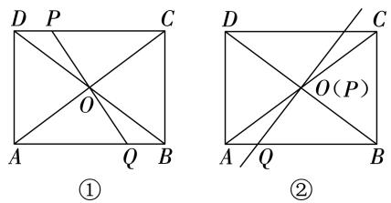  
第8题

9. $\frac { { \sqrt { 1 3 } } + 3 } { 2 }$ 解析:如图,连接 $A C$ 交 BD 于点 $O$ ,连接ON.菱形 ABCD 的对角线 $B D$ 的长为6,边长 $A B =$ $\sqrt { 1 0 } , \therefore A C \bot B D , A O = O C , O D = \frac { 1 } { 2 } B D = 3 , C D =$ ${ \sqrt { 1 0 } } . \ { \therefore } \ O C = { \sqrt { C D ^ { 2 } - O D ^ { 2 } } } = 1 . \ $ ： $N$ 为 $M D$ 的中点,ON BM. BM DM, ON DM. $\angle O N D =$ $9 0 ^ { \circ } .$ .取 $O D$ 的中点 $E$ ,连接CE,NE. $N E { = } O E { = } \frac { 1 } { 2 } O D { = }$ ${ \frac { 3 } { 2 } } . \therefore C E = { \sqrt { O C ^ { 2 } + O E ^ { 2 } } } = { \frac { \sqrt { 1 3 } } { 2 } } . \ \because \ C N \leqslant C E + N E ,$ ,当 $C , E , N$ 三点共线时, $C N$ 的长最大,为 $C E + E N =$ ${ \frac { \sqrt { 1 3 } } { 2 } } + { \frac { 3 } { 2 } } = { \frac { \sqrt { 1 3 } + 3 } { 2 } } .$

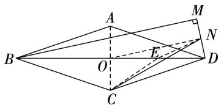  
第9题

三、10.()设直线 $C D$ 对应的函数解析式为 $y = k x + b .$ .将

$C ( - 9 , 0 ) , D \left( 0 , \frac { 9 } { 2 } \right)$ 代入,得 $\left\{ { \begin{array} { l } { - 9 k + b = 0 } \\ { b = { \frac { 9 } { 2 } } , } \end{array} } \right.$ ,解得 $\left\{ \begin{array} { l l } { { k { = } { \frac { 1 } { 2 } } , } } \\ { { { } } } \\ { { { b { = } { \frac { 9 } { 2 } } . } } } \end{array} \right.$ ∴ 直线 $C D$ 对应的函数解析式为 $\scriptstyle { y = { \frac { 1 } { 2 } } x + { \frac { 9 } { 2 } } }$ (2)能由题意 易得 $E \left( 0 , 3 \right) , B \left( 3 , 0 \right)$ . $D E = \frac { 9 } { 2 } - 3 = 1 . 5$ .∴ $F G = 2 D E = 3 .$ .设 $F \left( a , - a + 3 \right) \left( a < 0 \right)$ ),则 $G \left( a , \frac { \ d b } { \ d t } \right)$ ,${ \frac { 1 } { 2 } } a + { \frac { 9 } { 2 } } )$ . 易得 $- a + 3 - \bigl ( \frac 1 2 a + \frac 9 2 \bigr ) = 3$ ,解得 $a =$ $- 3 . \ \dot { \bullet } . \ F ( - 3 , 6 ) , G ( - 3 , 3 )$ .设点 $F$ 关于直线 $G H$ 的对称点为 $F ^ { \prime }$ ,则 $F ^ { \prime } ( - 3 , 0 )$ ),连接 $D F ^ { \prime } , D F ^ { \prime }$ 与 $G H$ 交于点 $P$ ,此时 $P F { + } P D$ 的值最小.设直线 $D F ^ { \prime }$ 对应的函数解析式为$_ { y } = _ { m x } + _ { n . }$ 将 $F ^ { ' } ( - 3 , 0 ) , D \left( 0 , \frac { 9 } { 2 } \right)$ 代入,得 $\left\{ { \begin{array} { l } { - 3 m + } \\ { n { = } { \frac { 9 } { 2 } } } \end{array} } \right.$ $ 3 m + n = 0 ,$ ,,解得 $\begin{array} { c } { { ( m = { \frac { 3 } { 2 } } ,  } } \\ { {  \qquad } } \\ { {  \qquad ( n = { \frac { 9 } { 2 } } .  } } \end{array}$ ∴ 直 线 $D F ^ { \prime }$ 对 应 的 函 数 解 析 式 为 $y =$ ${ \frac { 3 } { 2 } } x + { \frac { 9 } { 2 } }$ .当 $y = 3$ 时, $\frac { 3 } { 2 } x + \frac { 9 } { 2 } = 3$ ,解得 $x = - 1 .$ . 点 $P$ 的坐标为 $( - 1 , 3 )$ ) ()存在 $\textcircled{1}$ 如图 $\textcircled{1}$ ,当 $O P / / M Q$ ,$P M / / O Q$ 时,四边形 PMQO 是平行四边形.由（2),得$P ( - 1 , 3 )$ .易得 $M ( - 3 , 3 ) . \ \dot { \bullet } \ P M = 2 . \ \dot { \bullet } \ Q ( - 2 , 0 ) ,$ $\textcircled{2}$ 如图 $\textcircled{2}$ ,当 $P Q / / M O , P M / / Q O$ 时,四边形 PMOQ是平行四边形. 易得 $P M { = } O Q { = } 2 , \therefore \ Q ( 2 , 0 ) . \ ($ $\textcircled{3}$ 如图 $\textcircled{3}$ ,当 $O P / / Q M , P Q / / O M$ 时,四边形 $P Q M O$ 是平行四边形.过点 $P$ 作 $P N \bot y$ 轴 垂足为 $N$ 过点 $M$ 作 $M K \perp x$ 轴 垂足为 $K . \stackrel { \cdot \cdot } { \cdot } O P / / Q M , \stackrel { \cdot } { \cdot \cdot } \angle K Q M = \angle Q O P .$ .又 $P N / /$ $\boldsymbol { Q 0 }$ $\angle Q O P \ = \ \angle N P O . \therefore \angle K Q M \ = \ \angle N P O .$ ： $Q M = P O$ , $\angle Q K M = \angle P N O = 9 0 ^ { \circ }$ , $\triangle Q K M \cong$ $\triangle P N O . \therefore Q K = P N = 1 , K M = N O = 3 . \therefore$ 点 $M$ 的纵坐标为-3.将 $y = - 3$ 代入 $y = { \frac { 1 } { 2 } } x + { \frac { 9 } { 2 } }$ ,得 ${ \frac { 1 } { 2 } } x + { \frac { 9 } { 2 } } =$ $- 3$ ,解得 $x = - 1 5 . \ \therefore \ K ( - 1 5 , 0 ) . \ \therefore \ Q ( - 1 6 , 0 ) .$ .综上所述,点 $Q$ 的坐标为 $( - 2 , 0 )$ )或(,)或 $( - 1 6 , 0 )$ )

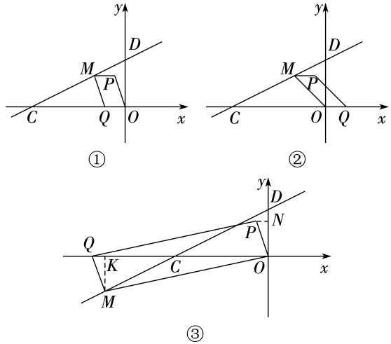  
第10题

11.() ()如图 $\textcircled{1}$ 所示 $B E ^ { 2 } + D F ^ { 2 } = E F ^ { 2 }$ 延长$D A , E O$ 交于点 $G$ ,连接 $G F$ .在矩形 $A B C D$ 中 $A D / / B C$ $O A = O C$ $A D = B C$ $\angle A G O = \angle C E O$ $\angle G A O =$ $\scriptstyle { \left\{ \begin{array} { l l } { \angle A G O = \angle C E O , } \\ { \angle G A O = \angle E C O , } \\ { O A = O C , } \end{array} \right. }$ ,$\angle E C O$ .在 $\triangle A O G$ 和 $\triangle C O E$ 中, ,$\triangle A O G { \cong } \triangle C O E$ . $O G = O E$ , $A G = C E$ . $A D +$ $A G = B C + C E$ ，即 $D G = B E$ .在 $\triangle E O F$ 和 $\triangle G O F$ 中，$\scriptstyle | O E = O G$   
FOE FOG , EOF GOF. $E F =$ $\scriptstyle { \left| { O F = O F } \right. }$ ,  
GF.: $\angle A D C = 9 0 ^ { \circ } , \therefore \angle G D F = 1 8 0 ^ { \circ } - 9 0 ^ { \circ } = 9 0 ^ { \circ } \ :$ 在$\mathrm { R t } \triangle D F G$ 中,由 勾 股 定 理,得 $D G ^ { 2 } + D F ^ { 2 } = G F ^ { 2 }$ .： $B E ^ { 2 } + D F ^ { 2 } = E F ^ { 2 }$ ()如图 $\textcircled{2}$ ,过点 $A$ 作 $A G \bot C E$ ,过点 $B$ 作 $B G \bot B D , A G$ 与 $B G$ 交于点 $G$ ,连接 $C G$ 交 $A B$ 于点 $O$ ,连接 $D O$ 并延长,交 $A G$ 的延长线于点 $H$ ,连接EH,OF,OE. : $\angle G A C = \angle G B C = \angle A C B = 9 0 ^ { \circ }$ 四边形ACBG为矩形. $A O { = } B O { = } \frac { 1 } { 2 } A B , C O { = } O G , A G / /$ $B C , A G = B C , \therefore \angle G H O = \angle C D O , \angle H G O = \angle D C O .$ ： $\cdot \bigtriangleup G O H { \stackrel { \Longleftrightarrow } { = } } \bigtriangleup C O D . \ \therefore \ O H = O D , G H = C D , \ \therefore \ A G +$ $G H = B C + C D$ ,即 $A H = B D$ . $\angle H A C = 9 0 ^ { \circ }$ ,∴ $\angle H A E = 1 8 0 ^ { \circ } - 9 0 ^ { \circ } = 9 0 ^ { \circ } .$ .在 $\mathrm { R t } \triangle A E H$ 中,由勾股定理,得 $H E ^ { 2 } = A E ^ { 2 } + A H ^ { 2 } = A E ^ { 2 } + B D ^ { 2 } , \because A E ^ { 2 } + B D ^ { 2 } =$ 2, $\bullet H E ^ { 2 } = D E ^ { 2 } , \therefore H E = D E , \ \because \ O E = O E , O H =$ ${ \cal O } { \cal D } , \therefore \triangle { \cal O } E H \cong \triangle { \cal O } E { \cal D } . \therefore \angle E { \cal O } H = \angle E O D = 9 0 ^ { \circ } .$ ∵ $F$ 为 $D E$ 的中点,∴ $O F = \frac { 1 } { 2 } D E$ $A F { \geqslant } O F { - } O A$ 且当 $O , A , F$ 三点共线时,等号成立,∴ $A F { \geqslant } \frac 1 2 D E -$ ${ \frac { 1 } { 2 } } A B . \ \cdots \ D E - A B = 4 , \ \dot { \bullet } . \ A F \geqslant { \frac { 1 } { 2 } } \ ( D E - A B ) = 2 .$ .∴ $A F$ 长的最小值为2

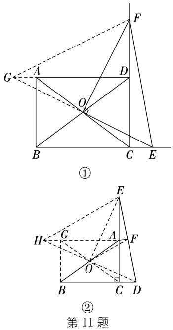