# 24.1 数据的集中趋势

# 目标直通车

1.理解平均数、中位数和众数等统计量的统计意义.

2.会计算加权平均数,理解“权”的意义,能选择适当的统计量表示数据的集中趋势.3.会用样本平均数估计总体的平均数,进一步感受抽样的必要性,体会用样本估计总体的思想.4.参与收集、整理、描述和分析数据得出结论的统计活动,经历数据处理的基本过程,体会统计与生活的联系,感受统计在生活和生产中的作用,养成用数据说话的习惯和培养实事求是的科学态度.

# 知识百宝箱

对应教材P149

# 平均数 [重点]

1.一 般 地,有 $n$ 个 数 据 $x _ { 1 } , x _ { 2 } , \cdots , x _ { n }$ ,我 们 把 $\frac { 1 } { n } \left( x _ { 1 } + \right.$ $\boldsymbol { x } _ { 2 } + \cdots + \boldsymbol { x } _ { n } )$ 叫作这 $n$ 个数据的平均数，记作 $\overline { { x } }$ ,即 $\stackrel { - } { x } = \frac { 1 } { n } ( x _ { 1 } +$ $x _ { 2 } + \cdots + x _ { n } )$

2.平均数的大小与每个数据都有关系 它反映了一组数据取值的平均水平.如果需要了解一组数据的平均水平,那么可计算这组数据的平均数.

3.当一组数据较大,并且这些数据都在某一常数 $a$ 附近上下波动时 一般选用 新数据法 计算 取该常数 $a$ 为标准数 算出各数与标准数的差的平均数 然后加上 $a$ 即可得到这组数据的平均数.

！提示 平均数的缺点是容易受个别特殊值的影响 所以有时不能代表数据的平均水平.

一般地,我们把 $n$ 个数 $x _ { 1 } , x _ { 2 } , \cdots , x _ { n }$ 的和与 $n$ 的比叫作这 $n$ 个数的算术平均数 简称平均数

示例1 数据 的平均数是 （

A.4 B.3  
C.2.5 D.2

解析:根据平均数的定义“平均数是指在一组数据中所有数据之和除以数据的个数 进行计算 即 $\stackrel { - } { x } = \frac { - 1 + 0 + 3 + 4 + 4 } { 5 } = 2 .$ .

答案:D.

点拨 解题时 先算出 $n$ 个数的和,然后除以 $n$ ,就可得出这 $n$ 个数的平均数.

# 加权平均数 [重点]

1.一般地,若 $n$ 个数 $x _ { 1 } , x _ { 2 } , \cdots , x _ { n }$ 的权分别为 $\mathbf { \mathcal { W } } _ { 1 } \circ \mathbf { \mathcal { W } } _ { 2 } \circ \cdots$ ,$\boldsymbol { \mathcal { W } } _ { n }$ ，则 $\frac { x _ { 1 } w _ { 1 } + x _ { 2 } w _ { 2 } + \dots + x _ { n } w _ { n } } { w _ { 1 } + w _ { 2 } + \dots + w _ { n } }$ 叫作这 $n$ 个数的加权平均数.在求 $n$ 个数的平均数时,如果在 $n$ 个数中, $x _ { 1 }$ 出现 $f _ { 1 }$ 次, $x _ { 2 }$ 出现

.用公式计算加权平均数时 应先整理数据准 确 找 出 $f _ { 1 } , f _ { 2 } , \cdots , f _ { k }$ 的值.

.算术平均数是加权

$f _ { 2 }$ 次 $\cdots , x _ { k }$ 出现 $f _ { k }$ 次(这里 $f _ { 1 } + f _ { 2 } + \cdots + f _ { k } = n \rangle$ ，那么这 $n$ 个数的平均数为 ,也叫作 x ,x ,…,x这 $k$ 个数的加权平均数,其中 $f _ { 1 } , f _ { 2 } , \cdots , f _ { k }$ 分别叫作 $x _ { 1 } , x _ { 2 } , \cdots ,$ ,$\mathcal { X } _ { k }$ 的权.

2. $x _ { 1 }$ 出现的次数 $f _ { 1 }$ 叫作权, $f _ { 1 }$ 越大,表示 $x _ { 1 }$ 数据越多,权就越重.

3.加权平均数实际上是算术平均数的另一种表示形式 是平均数的一种简便运算.

4.在求频数分布表(直方图)类的加权平均数时,常用各组的组中值代表频数分布表 直方图 中各组的实际数据 把各组的频数看成相应组中值的权.

示例2 学校准备从甲 乙两名选手中选择一名选手代表学校参加所在地区的汉字听写大赛,学校对两名选手从表达能力、阅读理解、综合素质和汉字听写四个方面做了测试,他们各自的成绩(百分制 如下表 单位 分

<table><tr><td rowspan=1 colspan=1>选手</td><td rowspan=1 colspan=1>表达能力</td><td rowspan=1 colspan=1>阅读理解</td><td rowspan=1 colspan=1>综合素质</td><td rowspan=1 colspan=1>汉字听写</td></tr><tr><td rowspan=1 colspan=1>甲</td><td rowspan=1 colspan=1>85</td><td rowspan=1 colspan=1>78</td><td rowspan=1 colspan=1>85</td><td rowspan=1 colspan=1>73</td></tr><tr><td rowspan=1 colspan=1>乙</td><td rowspan=1 colspan=1>72</td><td rowspan=1 colspan=1>79</td><td rowspan=1 colspan=1>83</td><td rowspan=1 colspan=1>84</td></tr></table>

由表中成绩已算得甲的平均成绩为 . 分 请计算乙的平均成绩.从他们的这一成绩看 应选择谁去参加大赛

平均数的特例 当加权平均数中各项的权相等时 就变成了算术平均数.

# 漫画速记

()如果表达能力、阅读理解、综合素质和汉字听写分别赋予它们和 的权 请分别计算两名选手的平均成绩.从他们的这一成绩看 应选择谁去参加大赛

解析 先用算术平均数公式 计算乙的平均成绩 然后根据计算结果与甲的平均成绩比较 结果大的去参加大赛. 先用加权平均数公式 计算甲 乙的平均成绩 然后比较计算结果 结果大的去参加大赛.

解:()x乙 ${ \overline { { x } } } _ { \mathrm { Z } } = { \frac { 1 } { 4 } } \times ( 7 2 + 7 9 + 8 3 + 8 4 ) = 7 9 . 5 6$ 分 .$\because 8 0 . 2 5 > 7 9 . 5$ ,  
应选择甲去参加大赛.

$ \overline { { { x } } } _ { \mathtt { H } } = \overline { { { \frac { 8 5 \times 2 + 7 8 \times 1 + 8 5 \times 3 + 7 3 \times 4 } { 2 + 1 + 3 + 4 } } } } = 7 9 . 5 ($ (分);$\overline { { { x } } } _ { \mathrm { Z } } = \frac { 7 2 \times 2 + 7 9 \times 1 + 8 3 \times 3 + 8 4 \times 4 } { 2 + 1 + 3 + 4 } { = } 8 0 . 8 ($ (分).： $7 9 . 5 { < } 8 0 . 8$ ,应选择乙去参加大赛.

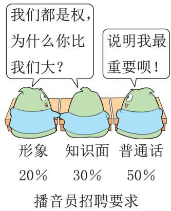

注意在计算加权平均数时 要考虑到各个数据的权重 数据的权重反映了数据的相对 重要程度 .

# 用样本平均数估计总体平均数

# 1.组中值:

数据分组后 这个小组两个端点的数的平均数叫作这个组的组中值.

# 2.用样本的平均数估计总体的平均数:

当所要考察的对象较多 或对考察对象带有破坏性时 统计中常常通过用样本估计总体的方法来获得对总体的认识.

示例3 某灯泡厂为测量一批灯泡的使用寿命,从中随机抽查了只灯泡,它们的使用寿命如下表所示,则这批灯泡的平均使用寿命是 .

！提示 选取的样本要有随机性 样本中的数据要有代表性 否则将影响到样本对总体估计的准确程度.

<table><tr><td rowspan=1 colspan=1>使用寿命x/h</td><td rowspan=1 colspan=1>600≤x&lt;1000</td><td rowspan=1 colspan=1>1000≤x&lt;1 400</td><td rowspan=1 colspan=1>1 400≤x&lt;1800</td><td rowspan=1 colspan=1>1800≤x&lt;2200</td></tr><tr><td rowspan=1 colspan=1>灯泡只数</td><td rowspan=1 colspan=1>5</td><td rowspan=1 colspan=1>10</td><td rowspan=1 colspan=1>15</td><td rowspan=1 colspan=1>10</td></tr></table>

点拨 统计中常用各组的组中值代表各组的实际数据 把各组的频数看作相应组中值的权.

解析:根据上表,可以得出各组数据的组中值分别为 $8 0 0 , 1 \ 2 0 0 , 1 \ 6 0 0$ ,2000，所以 ${ \overline { { x } } } = { \frac { 8 0 0 \times 5 + 1 } { } } 2 0 0 \times 1 0 + 1 6 0 0 \times 1 5 + 2 0 0 0 \times 1 0  { 5 + 1 0 + 1 5 + 1 0 }  { = 1 { \ 5 } 0 0 ( { \mathrm { h } } ) } ,$ 即这批灯泡的平均使用寿命是 $1 5 0 0 \mathrm { h }$ .

答案: .

# 知识点4 中位数 [重点]

1.一般地,一组数据按从小到大(或从大到小)的顺序排列,处于中间位置的数叫作这组数据的中位数.当数据的个数是奇数时,处于中间位置的数就是中位数;当数据的个数是偶数时,居中的数据有两个 取这两个数据的平均数为这组数据的中位数.

一组数据的中位数不一定出现在这组数据中 一组数据的中位数是唯一的.

当一组数据有 $n$ 个数,且这 $n$ 个数按从小到大(或从大到小)的顺序排列时,若 $n$ 为奇数,则第 $\frac { n + 1 } { 2 }$ 个数就是这组数据的中位数;若 $n$ 为偶数,则第 $\frac { n } { 2 }$ 个和第 $\left( { \frac { n } { 2 } } + 1 \right)$ 个数的平均数就是这组数据的中位数.

2.中位数仅与数据的排列位置有关,当一组数据中个别数据较大时 可用中位数来描述这组数据的集中趋势.

3.中位数是一个位置代表值 如果已知一组数据的中位数那么可以知道这组数据按大小排序后,位于中位数左、右两侧的数据个数相同.

示例4 ·福建 学校为了解学生的安全防范意识 随机抽取了 名学生进行相关知识测试 将测试成绩 单位 分 整理得到如图所示的条形统计图,则这 名学生测试成绩数据的中位数是

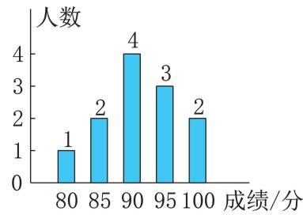  
示例 图

.统计数据是 名学生的成绩 而不是这五个数 切忌混淆.

.求这组数据的中位数可更简单些,即看条形统计图可知 个数据中 居于中间位置的两个数据均为 ,故可直接求得结果,不必将 个数据一一列出.

解析: 个数据从小到大依次为 , , , , , , , , , , ,第 个数据与第 个数据的平均数为 ${ \frac { 9 0 + 9 0 } { 2 } } = 9 0$ 故这组数据的中位数为 .

答案: .

# 知识点5众数

1.一组数据中出现次数最多的数据叫作这组数据的众数.如数据 ,,,,, 的众数是 .众数的单位与原数据的单位一致.

2.当一组数据有较多的重复数据时,众数往往能较好地反映其集中趋势.

3.当一组数据中出现次数 频数 最多的数据有 个或 个以上时,这几个数都是这组数据的众数,即众数不具有唯一性.

4.众数考察的是各数据出现的频数 其大小只与这组数据中的部分数据有关.

！提示 众数是一组数据 多数水平 的重要数据代表一组数据的众数有时不止一个.若几个数据出现的次数相同,并且比其他数据出现的次数都多,则这几个数据都是这组数据的众数.

示例5 某班学生经常采用小组合作学习的方式进行学习,王老师每周对各小组合作学习的情况进行综合评分.下表是各小组其中一周的得分情况:

<table><tr><td rowspan=1 colspan=1>组 别</td><td rowspan=1 colspan=1></td><td rowspan=1 colspan=1>二</td><td rowspan=1 colspan=1>三</td><td rowspan=1 colspan=1>四</td><td rowspan=1 colspan=1>五</td><td rowspan=1 colspan=1>六</td><td rowspan=1 colspan=1>七</td><td rowspan=1 colspan=1>八</td></tr><tr><td rowspan=1 colspan=1>得分/分</td><td rowspan=1 colspan=1>90</td><td rowspan=1 colspan=1>95</td><td rowspan=1 colspan=1>90</td><td rowspan=1 colspan=1>88</td><td rowspan=1 colspan=1>90</td><td rowspan=1 colspan=1>92</td><td rowspan=1 colspan=1>85</td><td rowspan=1 colspan=1>90</td></tr></table>

这组数据的众数是解析 根据众数是出现次数最多的数据就可以求解

答案: .

众数是一组数据中出现次数最多的数据 而不是数据出现的次数.

# 平均数、中位数和众数的联系与区别

<table><tr><td rowspan=1 colspan=1>名称</td><td rowspan=1 colspan=1>区别</td><td rowspan=1 colspan=1>联系</td></tr><tr><td rowspan=1 colspan=1>平均数</td><td rowspan=1 colspan=1>（1）平均数的大小与一组数据中的每个数据均有关系，任何一个数据的变动都可能会引起相应平均数的变动；（2）一组数据的平均数唯一；（3）平均数不一定是原数据中的数据</td><td rowspan=3 colspan=1>(1）平均数、中位数和众数都是描述一组数据的集中趋势的特征数；（2）实际问题中求得的平均数、中位数和众数的单位与原始数据的单位一致</td></tr><tr><td rowspan=1 colspan=1>中位数</td><td rowspan=1 colspan=1>（1）中位数与数据的排列位置有关，某些数据的变动对中位数没有影响，当一组数据中存在个别极端数据时，可用中位数来描述其集中趋势;（2）一组数据的中位数唯一；（3）中位数也可能不是原数据中的数据</td></tr><tr><td rowspan=1 colspan=1>众数</td><td rowspan=1 colspan=1>（1）众数着眼于对各数据出现频数的考察，其大小只与这组数据中的部分数据有关，当一组数据中有不少数据多次重复出现时，其众数往往是我们关心的一种统计量；（2）一组数据的众数不一定唯一，也可能没有众数;（3）众数一定是原数据中的数据；（4）众数不受极端数据的影响</td></tr></table>

！提示 平均数 中位数 众数从不同方面反映了一组数据的集中趋势 因此为了较全面、科学地分析一组数据 我们往往对这三个方面都加以考虑,避免仅从一个方面考虑,轻易下结论.

示例6 ( ·江西改编)如图是某地去年一至六月份每月空气质量为优的天数的折线统计图,关于各月份空气质量为优的天数,下列结论正确的是

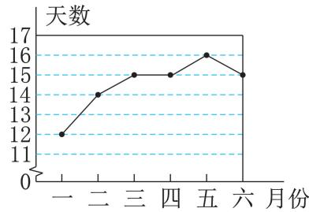  
示例 图

这组数据中共含有 个数 这组数据的众数是这组数据的中位数是 这组数据的平均数是解析:这组数据中共有 个数,从小到大依次为 , , , , , ,从而求得众数为 ,中位数为 ${ \frac { 1 5 + 1 5 } { 2 } } = 1 5$ ,平均数为 $\frac { 1 } { 6 } \times \left( 1 2 + 1 4 + 1 5 + 1 5 + \right.$ $1 5 + 1 6 ) = { \frac { 2 9 } { 2 } } \neq 1 5 .$ .

答案:C.

点拨 统计的是各月份空气质量为优的天数 切不可误以为数据个数是 $1 2 +$ $1 4 + 1 5 + 1 5 + 1 5 + 1 6 = 8 7$ .

# 典例展示厅

# 题型

# 一 用样本估计总体在实际生活中的应用

典例1小刚家有一个鱼塘 鱼塘里养了 条鲫鱼 现准备打捞出售 为了估计这个鱼塘里鲫鱼的总质量,现从鱼塘里捕捞了三次并进行统计,得到的数据如下表:

<table><tr><td rowspan=1 colspan=1>次序</td><td rowspan=1 colspan=1>第一次</td><td rowspan=1 colspan=1>第二次</td><td rowspan=1 colspan=1>第三次</td></tr><tr><td rowspan=1 colspan=1>鲫鱼的条数</td><td rowspan=1 colspan=1>20</td><td rowspan=1 colspan=1>10</td><td rowspan=1 colspan=1>10</td></tr><tr><td rowspan=1 colspan=1>平均每条鲫鱼的质量/千克</td><td rowspan=1 colspan=1>1.6</td><td rowspan=1 colspan=1>2.2</td><td rowspan=1 colspan=1>1.8</td></tr></table>

这个鱼塘里鲫鱼的总质量约是多少千克?

解析 应通过计算已捕捞的 条鲫鱼的平均质量利用样本估计总体的思想来计算.

解 捕捞上来的 条鲫鱼的平均质量为$\frac { 2 0 \times 1 . 6 + 1 0 \times 2 . 2 + 1 0 \times 1 . 8 } { 2 0 + 1 0 + 1 0 } { = } 1 . \ : \ell$ (千克),这个鱼塘里鲫鱼的总质量约是 $1 , \ 8 \times$ $2 \ 0 0 0 { = } 3 \ 6 0 0$ (千克).

# 非常点评

用样本估计总体是统计学中非常重要的思想.优点是提高效率 节约时间与能源 缺点是有时数据不够精确.

# 题型

# “权”的常见给出方式

# 1.用比的形式给出各数据的 权

典例2 某初中欲向高一级学校推荐一名学生,根据规定的推荐程序:首先,由本年级名学生民主投票 每人只能推荐一人 不设弃权票 选出了得票数最多的甲 乙 丙三人 投票结果统计如图 $\textcircled{1}$ 所示.其次 对三名候选人进行了笔试和面试两项测试 各项成绩如下表:

<table><tr><td rowspan=2 colspan=1>测试项目</td><td rowspan=1 colspan=3>测试成绩/分</td></tr><tr><td rowspan=1 colspan=1>甲</td><td rowspan=1 colspan=1>乙</td><td rowspan=1 colspan=1>丙</td></tr><tr><td rowspan=1 colspan=1>笔试</td><td rowspan=1 colspan=1>92</td><td rowspan=1 colspan=1>90</td><td rowspan=1 colspan=1>95</td></tr><tr><td rowspan=1 colspan=1>面试</td><td rowspan=1 colspan=1>85</td><td rowspan=1 colspan=1>95</td><td rowspan=1 colspan=1>80</td></tr></table>

如图 $\textcircled{2}$ 所示为某同学根据上表绘制的一幅不完整的条形统计图.

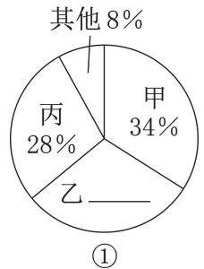

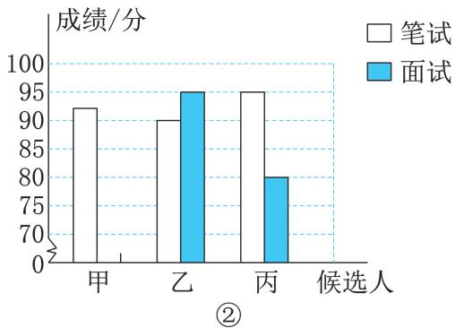  
典例 图

请你根据以上信息 解答下列问题()补全图 $\textcircled{1}$ 和图 $\textcircled{2}$ ;

()请计算每名候选人的得票数;

若每名候选人得一票记 分 投票 笔试 面试三项得分按照 $2 : 5 : 3$ 的比计算三名候选人的平均成绩 成绩最高的将被推荐则应该推荐谁

解析:()在扇形统计图中,由各部分的百分比之和是 ,即可知道乙的得票数占总票数的百分比.通过表格可看出,甲的面试成绩是 分,即可补全条形统计图.()用总票数乘对应的百分比可得每名候选人的得票数.()分别求三个人成绩的加权平均数.

解:()如图 $\textcircled{3} \textcircled{4}$ 所示. ()甲: $2 0 0 \times 3 4 \% = 6 8 ($ (票), 乙: $2 0 0 \times 3 0 \% = 6 0$ (票), 丙: $2 0 0 \times 2 8 \% = 5 6$ (票).

()甲的平均成绩 $\stackrel { - } { x } _ { \scriptscriptstyle \Psi } = \frac { 6 8 \times 2 + 9 2 \times 5 + 8 5 \times 3 } { 2 + 5 + 3 } =$

.(分),

乙的平均成绩 $\overline { { { x } } } _ { \mathord { \ Z } } = \frac { 6 0 \times 2 + 9 0 \times 5 + 9 5 \times 3 } { 2 + 5 + 3 } =$

.(分),

丙的平均成绩 $\overline { { { x _ { \tt B } } } } = \frac { 5 6 \times 2 + 9 5 \times 5 + 8 0 \times 3 } { 2 + 5 + 3 } =$

.(分).

： $^ { \bullet } \ 8 5 . 5 { \ > } 8 5 . 1 { > } 8 2 . 7$ ,乙的平均成绩最高 应该推荐乙.

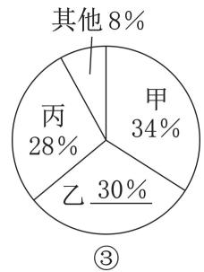

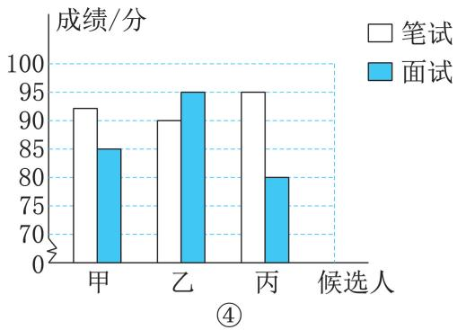  
典例 图

# 方法归纳

# 求“平均数”的方法

计算算术平均数是直接求得一组数据的总和 再除以这组数据的个数 计算加权平均数 则需要考虑各个数据在这组数据中的“权重”.无论是算术平均数,还是加权平均数,它们都反映了组数据的平均水平.

# 2.用百分数的形式给出各数据的“权”

典例3 某校为推荐一个作品参加科技创新比赛 对甲 乙 丙 丁四个作品进行量化评分具体成绩(百分制)如下表:

<table><tr><td rowspan=1 colspan=1>作1品</td><td rowspan=1 colspan=1>甲</td><td rowspan=1 colspan=1>乙</td><td rowspan=1 colspan=1>丙</td><td rowspan=1 colspan=1>丁</td></tr><tr><td rowspan=1 colspan=1>创新性</td><td rowspan=1 colspan=1>90分</td><td rowspan=1 colspan=1>95分</td><td rowspan=1 colspan=1>90分</td><td rowspan=1 colspan=1>90分</td></tr><tr><td rowspan=1 colspan=1>实用性</td><td rowspan=1 colspan=1>90分</td><td rowspan=1 colspan=1>90分</td><td rowspan=1 colspan=1>95分</td><td rowspan=1 colspan=1>85分</td></tr></table>

如果按照创新性占 $60 \%$ 实用性占 $40 \%$ 计算总成绩 并根据总成绩择优推荐 那么应推荐的作品是

A.甲 B.乙 C.丙 D.丁解析 按照创新性的权重为 $60 \%$ 实用性的权重为$40 \%$ 来计算 甲的总成绩 $= 9 0 \times 6 0 \% + 9 0 \times 4 0 \% =$ 分 乙的总成绩 $= 9 5 \times 6 0 \% + 9 0 \times 4 0 \% =$ 分 丙的总成绩 $= 9 0 \times 6 0 \% + 9 5 \times 4 0 \% =$ 分 丁的总成绩 $= 9 0 \times 6 0 \% + 8 5 \times 4 0 \% =$ 分 .因为 $9 3 > 9 2 > 9 0 > 8 8$ 所以乙的总成绩最高.所以应推荐的作品是乙.

答案:.

# - 对接教材

本题与教材 例 相对应,都是利用加权平均数来解决实际问题 其中 权 说明了不同数据的“重要程度”,所以在解决实际问题时要格外关注各项的“权”重.

# 题型三 用“组中值”计算平均数

典例4 八年级 班学生参加初中数学竞赛取得了优异的成绩 指导老师统计了所有参赛学生的成绩(成绩都是整数,满分为 分,且没有学生拿到满分 并且绘制了如图所示的频数分布直方图(每组包含最小值,不包含最大值 .

八年级 班在本次数学竞赛中的平均成绩大约是多少分(结果精确到 . 分)?

如果成绩在 分以上 含 分 的学生获奖 那么该班参赛学生的获奖率是多少解析 由频数分布直方图可知共有 名学生参加了数学竞赛 但从中不能看出每名学生的具体成绩 因此用各组的 组中值 来近似地计算本次数学竞赛的平均成绩. 用成绩在 分以上 含分 的人数除以总人数即可.

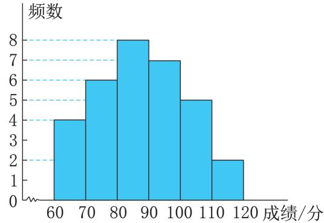  
典例 图

解:() $4 + 6 + 8 + 7 + 5 + 2 = 3 2$ (名), ${ \overline { { x } } } =$ $\frac { 1 } { 3 2 } { \times } ( 6 5 { \times } 4 + 7 5 { \times } 6 + 8 5 { \times } 8 + 9 5 { \times } 7 + 1 0 5 { \times }$ $5 + 1 1 5 \times 2 ) \approx 8 7 . 8 \AA$ (分).

获奖率为 ${ \frac { 7 + 5 + 2 } { 3 2 } } \times 1 0 0 \% = 4 3 . 7 5 \% .$ .

# 非常点评

“组中值”是指这个小组中两端点的数的平均数 在频数分布直方图或频数分布表中求平均数时 常用 组中值 代表各组的实际数据 把各组的频数看成相应 组中值 的权 能近似地计算出一组数据的平均数 但它仅是一个近似值.

# 题型四 确定统计图中的“三数”

# 1.用条形统计图确定 三数

典例5 在某中学组织的诗词大赛中,来自不同年级的 名参赛同学的成绩如图所示.这些成绩的中位数和众数分别是 )

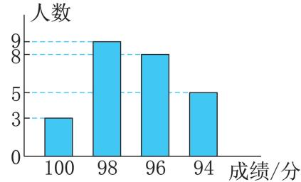  
典例 图

分, 分 分, 分 分, 分 分, 分

解析:根据一组数据中出现次数最多的数据判断众数 根据将一组数据按照从小到大 或从大到小 的顺序排列后处于中间位置的数据确定中位数即可.

答案:

# 非常点评

平均数 中位数 众数是统计中的三个重要的量 在这儿简称为 三数 .解答这类问题时关键是从图中挖掘所含的信息 再根据题中所给

条件求解.

在计算中位数时 要先把这组数据按照从小到大或者从大到小的顺序排列 取最中间的一个数据或者中间两个数据的平均数,中位数不受极端值的影响 众数是指一组数据中出现次数最多的数据.

# 2.用折线统计图确定 三数

典例6 在学校的体育训练中 小杰投掷实心球的 次成绩如图所示,则这 次成绩的中位数和平均数分别是 （

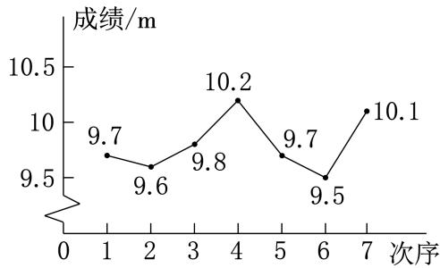  
典例 图

A. $9 . 7 ~ \mathrm { m } , 9 . 9 ~ \mathrm { m }$ B. $9 . 7 ~ \mathrm { m } , 9 . 8 ~ \mathrm { m }$   
C. $9 . 8 ~ \mathrm { m } , 9 . 7 ~ \mathrm { m }$ D. $9 . 8 ~ \mathrm { m } , 9 . 9 ~ \mathrm { m }$

解析:观察统计图,得到 次成绩,把这 个数据从小到大排列,第 个数据是 .,因此这 次成绩的中位数是 $9 . 7 \mathrm { ~ m ~ }$ ;平均数为 $\frac { 1 } { 7 } \times ( 9 . 5 + 9 . 6 + 9 . 7 +$ $9 . 7 + 9 . 8 + 1 0 . 1 + 1 0 . 2 ) = 9 . 8 ( \mathrm { m } ) .$ .

答案:

# 非常点评

根据折线统计图确定 三数 时 关键是从图中得到具体的数据,再结合“三数”的定义解题.

# 3.用扇形统计图确定 三数

典例7 某市自开展“学习新思想,做好接班人”主题阅读活动以来,受到各校的广泛关注和学生们的积极响应.某校为了解全校学生主题阅读的情况 随机抽查了部分学生在某一周内文章阅读的篇数 并制成如下统计图表.

<table><tr><td rowspan=1 colspan=1>文章阅读的篇数</td><td rowspan=1 colspan=1>3</td><td rowspan=1 colspan=1>4</td><td rowspan=1 colspan=1>5</td><td rowspan=1 colspan=1>6</td><td rowspan=1 colspan=1>7及以上</td></tr><tr><td rowspan=1 colspan=1>人数</td><td rowspan=1 colspan=1>20</td><td rowspan=1 colspan=1>28</td><td rowspan=1 colspan=1>m</td><td rowspan=1 colspan=1>16</td><td rowspan=1 colspan=1>12</td></tr></table>

请根据统计图表中的信息,解答下列问题:

()求被抽查的学生人数和 $m$ 的值;  
求本次抽查的学生文章阅读篇数的中位数和众数  
若该校共有 名学生 根据抽查结果估计该校学生在这一周内文章阅读的篇数为的人数.

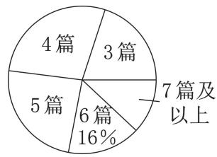  
典例 图

解析 由文章阅读的篇数为 的人数及其所占百分比求得被抽查的学生人数 进而求得 $m$ 的值根据中位数和众数的定义求解 用总人数乘样本中一周内文章阅读的篇数为 的人数所占比例即可求得.

解:()被抽查的学生人数为 $1 6 \div 1 6 \% =$ 100, : $m = 1 0 0 - ( 2 0 + 2 8 + 1 6 + 1 2 ) = 2 4 .$ .

共有 个数据 中位数为第个数据的平均数,  
而第 个数据均为  
本次抽查的学生文章阅读篇数的中位数为 .  
出现次数最多的数据是 ,  
本次抽查的学生文章阅读篇数的众数为 .

估计该校学生在这一周内文章阅读的篇数为 的人数为 $8 0 0 \times { \frac { 2 8 } { 1 0 0 } } { = } 2 2 4 .$ .

# 非常点评

从扇形统计图中获取信息求“三数”,关键是从扇形统计图中获取准确的数据 然后根据 三数 的计算方法进行计算.

# 题型五 如何选择“三数”作代表

# 1.用平均数作代表

典例8 小谢家买了一辆小轿车,小谢连续记录了七天中每天行驶的路程如下表:

<table><tr><td rowspan=1 colspan=1>时间</td><td rowspan=1 colspan=1>第1天</td><td rowspan=1 colspan=1>第第二</td><td rowspan=1 colspan=1>第第三干</td><td rowspan=1 colspan=1>第</td><td rowspan=1 colspan=1>第五天</td><td rowspan=1 colspan=1>第六天</td><td rowspan=1 colspan=1>第七天</td></tr><tr><td rowspan=1 colspan=1>路程/千米</td><td rowspan=1 colspan=1>46</td><td rowspan=1 colspan=1>39</td><td rowspan=1 colspan=1>36</td><td rowspan=1 colspan=1>50</td><td rowspan=1 colspan=1>54</td><td rowspan=1 colspan=1>91</td><td rowspan=1 colspan=1>34</td></tr></table>

用统计的知识,解答下面的问题:

()估计小谢家小轿车每月(按 天计算)要行驶多少千米

若每行驶 千米需汽油 升 汽油每升 . 元,估计小谢家一年(按 个月计算 的汽油费用是多少元

解析:()先利用平均数的计算公式求出平均每天行驶的路程,再根据平均每天行驶的路程求出每月要行驶的路程.()根据每月要行驶的路程求出每年要行驶的路程,有几个 千米,即需几个 升,再乘汽油的单价,就可求出小谢家一年的汽油费用.

解 由表可知 平均每天行驶的路程为${ \frac { 1 } { 7 } } \times ( 4 6 + 3 9 + 3 6 + 5 0 + 5 4 + 9 1 + 3 4 ) =$ (千米),  
估计小谢家小轿车每月要行驶 $5 0 \times 3 0 =$ (千米).

() 估 计 小 谢 家 一 年 的 汽 油 费 用 为${ \frac { 1 \ 5 0 0 \times 1 2 } { 1 0 0 } } \times 8 \times 7 . \ 2 5 = 1 0 \ 4 4 0 ( { \overrightarrow { \mathcal { D } } } ) .$

# 非常点评

平均数反映了一组数据的 平均水平 它对一组数据所包含信息的反映最充分 其应用也较为广泛 但易受极端值的影响 有时计算还比较麻烦.

# 2.用众数作代表

典例9 为了全面了解学生的学习 生活及家庭的基本情况 加强学校 家庭的联系 某中学积极组织全体教师开展 课外访万家 活动.王老师对所在班级的全体学生进行实地家访 了解到每名学生家庭的相关信息 现从中随机抽取 名学生家庭的年收入情况,统计如下表:

<table><tr><td rowspan=1 colspan=1>年收入/万元</td><td rowspan=1 colspan=1>6</td><td rowspan=1 colspan=1>6.5</td><td rowspan=1 colspan=1>1</td><td rowspan=1 colspan=1>8</td><td rowspan=1 colspan=1>9</td><td rowspan=1 colspan=1>139</td><td rowspan=1 colspan=1>17</td></tr><tr><td rowspan=1 colspan=1>家庭个数</td><td rowspan=1 colspan=1>1</td><td rowspan=1 colspan=1>3</td><td rowspan=1 colspan=1>5</td><td rowspan=1 colspan=1>2</td><td rowspan=1 colspan=1>2</td><td rowspan=1 colspan=1>1</td><td rowspan=1 colspan=1>1</td></tr></table>

()求这 名学生家庭年收入的平均数、众数.

你认为用 中的哪个统计量来代表这名学生家庭年收入的一般水平较为合适请简要说明理由.

解析:()根据平均数、众数的定义求解即可.在平均数 众数两数中 平均数受到极端值的影响较大 所以众数更能反映家庭年收入的一般水平.

解:()这 名学生家庭年收入的平均数是$( 6 + 6 , ~ 5 \times 3 + 7 \times 5 + 8 \times 2 + 9 \times 2 + 1 3 +$ $1 7 ) \div 1 5 = 8 . 3 $ 万元 .在这一组数据中出现次数最多的是 ,这 名学生家庭年收入的众数是 万元.

()用众数代表这 名学生家庭年收入的一般水平较为合适.理由 在这 个数据中 出现的次数最多所以能代表家庭年收入的一般水平.

# 非常点评

众数是一组数据中出现次数最多的数据,反映了一组数据的集中趋势.众数的计算比较简单 不受极端值的影响 但有时一组数据的众数可能不止一个 也可能没有众数 因此可靠性比较差.

# 3.用中位数作代表

典例10 某公司销售部人员收入完全与销售量挂钩 去年年薪情况统计如下表() 个人年薪数据的平均数是 ,众数是 ,中位数是

<table><tr><td rowspan=1 colspan=1>年薪/万元</td><td rowspan=1 colspan=1>16</td><td rowspan=1 colspan=1>17</td><td rowspan=1 colspan=1>18</td><td rowspan=1 colspan=1>20</td><td rowspan=1 colspan=1>153</td></tr><tr><td rowspan=1 colspan=1>人数</td><td rowspan=1 colspan=1>2</td><td rowspan=1 colspan=1>1</td><td rowspan=1 colspan=1>1</td><td rowspan=1 colspan=1>1</td><td rowspan=1 colspan=1>1</td></tr></table>

描述这 名销售员的一般年薪水平 用什么统计量较合适 为什么

解析 数据为 根据 三数 的计算方法求解 根据数据的集中趋势选择合适的统计量.

解:() ; ; ..

()用中位数描述这 名销售员的一般年薪水平较合适.  
有 个人的年薪均在 $1 6 { \sim } 2 0$ 万元之间用中位数反映销售员的一般年薪水平较合适.

# 方法归纳

# 选择合适的统计量表示一组数据集中趋势的方法

我们不仅要会求平均数、中位数和众数,还要能正确选用平均数 中位数 众数表示这组数据的集中趋势.当一组数据中某些数据重复出现次数较多时 众数往往作为首选的统计量 当个别数据偏离平均数 众数较远时 常用中位数反映该组数据的集中趋势.选择的统计量要能代表这组数据全部或绝大部分的特征.

# 4.综合用“三数”作代表

典例11 三个生产日光灯管的厂家都在广告中宣称 他们生产的日光灯管在正常情况下灯管的使用寿命为 个月.工商部门为了检查他们宣传的真实性 从三个厂家各抽取了只日光灯管进行检测 灯管的使用寿命(单位:个月)如下表:

<table><tr><td>甲厂78999111314161719</td><td></td><td></td><td></td><td></td><td></td><td></td><td></td><td></td><td></td><td></td><td></td><td></td></tr><tr><td>乙厂</td><td></td><td>17</td><td></td><td>9</td><td></td><td></td><td>910101212121314</td><td></td><td></td><td></td><td></td><td></td></tr><tr><td>丙厂</td><td></td><td>77</td><td></td><td>8</td><td>8</td><td>8121314151617</td><td></td><td></td><td></td><td></td><td></td><td></td></tr></table>

这三个厂家的广告分别利用了统计中的哪一个特征数 平均数 中位数 众数 进行宣传?

如果三个厂家的产品的售价一样 那么作为顾客你会选购哪个厂家的产品 请说明理由.

解析 要看甲 乙 丙三个厂家分别利用了哪一个特征数 则需要分别计算出甲 乙 丙三个厂家灯管的使用寿命的平均数、中位数和众数,看哪一个特征数与 个月相等 然后进行判断.

解:() ${ \overline { { x } } } _ { \mathbb { H } } = { \frac { 1 } { 1 1 } } \times ( 7 + 8 + \cdots + 1 9 ) =$ (个月); ${ \overline { { x } } } _ { \mathsf { Z } } = { \frac { 1 } { 1 1 } } { \times } ( 7 + 7 + \cdots + 1 4 ) { = } { \frac { 1 1 5 } { 1 1 } } ($ (个月); ${ \overline { { x } } } _ { \mathtt { F } } = { \frac { 1 } { 1 1 } } \times ( 7 + 7 + \cdots + 1 7 ) = { \frac { 1 2 5 } { 1 1 } } ($ (个月).

甲厂灯管使用寿命的中位数为 个月,众数为 个月;  
乙厂灯管使用寿命的中位数为 个月 众数为 个月;  
丙厂灯管使用寿命的中位数为 个月 众数为 个月.  
甲厂的广告利用了平均数 乙厂的广告利用了众数,丙厂的广告利用了中位数.  
()答案不唯一,如选购甲厂的产品.  
理由 平均数能较真实地反映灯管的平均使用寿命.

# 非常点评

平均数 中位数和众数从不同方面反映了一组数据的平均水平 虽然不同数据中平均数 中位数 众数的值可能相同 但反映出来的平均水平可能存在差异 应灵活处理.

# 误区警示牌

# 易错点一

# 不理解平均数与加权平均数的区别致错

例1 在一次 爱心互助 捐书活动中 某班第一小组 名同学捐书的数量如下表

<table><tr><td rowspan=1 colspan=1>数量/本</td><td rowspan=1 colspan=1>5</td><td rowspan=1 colspan=1>6</td><td rowspan=1 colspan=1>7</td><td rowspan=1 colspan=1>10</td></tr><tr><td rowspan=1 colspan=1>人数</td><td rowspan=1 colspan=1>2</td><td rowspan=1 colspan=1>3</td><td rowspan=1 colspan=1>2</td><td rowspan=1 colspan=1>1</td></tr></table>

这 名同学捐书的平均数量为 本.正确解答 捐书的平均数量为 $( 5 \times 2 + 6 \times 3 +$ $7 \times 2 + 1 0 \times 1 ) \div ( 2 + 3 + 2 + 1 ) = 6 . 5$ 本 .故填 ..

考虑各个数据的个数不同 也就是每个数据的 重要程度 不同 故应该求这组数据的加权平均数 切忌丢掉这个 权 只是简单地把这些数据相加求平均数 这是最易犯的错误.只有各个数据个数相等 才能直接相加.

# 易错点二 误解数据的意义致错

例2 学校组织普通话演讲比赛,共有 人参

赛 成绩如图所示 这一组数据的中位数是

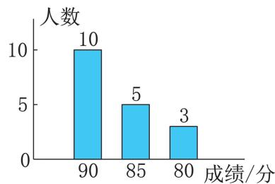  
例 图

正确解答:数据的个数为 ,将这些数据按从大到小排列,中位数是第 个与第 个数据的平均数,为 ${ \frac { 9 0 + 9 0 } { 2 } } = 9 0 .$ .故填 .

本题易误得结论 中位数为 错误原因是误认为数据只有 三个 这是解这类题极易犯的错误.

# 易错点三 对众数的理解有误致错

例3 八年级 班 名同学练习定点投篮每人各投 次,进球个数统计如下表:

<table><tr><td rowspan=1 colspan=1>进球个数</td><td rowspan=1 colspan=1>1</td><td rowspan=1 colspan=1>2</td><td rowspan=1 colspan=1>3</td><td rowspan=1 colspan=1>4</td><td rowspan=1 colspan=1>5</td><td rowspan=1 colspan=1>7</td></tr><tr><td rowspan=1 colspan=1>人数</td><td rowspan=1 colspan=1>1</td><td rowspan=1 colspan=1>1</td><td rowspan=1 colspan=1>4</td><td rowspan=1 colspan=1>2</td><td rowspan=1 colspan=1>3</td><td rowspan=1 colspan=1>1</td></tr></table>

这 名同学进球个数的众数是正确解答 由于练习定点投篮进 个球出现了 人 出现的次数最多 故这组数据的众数

是 .故填 .

众数是一组数据中出现次数最多的数据 这里易误把出现最多次的数的次数 当成众数.众数不是指数据出现的次数 而是出现次数最多的数据.

#

问题(教材 )可以.不可以.

思考 教材

若听 说 读 写的成绩按照 $3 : 3 : 2 : 2$ 的比确定 则甲的平均成绩为${ \frac { 8 5 \times 3 + 7 8 \times 3 + 8 5 \times 2 + 7 3 \times 2 } { 3 + 3 + 2 + 2 } } = 8 0 . \ 5$ 分 乙的平均成绩为 $\frac { 7 3 \times 3 + 8 0 \times 3 + 8 2 \times 2 + 8 3 \times 2 } { 3 + 3 + 2 + 2 } =$ . 分 . $8 0 . 5 { \ > } 7 8 . 9 $ 应该录取甲.

与问题中的 相比较 能体会到权越大说明其所对应的数据 成绩 就越重要 数据的权能够反映数据的相对 重要程度 .

问题(教材 )

$5 0 \% , 4 0 \% , 1 0 \%$ 说明演讲内容 语言表达形象风度三项成绩在总成绩中的重要程度 是三项成绩的权 所以他们的综合成绩不同.权越大数据对加权平均数的影响越大.

# 思考 教材

不一定.扩大样本容量.

问题(教材 )不合适.

思考(教材 )

因为平均数受极端值影响更显著 而中位数受极端值影响较小.

问题 教材

由表中的数据可以看出,尺码为 $2 2 \mathrm { c m }$ ,$2 2 . 5 \ : \mathrm { c m } , 2 5 \ : \mathrm { c m }$ 的鞋销售量偏低 在进货时应少进这几种尺码的鞋 合理即可 .

问题(教材 )

因为平均数受极端值影响显著,少数高收入者的月收入会拉高平均数.

思考(教材 )

合适 月收入达到 元的有人 未达到的有 人 因此用众数能反映这家公司员工的月收入水平 合理即可 .

问题 教材

因为平均数受极端值的影响较大 去掉一个最高分和一个最低分 可减小极端值对平均数的影响 使评分更公平

练习 教材

.()甲: ${ \frac { 8 6 + 9 0 } { 2 } } = 8 8 $ (分),乙: ${ \frac { 9 2 + 8 3 } { 2 } } =$ .(分). $8 8 > 8 7 . \ 5$ , 甲将被录取()甲: $( 8 6 \times 6 + 9 0 \times 4 ) \div ( 6 + 4 ) = 8 7 . 6 ($ (分),乙: $( 9 2 \times 6 + 8 3 \times 4 ) \div ( 6 + 4 ) = 8 8 . 4 ($ (分).$8 7 . 6 { < } 8 8 . 4 ,$ , 乙将被录取2.∵ $9 5 \times 2 0 \% + 9 0 \times 3 0 \% + 8 5 \times 5 0 \% =$ . 分 他这学期的体育成绩是 . 分

练习 教材 $\cdot$

.这个跳水队运动员 的 平 均 年 龄 为$\frac { 1 3 \times 8 + 1 4 \times 1 6 + 1 5 \times 2 4 + 1 6 \times 2 } { 8 + 1 6 + 2 4 + 2 } \approx 1 4 0$ 岁

.这家超市的每人次平均消费金额是$\frac { 1 } { 4 \ 0 0 0 + 2 \ 0 0 0 + 3 \ 0 0 0 + 7 \ 0 0 0 + 4 \ 0 0 0 } \times ( 4 \ 0 0 0 \times$ $4 6 + 2 ~ 0 0 0 \times 3 2 + 3 ~ 0 0 0 \times 6 3 + 7 ~ 0 0 0 \times 9 5 +$ $4 \ 0 0 0 \times 8 0 ) = 7 1 . \ 1$ 元 非现金结账百分比为$\frac { 1 } { 4 \ 0 0 0 + 2 \ 0 0 0 + 3 \ 0 0 0 + 7 \ 0 0 0 + 4 \ 0 0 0 } \times ( 4 \ 0 0 0 \times$ $7 0 \% + 2 \ 0 0 0 \times 7 6 \% + 3 \ 0 0 0 \times 7 3 \% + 7 \ 0 0 0 \times$ $8 5 \% + 4 0 0 0 \times 8 2 \% ) = 7 8 . 7 \%$

. 这个班级学生上学路上平均所需时间为

练习(教材 $^ -$ )

1.∵ $( 1 0 \times 1 0 + 1 3 \times 1 5 + 1 4 \times 2 0 + 1 5 \times$ $1 8 ) \div ( 1 0 + 1 5 + 2 0 + 1 8 ) \approx 1 3$ 根 这批新品种黄瓜平均每株约结 根黄瓜

.估计这批槐树树干 的 平 均 周 长 为$\frac { 1 } { 8 + 1 2 + 1 4 + 1 0 + 6 } \times ( 3 2 . ~ 5 \times 8 + 3 7 . ~ 5 \times 1 2 +$ $4 2 . 5 \times 1 4 + 4 7 . 5 \times 1 0 + 5 2 . 5 \times 6 ) \approx 4 2 ( { \mathrm { c m } } )$

. 表 估计这所学校所有学生的平均课外阅读时间为$\scriptstyle { \frac { 1 \times 2 + 3 \times 6 + 5 \times 2 3 + 7 \times 1 1 + 9 \times 5 + 1 1 \times 3 } { 2 + 6 + 2 3 + 1 1 + 5 + 3 } } =$

$5 , 8 ( \mathrm { h } )$ 表 估计这所学校所有学生的平均课外阅读时间为 $\frac { 2 \times 8 + 6 \times 3 4 + 1 0 \times 8 } { 8 + 3 4 + 8 } { = } 6 ( \mathrm { h } )$

()不相同 表 更合适 因为分组更细,数据分布反映更准确

# 练习(教材 )

.这些工人每天加工零件数的中位数是.乳类软饮料

练习 教材

.平均数受影响,中位数不受影响 平均数的大小与一组数据里的每个数据均有关系,因此一个数据的变动会引起平均数的变动;中位数仅与数据按大小依次排列的位置有关 数据错记成 仍是最大值 各数据大小排列的位置不变

. 第 组 平均数 中位数 众数 第 组 平均数 中位数 众数这两组数据的中位数 众数相同 第一组数据的平均数大于第二组.特点:平均数的大小与组数据里的每个数据均有关系 任何数据的变动都会引起平均数的变动;中位数仅与数据按大小依次排列的位置有关 众数着眼于对各数据出现的频数的考查 其大小只与在这组数据中的部分数据有关

习题 教材

# [复习巩固]

$\frac { 1 0 0 \times 1 + 8 0 \times 3 + 5 0 \times 7 + 3 0 \times 4 } { 1 + 3 + 7 + 4 } =$ 万元 这个公司平均每人所创年利润是万元$_ 2 . ~ : ~ \frac { 1 } { 2 + 4 + 8 + 7 + 3 + 1 } \times ( 6 . ~ 5 \times 2 +$ $7 . 5 { \times } 4 + 8 . 5 { \times } 8 + 9 . 5 { \times } 7 + 1 0 . 5 { \times } 3 + 1 1 . 5 { \times }$ $\mathrm { 1 ) = 8 . 8 2 ( m ) , \cdot \mathrm { \cdot } }$ 这个班男生投掷实心球的平均成绩是 $8 , 8 2 \mathrm { m }$ $_ { 3 . } ~ \because ~ \frac { 1 } { 1 0 } \times ( 2 2 . ~ 3 6 + 2 2 . ~ 3 5 + 2 2 . ~ 3 3 +$ $2 2 . 3 5 + 2 2 . 3 7 + 2 2 . 3 4 + 2 2 . 3 8 + 2 2 . 3 6 +$ $2 2 . 3 2 \mathrm { + 2 2 . 3 5 ) = 2 2 . 3 5 1 ( m m ) , \ddot { . } }$ 估计这批零件的平均长度为 $2 2 . 3 5 1 \ \mathrm { m m }$

.这些运动员成绩的平均数为 $\frac { 1 } { 1 + 4 + 5 + 2 + 2 + 1 } \times ( 1 . ~ 4 5 \times 1 + 1 . ~ 5 0 \times 4 +$ $1 . 6 0 { \times } 5 + 1 . 6 5 { \times } 2 + 1 . 7 0 { \times } 2 + 1 . 7 5 { \times } 1 ) \approx$ $1 . 5 9 ( \mathrm { m } )$ ),中位数是 $1 . 6 0 \mathrm { m }$ ,众数是 $1 . 6 0 \mathrm { m }$

# [综合运用]

.()x甲 $\overline { { x } } _ { \mathtt { H } } = \frac { 1 } { 5 } \times ( 9 . 5 + 9 . 5 + 9 . 4 + 9 . 6 +$

$9 . 5 ) = 9 . 5 ; \overline { { { x } } } _ { \mathrm { Z } } = \frac { 1 } { 5 } \times ( 9 . 6 + 9 . 6 + 9 . 6 + 9 . 6 +$ $9 . ~ 0 ) = 9 . ~ 4 8 ~ ( 2 ) ~ \stackrel { - } { x } _ { \mathrm { { H } } } ^ { \prime } = \frac { 1 } { 3 } \times ( 9 . ~ 5 + 9 . ~ 5 +$ $9 . 5 ) = 9 . 5 ; \overline { { x } } _ { \mathrm { Z } } ^ { \prime } = \frac { 1 } { 3 } \times ( 9 . 6 + 9 . 6 + 9 . 6 ) = 9 . 6$ 第二种方法更合理 因为平均数受极端值的影响较大 去掉一个最高分和一个最低分 可减小极端值对平均数的影响,使打分更公平

.这三个镇的人均耕地面积为$\frac { 1 5 \times 0 . 1 5 + 7 \times 0 . 2 1 + 1 0 \times 0 . 1 8 } { 1 5 + 7 + 1 0 } \approx 0 . 1 7 ( \mathrm { h m } ^ { 2 } )$

.这所学校早操的出勤率为$\frac { 1 } { 4 0 0 + 3 5 0 + 3 8 0 } \times ( 4 0 0 \times 9 8 \% + 3 5 0 \times 9 6 \% +$ $3 8 0 \times 9 5 \% ) \approx 9 6 \%$

8.（1）甲： $( 7 0 \times 2 + 5 0 \times 3 + 8 0 \times 5 ) \div ( 2 +$ $3 + 5 ) = 6 9$ 分 乙 $( 9 0 \times 2 + 7 5 \times 3 + 4 5 \times 5 ) \div$ $( 2 + 3 + 5 ) = 6 3$ (分),丙: $( 5 0 \times 2 + 6 0 \times 3 + 8 5 \times$ $5 ) \div ( 2 + 3 + 5 ) = 7 0 . 5 ($ (分). $6 3 { < } 6 9 { < } 7 0 . \ 5$ ,应 该 录 取 丙 甲 $7 0 \ \times \ 5 0 \% \ +$ $5 0 \times 3 0 \% + 8 0 \times 2 0 \% = 6 6$ 分 乙 $90 \times 5 0 \% +$ $7 5 \times 3 0 \% + 4 5 \times 2 0 \% = 7 6 . 5 ($ 分 丙 $5 0 ~ \times$ $5 0 \% + 6 0 \times 3 0 \% + 8 5 \times 2 0 \% = 6 0$ (分). $6 0 <$ $6 6 { < } 7 6 . 5 , \ldots$ 应该录取乙

. 22+31+25+…+26+29

$2 1 ( ^ { \circ } \mathrm { C } ) , \therefore$ 这个月中午 时的平均气温约为$2 1 ~ ^ { \circ } \mathrm { C }$ ()以 为组距作频数分布表如下:

<table><tr><td rowspan=1 colspan=1>中午12时的气温 x/℃</td><td rowspan=1 colspan=1>组中值</td><td rowspan=1 colspan=1>频数</td></tr><tr><td rowspan=1 colspan=1>12≤x&lt;16</td><td rowspan=1 colspan=1>14</td><td rowspan=1 colspan=1>7</td></tr><tr><td rowspan=1 colspan=1>16≤x&lt;20</td><td rowspan=1 colspan=1>18</td><td rowspan=1 colspan=1>4</td></tr><tr><td rowspan=1 colspan=1>20≤x&lt;24</td><td rowspan=1 colspan=1>22</td><td rowspan=1 colspan=1>8</td></tr><tr><td rowspan=1 colspan=1>24≤x&lt;28</td><td rowspan=1 colspan=1>26</td><td rowspan=1 colspan=1>4</td></tr><tr><td rowspan=1 colspan=1>28≤x&lt;32</td><td rowspan=1 colspan=1>30</td><td rowspan=1 colspan=1>7</td></tr></table>

由表格可得,这个月中午 时的平均气温为

1  
X(14×7+18×4+22×8+26×4+30×30  
$7 ) = 2 2 ( ^ { \circ } \mathrm { C } )$ ).这个结果与()中的结果(近似值)相差不大,用组中值代表各组的实际数据,把各组的频数看成相应组中值的权,能近似地计算组数据的平均数 言之有理即可

这批鸡质量的平均数为$\frac { 1 } { 5 3 + 1 0 8 + 3 4 8 + 2 7 5 + 2 1 6 } \times ( 1 . ~ 3 \times 5 3 + 1 . ~ 6 \times$ $1 0 8 + 1 . ~ 9 \times 3 4 8 + 2 . ~ 1 \times 2 7 5 + 2 . ~ 3 \times 2 1 6 ) \approx$ $2 . \ 0 ( \mathrm { k g } )$ ),中位数为 $1 . 9 \mathrm { k g }$ ,众数为 $1 . 9 \mathrm { k g }$

.这些车的平均速度约为 $5 2 . 4 ~ \mathrm { k m / h }$ 车速的众数是 $5 2 ~ \mathrm { k m / h }$ 中位数是 $5 2 ~ \mathrm { k m / h }$ 由此可知,这个时段路口来往车辆的车速约为$5 2 ~ \mathrm { k m / h }$ 言之有理即可

# [拓广探索]

班捐书册数的平均数大 班捐书册数的平均数和中位数一样大 班捐书册数的中位数大 数据分布成左偏状态时,数据集中存在一些较小的值,导致平均数被拉低,而中位数相对稳定,因此中位数会大于平均数;反之,中位数小于平均数;数据分布对称时,平均数可能等于中位数 合理即可

.略

# 24.2 数据的离散程度

#

1.会计算方差,理解方差是用来反映数据的离散程度的统计量,培养用统计知识解决数学问题的能力.

2.经历探索方差的过程,理解并运用方差来解决实际问题,并能用计算器计算方差.

3.会用样本方差估计总体方差,进一步感受抽样的必要性,体会用样本估计总体的思想.

# 知识百宝箱

对应教材P168

# 知识点1 离差平方和

一组数据中各组数据与平均数的差的平方和叫作离差平方和,公式为 $d ^ { 2 } = ( x _ { 1 } - { \overline { { x } } } ) ^ { 2 } + ( x _ { 2 } - { \overline { { x } } } ) ^ { 2 } + \cdots + ( x _ { n } - { \overline { { x } } } ) ^ { 2 } .$ .

示例1 求数据 的离差平方和.

解析:先求数据的平均数,再根据公式求数据的离差平方和.

解 $\therefore \overline { { x } } = \frac { 3 + 9 + 6 + 2 } { A } = 5 , d ^ { 2 } = ( 3 - 5 ) ^ { 2 } + ( 9 - 5 ) ^ { 2 } + ( 6 - 5 ) ^ { 2 } + ( 2 -$ $5 ) ^ { 2 } = 4 + 1 6 + 1 + 9 = 3 0 .$ .

# 方差 [重点、难点]

1.概念 一组数据中 各数据与这组数据的平均数的差的平方的平均数叫作方差.方差越大,数据的波动越大;方差越小,数据的波动越小.

2.计算公式:用 $s ^ { 2 }$ 表示一组数据的方差,用 $_ { \mathcal { X } }$ 表示一组数据的平均数,用 $x _ { 1 } , x _ { 2 } , \cdots , x _ { n }$ 表示各数据,则 $s ^ { 2 } = { \frac { 1 } { n } } [ ( x _ { 1 } - { \overline { { x } } } ) ^ { 2 } + \qquad $ $( x _ { 2 } - { \overline { { x } } } ) ^ { 2 } + \cdots + ( x _ { n } - { \overline { { x } } } ) ^ { 2 } ] .$ .

3.计算方差的步骤:()求平均数;()求各数据与平均数的差值;()求各差值的平方;()求各平方的平均数.当然,在具体计算时 往往利用定义中的公式一次性求得

4.把一组数据中每个数据都加上或减去同一个数,得到的新数据方差不变.利用这个性质 在计算一组较大数据的方差时 可以采用“新数据法”,即将这组数据中每个数据都减去同一个数,得到一组新数据 再计算这组新数据的方差 所得结果与原数据的方差相同.

5.把一组数据中每个数据都乘同一个数 $a$ 所得的新数据的方差是原数据方差的 $a ^ { 2 }$ 倍.

.求数据的离差平方和 必须先求数据的平均数;

.求数据的离差平方和不必将数据排序.

.方差的大小与数据本身的大小无关 可能一组数据比较小 但方差较大 也有可能一组数据比较大 但方差较小.

.在考察总体方差时 有时所要考察的总体包含很多个体或者考察对象带有破坏性 常常用样本方差来估计总体方差.

方差的单位是原始数据单位的平方.

链接 离差平方和公式与方差公式的关系 $s ^ { 2 } { = } \frac { d ^ { 2 } } n$

示例2 ·龙东地区 有一组数据 则这组数据的方差为 （

A.1 B.0.8 C. 0.6 D. 0.5解析 因为 ${ \overline { { x } } } = { \frac { 2 + 3 + 3 + 4 } { 4 } } = 3$ 所以 $s ^ { 2 } = \frac { 1 } { 4 } [ ( 2 - 3 ) ^ { 2 } + ( 3 - 3 ) ^ { 2 } + ( 3 -$ $3 ) ^ { 2 } + ( 4 - 3 ) ^ { 2 } ] = \frac { 1 } { 4 } \times 2 = 0 . 5 .$ .

方法规律 方差的计算方法 $\textcircled{1}$ 求平均数 $\textcircled{2}$ 求各数据与平均数的差 $\textcircled{3}$ 求 $\textcircled{2}$ 中差值的平方 $\textcircled{4}$ 求 $\textcircled{3}$ 中各平方的平均数.

答案:.

示例3 甲、乙、丙、丁四名同学都参加了 次数学模拟测试,每个人这 次成绩的平均数都是 分,方差分别是 $s _ { \mathbb { H } } ^ { 2 } = 0 . 6 5$ 分2, $s _ { Z } ^ { 2 } =$ . 分2, $s _ { \mathbb { H } } ^ { 2 } = 0 . 5 0$ 分2, $s _ { \mathrm { T } } ^ { 2 } { = } 0 . ~ 4 5$ 分2,则这 次测试成绩最稳定的是 ( )

甲 B.乙 C.丙 D.丁解析:比较成绩的方差,方差越小,成绩越稳定.因为 $s _ { \mathtt { H } } ^ { 2 } = 0 . \ 6 5$ 分2, $s _ { \mathrm { ~ Z ~ } } ^ { 2 } =$ . 分2, $s _ { \mathbb { R } } ^ { 2 } = 0 . 5 0$ 分2, $s _ { \mathrm { T } } ^ { 2 } = 0 . \ 4 5$ 分2,所以 $s _ { \textsc { j } } ^ { 2 } { < } s _ { \textsc { m } } ^ { 2 } { < } s _ { \textsc { m } } ^ { 2 } { < } s _ { \textsc { m } } ^ { 2 }$ .所以成绩最稳定的是丁.

方法规律 方差是用来衡量一组数据波动大小的量 方差越大 表明这组数据偏离平均数越大,即波动越大,数据越不稳定 反之 方差越小 表明这组数据波动越小 数据越稳定.

答案:D.

示例4 某校八年级()班进行立定跳远训练,以下是小超和小辉次的成绩(单位: $\mathrm { m } ,$ ):  
小超:. ,. ,. ,. ,. ,. ;  
小辉:. ,. ,. ,. ,. ,. .  
()小超和小辉的平均成绩分别是多少?  
分别计算两人的 次成绩的方差 结果精确到 $0 . 0 0 0 0 1 \mathrm { m } ^ { 2 }$ ），  
谁的成绩更稳定?  
()若预知参加年级的比赛能跳过 $2 . 5 5 \mathrm { ~ m ~ }$ 就可能获得冠军,则应  
选哪名同学参加? 为什么?

分析 用算术平均数的计算公式计算.()分别计算并比较两人成绩的方差即可判断 根据题意 分析数据 分别查看两人跳过 $2 . 5 5 \mathrm { ~ m ~ }$ 的次数进行对比.

解:(1)小超的平均成绩为 $\frac { 1 } { 6 } \times ( 2 . 5 0 + 2 . 4 2 + 2 . 5 2 + 2 . 5 6 +$

$2 . 4 8 \div 2 . 5 8 ) = 2 . 5 1 ( \mathrm { m } )$ ),小辉的平均成绩为 $\frac { 1 } { 6 } \times ( 2 . 5 4 + 2 . 4 8 +$ $2 , 5 0 + 2 , 4 8 + 2 , 5 4 + 2 , 5 2 ) = 2 , 5 1 ( \mathrm { m } ) .$ .

(2) $s _ { j \backslash \mathbb { H } } ^ { 2 } = \frac { 1 } { 6 } \times [ ( 2 . ~ 5 0 - 2 . ~ 5 1 ) ^ { 2 } + ( 2 . ~ 4 2 - 2 . ~ 5 1 ) ^ { 2 } + ( 2 . ~ 5 2 -$ $2 . 5 1 ) ^ { 2 } + ( 2 . 5 6 - 2 . 5 1 ) ^ { 2 } + ( 2 . 4 8 - 2 . 5 1 ) ^ { 2 } + ( 2 . 5 8 - 2 . 5 1 ) ^ { 2 } { \bmod { } }$ $0 . 0 0 2 7 7 ( \mathrm { m } ^ { 2 } )$ ), $s _ { \jmath \breve { \imath } \breve { \imath } \breve { \imath } } ^ { 2 } = \frac { 1 } { 6 } \times \left[ ( 2 . 5 4 - 2 . 5 1 ) ^ { 2 } + ( 2 . 4 8 - 2 . 5 1 ) ^ { 2 } + ( 2 . 5 0 - 2 . 5 1 ) ^ { 2 } + \right.$

方差是用来比较两组数据的波动大小的量.当两组数据的个数相等 平均数相等或比较接近时,可以通过比较两组数据的方差来说明数据的稳定性.

$( 2 , 4 8 - 2 , ~ 5 1 ) ^ { 2 } + ( 2 , ~ 5 4 - 2 , ~ 5 1 ) ^ { 2 } + ( 2 , ~ 5 2 - 2 . 5 1 ) ^ { 2 } ] \approx$ $0 . 0 0 0 6 3 ( \mathrm { m } ^ { 2 } )$ ).  
： $\cdot \ 0 . 0 0 0 \ 6 3 { < } 0 . \ 0 0 2 \ 7 7$ ,  
小辉的成绩更稳定.应选小超参加.  
跳过 $2 , 5 5 \mathrm { ~ m ~ }$ 就可能获得冠军,而在 次成绩中,小超 次跳过了 $2 , 5 5 \mathrm { ~ m ~ }$ ,小辉 次都没有跳过 $2 , 5 5 \mathrm { ~ m ~ }$ ,  
应选小超参加.

# 方差的三个重要结论 [难点]

设一组数据 $x _ { 1 } , x _ { 2 } , x _ { 3 } , \cdots , x _ { n }$ 的平均数为 $_ { \mathcal { X } }$ ,方差为 $s ^ { 2 }$ .

()数据 $x _ { 1 } + a , x _ { 2 } + a , x _ { 3 } + a , \cdots , x _ { n } + a$ 的方差为 $s ^ { 2 }$ .  
()数据 $b x _ { 1 } , b x _ { 2 } , b x _ { 3 } , \cdots , b x _ { n }$ 的方差为 $b ^ { 2 } s ^ { 2 }$ .  
()数据 $b x _ { 1 } + a , b x _ { 2 } + a , b x _ { 3 } + a , \cdots , b x _ { n } + a$ 的方差为 $b ^ { 2 } s ^ { 2 }$ .

示例5 已知数据 的方差为 求

() ,,,, 的方差;  
（2）4,8,12,16,20的方差;  
(3）3,5,7,9,11的方差.

！提示 三个结论用语言简述如下 将各个数加上同一常数 $a$ 方差不变 将各个数同时扩大为原来的 $b$ 倍,方差扩大为原来的 $b ^ { 2 }$ 倍解析 分别利用方差的三个重要结论解题.

解:()将 ,,,, 分别加上 ,就得到 ,,,,.  
它们的方差相同,即 ,,,, 的方差也为 .

()将 ,,,, 分别乘 ,就得到 ,, , , .的方差是数据 的方差的 $4 ^ { 2 }$ 倍 即8,12,16,20的方差是 $4 ^ { 2 } \times 2 { = } 3 2$ .

()将 ,,,, 分别乘 再加上 ,就得到 ,,,, .,,,, 的方差是数据 ,,,, 的方差的 $2 ^ { 2 }$ 倍,即 ,,的方差是 $2 ^ { 2 } \times 2 = 8$ .

记住方差的三个重要结论可以快速求解相关的选择填空题.

# 典例展示厅

# 题型一 离差平方和的应用

典例1 军训时,甲、乙两名同学进行实弹射击比赛成绩数据如下

<table><tr><td rowspan=1 colspan=1>甲的成绩</td><td rowspan=1 colspan=1>6</td><td rowspan=1 colspan=1>6</td><td rowspan=1 colspan=1>8</td><td rowspan=1 colspan=1>7</td><td rowspan=1 colspan=1>7</td><td rowspan=1 colspan=1>8</td></tr><tr><td rowspan=1 colspan=1>乙的成绩</td><td rowspan=1 colspan=1>3</td><td rowspan=1 colspan=1>7</td><td rowspan=1 colspan=1>6</td><td rowspan=1 colspan=1>7</td><td rowspan=1 colspan=1>9</td><td rowspan=1 colspan=1>10</td></tr></table>

试利用两名同学成绩数据的离差平方和分析

他们的成绩特征.

解析 利用两名同学的离差平方和分析数据的波动程度.

解: $\overset { - } { x } _ { \mathbb { H } } = \frac { 6 + 6 + 8 + 7 + 7 + 8 } { 6 } = 7 .$ $\overline { { x } } _ { \mathord { \mathsf { Z } } } = \frac { 3 + 7 + 6 + 7 + 9 + 1 0 } { 6 } = 7 .$

$d _ { \mathbb { H } } ^ { 2 } = 2 \times ( 6 - 7 ) ^ { 2 } + 2 \times ( 7 - 7 ) ^ { 2 } + 2 \times ( 8 -$ $7 ) ^ { 2 } = 4 , d _ { \ Z } ^ { 2 } = ( 3 - 7 ) ^ { 2 } + 2 \times ( 7 - 7 ) ^ { 2 } + ( 6 -$ $7 ) ^ { 2 } + ( 9 - 7 ) ^ { 2 } + ( 1 0 - 7 ) ^ { 2 } = 3 0 .$   
由上述数据知 甲 乙两名同学的平均成绩相等 但乙同学的离差平方和远远大于甲同学故乙同学的成绩波动大.

# 非常点评

离差平方和只反映了数据的离散程度 如本例,通过离差平方和判断,甲成绩稳定,乙成绩波动大,但不能说明甲的成绩好.若从其他角度考量这两组数据,则又有其他解释,如乙同学的爆发力好 如果派选手参赛 若选求稳定 则选甲同学 若求争第一名 则选乙同学.这就是统计学的灵活之处———根据不同要求计算不同统计量.

# 题型

# 方差的三个重要结论的应用

典例2 有四组数据: $\textcircled { 1 } 2 , 3 , 6 , 9 , 1 2 ; \textcircled { 2 } 2 0 2 ,$ ,203,206,209,212; $\textcircled{3}$ 7,8,11,14,17; $\textcircled{4}$ 4,9,.其中有三组数据的方差是相同的 方差与其他三组不同的一组数据是

A. $\textcircled{1}$ B. $\textcircled{2}$ C. $\textcircled{3}$ D. $\textcircled{4}$ 解析:因为第 $\textcircled{2}$ 组数据由第 $\textcircled{1}$ 组数据均加上 得到 所以 $\textcircled{1} \textcircled{2}$ 两组数据的方差相等 因为第 $\textcircled{3}$ 组数据由第 $\textcircled{1}$ 组数据均加上 得到,所以 $\textcircled{1} \textcircled{3}$ 两组数据的方差相等.

答案:D.

# 非常点评

当每个数据都加上一个数(或减去一个数)时 方差不变 即数据的波动情况不变

# 题型三 方差的实际应用

典例3 ( ·新疆)某跳远队准备从甲、乙、丙 丁 名运动员中选取 名成绩优异且发挥稳定的运动员参加比赛,他们成绩数据的平均数和方差如下: $\overline { { x } } _ { \mathbb { H } } = \overline { { x } } _ { \textup { T } } = 5 . 7 5 , \overline { { x } } _ { \textup { Z } } =$ $\overline { { { x } } } _ { \mathtt { M } } = 6 . 1 5 , s _ { \mathtt { M } } ^ { 2 } = s _ { \mathtt { M } } ^ { 2 } = 0 . \ 0 2 , s _ { \mathtt { Z } } ^ { 2 } = s _ { \mathtt { T } } ^ { 2 } = 0 . \ 4 5 ,$ ,则应选择的运动员是 ）

甲 B.乙 丙 丁解析 综合分析 名运动员的平均成绩与稳定性得出丙的平均成绩好,且最稳定(方差最小),可得结论.

答案:C.

# 非常点评

平均数反映运动员的成绩优劣 而方差则反映运动员成绩的稳定性 条件中乙的平均成绩与丙相同 但方差远大于丙的方差 所以应综合两个统计量确定正确选项.

# 题型四

# “三数”与方差的综合应用

典例4 某校举办了一次成语知识竞赛 满分分 学生得分均为整数 成绩达到 分及分以上为合格 达到 分或 分为优秀在这次竞赛中 甲 乙两组学生成绩分布的折线统计图如图所示,成绩统计分析表如下:

<table><tr><td rowspan=1 colspan=1>组别</td><td rowspan=1 colspan=1>平均数/分</td><td rowspan=1 colspan=1>中位数/分</td><td rowspan=1 colspan=1>方差/分²</td><td rowspan=1 colspan=1>合格率优秀率</td><td rowspan=1 colspan=1>合格率优秀率</td></tr><tr><td rowspan=1 colspan=1>甲组</td><td rowspan=1 colspan=1>6.8</td><td rowspan=1 colspan=1>a</td><td rowspan=1 colspan=1>3.76</td><td rowspan=1 colspan=1>90%</td><td rowspan=1 colspan=1>30%</td></tr><tr><td rowspan=1 colspan=1>乙组</td><td rowspan=1 colspan=1>b</td><td rowspan=1 colspan=1>7.5</td><td rowspan=1 colspan=1>1.96</td><td rowspan=1 colspan=1>80%</td><td rowspan=1 colspan=1>20%</td></tr></table>

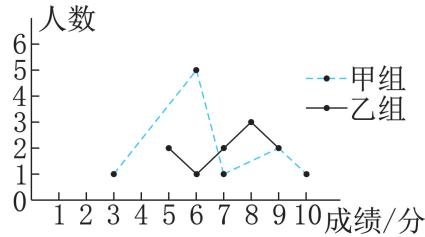  
典例 图

()求成绩统计分析表中 $a , b$ 的值.

()小英说:“这次竞赛我得了 分,在我们小组中排名属于中游偏上.观察表格 判断小英是甲 乙哪个组的学生

甲组同学说 我们组的合格率 优秀率均高于乙组 所以我们组的成绩好于乙组但乙组同学不同意甲组同学的说法 认为他们组的成绩要好于甲组.请你写出两条支持乙组同学观点的理由.

解析 由折线统计图中数据 根据中位数和加权平均数的定义求解可得.()根据中位数的意义求解可得. 可从乙组优势的方面阐述.

解 由折线统计图可知 甲组成绩的数据从小到大排列为 $3 , 6 , 6 , 6 , 6 , 6 , 7 , 9 , 9 , 1 0 ,$ ,$a = 6$ ,$b { = } \frac { 5 \times 2 + 6 \times 1 + 7 \times 2 + 8 \times 3 + 9 \times 2 } { 2 + 1 + 2 + 3 + 2 } { = } 7 . 2 .$

甲组成绩的中位数为 分 乙组成绩的中位数为 . 分,而小英的成绩位于小组中游偏上 小英属于甲组学生.

理由 $\textcircled{1}$ 乙组的平均数高于甲组 即乙组的总体平均水平高 $\textcircled{2}$ 乙组的方差比甲组小即乙组的成绩比甲组的成绩稳定(合理即可).

# 非常点评

三数 与方差的综合应用是中考的热点 解题的关键是正确理解平均数 中位数 众数和方差的概念及计算方法.

典例5 为了让同学们了解自己的体育水平八年级 班的体育老师对全班 名学生进行了一次体育模拟测试 得分均为整数 满分为 分 八年级 班的体育委员根据这次测试成绩 制作了如图所示的统计图和分析表如下:

八年级 班体育模拟测试成绩分析表根据以上信息 解答下列问题()这个班男生有 人,女生有人.

<table><tr><td rowspan=1 colspan=1></td><td rowspan=1 colspan=1>平均数</td><td rowspan=1 colspan=1>方差</td><td rowspan=1 colspan=1>中位数</td><td rowspan=1 colspan=1>众数</td></tr><tr><td rowspan=1 colspan=1>男生</td><td rowspan=1 colspan=1></td><td rowspan=1 colspan=1>1.99分²</td><td rowspan=1 colspan=1>8分</td><td rowspan=1 colspan=1>7分</td></tr><tr><td rowspan=1 colspan=1>女生</td><td rowspan=1 colspan=1>7.92分</td><td rowspan=1 colspan=1>1.993 6分²</td><td rowspan=1 colspan=1>8分</td><td rowspan=1 colspan=1></td></tr></table>

补全八年级 班体育模拟测试成绩分析表.

在这次体育测试中 你认为八年级 班的男生队 女生队哪个表现更突出一些 请

说明理由.

八年级(1)班全体女生体育模拟测试成绩分布扇形统计图解析:()由条形统计图可得男生人数,用总人数减去男生人数可得女生人数. 根据平均数和众数的定义可得. 从平均数 方差 众数和中位数中选择一方面分析可得.

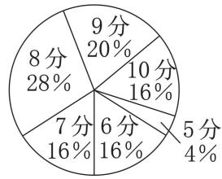  
八年级(1)班全体男生体育模拟测试成绩分布条形统计图

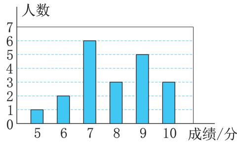  
典例 图

解:() ; .

()男生成绩的平均数为 $\frac { 1 } { 2 0 } \times ( 5 + 6 \times 2 +$ $7 \times 6 + 8 \times 3 + 9 \times 5 + 1 0 \times 3 ) = 7 . 9 6$ (分),女生成绩的众数为 分.  
补全表格如下:

八年级 班体育模拟测试成绩分析表女生队表现更突出.理由:女生队的平均数较高,表示女生队测试的总体平均成绩较好 合理即可

<table><tr><td rowspan=1 colspan=1></td><td rowspan=1 colspan=1>平均数</td><td rowspan=1 colspan=1>方差</td><td rowspan=1 colspan=1>中位数</td><td rowspan=1 colspan=1>众数</td></tr><tr><td rowspan=1 colspan=1>男生</td><td rowspan=1 colspan=1>7.9分</td><td rowspan=1 colspan=1>1.99分²</td><td rowspan=1 colspan=1>8分</td><td rowspan=1 colspan=1>7分</td></tr><tr><td rowspan=1 colspan=1>女生</td><td rowspan=1 colspan=1>7.92分</td><td rowspan=1 colspan=1>1.993 6分²</td><td rowspan=1 colspan=1>8分</td><td rowspan=1 colspan=1>8分</td></tr></table>

# 非常点评

本题考查了扇形统计图 条形统计图 加权平均数 众数等 解题的关键是正确识图并合理利用 三数 和方差进行判断.

# 题型五 利用方差进行决策

典例6 某射箭队准备从小方 小明两人中选拔一人参加射箭比赛 在选拔赛中 两人各射箭 次的成绩 单位 环 如下

<table><tr><td rowspan=1 colspan=1>次序</td><td rowspan=1 colspan=1></td><td rowspan=1 colspan=1></td><td rowspan=1 colspan=1></td><td rowspan=1 colspan=1></td><td rowspan=1 colspan=1></td><td rowspan=1 colspan=1></td><td rowspan=1 colspan=1></td><td rowspan=1 colspan=1></td><td rowspan=1 colspan=1></td><td rowspan=1 colspan=1>10</td></tr><tr><td rowspan=1 colspan=1>小方</td><td rowspan=1 colspan=1></td><td rowspan=1 colspan=1></td><td rowspan=1 colspan=1>9</td><td rowspan=1 colspan=1></td><td rowspan=1 colspan=1></td><td rowspan=1 colspan=1>9</td><td rowspan=1 colspan=1></td><td rowspan=1 colspan=1></td><td rowspan=1 colspan=1>10</td><td rowspan=1 colspan=1>10</td></tr><tr><td rowspan=1 colspan=1>小明</td><td rowspan=1 colspan=1></td><td rowspan=1 colspan=1></td><td rowspan=1 colspan=1>8</td><td rowspan=1 colspan=1>9</td><td rowspan=1 colspan=1>8</td><td rowspan=1 colspan=1>8</td><td rowspan=1 colspan=1></td><td rowspan=1 colspan=1></td><td rowspan=1 colspan=1>10</td><td rowspan=1 colspan=1>8</td></tr></table>

()根据以上数据,将下面两个表格补充完整:

# 小方10次射箭成绩情况

<table><tr><td rowspan=1 colspan=1>环数</td><td rowspan=1 colspan=1>6</td><td rowspan=1 colspan=1>7</td><td rowspan=1 colspan=1>8</td><td rowspan=1 colspan=1>9</td><td rowspan=1 colspan=1>10</td></tr><tr><td rowspan=1 colspan=1>频数</td><td rowspan=1 colspan=1></td><td rowspan=1 colspan=1></td><td rowspan=1 colspan=1></td><td rowspan=1 colspan=1></td><td rowspan=1 colspan=1></td></tr></table>

# 小明10次射箭成绩情况

<table><tr><td rowspan=1 colspan=1>环数</td><td rowspan=1 colspan=1>6</td><td rowspan=1 colspan=1>7</td><td rowspan=1 colspan=1>8</td><td rowspan=1 colspan=1>9</td><td rowspan=1 colspan=1>10</td></tr><tr><td rowspan=1 colspan=1>频数</td><td rowspan=1 colspan=1></td><td rowspan=1 colspan=1></td><td rowspan=1 colspan=1></td><td rowspan=1 colspan=1></td><td rowspan=1 colspan=1></td></tr></table>

()分别求出两人 次射箭成绩的平均数;

从两人成绩的稳定性角度分析应选派谁参加比赛更合适.

解析 依次数出各环数对应的频数即可. 根据加权平均数的定义即可得到结论. 根据方差公式即可得到结论.

解 补充表格如下

小方10次射箭成绩情况  

<table><tr><td rowspan=1 colspan=1>数</td><td rowspan=1 colspan=1>6</td><td rowspan=1 colspan=1>7</td><td rowspan=1 colspan=1>8</td><td rowspan=1 colspan=1>9</td><td rowspan=1 colspan=1>10</td></tr><tr><td rowspan=1 colspan=1>频 数</td><td rowspan=1 colspan=1>1</td><td rowspan=1 colspan=1>2</td><td rowspan=1 colspan=1>1</td><td rowspan=1 colspan=1>3</td><td rowspan=1 colspan=1>3</td></tr></table>

# 小明10次射箭成绩情况

<table><tr><td rowspan=1 colspan=1>环数</td><td rowspan=1 colspan=1>6</td><td rowspan=1 colspan=1>7</td><td rowspan=1 colspan=1>8</td><td rowspan=1 colspan=1>9</td><td rowspan=1 colspan=1>10</td></tr><tr><td rowspan=1 colspan=1>频 数</td><td rowspan=1 colspan=1>0</td><td rowspan=1 colspan=1>0</td><td rowspan=1 colspan=1>6</td><td rowspan=1 colspan=1>3</td><td rowspan=1 colspan=1>1</td></tr></table>

()小方成绩的平均数为 $\frac { 1 } { 1 0 } \times ( 6 + 7 \times 2 +$ $8 + 9 \times 3 + 1 0 \times 3 ) = 8 . 5 ($ （环)；  
小明成绩的平均数为 ${ \frac { 1 } { 1 0 } } \times ( 8 \times 6 + 9 \times 3 +$ $1 0 ) = 8 . 5$ (环).  
$\because s _ { \scriptscriptstyle { \mathscr { N } , \mathscr { N } } } ^ { 2 } = \frac { 1 } { 1 0 } \times [ ( 6 - 8 . 5 ) ^ { 2 } + 2 \times ( 7 -$ $8 . 5 ) ^ { 2 } + ( 8 - 8 . 5 ) ^ { 2 } + 3 \times ( 9 - 8 . 5 ) ^ { 2 } + 3 \times$ $\left( 1 0 { - } 8 . 5 \right) ^ { 2 } \mathbf { \bar { \Phi } } ] = 1 . 8 5 ( \mathbf { \bar { \Phi } } \mathbf { \bar { \Phi } } ^ { 2 } ) ,$ ,  
$s _ { \ J { \bf { \ / { M } } } } ^ { 2 } = \frac { 1 } { 1 0 } \times \left[ { 6 \times ( 8 - 8 . 5 ) ^ { 2 } + 3 \times ( 9 - 8 . 5 ) ^ { 2 } + } \right.$ $( 1 0 - 8 . 5 ) ^ { 2 } ] = 0 . 4 5 ($ 环2  
$\therefore s _ { \mathrm { \tiny ~ J i v } } ^ { 2 } > s _ { \mathrm { \tiny ~ J i v H } } ^ { 2 }$ .  
应选派小明参加比赛更合适.

# -对接教材

本题与教材 练习第 题相对应,均考查了在平均数相等或相近的情况下 利用方差进行决策,解答这类问题的一般思路是先求平均数 再求方差 根据方差小的成绩更稳定来确定参赛选手.准确理解方差的意义是解决这类问题的关键.

# 误区警示牌

# 易错点

# 方差中的三个重要结论互相混淆

例1 设数据 $x _ { 1 } , x _ { 2 } , \cdots , x _ { 8 }$ 的平均数为 $_ { \mathcal { X } }$ ,方差为 $s ^ { 2 }$ ,则数据 $3 x _ { 1 } + 2 , 3 x _ { 2 } + 2 , \cdots , 3 x _ { 8 } + 2$ 的平均数为 ,方差为

正确解答 根据方差的三个重要结论 可得$3 x _ { 1 } + 2 , 3 x _ { 2 } + 2 , \cdots , 3 x _ { 8 } + 2$ 的平均数为$3 \overline { { x } } + 2$ ,方差为 $3 ^ { 2 } s ^ { 2 }$ ,即 $9 s ^ { 2 }$ .故填 $3 \overline { { x } } + 2 ; 9 s ^ { 2 }$ .

若对方差的三个重要结论互相混淆则第一空易误填 $\overline { { x } } + 2$ 第二空易误填 $3 s ^ { 2 } + 2 .$ .我

们利用某些重要概念解题时,务必做到概念清楚 正确 不能主观臆断.

# 易错点二 分析片面，生搬硬套

例2 为了从甲、乙两人中选拔一人参加射击比赛 现让甲 乙两人在相同条件下各射靶次 按射击的时间顺序把每次射靶的成绩单位 环 情况统计如下表

<table><tr><td rowspan=1 colspan=1>甲</td></tr><tr><td rowspan=1 colspan=1>乙</td></tr></table>

请你根据他们 次的射击成绩,运用所学的统计知识来确定参赛选手.

正确解答:由题意,得 ${ \overline { { x } } } _ { \mathbb { H } } = { \frac { 1 } { 1 0 } } \times ( 9 + 4 + \cdots +$ $7 ) = 7$ (环);  
${ \overline { { x } } } _ { \mathsf { Z } } = { \frac { 1 } { 1 0 } } \times ( 2 + 4 + \cdots + 1 0 ) = 7 ( { \mathsf { Z } }$ (环).  
$s _ { \mathbb { H } } ^ { 2 } = \frac { 1 } { 1 0 } \times [ ( 9 - 7 ) ^ { 2 } + ( 4 - 7 ) ^ { 2 } + \cdots + ( 7 -$ $7 ) ^ { 2 } ] { = } 1 . 8$ (环2);  
$s _ { z } ^ { 2 } = { \frac { 1 } { 1 0 } } \times [ ( 2 - 7 ) ^ { 2 } + ( 4 - 7 ) ^ { 2 } + \cdots + ( 1 0 -$ $7 ) ^ { 2 } ] = 5 . 4$ (环2).  
从平均成绩看, ${ \overline { { x } } } _ { \mathbb { H } } = { \overline { { x } } } _ { \mathbb { Z } }$ ,甲、乙两人的平均成绩相等 从方差看 $s _ { \mathbb { H } } ^ { 2 } { < _ { S _ { Z } ^ { 2 } } }$ 甲的成绩比乙稳定 从命中 环及以上的次数来看 甲比乙少 甲的成绩围绕平均数上下波动 而乙处于上升趋势 从第 次开始就没有比甲成绩低的情况发生 故乙的潜力大 参赛时取胜的可能性更大.故应选乙参加比赛.

本题易发生决策错误 认为成绩越稳定越好 没有结合实际进行具体而全面的分析.

#

# 练习(教材 )

.略

2. $s _ { \scriptscriptstyle { \Psi } } ^ { 2 } = \frac { 1 } { 5 } \times [ ( 1 8 2 - 1 7 2 ) ^ { 2 } + ( 1 9 4 -$ $1 7 2 ) ^ { 2 } + ( 1 4 3 - 1 7 2 ) ^ { 2 } + ( 1 8 5 - 1 7 2 ) ^ { 2 } + ( 1 5 6 -$ $1 7 2 ) ^ { 2 } { \overset { \_ } { } 2 } = 3 7 0 \quad s _ { \scriptscriptstyle { \mathrm { Z } } } ^ { 2 } = \frac { 1 } { 5 } \times [ ( 1 9 9 - 1 8 0 ) ^ { 2 } + ( 1 4 8 - $ $1 8 0 ) ^ { 2 } + ( 2 4 2 - 1 8 0 ) ^ { 2 } + ( 1 7 0 - 1 8 0 ) ^ { 2 } + ( 1 4 1 -$ $1 8 0 ) ^ { 2 } ] { = } 1 3 7 0$ $s _ { \mathbb { H } } ^ { 2 } < s _ { Z } ^ { 2 }$ , 甲组跳绳成绩的离散程度较低

# 练习(教材 )

甲 乙两组数据的平均数分别为和 . 方差分别为 . 和 . 在 天中,乙机床出次品的平均数较小,且出次品的波动较小 故乙机床的性能比较好

习题 . 教材

# [复习巩固]

.略

. 甲 乙两组数据的平均数分别为. . 甲 乙两组数据的方差分别为,. () ${ \overline { { x } } _ { \mathbb { H } } } = { \overline { { x } } _ { Z } }$ , $s _ { \mathbb { H } } ^ { 2 } > s _ { Z } ^ { 2 }$ , 乙包装机包装食盐的质量比较稳定

# [综合运用]

. 甲 乙两种小麦的平均苗高都是$\begin{array} { r l } { 1 3 \ \mathrm { c m } } & { { } ( 2 ) \ \stackrel { \bullet \bullet } { \bullet } \ s _ { \sharp } ^ { 2 } = 3 . 6 \ \mathrm { c m } ^ { 2 } , s _ { Z } ^ { 2 } = 1 5 . 8 \ \mathrm { c m } ^ { 2 } } \end{array}$ ,$s _ { \mathbb { H } } ^ { 2 } < s _ { Z } ^ { 2 }$ , 甲种小麦的长势比较整齐

$\begin{array} { r l } { 1 . } & { \cdots \ \overline { { x } } _ { \mathbb { P } } - \frac { 1 } { 1 0 } \times ( 8 + 6 + 9 + 6 + 8 + 1 0 + } \\ & { \qquad \quad } \\ { 7 + 7 + 1 0 + 9 ) - 8 , \overline { { x } } _ { z } - \frac { 1 } { 1 0 } \times ( 7 + 8 + 9 + 8 + 9 + } \\ & { \qquad \quad } \\ { 8 + 8 + 1 0 + 6 + 7 ) - 8 , \ . \ . \ \overline { { x } } _ { \mathbb { P } } ^ { 2 } - \frac { 1 } { 1 0 } \times [ ( 8 - 8 ) ^ { 2 } + } \\ & { ( 6 - 8 ) ^ { 2 } + ( 9 - 8 ) ^ { 2 } + ( 6 - 8 ) ^ { 2 } + ( 8 - 8 ) ^ { 2 } + ( 1 0 - } \\ & { 8 ) ^ { 2 } + ( 7 - 8 ) ^ { 2 } + ( 7 - 8 ) ^ { 2 } + ( 1 0 - 8 ) ^ { 2 } + ( 9 - } \\ & { 8 ) ^ { 2 } ] = 2 , \ s _ { z } ^ { 2 } = \frac { 1 } { 1 0 } \times [ ( 7 - 8 ) ^ { 2 } + ( 8 - 8 ) ^ { 2 } + ( 9 - } \end{array}$ $8 ) ^ { 2 } + ( 8 - 8 ) ^ { 2 } + ( 9 - 8 ) ^ { 2 } + ( 8 - 8 ) ^ { 2 } + ( 8 - 8 ) ^ { 2 } +$ $( 1 0 - 8 ) ^ { 2 } + ( 6 - 8 ) ^ { 2 } + ( 7 - 8 ) ^ { 2 } ] = 1 . 2 . \ \stackrel { \bullet \cdot } { : } \ s _ { \mathtt { H } } ^ { 2 } \gg$ $s _ { Z } ^ { 2 }$ , 乙运动员的投篮更稳定

.()平均数约是 .,方差约是 .平均数约是 方差约是 中计算平均分的方法更合理 从方差的角度来看,去掉一个最高分和一个最低分可以有效减小极端值与异常值对运动员成绩判定的影响 更加公平公正

# [拓广探索]

.略

# 24.3 数据的四分位数

# 目标直通车

1.了解数据的几分位数的定义.

2.理解数据的四分位数的概念,并会求一组数据的四分位数.

3.了解箱线图的概念,并能由箱线图读出数据的最大值、最小值、四分位数,且能由两组数据的箱线图比较两组数据的特征.

# 知识百宝箱

对应教材P176

# 数据的四分位数的概念

1 把一组数据按从小到大顺序排列 将数据分为四等分的三个数 叫作这组数据的四分位数 从小到大分别称为第一四分位数、第二四分位数(中位数)、第三四分位数,分别记为 $Q _ { 1 } , Q _ { 2 } , Q _ { 3 }$ .

2.第一四分位数又称下四分位数,第三四分位数又称上四分位数.

链接 第二四分位数就是中位数.数据排序后 如果有奇数个数 那么取中间一个数;如果有偶数个数,那么取中间两数的平均数

3.数据的第一四分位数又称 $25 \%$ 分位数,第二四分位数又称$50 \%$ 分位数,第三四分位数又称 $7 5 \%$ 分位数.

示例1 求数据 的四分位数.  
解析 先将数据从小到大排列 再根据四分位数的定义解题  
解 把数据从小到大排列 并分为四等分 如图.  
由图知, $\scriptstyle Q _ { 1 } = { \frac { 6 + 7 } { 2 } } = 6 . 5 , Q _ { 2 } = 8 , Q _ { 3 } = { \frac { 9 + 1 2 } { 2 } } = 1 0 . 5 .$   
这组数据的第一四分位数为 .,第二四分位数为 ,第三四分位数为 ..

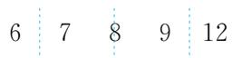  
示例 图

# 漫画速记

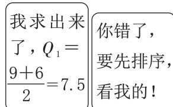

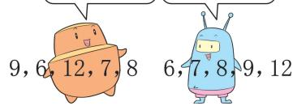

# 一组数据箱线图的画法

箱线图的画法:用数据的三个四分位数及数据的最小值、最大值这五个数值画箱线图

示例2 已知一组数据 画出这组数据的箱线图.

解析 先将数据从小到大排列 再求出最小值 最大值 四分位数 根据这五个数值可画这组数据的箱线图.

！提示 箱线图中的 箱体由四分位数确定.纵向三条线依次表示三个四分位数三条线的间距不一定相等.

解:将数据从小到大排列:,,,,,.

这组数据的最小值为2,最大值为9,四分位数分别为 $Q _ { 2 } = \frac { 4 + 5 } { 2 } =$ $4 . 5 , Q _ { 1 } = 3 , Q _ { 3 } = 7 .$ .

.图中的 参照线”类似于没有标方向的数轴 参照线上的相邻两数字之间间隔距离相等.

画箱线图如图所示.

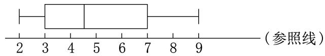  
示例 图

.箱线图反映了数据的特征.如本例 观察箱线图发现,中位数左侧数据较密集,而中位数右侧的数据较稀疏.

# 纵向箱线图的意义

为了对比两组数据的分布情况 可将两组数据的箱线图画在同一幅图中.

示例3 下表是甲 乙两名同学八次射击测试成绩数据()分别求两组数据的四分位数;

<table><tr><td rowspan=1 colspan=1>甲</td><td rowspan=1 colspan=1>7</td><td rowspan=1 colspan=1>8</td><td rowspan=1 colspan=1>7</td><td rowspan=1 colspan=1>3</td><td rowspan=1 colspan=1>9</td><td rowspan=1 colspan=1>10</td><td rowspan=1 colspan=1>7</td><td rowspan=1 colspan=1>4</td></tr><tr><td rowspan=1 colspan=1>乙</td><td rowspan=1 colspan=1>5</td><td rowspan=1 colspan=1>7</td><td rowspan=1 colspan=1>8</td><td rowspan=1 colspan=1>7</td><td rowspan=1 colspan=1>9</td><td rowspan=1 colspan=1>6</td><td rowspan=1 colspan=1>7</td><td rowspan=1 colspan=1>7</td></tr></table>

画箱线图 并利用箱线图分析两组数据的特征.

！提示 在同一幅图中画两组数据的纵向箱线图,有助于对两组数据进行直观对比、分析.

解析 将数据从小到大排列 分组即可求四分位数 利用最小值 最大值 四分位数 在同一幅图中画出箱线图 由图形特征分析数据特征

解:()将数据按从小到大的顺序排列,并分组如图 $\textcircled{1}$ 所示.

由分组知: $Q _ { \mathbb { H } _ { 2 } } = \frac { 7 + 7 } { 2 } = 7 , Q _ { \mathbb { H } 1 } = \frac { 4 + 7 } { 2 } = 5 . 5 , Q _ { \mathbb { H } 3 } = \frac { 8 + 9 } { 2 } = 8 . 5 .$ $\begin{array} { r } { Q _ { \ Z 2 } = \cfrac { 7 + 7 } { 2 } = 7 , Q _ { \ Z 1 } = \cfrac { 6 + 7 } { 2 } = 6 . 5 , Q _ { \ Z 3 } = \cfrac { 7 + 8 } { 2 } = 7 . 5 . } \end{array}$ .

()画箱线图如图 $\textcircled{2}$ 所示.

观察箱线图可得如下信息 $\textcircled{1}$ 两组数据的中位数相等 但乙的箱体更短,说明乙的成绩数据更多集中在 附近; $\textcircled{2}$ 甲的成绩波动明显大于乙的成绩波动 甲的箱体和须线比乙的长 合理即可

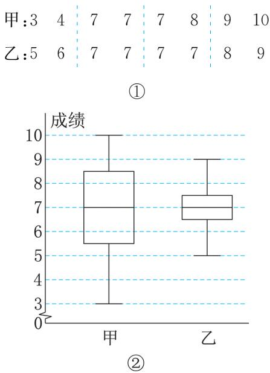  
示例 图

.在同一幅图中画箱线图 一般是指反映同一事件的数据 如同是两人的射击成绩、同是两人的数学考试成绩.如果把两种不同性质的数据箱线图画在一幅图中 那么没有对比分析的意义 如甲的射击成绩与甲的数学考试成绩不应画在同一幅箱线图中.

.箱线图越短 数据越集中..由箱体延伸出的两条线段称为“须线”.箱体长度是第三四分位数减去第一四分位数的差 称为 四分位距 箱体越短 数据越集中.

# 典例展示厅

# 题型一 计算数据的四分位数

典例1 某学校对男、女学生进行有关“习惯与礼貌 的评分 数据记录如下  
男: , , , , , , , , , , ,66,38,44,56,75,35,58,94,58;  
女:77,55,69,58,76,70,77,90,51,53,63,, , , , , , .

()分别计算男、女学生得分数据的平均数;

分别计算男 女学生得分数据的四分位数.

解析 利用平均数的计算公式即可得到结果.先把男生 女生得分从小到大排列 再利用四分位数的定义求解.

解:()男生得分数据的平均数为 $\overline { { x } } _ { 1 } =$ $( 5 4 + 7 0 + 5 7 + 4 6 + 9 0 + 5 8 + 6 3 + 4 6 + 8 5 +$ $7 3 + 5 5 + 6 6 + 3 8 + 4 4 + 5 6 + 7 5 + 3 5 + 5 8 +$ $9 4 + 5 8 ) \div 2 0 = 6 1 . 0 5$ ；  
女生得分数据的平均数为 $\overline { { x } } _ { 2 } = ( 7 7 + 5 5 +$ $6 9 + 5 8 + 7 6 + 7 0 + 7 7 + 9 0 + 5 1 + 5 3 + 6 3 +$ $6 4 + 6 9 + 8 3 + 8 3 + 6 5 + 1 0 0 + 7 5 ) \div 1 8 = 7 1 .$ ()男生、女生得分数据从小到大排列如下:男: , , , , , , , , , , ,, , , , , , , , ;  
女:51,53,55,58,63,64,65,69,69,70,75,, , , , , , .

男生 女生得分数据的四分位数如下表

<table><tr><td rowspan=1 colspan=1></td><td rowspan=1 colspan=1>第一四分位数</td><td rowspan=1 colspan=1>第二四分位数</td><td rowspan=1 colspan=1>第三四分位数</td></tr><tr><td rowspan=1 colspan=1>男生女生</td><td rowspan=1 colspan=1>46+54=502</td><td rowspan=1 colspan=1>58+58=582</td><td rowspan=1 colspan=1>70+73=71.52</td></tr><tr><td rowspan=1 colspan=1>男生女生</td><td rowspan=1 colspan=1>63</td><td rowspan=1 colspan=1>69+70=69.52</td><td rowspan=1 colspan=1>77</td></tr></table>

方法归纳

# 第一四分位数与第三四分位数的求法技巧

无论数据中有几个数,第二四分位数就是中位数,而第一、第三四分位数分别是中位数左侧数据的“中位数”和中位数右侧数据的“中位数”.

# 题型

# 含“权”的数据计算四分位数的技巧

典例2 下面是校篮球队某队员若干场比赛的得分数据.

<table><tr><td rowspan=1 colspan=1>每场比赛得分</td><td rowspan=1 colspan=1>3</td><td rowspan=1 colspan=1></td><td rowspan=1 colspan=1></td><td rowspan=1 colspan=1></td><td rowspan=1 colspan=1></td><td rowspan=1 colspan=1></td><td rowspan=1 colspan=1></td></tr><tr><td rowspan=1 colspan=1>频数</td><td rowspan=1 colspan=1>2</td><td rowspan=1 colspan=1>1</td><td rowspan=1 colspan=1>2</td><td rowspan=1 colspan=1>3</td><td rowspan=1 colspan=1>1</td><td rowspan=1 colspan=1>11</td><td rowspan=1 colspan=1>11</td></tr></table>

分别求出该队员得分数据的四分位数.解析:根据表中的“权数”计算四分位数的值.解 由权数知 数据中含有 个数中位数为第 个数,即 $Q _ { 2 } = 1 0$ ,去掉一个剩下 个数 中位数左 右侧各有 个数,故第一、三四分位数分别为第 个数与第个数,易得 $Q _ { 1 } = 6 , Q _ { 3 } = 1 1 .$ .综上所述, $Q _ { 1 } = 6 , Q _ { 2 } = 1 0 , Q _ { 3 } = 1 1 .$ .

# -非常点评

当数据个数太多 且以 权 的形式给出时按从小到大的顺序列出来会较麻烦.可将数据由权 分割成四组 分界点就是四分位数的方法推导四分位数的数值.例如 个数的中位数是第 个数的平均数 则第一四分位数是前个数的中位数 即第 个数的平均数 第三四分位数是后 个数的中位数 即第 个数的平均数 若是 个数 则中位数是第 个数,第一、三四分位数依然是去掉中位数后,前个数与后 个数的中位数 再由 权 来反推 求的过程就简单了

# 题型三 利用箱线图分析数据特征

典例3 下表是两家不同小型企业 人员结构相同)人员年薪表(单位:万元).

<table><tr><td rowspan=1 colspan=1>甲企业年薪</td><td rowspan=1 colspan=1>8</td><td rowspan=1 colspan=1>18</td><td rowspan=1 colspan=1>50</td><td rowspan=1 colspan=1>100</td></tr><tr><td rowspan=1 colspan=1>乙企业年薪</td><td rowspan=1 colspan=1>14.5</td><td rowspan=1 colspan=1>18</td><td rowspan=1 colspan=1>20</td><td rowspan=1 colspan=1>30</td></tr><tr><td rowspan=1 colspan=1>人数</td><td rowspan=1 colspan=1>20</td><td rowspan=1 colspan=1>4</td><td rowspan=1 colspan=1>2</td><td rowspan=1 colspan=1>1</td></tr></table>

()求两家企业的平均年薪;

()画箱线图,根据箱线图分析两家企业的

年薪特征.

解析:()用加权平均数公式求平均年薪.()先画图 再根据箱线图的特点分析年薪波动情况 离散程度等.

解:() $\overline { { { x } } } _ { \sharp } = \frac { 1 0 0 \times 1 + 5 0 \times 2 + 1 8 \times 4 + 8 \times 2 0 } { 1 + 2 + 4 + 2 0 } =$ $\frac { 4 3 2 } { 2 7 } = 1 6$ (万元).  
${ \overline { { { x } } } } _ { \ Z } \ = \ { \frac { 3 0 \times 1 + 2 0 \times 2 + 1 8 \times 4 + 1 4 . 5 \times 2 0 } { 1 + 2 + 4 + 2 0 } } =$ $\frac { 4 3 2 } { 2 7 } = 1 6$ (万元).

()甲企业年薪数据:最小值 $= 8$ ,最大值 $=$ $1 0 0 { , } Q _ { 2 }$ 的值为第 个数,即 $Q _ { 2 } = 8 ; Q _ { 1 }$ 的值为前 个数的中位数 即第 个数 则$Q _ { 1 } { = } 8 { \ } 2 _ { 3 }$ 的值为后13个数的中位数，即第个数,则 $Q _ { 3 } = 1 8$ .

乙企业年薪数据 最小值为 . 最大值为与甲数据的求法相同 可得 $Q _ { 1 } = 1 4 . ~ 5$ ，$Q _ { 2 } = 1 4 . 5 , Q _ { 3 } = 1 8 .$

画箱线图如图所示.

由箱线图知 $\textcircled{1}$ 甲企业数据波动大 而乙企业数据波动小 $\textcircled{2}$ 两组数据的最小值 第一四分位数、第二四分位数三个数据均分别相等 导致箱体下方无 须线 表明前面的数据频数很大 $\textcircled{3}$ 甲企业箱体上方的 须线 很长 表明最大数据离散严重 即个别人员年薪特别高 而乙企业箱体上方的 须线 相对较短 最大数据离散不太严重 表明年薪差距不太大 合理即可 .

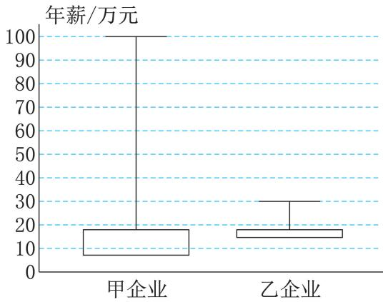  
典例 图

# -非常点评

本题数据排序后,由于前面的 个数据均相同 而后面仅剩 个数据 故箱线图很特殊箱体下方无“须线”,第一四分位数线与中位数线重合 以此例让读者了解特殊结构的数据箱线图的画法.

# 误区警示牌

# 易错点

# 不会确定下四分位数和上四分位数

例 求下列两组数据的中位数与下四分位数.

() ,,,,;   
() ,,,, , .

正确解答:() $Q _ { 2 } = 5 , Q _ { 1 } = { \frac { 1 + 3 } { 2 } } = 2 .$ .

()Q $\quad Q _ { 2 } = { \frac { 6 + 8 } { 2 } } = 7 , Q _ { 1 } = 4 .$

本题易作如下误解:() $Q _ { 2 } = 5 , Q _ { 1 } =$ ;() $Q _ { 2 } = \frac { 6 + 8 } { 2 } = 7 , Q _ { 1 } = \frac { 2 + 4 } { 2 } = 3 .$ .发生上述错误的原因是对求第一、三四分位数的方法不熟悉. 中共有 个数 中位数 即 $Q _ { 2 }$ 为 此时求下四分位数时,应求中位数左侧两个数的平均数 不包括中位数 中共有 个数 此时中位数应为 与 的平均数,第一四分位数应为 ,,的中位数(特别注意:包括 ).

#

问题 教材如数据的离散程度和集中趋势等.

问题 教材略.

练习(教材 )

. 最大值 最小值 下四分位数: ;中位数: ;上四分位数: ()略.甲组: $Q _ { 1 \oplus } = 1 4 9 . 5 , Q _ { 2 \oplus } = 1 8 2 , Q _ { 3 \oplus } =$ 189.5 乙组: $Q _ { 1 \ Z } = 1 4 4 . \ 5 , Q _ { 2 \ Z } = 1 7 0 , Q _ { 3 Z } =$ 如图所示 特点 甲组同学跳绳成绩的中位数更大,离散程度更低;乙组同学跳绳成绩的最大值更大 合理即可

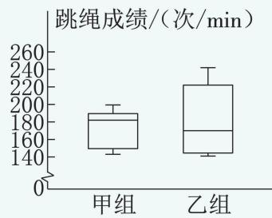  
第 题

3.不是 举例不唯一,如:1,2,3,4,5习题 教材

# [复习巩固]

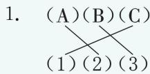

理由 的数据集中在左侧 与 一致 的数据分布比较均匀,与()一致;()的数据集中在右侧 与 一致

.() $Q _ { 1 } = 4 . 5$ 辆, $Q _ { 2 } = 1 0$ 辆, $Q _ { 3 } = 1 2$ 辆

()如图所示 特点:汽车销售数量的范围是

$2 \sim 1 4$ 辆 中位数是 辆 销售数量分布不对称,向 辆集中(合理即可)

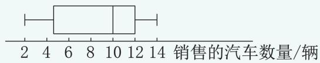  
第 题

# [综合运用]

. $Q _ { 1 } = 6 9 , Q _ { 2 } = 7 5 , Q _ { 3 } = 8 4$ 特点:大约$2 5 \%$ 同学的成绩数据不超过 $69 , 5 0 \%$ 同学的成绩数据不超过 $7 5 , 7 5 \%$ 同学的成绩数据不超过最低成绩远低于下四分位数 存在极低分 最高成绩接近满分 合理即可

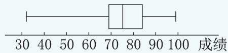  
第 题

.甲班: $Q _ { 1 \oplus } = 1 6 5 . 5 \ \mathrm { c m } , Q _ { 2 \oplus } = 1 6 9 \ \mathrm { c m }$ ,$Q _ { 3 \mathrm { { H } } } = 1 7 3 \ \mathrm { { c m } }$ 乙班： $Q _ { \mathrm { 1 2 } } = \mathrm { 1 6 7 ~ c m } , Q _ { \mathrm { 2 \zeta } } =$ $1 7 0 . 5 \ \mathrm { c m } , Q _ { 3 \ Z } = 1 7 6 \ \mathrm { c m }$ 如图所示 甲班身高的箱线图整体在乙班下方 说明甲班男生的身高相对矮些,乙班四分位距更大,说明乙班中间$50 \%$ 男生身高更分散(合理即可)

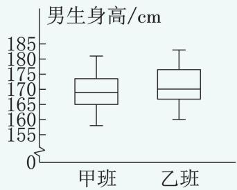  
第4题

# 24.4 数据的分组

# 目标直通车

1.了解数据分组的意义:更细致地分析数据的离散程度.

2.会求数据的组内离差平方和与组间离差平方和,并能应用于生活实际.

对应教材P182

# 知识百宝箱

# 组内离差平方和

1.把 $n$ 个数据分为两组 前 $m \left( m < _ { n } \right)$ 个数据为一组 后 nm)个数据为一组，它们的平均数分别记为 $\overline { { x } } _ { 1 }$ 和 $x _ { 2 }$ ,两组的离差平方和分别记为 $d _ { 1 } ^ { 2 }$ 和 $d _ { 2 } ^ { 2 }$ ,则 $d _ { 1 } ^ { 2 } + d _ { 2 } ^ { 2 }$ 称为组内离差平方和.

2.组内离差平方和表示两个组内数据的离散程度.

示例1 已知数据 ,, , ,,将数据分为前 个数一组与后个数一组 求组内离差平方和  
解:将数据从小到大排列为 ,,, , .第一组:,;第二组:,10,11. $\stackrel { - } { x } _ { 1 } = \stackrel { 7 + 9 } { 2 } = 8 , \stackrel { - } { x } _ { 2 } = \stackrel { 9 + 1 0 + 1 1 } { 3 } = 1 0 . \stackrel { \cdot } { \cdot } d _ { 1 } ^ { 2 } = ( 7 - 8 ) ^ { 2 } + ( 9 - 1 ) ^ { 2 } d _ { 1 } ^ { 2 } = ( 1 + 1 0 + 1 ) ^ { 2 } .$ $8 ) ^ { 2 } = 2 , d _ { 2 } ^ { 2 } = ( 9 - 1 0 ) ^ { 2 } + ( 1 0 - 1 0 ) ^ { 2 } + ( 1 1 - 1 0 ) ^ { 2 } = 2 . \ \dot { \bullet } \ { d _ { 1 } ^ { 2 } } + d _ { 2 } ^ { 2 } =$ $2 + 2 { = } 4$ ,即组内离差平方和为 .

# 组间离差平方和

1.组间离差平方和的定义:把数据分为两组,两组数据的平均数关于总体数据平均数的离差平方和,称为组间离差平方和.

2.组间离差平和的计算公式: $d _ { 1 2 } ^ { 2 } = m ( \overline { { { x } } } _ { 1 } - \overline { { { x } } } ) ^ { 2 } + ( n -$ $m ) ( { \overline { { x } } } _ { 2 } { - } { \overline { { x } } } ) ^ { 2 } .$

示例2 已知数据 ,,,, .将数据的前两个数一组,后三个数一组 求两组的组间离差平方和.

解析:先排序,后分组,再求两组数据的平均数,最后利用公式求组间离差平方和.

解:数据从小到大排序为 ,,,, .

第一组 第二组 .： $\stackrel { - } { x } _ { 1 } = \frac { 2 + 4 } { 2 } = 3 , \stackrel { - } { x } _ { 2 } = \frac { 5 + 7 + 1 2 } { 3 } = 8 , \stackrel { - } { x } = \frac { 2 + 7 + 4 + 5 + 1 2 } { 5 } = 6 .$ : $d _ { 1 2 } ^ { 2 } = 2 \times ( 3 - 6 ) ^ { 2 } + 3 \times ( 8 - 6 ) ^ { 2 } = 1 8 + 1 2 = 3 0 .$ .

分组方法不同,组内离差平方和的大小也不同这正为分析如何分组 才能使数据的组内离散程度最小提供了方法.

先将数据从小到大排列 再按要求分组 继而可求组内离差平方和

点拨 通常情况下 按大小排序是分组的前提.

# 漫画速记

求组间离差平方和的意义是什么？

考量一组 数据分成 两组后， 两组间的 差异.

分组方法不同,组间离差平方和的大小也不尽相同.如本题 若按前 个后 个分组 即第一组第二组:,,, ,则 $\overline { { x } } _ { 1 } =$ $2 , \overline { { { x } } } _ { 2 } = \frac { 4 + 5 + 7 + 1 2 } { 4 } = 7 .$ .此时 $d _ { 1 2 } ^ { 2 } = 1 \times ( 2 - 6 ) ^ { 2 } + 4 \times$ $( 7 - 6 ) ^ { 2 } = 1 6 + 4 = 2 0 < 3 0$ .

# 典例展示厅

# 题型

# 计算组内离差平方和解实际问题

典例 年四个城市人均 (单位:万元 取整数 从小到大依次为 市 市市 市 .

()求四个城市人均 数据的平均数;

()填写下表:

<table><tr><td rowspan=1 colspan=1>分组</td><td rowspan=1 colspan=1>第1组离差平方和</td><td rowspan=1 colspan=1>第2组离差平方和</td><td rowspan=1 colspan=1>组内离差平方和</td></tr><tr><td rowspan=1 colspan=1>第1个间隔</td><td rowspan=1 colspan=1></td><td rowspan=1 colspan=1></td><td rowspan=1 colspan=1></td></tr><tr><td rowspan=1 colspan=1>第2个间隔</td><td rowspan=1 colspan=1></td><td rowspan=1 colspan=1></td><td rowspan=1 colspan=1></td></tr><tr><td rowspan=1 colspan=1>第3个间隔</td><td rowspan=1 colspan=1></td><td rowspan=1 colspan=1></td><td rowspan=1 colspan=1></td></tr></table>

按组内离差平方和最小的原则将四个城市分为两组.

解析:()根据平均数公式求四个城市人均数据的平均数 利用离差平方和公式计算填表. 视填表结果确定.

解:() ${ \overline { { x } } } = { \frac { 1 1 + 1 4 + 2 0 + 2 3 } { 4 } } = 1 7 .$

()把数据按从小到大排列为 , , , .按第 个间隔分组,第 组: ;第 组: ,, .此时 $\overline { { x } } _ { 1 } = 1 1 , d _ { 1 } ^ { 2 } = 0 , \overline { { x } } _ { 2 } = 1 9 , d _ { 2 } ^ { 2 } = 4 2 .$ .$d _ { 1 } ^ { 2 } + d _ { 2 } ^ { 2 } = 4 2$ .  
按第 个间隔分组,第 组: , ;第 组:, .此时 $\overline { { x } } _ { 1 } = 1 2 . 5 , d _ { 1 } ^ { 2 } = 4 . 5 . \overline { { x } } _ { 2 } = 2 1 .$ ,$d _ { 2 } ^ { 2 } = 4 . 5 . \ \dot { \cdots } \ d _ { 1 } ^ { 2 } + d _ { 2 } ^ { 2 } = 9 .$ .  
按第 个间隔分组,第 组: , , ;第组: .此时 $\overline { { x } } _ { 1 } = 1 5$ , $d _ { 1 } ^ { 2 } = 4 2$ . $\overline { { x } } _ { 2 } = 2 3$ , $d _ { 2 } ^ { 2 } =$ $0 . \therefore d _ { 1 } ^ { 2 } + d _ { 2 } ^ { 2 } = 4 2 .$ .  
将以上数据对应填入表格.  
()按组内离差平方和最小的原则将四个城市分为两组如下: $\{ \mathrm { A } $ 市, 市}和 $\{ \mathrm { C }$ 市, 市 $\Bigg \}$ }.

# 非常点评

从上面的分组可看出 市与 市的人均相差较小 而 市与 市的人均 也相差较小 因此 这种分组方法是将相对靠近的数据分在同一个组.

# 误区警示牌

# 易错点

# 不将数据排序造成错误分组

例 将数据 ,,,, 按前三个数一组,后二个数一组 求组内离差平方和.

正确解答 将数据从小到大排列如下.按要求分组 第 组 第 组$6 . \ \therefore \ { \overline { { x } } } _ { 1 } = { \frac { 2 + 3 + 4 } { 3 } } = 3 , d _ { 1 } ^ { 2 } = ( 2 - 3 ) ^ { 2 } + ( 3 -$

$3 ) ^ { 2 } + ( 4 - 3 ) ^ { 2 } = 2 , \overline { { { x } } } _ { 2 } = \frac { 5 + 6 } { 2 } = 5 . 5 , d _ { 2 } ^ { 2 } = ( 5 -$ $5 . ~ 5 ) ^ { 2 } + ( 6 - 5 . ~ 5 ) ^ { 2 } = 0 . ~ 5 . ~ \overset { . } { \cdot } ~ d _ { 1 } ^ { 2 } + d _ { 2 } ^ { 2 } = 2 +$ $0 . 5 { = } 2 . 5$ .

若不排序分组为第 组 第组:,,则计算结果大大高于 .,读者可以一试.

#

问题 教材合理.

练习(教材 )

. 北京 石家庄 呼和浩特 哈尔滨 上海广州,成都,贵阳,昆明}和{海口} 不一致2.{A,B}和{C,D,E}

习题 . 教材

# [复习巩固]

.{,}和{ , , }

[综合运用]

.{,,,}和 $\{ \mathrm { B } , \mathrm { F } \}$ }或{,}和{,,,}

[拓广探索]

.{,,},{},{ }

# 本章总结— 江苏考情聚焦

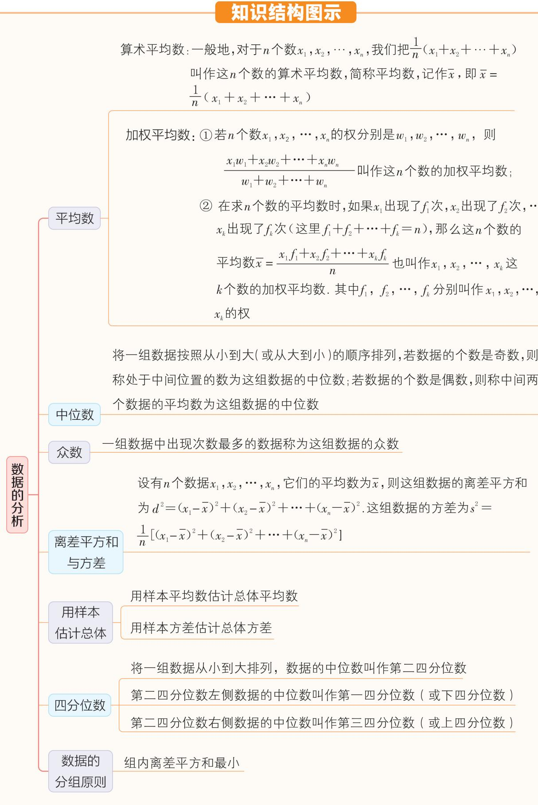

# 江苏考情综述

数据的分析是江苏中考的必考内容之一,绝大部分试卷均将此类题放置在解答题中,在近三年中考试卷中,数据的分析的考试内容一般为利用数据的分析解实际问题,分值一般为 $8 \sim$ 分 题序一般在解答题的中前部位置

# 考点分类突破

# 考点一 运用平均数解决问题

# 考情速览

<table><tr><td rowspan=1 colspan=1>卷别</td><td rowspan=1 colspan=1>题序</td><td rowspan=1 colspan=1>分值</td></tr><tr><td rowspan=1 colspan=1>2025姜堰模拟</td><td rowspan=1 colspan=1>3</td><td rowspan=1 colspan=1>3</td></tr><tr><td rowspan=1 colspan=1>2024宿迁中考</td><td rowspan=1 colspan=1>13</td><td rowspan=1 colspan=1>3</td></tr><tr><td rowspan=1 colspan=1>2024射阳模拟</td><td rowspan=1 colspan=1>11</td><td rowspan=1 colspan=1>3</td></tr></table>

典例精析

类型1 运用算术平均数解决问题

典例1 ( ·宿迁)一组数据 $6 , 8 , 1 0 , x$ 的平均数是 ,则 $_ { \mathcal { X } }$ 的值为

解析 因为数据 $6 , 8 , 1 0 , x$ 一共有 个数 而这 个数的平均数是 ,所以 $\frac { 1 } { 4 } \times ( 6 + 8 + 1 0 + x ) = 9$ ,解得 $x = 1 2$ .

答案: .

非常点评

本题考查的是算术平均数的概念,利用算术平均数公式 平均数 $= { \frac { 1 } { n } } ( x _ { 1 } + x _ { 2 } + \cdots + x _ { n } )$ )计算即可.

# 类型2 运用加权平均数解决问题

典例2 ·射阳模拟 在一次演讲比赛中 评委将从演讲内容 演讲能力 演讲效果三个方面为选手打分 各项成绩均按百分制计 再按演讲内容占 $50 \%$ 演讲能力占 $40 \%$ 、演讲效果占 $10 \%$ 计算选手的综合成绩 百分制 .进入决赛的前两名选手的单项成绩如表所示 此次演讲比赛的第一名是选手(填“甲”或“乙”).

<table><tr><td rowspan=1 colspan=1>选 手</td><td rowspan=1 colspan=1>演讲内容/分</td><td rowspan=1 colspan=1>演讲能力/分</td><td rowspan=1 colspan=1>演讲效果/分</td></tr><tr><td rowspan=1 colspan=1>甲</td><td rowspan=1 colspan=1>85</td><td rowspan=1 colspan=1>95</td><td rowspan=1 colspan=1>95</td></tr><tr><td rowspan=1 colspan=1>乙</td><td rowspan=1 colspan=1>95</td><td rowspan=1 colspan=1>85</td><td rowspan=1 colspan=1>95</td></tr></table>

解析:选手甲的综合成绩是 $8 5 \times 5 0 \% + 9 5 \times$ $4 0 \% + 9 5 \times 1 0 \% = 9 0$ (分),选手乙的综合成绩是$9 5 \times 5 0 \% + 8 5 \times 4 0 \% + 9 5 \times 1 0 \% = 9 1 6$ (分).由此可知选手乙获得第一名,选手甲获得第二名.

答案:乙.

# 非常点评

本题的 权 是 $5 0 \% , 4 0 \% , 1 0 \%$ 可用加权平均数公式 把权代入公式计算 还可以将以百分比形式给出的权数转化为比的形式 即演讲内容、演讲能力、演讲效果的比为 $5 : 4 : 1$ .

# 考点二 运用中位数或众数解决问题

# 考情速览

<table><tr><td rowspan=1 colspan=1>卷别</td><td rowspan=1 colspan=1>题序</td><td rowspan=1 colspan=1>分值</td></tr><tr><td rowspan=1 colspan=1>2025 镇江二模</td><td rowspan=1 colspan=1>14</td><td rowspan=1 colspan=1>3</td></tr><tr><td rowspan=1 colspan=1>2024南通中考</td><td rowspan=1 colspan=1>20</td><td rowspan=1 colspan=1>10</td></tr><tr><td rowspan=1 colspan=1>2024扬州中考</td><td rowspan=1 colspan=1>4</td><td rowspan=1 colspan=1>3</td></tr><tr><td rowspan=1 colspan=1>2023徐州中考</td><td rowspan=1 colspan=1>5</td><td rowspan=1 colspan=1>3</td></tr></table>

典例精析

类型1 求以 权 给出的数据的众数

典例3 ·镇江二模 在一次中学生田径运动会上,参加男子跳高的 名运动员的成绩如下表所示

<table><tr><td rowspan=1 colspan=1>成绩/米</td><td rowspan=1 colspan=1>1.55</td><td rowspan=1 colspan=1>1.60</td><td rowspan=1 colspan=1>1.65</td><td rowspan=1 colspan=1>1.70</td><td rowspan=1 colspan=1>1. 75</td><td rowspan=1 colspan=1>1.80</td></tr><tr><td rowspan=1 colspan=1>人数</td><td rowspan=1 colspan=1>4</td><td rowspan=1 colspan=1>3</td><td rowspan=1 colspan=1>5</td><td rowspan=1 colspan=1>6</td><td rowspan=1 colspan=1>1</td><td rowspan=1 colspan=1>1</td></tr></table>

则这些运动员成绩的众数为 ）

. 米 . 米. 米 . 米

解析 这组成绩中 米出现了 次 次数最多故这组成绩的众数是 米

答案:C.

# 非常点评

若数据是以 权 的形式给出的 则权数最大的数据即为众数 如本例 米 对应的权数为 是所有权数中最大的 故众数为 . 米.

# 类型2 求以频数给出的数据的中位数

典例4 ( ·南通)我国淡水资源相对缺乏 节约用水应成为人们的共识.为了解某小区家庭用水情况 随机调查了该小区 个家庭去年的月均用水量 单位 吨 绘制出如下未完成的统计图表.

<table><tr><td rowspan=1 colspan=1>组别</td><td rowspan=1 colspan=1>家庭月均用水量t/吨</td><td rowspan=1 colspan=1>频数</td></tr><tr><td rowspan=1 colspan=1>A</td><td rowspan=1 colspan=1>2.0≤t&lt;3.4</td><td rowspan=1 colspan=1>7</td></tr><tr><td rowspan=1 colspan=1>B</td><td rowspan=1 colspan=1>3.4≤t&lt;4.8</td><td rowspan=1 colspan=1>m</td></tr><tr><td rowspan=1 colspan=1>C</td><td rowspan=1 colspan=1>4.8≤t&lt;6.2</td><td rowspan=1 colspan=1>n</td></tr><tr><td rowspan=1 colspan=1>D</td><td rowspan=1 colspan=1>6.2≤t&lt;7.6</td><td rowspan=1 colspan=1>6</td></tr><tr><td rowspan=1 colspan=1>E</td><td rowspan=1 colspan=1>7.6≤t&lt;9.0</td><td rowspan=1 colspan=1>2</td></tr><tr><td rowspan=1 colspan=1>合计</td><td rowspan=1 colspan=1>/</td><td rowspan=1 colspan=1>50</td></tr></table>

根据上述信息 解答下列问题() $m =$ ， $n =$ ()这 个家庭去年月均用水量的中位数落在 组;

()若该小区有 个家庭,估计去年月均用水量小于 . 吨的家庭有多少个.

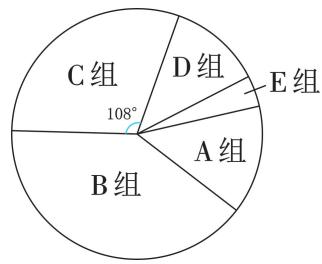  
典例 图

解析:()根据题意,得 组的频数 $n { = } \frac { 1 0 8 } { 3 6 0 } { \times } 5 0 { = }$ 从而 组的频数 $m = 5 0 - 7 - 1 5 - 6 - 2 = 2 0 .$ .根据中位数的定义 由 $5 0 \div 2 = 2 5$ 可得中位数是第 个数和第 个数的平均数,结合 组频数为 组频数为 可判断得解 由 个家庭中去年月均用水量小于 . 吨的家庭数有 $^ { 7 + }$ $2 0 { = } 2 7$ 个 进而可以判断得解.

解:() ; .  
() .  
() 个家庭中去年月均用水量小于. 吨的家庭有 $7 + 2 0 = 2 7$ （个），  
估计去年月均用水量小于 . 吨的家庭有 $1 2 0 0 \times { \frac { 2 7 } { 5 0 } } { = } 6 4 8 ^ { \circ }$ (个).

# 非常点评

本题的 个数据是从小到大排列的 因此根据 偶数个数据的中位数是中间两个数的平均数 这一概念求该组数据的中位数 个数据中间的两个数分别是第 和 个数 由第 题求得 $m = 2 0$ 因此 组数据是第 $8 \sim 2 7$ 个数 显然中位数应该在 组.求数据的中位数时要注意:.应将数据按从小到大(或从大到小)的顺序排列 .奇数个数据的中位数就是位居中间的那个数 而偶数个数据的中位数是位居在中间的两个数的平均数,如 $1 , 2 , 4 , 6 , 8$ 的中位数为,而 ,,, 的中位数为 ${ \frac { 2 + 4 } { 2 } } = 3$ .

# 考点三 综合运用“三数”解决问题

# 考情速览

<table><tr><td rowspan=1 colspan=1>卷别</td><td rowspan=1 colspan=1>题序</td><td rowspan=1 colspan=1>分值</td></tr><tr><td rowspan=1 colspan=1>2025 扬州中考</td><td rowspan=1 colspan=1>21</td><td rowspan=1 colspan=1>8</td></tr><tr><td rowspan=1 colspan=1>2025常州中考</td><td rowspan=1 colspan=1>21</td><td rowspan=1 colspan=1>8</td></tr><tr><td rowspan=1 colspan=1>2024连云港中考</td><td rowspan=1 colspan=1>21</td><td rowspan=1 colspan=1>10</td></tr><tr><td rowspan=1 colspan=1>2024常州中考</td><td rowspan=1 colspan=1>21</td><td rowspan=1 colspan=1>8</td></tr></table>

典例精析

类型1 运用“三数”解实际问题

典例5 ( ·扬州)为参加市校园“音乐达人 大赛 小红和小丽参加了校内选拔赛

位评委的评分情况如下(单位:分).

表1 评委评分数据  

<table><tr><td rowspan=1 colspan=1>选 手</td><td rowspan=1 colspan=10>评委评分</td></tr><tr><td rowspan=1 colspan=1>小红</td><td rowspan=1 colspan=1>7</td><td rowspan=1 colspan=1>8</td><td rowspan=1 colspan=1>7</td><td rowspan=1 colspan=1>8</td><td rowspan=1 colspan=1>7</td><td rowspan=1 colspan=1>7</td><td rowspan=1 colspan=1>7</td><td rowspan=1 colspan=1>8</td><td rowspan=1 colspan=1>7</td><td rowspan=1 colspan=1>9</td></tr><tr><td rowspan=1 colspan=1>小丽</td><td rowspan=1 colspan=1>7</td><td rowspan=1 colspan=1>7</td><td rowspan=1 colspan=1>6</td><td rowspan=1 colspan=1>8</td><td rowspan=1 colspan=1>8</td><td rowspan=1 colspan=1>8</td><td rowspan=1 colspan=1>8</td><td rowspan=1 colspan=1>8</td><td rowspan=1 colspan=1>7</td><td rowspan=1 colspan=1>8</td></tr></table>

表2 评委评分数据分析  

<table><tr><td rowspan=1 colspan=1>选</td><td rowspan=1 colspan=1>平均数</td><td rowspan=1 colspan=1>中位数</td><td rowspan=1 colspan=1>众数</td></tr><tr><td rowspan=1 colspan=1>小红</td><td rowspan=1 colspan=1>7.5</td><td rowspan=1 colspan=1>b</td><td rowspan=1 colspan=1>7</td></tr><tr><td rowspan=1 colspan=1>小丽</td><td rowspan=1 colspan=1>a</td><td rowspan=1 colspan=1>8</td><td rowspan=1 colspan=1>C</td></tr></table>

根据以上信息 回答问题

()表 中 $a =$ , $b =$ $c = \_$

()你认为小红和小丽谁的成绩较好? 请说明理由.

解析 由题意 得 $a = { \frac { 7 \times 3 + 6 + 8 \times 6 } { 1 0 } } = 7 . 5$ $b { = } \frac { 7 { + } 7 } { 2 } { = } 7 { , } c { = } 8 .$ .()根据平均数、众数和中位数的意义解答即可.

解:() .;;.

小丽的成绩较好.理由 两人的平均数相同 但小丽的成绩的中位数和众数均高于小红 小丽的成绩较好.

# 非常点评

本题要先求两人的平均数 中位数 众数 再根据这三个数解答问题.在解第 题时 应根据各统计量的实际意义作出合理的回答.

# 类型2 运用“三数”解开放题

典例6 ·连云港 为了解七年级男生体能情况 某校随机抽取了七年级 名男生进行体能测试 并对测试成绩 $\mathcal { X }$ 单位 分 进行了统计分析:

# 【收集数据】

100 94　88　8852　79　8364　83 87   
76 89 91 68 77 9772 839673

【整理数据】该校规定: $x \leqslant 5 9$ 为不合格,

$5 9 < x \leqslant 7 5$ 为合格 $7 5 { < } _ { x } { \leqslant } 8 9$ 为良好 $8 9 <$ $x { \leqslant } 1 0 0$ 为优秀.

<table><tr><td rowspan=1 colspan=1>等次</td><td rowspan=1 colspan=1>频数(人数)</td><td rowspan=1 colspan=1>频率</td></tr><tr><td rowspan=1 colspan=1>不合格</td><td rowspan=1 colspan=1>1</td><td rowspan=1 colspan=1>0.05</td></tr><tr><td rowspan=1 colspan=1>合格</td><td rowspan=1 colspan=1>a</td><td rowspan=1 colspan=1>0.20</td></tr><tr><td rowspan=1 colspan=1>良好</td><td rowspan=1 colspan=1>10</td><td rowspan=1 colspan=1>0.50</td></tr><tr><td rowspan=1 colspan=1>优秀</td><td rowspan=1 colspan=1>5</td><td rowspan=1 colspan=1>6</td></tr><tr><td rowspan=1 colspan=1>合计</td><td rowspan=1 colspan=1>20</td><td rowspan=1 colspan=1>1.00</td></tr></table>

分析数据 此组数据的平均数是 众数是,中位数是 $c$ ;

# 【解决问题】

()填空: $a =$ $b =$ ,c

若该校七年级共有 名男生 估计体能测试能达到优秀的男生有多少名

根据上述统计情况 写一条你的看法.

解析 从数据中找出大于 且小于或等于的数的个数即为 $a$ 用整体 减去前三组的频率即可得 $b$ .把 个数据按从小到大的顺序排列,第个数的平均数即为 $c$ . 用样本估计总体可得到结果. 根据数据的特点作答.

解:() ;. ; .  
(2） $3 0 0 \times 0 . 2 5 { = } 7 5$ （名），  
估计体能测试能达到优秀的男生有 名.

()平时应加强体能训练(合理即可).

# 非常点评

本题的第 题为开放题 解题的关键是回答合理 如 提高优秀的人数 争取全员合格 等尽管答案可自由发挥,但仍应体现“正能量”,如不可答 减少优秀人数 增加不及格人数 弱化体能训练 等.

# 考点四 方差的计算与应用

# 考情速览

<table><tr><td rowspan=1 colspan=1>卷别</td><td rowspan=1 colspan=1>题 序</td><td rowspan=1 colspan=1>分值</td></tr><tr><td rowspan=1 colspan=1>2025常州中考</td><td rowspan=1 colspan=1>21</td><td rowspan=1 colspan=1>8</td></tr></table>

(续表)

<table><tr><td rowspan=1 colspan=1>卷别</td><td rowspan=1 colspan=1>题序</td><td rowspan=1 colspan=1>分值</td></tr><tr><td rowspan=1 colspan=1>2025 常熟模拟</td><td rowspan=1 colspan=1>4</td><td rowspan=1 colspan=1>3</td></tr><tr><td rowspan=1 colspan=1>2024徐州中考</td><td rowspan=1 colspan=1>24</td><td rowspan=1 colspan=1>7</td></tr><tr><td rowspan=1 colspan=1>2024 江阴模拟</td><td rowspan=1 colspan=1>4</td><td rowspan=1 colspan=1>3</td></tr><tr><td rowspan=1 colspan=1>2024金湖模拟</td><td rowspan=1 colspan=1>20</td><td rowspan=1 colspan=1>8</td></tr></table>

典例精析

# 类型1 方差的计算方法

典例7 ·江阴模拟 已知一组数据为$7 , 2 , 5 , x$ 它们的平均数是 则这组数据的方差为 ( )

A.3解析 因为一组数据 $7 , 2 , 5 , x , 8$ 的平均数是 所以 $5 { = } \frac 1 5 \times ( 7 + 2 + 5 + x + 8 )$ .所以 $x = 3 .$ .所以$s ^ { 2 } = { \frac { 1 } { 5 } } \times [ ( 7 - 5 ) ^ { 2 } + ( 2 - 5 ) ^ { 2 } + ( 5 - 5 ) ^ { 2 } + ( 3 -$ $5 ) ^ { 2 } + ( 8 - 5 ) ^ { 2 } ] = 5 . 2 .$ .

答案:.

# -非常点评

方差的计算公式 $s ^ { 2 } = \frac { 1 } { n } [ ( x _ { 1 } - \overline { { x } } ) ^ { 2 } + ( x _ { 2 } -$ ${ \overline { { x } } } ) ^ { 2 } + \cdots + ( x _ { n } - { \overline { { x } } } ) ^ { 2 } ]$ 中的 $_ { \mathcal { X } }$ 是平均数，因此，求一组数据的方差,必须已知平均数和各个数据.若本题给出 $_ { \mathcal { X } }$ 的值 但平均数未知 则需要先求平均数 而本题只需要先求 $_ { \mathcal { X } }$ 的值 方差就能直接用公式计算了.

# 类型2 联合运用“三数”与方差解决问题

典例8 ( ·金湖模拟)某校组织学生参加卫生知识竞赛,为了解竞赛情况,从两个年级各抽取 名学生的成绩 满分为 分 .

收集数据:

七年级: , , , , , , , , , ;八年级: , , , , , , , , , .分析数据:

<table><tr><td rowspan=1 colspan=1></td><td rowspan=1 colspan=1>平均数</td><td rowspan=1 colspan=1>中位数</td><td rowspan=1 colspan=1>众娄数</td><td rowspan=1 colspan=1>方差</td></tr><tr><td rowspan=1 colspan=1>七年级</td><td rowspan=1 colspan=1>89</td><td rowspan=1 colspan=1>m</td><td rowspan=1 colspan=1>90</td><td rowspan=1 colspan=1>39</td></tr><tr><td rowspan=1 colspan=1>八年级</td><td rowspan=1 colspan=1>n</td><td rowspan=1 colspan=1>90</td><td rowspan=1 colspan=1>p</td><td rowspan=1 colspan=1>q</td></tr></table>

根据以上信息解答下列问题( ) $m =$ ,n , $_ { \textrm { } \phi } =$ ()从方差的角度看, 学生的成绩更稳定 填 七年级 或 八年级 .

()通过数据分析,你认为哪个年级学生的成绩更好 请说明理由.

解析 七年级 名学生成绩数据从小到大排列 处在中间位置的两个数都是 因此 $m = 9 0$ ；八 年 级 学 生 成 绩 数 据 的 平 均 数 为$\frac { 8 0 + 8 5 \times 2 + 9 0 \times 4 + 9 5 \times 2 + 1 0 0 } { 1 0 } = 9 0 ,$ ,即 $n = 9 0$ ;八年级学生成绩数据出现次数最多的是 共出现 次,因此众数是 ,即 $\scriptstyle { p = 9 0 }$ .()八年级学生成绩数据的方差 q= $q = \frac { 1 } { 1 0 } \times [ ( 8 0 - 9 0 ) ^ { 2 } + ( 8 5 -$ 90)²×2+(90-90)²×4+(95-90)²×2+(100—$9 0 ) ^ { 2 } \beth = 3 0$ 即 $q = 3 0$ .因为 $3 0 < 3 9$ 所以八年级学生的成绩更稳定 根据平均数和方差的大小进行比较即可.

解:() ; ; .  
()八年级.  
八年级学生的成绩更好.  
理由 两个年级学生成绩的中位数和众数相同 八年级学生成绩的平均数比七年级高方差比七年级小  
八年级学生的成绩更好.

# -非常点评

本题考查了平均数 中位数 众数等 三数以及方差的计算方法 概括了本章的所有基础知识 另外 第 题是开放题 回答时应从 三数与方差的角度加以阐述 而两组数据的中位数与众数对应相等 因此 可侧重从平均数与方差的方面进行比较 特别注意 方差越大 数据的波动越大 数据的稳定性越差 一般情况下 数据应追求高稳定性.

# 类型3 由折线统计图判断方差的大小

典例9 ( ·常熟模拟)学校计划从甲、乙两人中选拔 名同学参加市知识竞赛 两名同学 次知识竞赛选拔的成绩如图所示 其

成绩的方差分别记作 $s _ { \mathbb { H } } ^ { 2 } \circ s _ { Z } ^ { 2 }$ ,则 $s _ { \mathbb { H } } ^ { 2 }$ 和 $s _ { Z } ^ { 2 }$ 的大小关系是 ( )

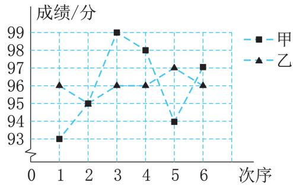  
典例 图

A. $s _ { \perp } ^ { 2 } > s _ { \perp } ^ { 2 }$ B. $s _ { \scriptscriptstyle \boxplus } ^ { 2 } < s _ { \scriptscriptstyle \mathscr { Z } } ^ { 2 }$ $s _ { \perp } ^ { 2 } = s _ { \mathrm { ~ Z ~ } } ^ { 2 }$ 不能确定

解析 由统计图可知 甲成绩数据在 至 之间波动 乙成绩数据在 至 之间波动 所以甲的波动比乙大,即 $s _ { \oplus } ^ { 2 } > s _ { Z } ^ { 2 }$ .

答案: .

# 非常点评

本题如果用方差计算公式求甲、乙成绩的方差 那么计算量会很大 我们发现 题目只要求比较甲、乙成绩的方差大小,而由折线统计图可明显发现 甲成绩的数据比乙成绩数据的波动大故可由折线统计图直接判断 $s _ { \Psi } ^ { 2 }$ 与 $s _ { \textsf { Z } } ^ { 2 }$ 的大小.

# 思想方法归纳

# 方程思想在数据的分析中的应用

在解答本章的有些题目时 在题目提供的数据中有时会出现未知数 这时通常利用方程思想并结合所学知识解答

例1 下表是某班 名学生的某一次数学测验成绩情况:

<table><tr><td rowspan=1 colspan=1>成绩/分</td><td rowspan=1 colspan=1>50</td><td rowspan=1 colspan=1>60</td><td rowspan=1 colspan=1>70</td><td rowspan=1 colspan=1>80</td><td rowspan=1 colspan=1>90</td></tr><tr><td rowspan=1 colspan=1>人数</td><td rowspan=1 colspan=1>1</td><td rowspan=1 colspan=1>4</td><td rowspan=1 colspan=1>X</td><td rowspan=1 colspan=1>y</td><td rowspan=1 colspan=1>2</td></tr></table>

若该班这次数学测验成绩的平均数为 分,求这组成绩的中位数.

解析:首先根据总人数及平均数,得到关于 $x \cdot y$ 的方程组 然后解这个方程组 得到 $x \cdot y$ 的值 最后根据中位数的概念求出这组成绩的中位数.

解: 该班有 名学生,  
$\begin{array} { r } { \mathbf { : } 1 + 4 + x + y + 2 = 2 1 \textcircled { 1 } . } \end{array}$   
该班这次数学测验成绩的平均数为分,  
∴ $( 5 0 + 6 0 \times 4 + 7 0 x + 8 0 y + 9 0 \times 2 ) \div 2 1 =$ $7 0 \textcircled{2}$ .  
$\displaystyle { \binom { x = 1 2 } { y = 2 . } }$ ，  
由 $\textcircled{1} \textcircled{2}$ ,解得  
处在中间位置的是第 ${ \frac { 2 1 + 1 } { 2 } } = 1 1$ 个 成

绩,即 分.

这组成绩的中位数为 分.

-非常点评

根据题意得到关于 $x \cdot y$ 的方程组是本题的解 题 关 键. 本 题 易 列 出 方 程$\frac { 5 0 + 6 0 \times 4 + 7 0 x + 8 0 y + 9 0 \times 2 } { 1 + 4 + x + y + 2 } { = } 7 0$ ,导致增加解题的难度.

# 整体思想在数据的分析中的应用

在有关统计量的计算中 当已知一组 或两组及以上)数据的统计量,要求另一组数据的统计量的值时,有时需要运用整体思想来解决.

例2 已知数据 $1 , 3 , m , 6 , y , 5$ 的平均数为数据 $x , 2 , n , 4 , z$ 的平均数为 ,则数据 $m$ ,$n \cdot x \cdot y \cdot z$ 的平均数为

解析:因为数据 $1 , 3 , m , 6 , y , 5$ 的平均数为 ,所以${ \frac { 1 } { 6 } } \times ( 1 + 3 + m + 6 + y + 5 ) = 8 .$ .所以 $m + y = 3 3$ .因为数据 $x , 2 , n , 4 , z$ 的平均数为 ,所以 ${ \frac { 1 } { 5 } } \times$ $\displaystyle ( { x + 2 + n + 4 + z } ) = 6 .$ .所以 $x + n + z = 2 4 .$ .所以数据 $m , n , x , y , z$ 的平均数为 ${ \frac { 1 } { 5 } } \times ( m + n + x + y +$ $z ) = \frac { 1 } { 5 } \times [ ( m + y ) + ( x + n + z ) ] = \frac { 5 7 } { 5 } .$

答案: $\frac { 5 7 } { 5 }$ 非常点评

在计算一组数据的平均数(或方差)时,常会用到将某一部分数据的和 或平方和 进行整体代换计算,体现了数学中的整体思想.

# 数形结合思想在数据的分析中的应用

在确定平均数 中位数 众数和方差时 一般需要从统计图表中准确提取信息进行数形结合,对统计图表中的数据进行恰当的分析 这种解决问题的思想方法在中考中广泛应用.

例3 如图所示为根据某班 名同学一周的体育锻炼时间绘制的条形统计图 则该班名同学一周的体育锻炼时间的众数 中位数分别是 ( )

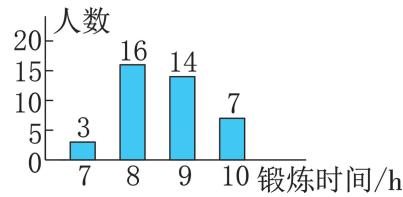  
例 图

A. $1 6 \mathrm { { h } } , 1 0 . 5 \mathrm { { h } }$ B. 8h,9 hC. $1 6 \mathrm { ~ h } , 8 . 5 \mathrm { ~ h ~ }$ D. 8h,8.5 h解析 从条形统计图中可以看出 该班同学一周的体育锻炼时间在 $^ { \textrm { \scriptsize 8 h } }$ 的人数最多 所以众数为 $^ { \textrm { \scriptsize 8 h } }$ 该班人数为 因此中位数是将所有同学一周的体育锻炼时间从小到大 或从大到小 排列后中间两个 即第 个和第 个 锻炼时间的平均数 这两个锻炼时间均为 $^ { \textrm { \scriptsize 9 h } }$ 所以中位数为 ${ \frac { 9 + 9 } { 2 } } { = } 9 ( \mathrm { h } )$ .

答案:B.

# 非常点评

先从统计图中获取信息 再结合众数 中位数的定义解决问题 从统计图中获取信息是本章的一个重要内容,也体现了数形结合思想.

例4 某农业科技部门为了解甲 乙两种新品西瓜的品质 大小 甜度等 进行了抽样调查.在相同条件下 随机抽取了两种西瓜各份样品 对西瓜的品质进行评分 百分制并对得分进行收集 整理 绘制成如图所示的西瓜得分折线统计图.通过观察折线统计图,判断 种西瓜的得分较稳定 填 甲或“乙”).

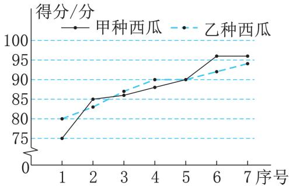  
例 图

解析 观察折线统计图 发现虚线 乙种西瓜 的波动较小,即 $s _ { \oplus } ^ { 2 } > s _ { Z } ^ { 2 }$ .

答案:乙.

# 非常点评

比较两组数据的稳定性时 一般解法是根据方差公式分别求两组数据的方差 再作对比.但本题可采取特殊解法 即观察图象 直接得出乙种西瓜的得分比甲种西瓜的得分稳定.这种灵活机动的解法是建立在对 方差 的意义理解透彻以及会看折线统计图的基础上的 我们从中撷取的是解题的 灵活机动 而不是 投机取巧

# 分类讨论思想在求“三数”中的应用

在计算统计量时 当一组数据中含有用字母表示的数据时 由于数据的大小不确定 导致这组数据按大小顺序排列的结果也不确定 因此常需要根据统计量的计算方法,分类讨论.

例5 已知一组数据 $5 , 7 , 7 , x$ 的中位数与平均数相等,求 $_ { \mathcal { X } }$ 的值及这组数据的中位数.

解 析:由 题 意 可 知 这 组 数 据 的 平 均 数 为$\frac { 5 + 7 + 7 + x } { 4 }$ 题中共有 个数据 根据中位数的求法,需将这组数据按大小顺序排列,而 $_ { \mathcal { X } }$ 的值未知,故需将 $x$ 分类讨论进行解决.

解 当 $x { \geqslant } 7$ 时 原数据按从小到大的顺序排列为 $5 , 7 , 7 , x$ ,其中位数为 ${ \frac { 7 + 7 } { 2 } } = 7$ .  
中位数与平均数相等,  
5+7+7+x 解得x .  
当 $x { \leqslant } 5$ 时,原数据按从小到大的顺序排列为 $x , 5 , 7 , 7$ ,其中位数为 ${ \frac { 5 + 7 } { 2 } } = 6 .$ .  
中位数与平均数相等,  
， ${ \frac { 5 + 7 + 7 + x } { 4 } } = 6$ 解得 $x = 5$   
当 $5 { < } \mathcal { x } { < } 7$ 时 原数据按从小到大的顺序排列为 $5 , x , 7 , 7$ ,其中位数为 $\frac { x + 7 } { 2 }$   
中位数与平均数相等,  
${ \frac { 5 + 7 + 7 + x } { 4 } } = { \frac { x + 7 } { 2 } }$ ,解得 $x = 5$ (不合题意,舍去).  
综上所述 当 $x = 5$ 时 中位数为 当 $x = 9$ 时,中位数为 .

# 非常点评

本题实际上考查了中位数的取值 要注意当数据的大小未知时 就应对未知数据分类讨论从而确定排列顺序 进而确定中位数.

# 统计思想在实际生活中的应用

统计学是一门与数据打交道的学科 研究如何收集 整理 计算和分析数据 然后从中找到些规律.选用统计知识 解决实际生活中涉及有关数据的问题,就是统计的思想方法的应用.

例6某校数学社团成员采用简单随机抽样的方法 抽取了本校八年级 名学生 对他们一周内平均每天的睡眠时间进行了调查 将数据整理后绘制成下表:

<table><tr><td rowspan=1 colspan=1>平均每天的睡眠时间t/小时</td><td rowspan=1 colspan=1>频数</td></tr><tr><td rowspan=1 colspan=1>5≤t&lt;6</td><td rowspan=1 colspan=1>1</td></tr><tr><td rowspan=1 colspan=1>6≤t&lt;7</td><td rowspan=1 colspan=1>5</td></tr><tr><td rowspan=1 colspan=1>7≤t&lt;8</td><td rowspan=1 colspan=1>m</td></tr><tr><td rowspan=1 colspan=1>8≤t&lt;9</td><td rowspan=1 colspan=1>24</td></tr><tr><td rowspan=1 colspan=1>t≥9</td><td rowspan=1 colspan=1>n</td></tr></table>

该样本中学生平均每天的睡眠时间达 小时及以上的百分比达到了 $22 \%$ .

()求表格中 $n$ 的值;  
该校八年级共有 名学生 估计其中平均每天的睡眠时间 $t$ 小时 在 $\tau { \leqslant } t { < } 8$ 这个范围内的人数.

解析 根据频率 $\frac { 1 } { 1 5 } \frac { 1 } { 1 7 } + \frac { 1 } { 2 } x  { 1 5 }$ 求解可得.()先根据频数的和是 及 $n$ 的值求出 $m$ 的值 再用总人数乘样本中平均每天的睡眠时间 $t$ 小时 在 $7 \leqslant$ $t < 8$ 这个范围内的人数所占比例即可求得.

解：(1) $n { = } 5 0 { \times } 2 2 \% { = } 1 1 .$ .  
(2） $m = 5 0 - 1 - 5 - 2 4 - 1 1 = 9 ,$ ，  
估计该校八年级平均每天的睡眠时间$t$ (小时)在 $7 \leqslant t < 8$ 这个范围内的人数是$4 0 0 \times { \frac { 9 } { 5 0 } } { = } 7 2 .$ .

# 非常点评

本题主要考查了用样本估计总体及频数分频数布表 解题的关键是掌握频率总体数量.

#

复习题 教材

# [复习巩固]

.()不正确 例如数据 , 的中位数是. 不是这组数据中的数 正确 不正确 例如数据 中既不存在大于平均数的数据,也不存在小于平均数的数据 ()正确不正确 例如数据 的离差平方和是 ,方差是 ;数据 , 的离差平方和是 ,方差是 .前者的离差平方和更大 但方差更小.平均约有 辆汽车通过这个路口

. 两座城市四季的平均气温分别约是 $4 ~ ^ { \circ } C$ 和 $2 0 ~ \mathrm { { ^ \circ C } }$ () $s _ { \mathrm { A } } ^ { 2 } = 1 2 7 . 2 5 \ { ^ \circ } \mathrm { C } ^ { 2 } ,$ $s _ { \mathrm { B } } ^ { 2 } { = }$ $5 3 . 1 8 7 5 ^ { \circ } \mathrm { C } ^ { 2 } , \cdots s _ { \mathrm { A } } ^ { 2 } > s _ { \mathrm { B } } ^ { 2 } ,$ , 城市四季的平均气温变化比较小

. 这家公司员工月收入的平均数为元,中位数为 元,众数为 元(2) $Q _ { 1 } = 5 ~ 5 0 0$ 元 $Q _ { 2 } { = } 6 ~ 0 0 0$ 元 $Q _ { 3 } { = } 1 2 \ 0 0 0$ 元如图所示

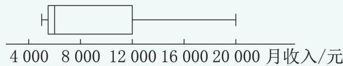  
第 题

$5 . \ \because \ { \overline { { x } } } = ( 1 . 1 5 + 1 . 0 4 + 1 . 1 1 + \cdots +$ $1 . 1 6 ) \div 2 0 \approx 1 . 1 7 ( \mathrm { k g } ) , s ^ { 2 } = \frac { 1 } { 2 0 } \times [ ( 1 . 1 5 - $ $1 . 1 7 ) ^ { 2 } + ( 1 . 0 4 - 1 . 1 7 ) ^ { 2 } + ( 1 . 1 1 - 1 . 1 7 ) ^ { 2 } + \cdots +$ $( 1 . 1 6 - 1 . 1 7 ) ^ { 2 } ] { \approx } 0 . 0 1 ( \mathrm { k g } ^ { 2 } ) , \dot { \bullet } .$ 估计水库中这种鱼质量的平均数为 $1 . 1 7 \mathrm { k g }$ 方差为 $0 . 0 1 \mathrm { k g } ^ { 2 }$

# [综合运用]

.电影院的上座率为

$6 2 . 5 \%$ 所售电影票的平均价格是$3 0 \times 6 0 \times 7 5 \% + 4 0 \times 6 0 \times 6 0 \% + 5 0 \times 4 0 \times 4 7 . 5 \%$ $6 0 \times 7 5 \% + 6 0 \times 6 0 \% + 4 0 \times 4 7 . 5 \%$

.(元)

两种股票一周内的交易日收盘价格的平均数分别约是 . 元和 . 元,方差分别约是 . 元2 和 . 元2 在这段时间内种股票的涨跌幅度大

. 甲 乙两门大炮所发射的炮弹落点与目标距离的平均数分别是 $3 , 2 \textrm { m }$ 和 $4 \textrm { m }$ () $s _ { \scriptscriptstyle { \mathbb { H } } } ^ { 2 } = 4 5 . 7 6 ~ \mathrm { m } ^ { 2 } , s _ { z } ^ { 2 } = 9 2 ~ \mathrm { m } ^ { 2 } , 4 5 . 7 6 < 9 2$ ,： $s _ { \mathbb { H } } ^ { 2 } < s _ { \ Z } ^ { 2 }$ . 甲炮射击的准确性较好

.()前年 月: $\overline { { x } } = \frac { 1 } { 3 1 } \times ( 7 1 + 4 2 +$ $4 5 + \cdots + 7 3 ) \approx 6 0 . 7 , s ^ { 2 } = \frac { 1 } { 3 1 } \times \left[ ( 7 1 - 6 0 . 7 ) ^ { 2 } + \right.$ $( 4 2 - 6 0 . 7 ) ^ { 2 } + ( 4 5 - 6 0 . 7 ) ^ { 2 } + \cdots + ( 7 3 -$ $6 0 . 7 ) ^ { 2 } { \overset { \_ } { } 2 } \approx 1 1 8 . 5 , Q _ { 1 } = 5 2 , Q _ { 2 } = 6 0 , Q _ { 3 } = 6 9$ 去年 月: ${ \overline { { x } } } = { \frac { 1 } { 3 1 } } \times ( 3 8 + 5 0 + 1 9 + \cdots + 4 4 ) \approx$ $3 2 . 6 , s ^ { 2 } = { \frac { 1 } { 3 1 } } \times \left[ ( 3 8 - 3 2 . 6 ) ^ { 2 } + ( 5 0 - 3 2 . 6 ) ^ { 2 } + \right.$ $( 1 9 - 3 2 . 6 ) ^ { 2 } + \cdots + ( 4 4 - 3 2 . 6 ) ^ { 2 } ] \approx 9 0 . \ 0 , Q _ { 1 } =$ $2 2 , Q _ { 2 } = 3 3 , Q _ { 3 } = 3 8$ ()略 ()这个地区去年 月相比前年 月 平均空气质量指数下降波动性减少 整体分布向更低指数集中 说明空气质量明显改善

.{,,,}和{,,,}

# [拓广探索]

11.略