# 2025年江苏省南通市中考数学试卷

一、选择题（本大题共10小题，每小题3分，共30分.在每小题给出的四个选项中，只有一项是符合题目要求的，请将正确选项的字母代号填涂在答题卡相应位置上）

1．(3分) 计算（-2）×(-3)，正确的结果是（ ）
    A．-5 
    B．5 
    C．-6 
    D．6 

2．(3分)《2025年中国卫星导航与位置服务产业发展白皮书》显示，去年我国卫星导航与位置服务产业总产值达5758亿元. 将“5758亿”用科学记数法表示为（ ）
    A．5.758×10¹⁰ 
    B．5.758×10¹¹ 
    C．0.5758×10¹² 
    D．57.58×10¹⁰ 

3．(3分) 如图，将△ABC沿着射线BC平移到△DEF. 若BC=6，EC=4，则平移的距离为（ ）
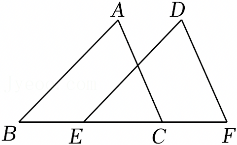
    A．2 
    B．4 
    C．6 
    D．8 

4．(3分) 上午9时整，钟表的时针和分针构成的角的度数为（ ）
    A．30° 
    B．60° 
    C．90° 
    D．120° 

5．(3分) 已知直线y=kx+b经过第一、第二、第三象限，则k，b的取值范围是（ ）
    A．k<0，b<0 
    B．k<0，b>0 
    C．k>0，b<0 
    D．k>0，b>0 

6．(3分) 如图是一个几何体的三视图（图中尺寸单位：cm），则这个几何体的底面圆的周长为（ ）
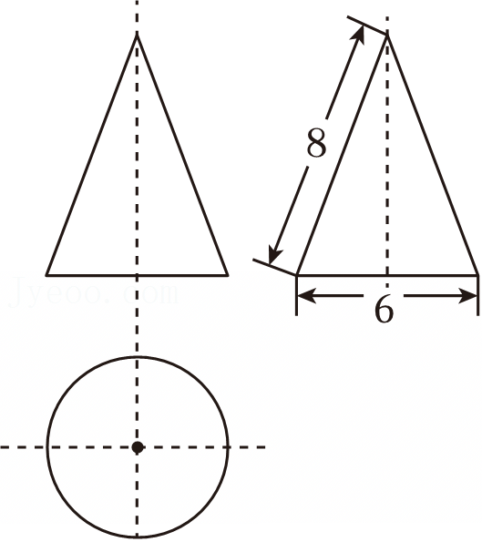
    A．6πcm 
    B．9πcm 
    C．12πcm 
    D．16πcm

7.（3分）在平面直角坐标系xOy中，将点A（3，1）绕原点O逆时针旋转90°，得到点B，则点B的坐标为（ ）  
    A. （3，-1） B. （-1，3） C. （1，-3） D. （-3，1）  

8.（3分）在△ABC中，∠C=90°，tanA=½，AC=2√5，则BC的长为（ ）  
    A. 1 B. 2 C. √5 D. 5  

9.（3分）如图，在等边三角形ABC的三边上，分别取点D，E，F，使AD=BE=CF。若AB=4，AD=x，△DEF的面积为y，则y关于x的函数图象大致为（ ）  
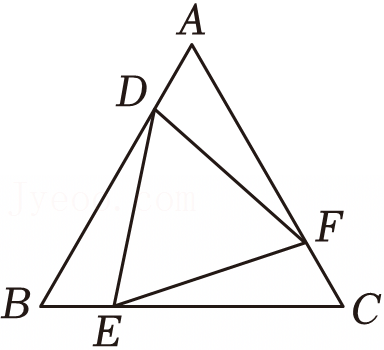
    A.  
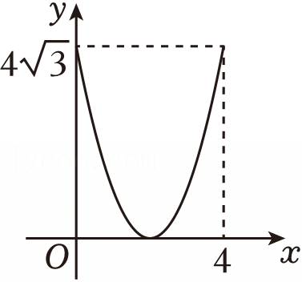  
    B.  
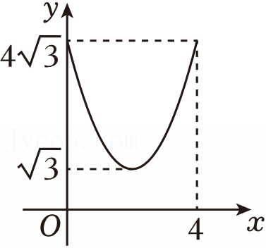  
    C.  
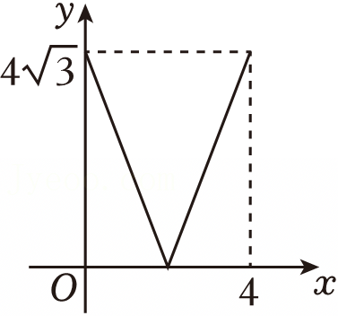  
    D.  
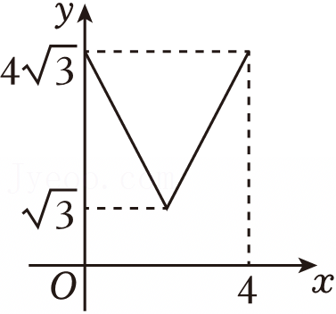  

10.（3分）在平面直角坐标系xOy中，五个点的坐标分别为A（-1，5），B（1，2），C（2，1），D（3，-1），E（5，5）。若抛物线y=a(x-2)²+k(a>0)经过上述五点中的三个点，则满足题意的a的值不可能为（ ）  
    A. 3/8 B. 4/9 C. 2/3 D. 3/4  

二、填空题（本大题共8小题，第11～12题每小题3分，第13～18题每小题3分，共30分不需写出解答过程，请把答案直接填写在答题卡相应位置上）  
11.（3分）分解因式am+a=______．

12.（3分）若$\sqrt{x-3}$在实数范围内有意义，则实数x的取值范围为 ___ 。

13.（4分）南通是“建筑之乡”，工程建筑中经常采用三角形的结构。如图是屋架设计图的一部分，E是斜梁AC的中点，立柱AD，EF垂直于横梁BC．若AC=4.8m，∠C=30°，则EF的长为___ m．
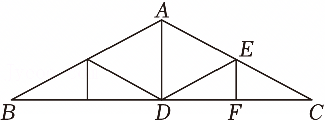
14.（4分）把一根长10m的钢管截成3m和1m两种规格的钢管。为了不造成浪费，可能截得钢管的总根数为 ___ （写出一种情况即可）．

15.（4分）如图，一块砖的A，B，C三个面的面积比是5：3：1．如果B面向下放在地上，地面所受压强为aPa，那么C面向下放在地上时，地面所受压强为___ Pa．
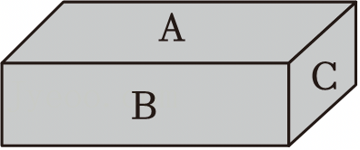
16.（4分）我国南宋数学家秦九韶曾提出利用三角形的三边求面积公式：一个三角形的三边长分别为a，b，c，三角形的面积S= $$\frac{1}{4}\sqrt{a^2 b^2 - (\frac{a^2 + b^2 - c^2}{2})^2}$$ ．若a=2$\sqrt{2}$，b=3，c=1，则S的值为___．

17.（4分）在平面直角坐标系中，以点A（3，0）为圆心，$\sqrt{13}$为半径作⊙A。直线y=kx-3k+2与⊙A交于B，C两点，则BC的最小值为___．

18.（4分）如图，网格图中每个小正方形的面积都为1．经过网格点A的一条直线，把网格图分成了两个部分，其中△BMN的面积为3，则sin∠MNB的值为__________．
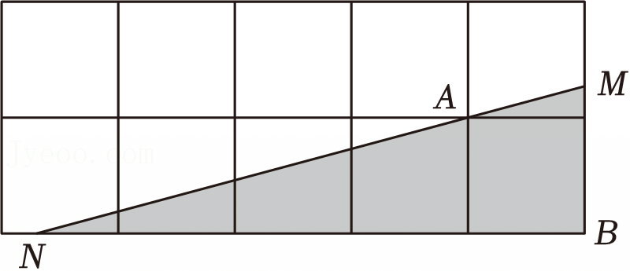
三、解答题（本大题共8小题，共90分.请在答题卡指定区域内作答，解题时应写出文字说明、证明过程

(共7页)

或演算步骤)

19. （12分）（1）解不等式组$$\begin{cases}2x-1<x+1 \\ x+8>4x-1\end{cases}$$；
（2）计算$$(\frac{3}{a+3} + 1)\cdot \frac{a^2 -9}{a+6}.$$

20. （10分）请从下列四个命题中选取两个命题，并判断所选命题是真命题还是假命题。如果是真命题，给出证明；如果是假命题，举出反例。
（1）若$a^2=b^2$，则$a=b$；
（2）对于任意实数$x,y$，一定有$x^2+y^2>2xy$；
（3）两个连续正奇数的平方差一定是8的倍数；
（4）一组对边平行，另一组对边相等的四边形一定是平行四边形。

21. （10分）为提升学生体质健康水平，促进学生全面发展，某校大课间共开展6项体育活动，每名学生均参加了其中一项活动。为了解该校学生参与大课间体育活动情况，随机抽取了该校50名学生进行调查，得到如下未完成的统计表。
| 体育活动 | 足球 | 篮球 | 排球 | 乒乓球 | 跳绳 | 啦啦操 |
| 人数 | 6 | a | 10 | 9 | 8 | 5 |

（1）表格中a的值为___；
（2）若该校有1000名学生，请估计该校参加足球活动的学生人数；
（3）为备战校际篮球联赛，学校计划从参加篮球活动的甲、乙两名同学中选拔一人加入校篮球队。已知甲、乙两名同学近六周定点投篮测试成绩（每次测试共有10次投篮机会，以命中次数作为测试成绩）如图所示。你建议选拔哪名同学，请说明理由。

# 两名同学近六周定点投篮测试成绩折线图

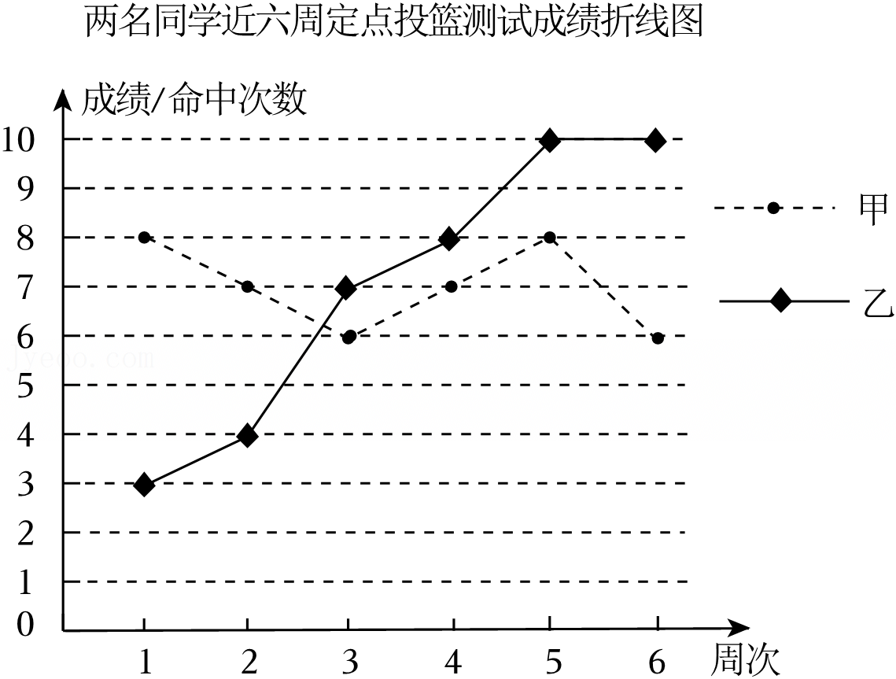

22.（10分）为继承和弘扬中华优秀传统文化，某校将八年级学生随机安排到以下四个场所参加社会实践活动。

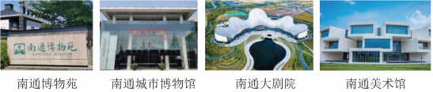

已知小明、小华、小丽都是该校八年级学生，求下列事件的概率：
(1) 小明到南通博物苑参加社会实践活动；
(2) 小华和小丽都到南通美术馆参加社会实践活动。

23.（10分）如图，PA与⊙O相切于点A，AC为⊙O的直径，点B在⊙O上，连接PB，PC，且PA=PB.
(1) 连接OB，求证：OB⊥PB；
(2) 若∠APB=60°，PA=2√3，求图中阴影部分的面积。

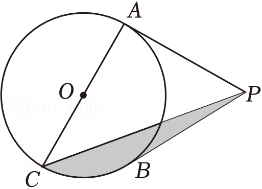

24.（12分）综合与实践：学校数学兴趣小组围绕“校园花圃方案设计”开展主题学习活动。

(共7页)

已知花圃一边靠墙（墙的长度不限），其余部分用总长为60m的栅栏围成。兴趣小组设计了以下两种方案：
| 方案一 | 方案二 |
|--------|--------|
| 如图1，围成一个面积为450$m^2$的矩形花圃.   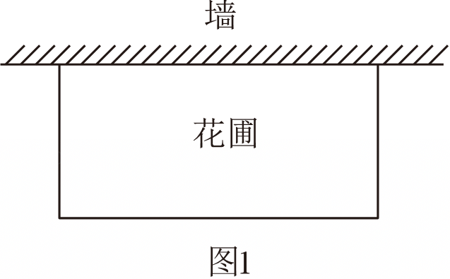 花圃 墙 图1 | 如图2，围成矩形花圃时，用栅栏（栅栏宽度忽略不计）将该花圃分隔为两个小矩形区域，用来种植不同花卉，并在花圃两侧各留一个宽为3m的进出口（此处不用栅栏）。   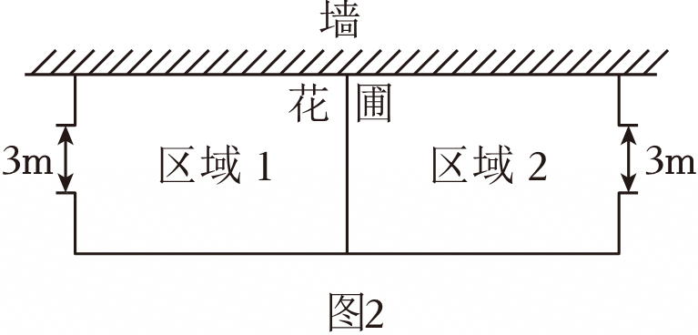 墙 花 3m 区域1 区域2 3m 图2 |
(1) 求方案一中与墙垂直的边的长度；   (2) 要使方案二中花圃的面积最大，与墙平行的边的长度为多少米？   
25.（13分）如图，矩形ABCD中，对角线AC、BD相交于点O。M是BC的中点，DM交AC于点G。
(1) 求证：AG=2GC；   (2) 设∠BCD、∠BDC的角平分线交于点I。 ①当AB=6，BC=8时，求点I到BC的距离； ②若AB+AC=2BC，作直线GI分别交BD，CD于E，F两点，求BC的值。
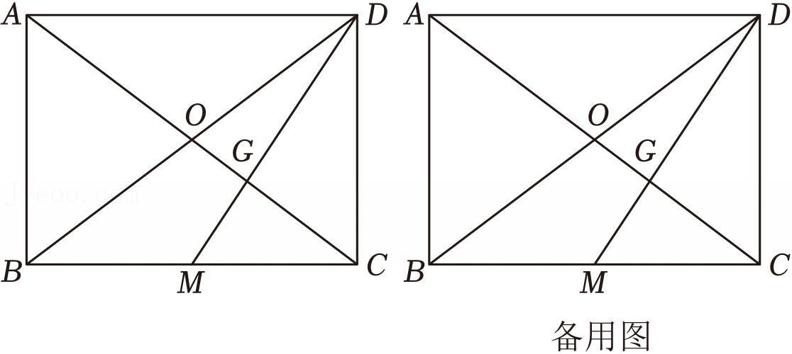 备用图   
26.（13分）在平面直角坐标系xOy中，反比例函数的图象经过点A（1，5），点A，B关于原点对称。该函数图象上另有两点M₁，M₂，它们的横坐标分别为m，m+n，其中m>1，n>0。依次作直线AM₁，BM₁与y轴分别交于C₁，D₁，直线AM₂，BM₂与y轴分别交于点C₂，D₂。记OC₁ - OD₁ = d₁，OC₂ - OD₂=d₂。
(1) 若m=2，求OC₁的长；   （共7页）

(2) 求代数式 (m+n)·d₂的值；

(3) 当 m(d₁ - d₂)=2d₂，3(d₁+d₂)=2n³时，求点D₂关于直线AM₂对称的点P的坐标．